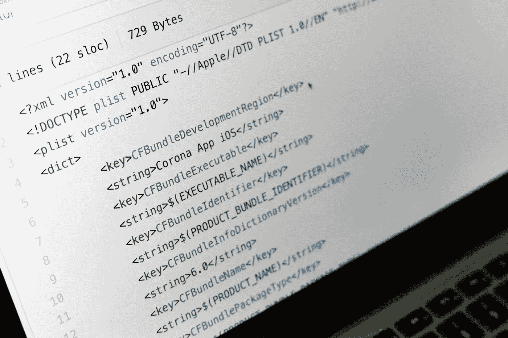

# 博客教程比视频更好的 3 个理由

> 原文：<https://levelup.gitconnected.com/3-reasons-blog-tutorials-are-better-than-videos-881ac2a15419>

## 多读书，少看点，成为更好的程序员。

谢谢 [Pexels](https://www.pexels.com/photo/black-flat-screen-computer-monitor-4584830/) ！

打开 YouTube。开始观看教你如何编码的视频。你会注意到一些奇怪的事情。T2 有成千上万不同的视频可供观看。对于任何给定的框架或库，您都可以找到一年的视频内容。让人应接不暇。

有涵盖整个技术体系的完整视频课程。其他视频将引导您从头到尾完成构建项目。这些视频有助于获得简要概述。但是他们可能没有你想象的那样帮到你。

这些视频教程有许多缺点，当你第一次开始观看它们时并不明显。事实上，你最好只阅读教程。我会给你三个理由让你至少开始改变。

请记住，我并不是说视频教程是完全不好的*。但我是说我们不应该像现在这样依赖他们。*

## 博客很容易更新

视频录制一次。然后，它们被编辑并上传给全世界。在过去的几年里，科技已经做了一些令人惊奇的事情。但是仍然没有一种简单的方法来更新在线视频。

例如，假设你有一个 YouTube 课程，内容是关于 React 库的。如果有大的更新，你几个小时的内容可能会变得无关紧要。技术变化很快。我们需要能够轻松高效地更新我们的教育内容。

当你保持这些视频时，真正的问题就开始了。他们不断获得浏览量(因此，广告收入)。所以，我理解保留它们的动机。但是现在，观众看的都是过时的内容。当然，你可以在描述或评论部分提到一个更新，但是让我们诚实地在这里。大多数人不看描述或评论部分。

> 最后的结果是新来者带着过时的知识进入这个行业。

编程已经是一个很难进入的领域。但是如果你从过时的教程中学到了所有的东西，那你就进退两难了。

这就是为什么文章和博客比视频更有用。它们非常容易更新。作者只要一分钟就搞定了。

当然，在你想到之前。不是所有的博客都更新内容。但重点是任何*真正好的*博客都会更新。一个负责任的博主会在必要的时候更新他们的内容。YouTube 创建者将不得不重新录制整个视频。更新对博主来说很容易，但对 YouTuber 来说却是一场噩梦。

## 视频让你变懒

我这么说是因为我已经关注了很多 YouTube 教程。他们只是不强迫你非常努力地工作。你可以很容易地跟着做，事情就会千篇一律地完美。真实的编程世界与此完全不同。

我特别记得浏览了 3 或 4 个 Python 教程。他们每个人都在 1-5 小时之间。其中一个是 12 小时的课程。尽管投入了大量的时间，我仍然没有学到多少东西。我没有用这些知识建立任何项目。我只是不停地观察，编码。老实说，我本可以节省自己的时间，将 Github repo 中的代码复制粘贴到我的 IDE 中。也会有同样的效果。

当你上网寻找一些信息时，*应该是为了推进你当前的项目。这将是非常具体的信息。看完整个 5 小时的速成课程来获取你需要的信息是不可行的。**你不能在视频上按 CTRL + F。无论如何，你浪费的时间会比你节省的时间更多。***

> 然后一个问题出现了——如果你需要的信息不在那里，你该怎么办？

有时候你会遇到一个特定的问题，却没有视频解决方案。只是还没有被创造出来。那你会怎么做？你不能就这么放弃。你得读点书。如果你一直在阅读，这将会变得容易得多。Github 上的技术文档、文章甚至其他项目都可以帮到你很多。

## 你会更快提高你的技能

编程不仅仅是敲击键盘上的按键。你在这里发展的真正技能是思考的能力。程序员需要能够识别问题，描述问题，找到并尝试解决问题的方法，如果其他方法都失败了，就向其他人寻求帮助。

> 你没有按照 YouTube 上千篇一律的教程做任何事情。

技术博客没有 YouTube 视频教程那样的吸引力。如果你厌倦了跟随一个技术博客，这将是一个停止的信号。我们大多数人就是无法忍受无聊的事情。但是视频就宽容多了。视频并没有那么无聊。事实证明，人们可以强迫自己长时间跟随教程视频。只要感觉有成效就好。(新闻快讯:不是。)

这很难，因为我们中的许多人(包括我自己)已经花费了**大量的时间来做这些教程。但是到了最后，我们并没有太多可以展示的东西。所以，帮你自己一个忙，尽可能快地提高你的编程技能。逃出炼狱教程。走出你的舒适区，为世界创造美好的事物！**