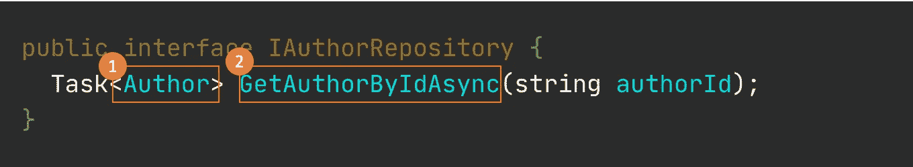
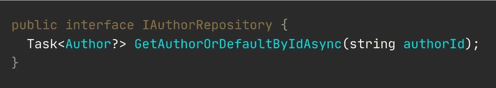
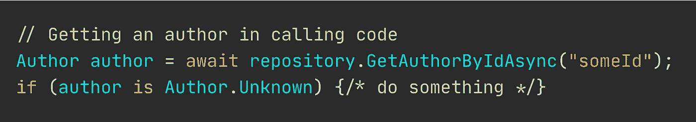
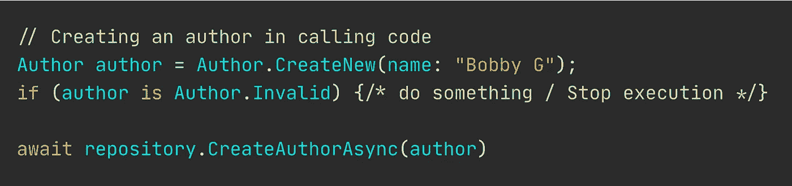

# 为什么需要空对象

> 原文：<https://levelup.gitconnected.com/3-reasons-why-you-need-null-objects-f6f7ba83cd4e>

## 应用设计模式

## 让我告诉你为什么这个奇怪的伪空对象如此伟大

因此，我写了这篇文章“[停止检查空值](https://medium.com/swlh/stop-checking-for-nulls-5f9f857ddf72)”，这引起了一些怀疑 NOP 有用性的开发者的不满。我想我应该花些时间提供更多的例子。

 [## 停止检查空值

### 空对象模式、工厂方法——让我们看看一些生产就绪代码！

medium.com](https://medium.com/swlh/stop-checking-for-nulls-5f9f857ddf72) 

对于那些没有读过上一篇文章，仍然不知道什么是空对象的人，这里有一个简单的解释。

> 主要目的是返回空值的合适替代。空对象只是允许更有表现力的代码。

让我们看一些例子，当空对象比仅仅使用空值更有表现力时，空值很容易破坏你的应用程序。

## 1 说谎方法签名

方法签名可能在两个方面隐瞒了它做了什么:1)返回类型，以及 2)方法名不正确。

我们经常在仓库里看到这样的东西。如果没有空对象，这一行代码的问题是它在返回什么和做什么上撒谎。

阅读这段代码告诉我，我可以 *always，* as in， ***always*** ，指望接收一个作者类型。但这不是真的，因为一些初级开发人员可能允许它返回 null。

## 取而代之做什么

如果您不想应用空模式，请编写代码来告诉您希望从中获得什么。关于的方法签名需要更改为下面的签名。

你看 Author 后面的问号，名字现在包含了“Default”？现在我们知道调用这个方法可能会以空结束。

## 2 表示缺少一个值

Null 可能意味着“没有价值”。但是，我们可以更有表现力，不是吗？

当执行查询时，您可以通过返回一个`Author.Unknown`类型来告知缺少值。它和 null 一样容易检查，但是如果你愿意，它也允许你传递它。这个对象将会有非常有预见性的行为:**它什么也不做**。

## 3 明确告知是否出现了问题

使用工厂或工厂方法，您能够返回更专门化的对象，这些对象允许您在出错时进行断言。

你并不总是想要抛出异常。正如你显然非常清楚的那样，只有在发生了异常的情况下，才应该抛出异常。

向方法提供不正确的输入通常并不罕见。很常见。我们通过返回一个表示出错的空对象来考虑这些共性。

# 批评家们怎么说

## 切换到另一种零安全的语言

这并不总是一个选项。很多时候，我们无法完全控制自己可以使用哪种语言。一些客户要求我们使用 C#、Java、JavaScript 等。

## 空对象模式令人困惑

这比什么都没找到就返回 null 更容易混淆。我不知道 null 是否代表一个丢失的值，或者是否出错了。至少返回一个名为“Unknown”的空对象会告诉我们找不到我们想要的东西。

## 这种模式已经过时了

MVC、MVVM、状态模式、存储库模式以及四人帮设计模式中的几乎所有模式都是如此。

甚至我们使用的语言也是古老的。Python 是 1990 年的。Java 是 1995 年的。是啊，没错。Python 甚至比 Java 更老派。但是我们仍然使用它们。

## **这种模式已经过时**

它仍然被应用在绿地项目中，因为它优雅地解决了一个问题。NOP 没有什么过时的。

## 它隐藏了错误

嗯——正如我在上面演示的那样，它实际上会把错误带到你面前，很容易检测和调试。

**Nicklas Millard** 是一名软件开发工程师，供职于一家发展最快的银行，负责构建任务关键型金融服务基础设施。

此前，他是 Big4 的高级技术顾问，为商业客户和政府机构开发软件。

> 在 [LinkedIn](https://www.linkedin.com/in/nicklasmillard/) 上连接