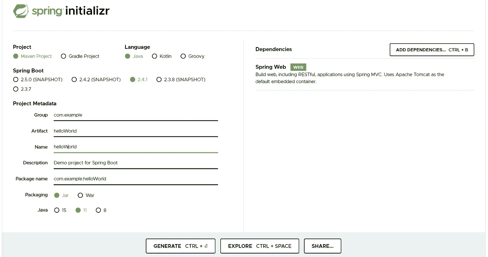
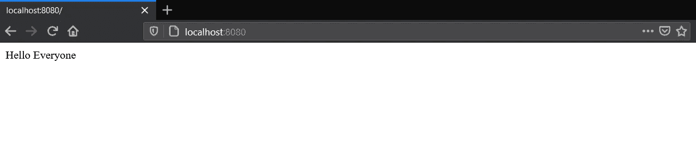
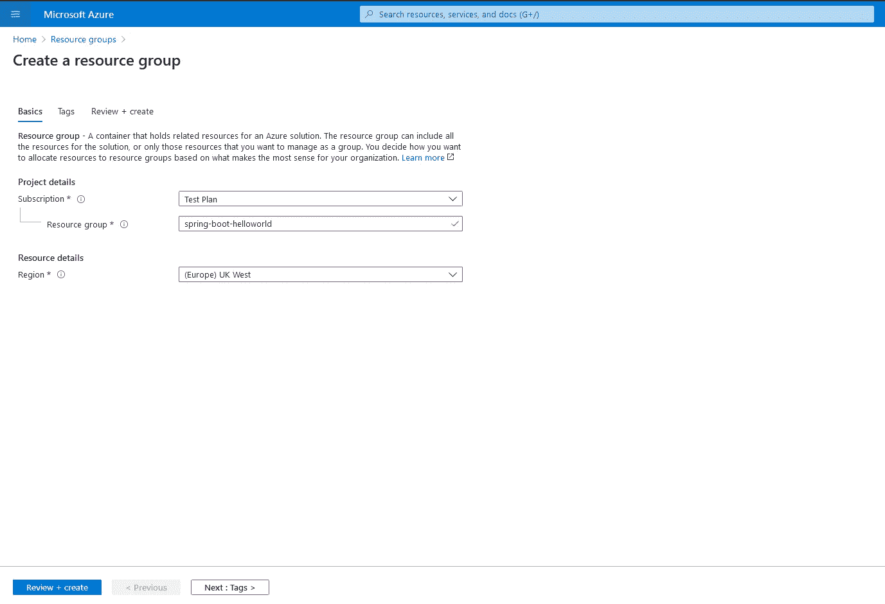
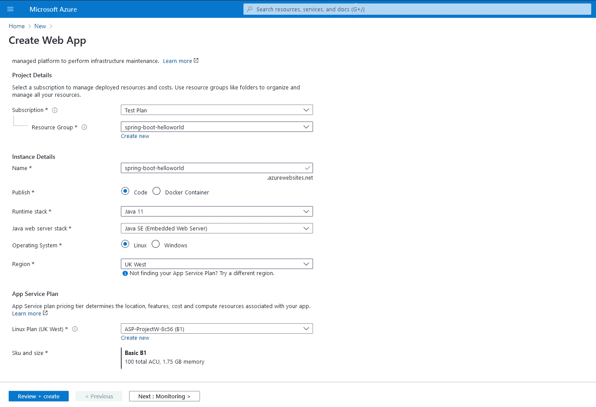
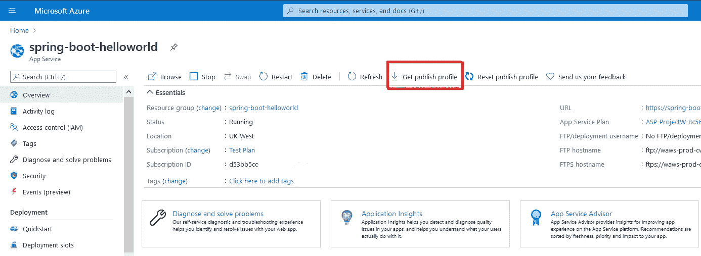
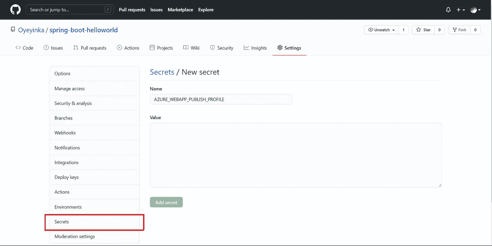
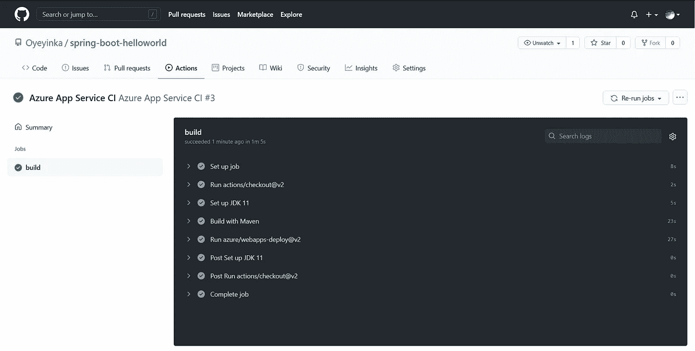

# 在 Azure 上将 Spring Boot 应用成功部署到生产环境的 3 个简单步骤

> 原文：<https://levelup.gitconnected.com/3-simple-steps-to-successfully-deploy-a-spring-boot-application-to-production-on-azure-4eb68c87a623>

使用 GitHub 动作自动化您的开发工作流程

图片由来自 [Pixabay](https://pixabay.com/?utm_source=link-attribution&utm_medium=referral&utm_campaign=image&utm_content=3174729) 的 [Tayeb MEZAHDIA](https://pixabay.com/users/tayebmezahdia-4194100/?utm_source=link-attribution&utm_medium=referral&utm_campaign=image&utm_content=3174729) 提供

# 概述

1.  创建 Spring Boot 应用程序。
2.  设置 Azure 应用服务。
3.  使用 GitHub 动作自动化开发工作流程。

# 1.创建 Spring Boot 应用程序

让我们从使用 [Spring 初始化器](https://start.spring.io/)创建一个新项目开始。

弹簧初始化 r

如上所示填写详细信息，点击**生成**继续。将项目导入任何合适的 IDE。

我们需要做的第一件事是添加一个控制器。

在 **src/main/java** 文件夹中创建一个名为 **com.example.controller** 的包。将文件命名为 **HelloWorldController** ，并将下面的内容复制到新文件中。

HelloWorldController

运行 **HelloWorldApplication** 并浏览到 **localhost:8080** ，如下图所示。一旦这是好的，我们可以进行第二步。

本地主机:8080

# 2.设置 Azure 应用服务

我们将从创建一个资源组开始这一步。资源组基本上是一个保存 Azure 解决方案相关资源的容器。

转到 Azure 门户，使用搜索栏找到**资源组**。进入该页面后，点击**添加**，并填写如下所示的详细信息。完成后，点击**审核+创建**。

在 Microsoft Azure 上创建资源组

接下来要做的是创建一个 Web 应用程序。再次，填写项目详细信息并点击**审查+创建**。

在 Microsoft Azure 上创建 Web 应用程序

接下来，我们继续创建一个工作流，并使用 GitHub 操作来自动化部署。

# 3.使用 GitHub 动作自动部署

我们在这里要做的第一件事是授权 GitHub 操作，这样它就可以在 Microsoft Azure 上成功发布。

我们需要下载一个**发布设置**文件。

为此，点击概览面板中的**获取发布配置文件**，如下所示。

获取发布配置文件

接下来，导航到您的 GitHub 项目，并转到**设置**。点击**秘密**并创建一个名为**AZURE _ web app _ PUBLISH _ PROFILE**的新秘密。

添加新秘密

打开 **PublishSettings** 文件，将文件内容粘贴到值字段。

接下来，我们需要设置工作流。在根文件夹下创建一个新目录，并将其命名为。 **github** 。直接在这个文件夹下创建另一个名为**工作流**的目录，然后添加一个名为 **deploy.yml** 的新文件。路径应该是这样的:**。github/workflows/deploy.yml**

将以下内容复制到新文件中。

部署. yml

下面是这个 GitHub 动作的分解:

3–6**(master)**:表示一旦代码被推送到或者合并到主分支，就触发工作流，并相应地发布。这是灵活的，可以为许多项目的许多分支进行设置。

10 **(ubuntu-latest)** :指定主机环境。

13 **(设置 JDK 11)** :检查并安装 Java 11。

17 **(使用 Maven 构建)**:这使用 Maven 构建应用程序。

19**(azure/web apps-deploy @ v2)**:这使用 publish-profile 部署应用程序。

一旦完成并推送，工作流将被自动触发，应用程序将被部署到 Azure Web 服务。

成功构建

现在，您可以浏览到 App Service 应用程序 URL 进行确认。

只需三个步骤，您就已成功部署到 Azure 应用服务。

> **资源**

源代码: [spring-boot-helloworld](https://github.com/Oyeyinka/spring-boot-helloworld)