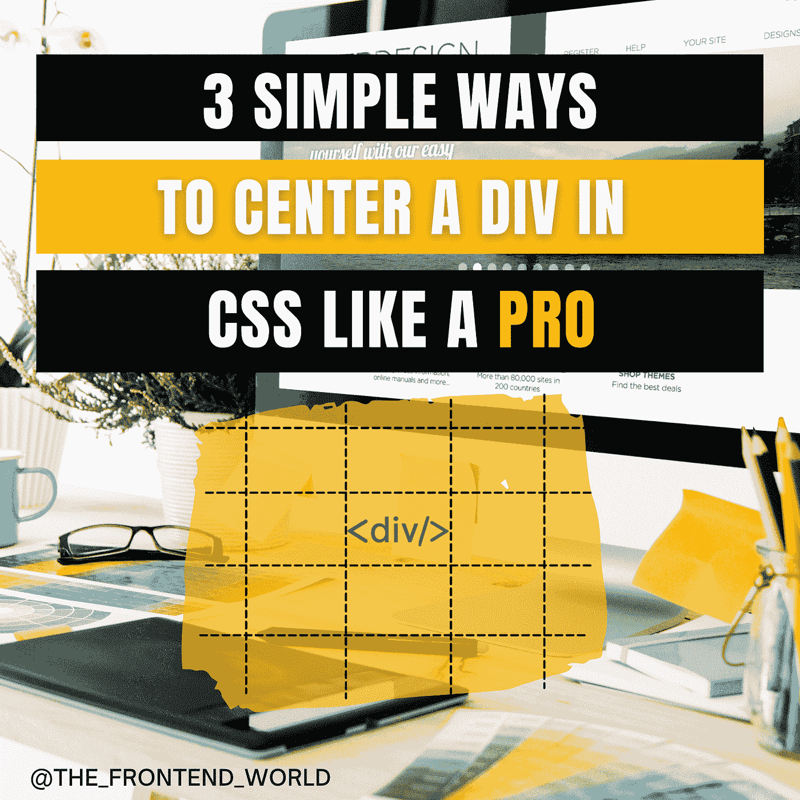
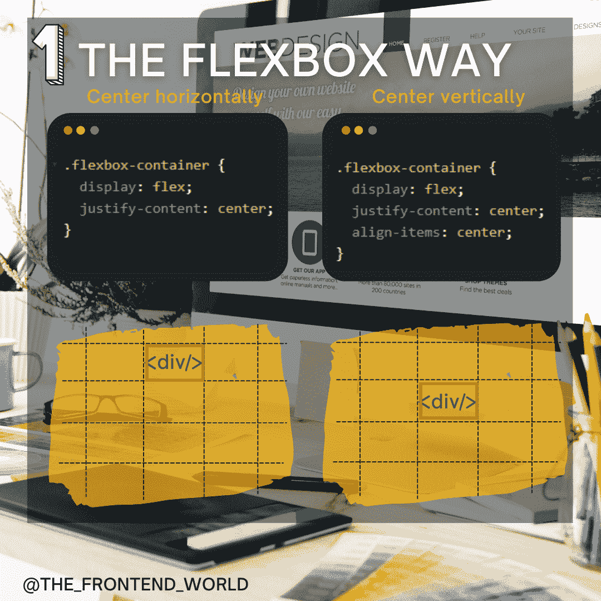
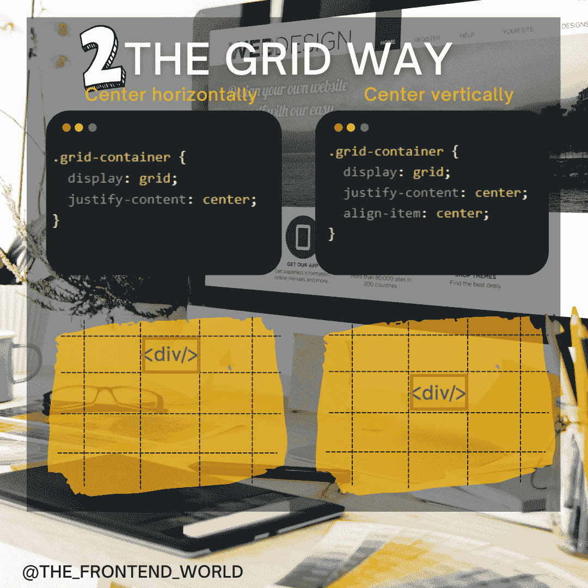
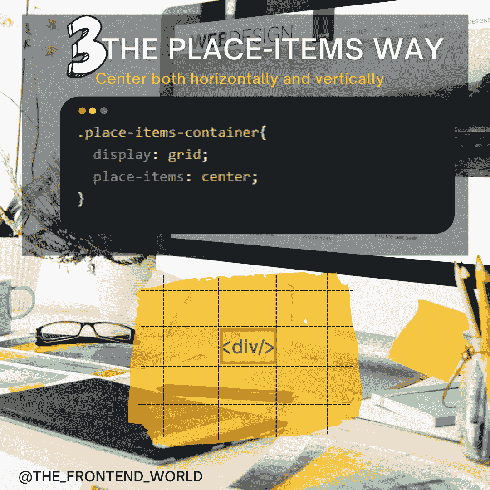

# 像专家一样在 CSS 中居中 div 的 3 个简单方法

> 原文：<https://levelup.gitconnected.com/3-simple-ways-to-center-a-div-in-css-like-a-pro-2496f2af0a30>

## 有用的 CSS 片段为生活保存

作者:FAM

没有办法开发一个网站不需要在某一点上集中一个 HTML 元素。这是开发人员在从事任何项目时经常面临的一个常见问题。居中可能需要时间来工作，这真的很令人沮丧，因为它听起来很简单。

这就是为什么我选择这个话题给你一些小片段，让你的工作任务发生变化，让你的生活变得更轻松。不再浪费时间！

开始吧！

# #1-使用 flexbox 系统

[Flexbox](https://developer.mozilla.org/en-US/docs/Web/CSS/CSS_Flexible_Box_Layout) 是一种一维布局方法，用于按行或列布局项目。项目伸缩以填充额外的空间，收缩以适应更小的空间。这是一个我们如何使用它在 HTML 中居中一个`div`的例子。

*   **水平居中**

柔性盒水平居中

*   **垂直居中**

柔性盒水平和垂直居中

柔性盒方式

# #2-使用网格系统

当 HTML 元素的`display`属性被设置为`grid`或`inline-grid`时，它就变成了一个网格容器。网格容器的所有直接子容器自动成为*网格项目*。下面是我们如何使用它来使一个 HTML 元素居中:

*   **水平居中**

以网格系统为中心

*   **垂直居中**

以网格系统为中心

网格道

# #3-使用位置-项目系统

CSS `**place-items**`速记属性允许你同时沿着块和行内方向对齐项目。与值`center`相结合，物品朝向对齐容器的中心彼此齐平地包装。

*   **垂直和水平居中**

使用 place-items 同时水平和垂直居中

地点-项目方式

# 想看看实际情况吗？

在 CSS 中居中的 3 种方法

欢迎来到@前端世界❤

**享受！**

# 亲爱的读者，我希望这是明确和有用的。

我希望你和你的家人无论在哪里都平安无事！坚持住。明天会更好！

**联系一下** [**中**](https://medium.com/@famzil/)**[**Linkedin**](https://www.linkedin.com/in/fatima-amzil-9031ba95/)**[**脸书**](https://www.facebook.com/The-Front-End-World)**[**insta gram**](https://www.instagram.com/the_frontend_world/)**，或者**[**Twitter**](https://twitter.com/FatimaAMZIL9)**。********

****🔗[www.fam-front.com](http://www.fam-front.com/)****

******FAM******