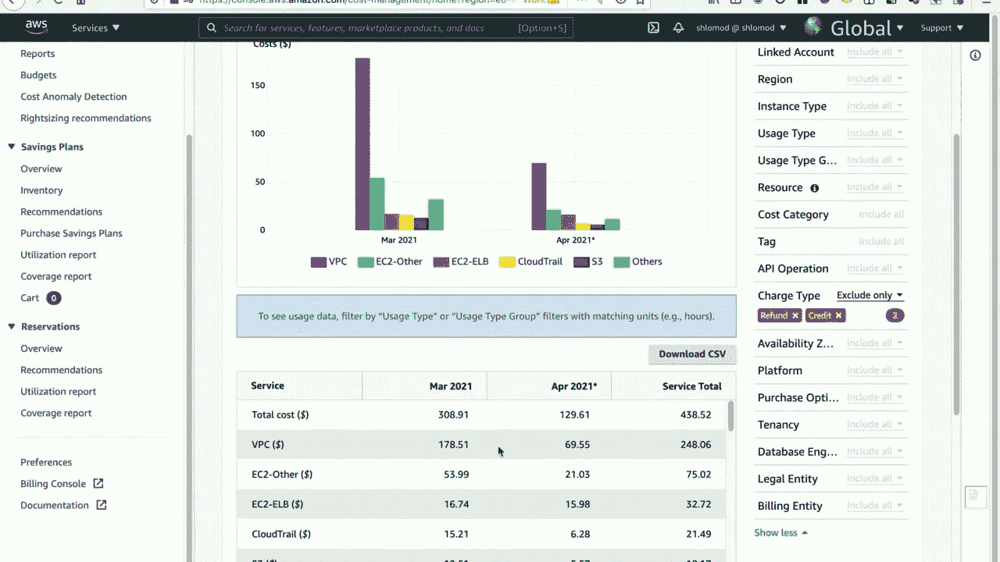
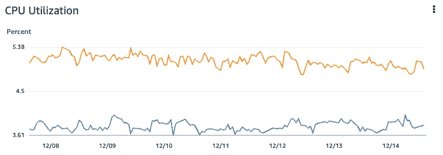
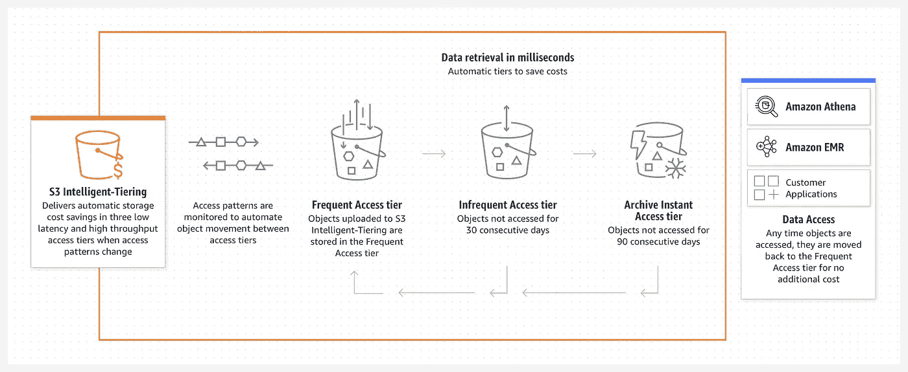

# 3 个简单的方法来减少你的 AWS 账单

> 原文：<https://levelup.gitconnected.com/3-simple-ways-to-reduce-your-aws-bill-today-3c937225ee5e>

## 这些简单的改变可以用于降低任何主要云提供商的成本

照片由 [Unsplash](https://unsplash.com?utm_source=medium&utm_medium=referral) 上的 [Jp Valery](https://unsplash.com/@jpvalery?utm_source=medium&utm_medium=referral)

你最后一次看你的 AWS 账单是什么时候？你们中的一些人可能从来没有，直到最近，我也没有。当我这样做时，我被花费的金额震惊了。

然而，这并不完全是悲观的。使用一些简单的技术，我成功地减少了我们的 AWS 账单。通过遵循这篇文章中的建议，我想你也可以降低你的成本。

我将使用 AWS 作为例子，只是因为我对它最熟悉，但是这些技术应该适用于任何主要的云提供商。

# 如何看待自己的 AWS 账单？

在我们开始存钱之前，我们首先需要对前景有个概念。Azure、GCP 和 AWS 都有工具可以让你轻松获得支出明细。在 AWS 中，我们可以使用[成本浏览器](https://aws.amazon.com/aws-cost-management/aws-cost-explorer/)。

它是免费使用的，你只需要登录你的 AWS 帐户，导航到成本浏览器，并启用它。24 小时后，数据将可供您开始分析。

启用后，如果您单击左侧菜单中的成本浏览器，以下是报告外观的示例:

图片来源:AWS

默认情况下，它应该显示你在每个 AWS 服务上花费的明细。如果不是分组，只需从右侧的维度选项中选择“服务”。

在这个简单的例子中，我们可以看到 5 月份我们在 VPC 上花了 178.51 美元，在 EC2 上花了 70.73 美元(两者相加)，在 CloudTrail 上花了 15.21 美元。

## 如何分析你的 AWS 账单

有了这些信息，我们如何着手决定我们努力省钱的最佳目标呢？

在现实世界中，比如我在分析一家公司的 AWS 账单时，清单可能会更长，成本也会更高。在大多数情况下，我们都在寻找立竿见影的效果。

虽然将一项服务的成本从 150 美元降低到 100 美元是好事，但我们是在追求大人物。这就是为什么我会建议你从最高成本的服务到最低成本的服务。根据你使用服务的时间长短，我会选择前 10-20 个作为重点。

首先，我会运用一些简单的常识。看看前 10-20 名中的每一项服务，并思考其成本是否合理或符合预期。你可以很容易地在网上找到服务的价格。如果没有人跳出来，那完全没问题，但在我的情况下，第一次胜利是发现了一些有点奇怪的东西…让我们来看看。

# 删除未使用的高级功能

这听起来很简单，对吗？你为什么要为你不需要的高级功能付费呢？

首先，很容易错误配置服务的设置。当它被创建时，也许它被错误地打开了。或者，就像我的情况，它被打开是有原因的，但没有人意识到它有多贵，而且它实际上没有帮助。

为了发现这种异常，我注意到我们在 AWS Cognito 上花费了相当多的钱，我认为这有点奇怪。我们确实使用了 Cognito，但使用在线定价，我们的成本明显高于应有水平。

我着手研究这是为什么，我在定价页面上发现，你可以花很高的价格启用可选的高级安全功能。经过尽职调查以确保我们不需要那些高级特性(这确实花了一些时间！)，**关掉那个开关降低了我们 95%的认知成本。**

AWS 服务有许多选项和功能，所以只需花一些时间将成本与预期进行比较，如果账单中有任何异常值，就深入研究一下。有时你会惊讶于你的发现！

接下来，我们来看看只使用您需要的东西。

# 根据资源使用情况调整 AWS 服务

许多 AWS 资源，特别是基于计算的资源，如 [EC2](https://aws.amazon.com/ec2/) ，以及支持服务，如[elastic cache](https://aws.amazon.com/elasticache/)和 [RDS](https://aws.amazon.com/rds/) ，允许您选择可用的资源数量。

例如，您可以在创建 EC2 实例时选择一个实例类型来设置其 CPU 和内存。根据您选择的实例类型，成本会有所不同。

我特别关注的是 ElastiCache，但是相同或相似的过程也适用于其他服务。有几个例子，所以我想知道我们是否可以减少我们已经分配的资源，以便节省一些钱。

## 我们如何确定 AWS 中的资源使用情况？

AWS 有一个方便的工具叫做 [CloudWatch](https://aws.amazon.com/cloudwatch/) ，它确实需要[一点点设置](https://aws.amazon.com/cloudwatch/getting-started/)，并且会有一个超出免费层的相关成本。简而言之，它提供了一整套关于所有 AWS 服务的指标。

除了寻找成本优化，它还使您能够监控和警告您的应用程序，所以在我看来是一个必须具备的。否则，您如何知道您的服务在性能和使用方面发生了什么？

一旦设置好，你可以直接在 CloudWatch 中查询，它有一个很好的 GUI，或者我更喜欢去特定的服务并使用 metrics 选项卡，比如在 ElastiCache 上。这两种方法都会产生类似这样的结果:

图片来源:AWS

这显示了一个给定的 ElastiCache 集群(其中有两个节点)在过去一个月的 CPU 使用情况。我们可以看到，它几乎不出汗。您还可以看到其他指标，比如内存使用情况，以及特定于服务的指标，比如缓存大小(对于 ElastiCache)或 IOPS(对于 RDS)。

假设使用率是稳定的，并且远低于 max，我们可以对实例应用所谓的*合理调整*，并减少分配的资源。**通过合理调整所有 elastic cache 实例，我减少了 50%的 elastic cache 账单。**

如果你把这种技术应用到所有你能调整的服务中，你肯定至少能节省一些。

我想看的最后一种方法有点不同:利用 AWS 的魔力。

# 启用成本节约功能

你可能认为 AWS 希望你尽可能多地花钱，你可能是对的。然而，他们确实经常为你提供工具和技巧，在你力所能及的地方省钱。

我将重点介绍其中一个，但 AWS 的产品套件中还有很多。我们在 AWS 的文件存储服务 [S3](https://aws.amazon.com/s3/) 上花了很多钱。

我最初是从确定我们是否可以在 S3 减少存储，或者从 S3 删除多余数据的角度来考虑这个问题的。事实证明，这是不可能的。

不过我并没有被打败，因为在研究 S3 的时候，我看到了一个你可以启用的功能，叫做 [*智能分层*](https://aws.amazon.com/s3/storage-classes/intelligent-tiering/) *。*本质上，如果您在 S3 上存储数据，但不经常访问它，您可以随着时间的推移逐渐将其转移到更便宜的存储上。它是这样工作的:

图片来源:AWS

稍微扩展一下，只需很少的费用(老实说，这是微不足道的)，AWS 将监控存储在启用智能分层的存储桶中的所有对象。您可以按照自己认为合适的方式调整规则，但是在 30 天不被访问后，对象将被移动到更便宜的存储，90 天后，它将被移动到非常便宜的存储。更具体地说，30 天后，存储成本降低了 40%，90 天后，降低了 68%。

但是，如果您突然需要访问存储在某个低成本层中的对象，数据的性能和可访问性不会受到影响。自动分层也仅适用于大于 128KB 的对象，但小于 128 kb 的对象不会收费，AWS 会忽略它们。

您节省了多少将取决于有多少移动到了每一层，但在我的案例中，一旦智能分层开始实施，S3 成本就降低了 70%以上。

# 最后一件事…

希望这些提示对你有用，你可以用它们来减少你的 AWS 账单。我想说的另一件事是[保留实例](https://aws.amazon.com/ec2/pricing/reserved-instances/)，如果你知道你最少需要一定数量的实例，这是一个省钱的好方法。

简而言之，您需要在 1 到 3 年内注册一定数量的实例，涵盖各种 AWS 服务(EC2、RDS 等)。)作为回报，AWS 会给你一个很大的折扣——**高达 72%** ！

你有没有发现并尝试降低 AWS 成本的额外技巧？请在评论中告诉我！

> **我的书** [**用现代图表技术创作软件**](https://www.amazon.com/dp/1680509837?maas=maas_adg_265A9C302E256D26C2E10C30DA1AA728_afap_abs&ref_=aa_maas&tag=maas) **，现在已经出版了！**
> 
> 您可以学习创建图表来比文字更直接、更清晰地交流信息，同时使用它来构建更好的软件。仅使用基于文本的标记，由 Mermaid 提供支持，创建有意义和有吸引力的图表来记录您的领域，可视化用户流，揭示任何所需级别的系统架构，等等！