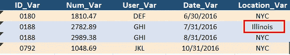

# 3 个小小的 SQL 错误让一份数据科学工作付出了代价

> 原文：<https://levelup.gitconnected.com/3-small-sql-errors-that-cost-a-data-science-job-offer-7ee920084aed>

## 其中一个让我失去了一份 21.2 万美元的工作

在我之前的迷你系列文章[每个数据科学家都应该知道的 SQL 技巧](https://towardsdatascience.com/6-sql-tricks-every-data-scientist-should-know-f84be499aea5)中，我分享了 10 个 SQL 技巧来提升你的分析工作。对于今天的帖子，我想从一个不同的角度来讨论 3 个 SQL 逻辑错误，这可能会造成很大的损失！

第一个错误是我在一家 FAANG 公司面试时犯的，这是我“付出了很大代价”才学会的。然而，最后两个错误是我在职业生涯后期作为采访者所看到的更新鲜的数据。

图片来源:[像素](https://www.pexels.com/photo/design-desk-display-eyewear-313690/)

对于我自己的求职面试，招聘人员总结了如下方案:

*   14 万美元基本工资
*   30k 美元注册奖金
*   12.5 万美元 RSU 在 4 年内完全获得
*   2 万美元的年终奖(估计)

总费用是每年 22.1 万美元。我从招聘电话，招聘经理技术筛选，第一轮技术/编码，一直到最后一轮技术。不幸的是，我在回答特洛伊木马问题时犯了一个致命的错误，使我失去了潜在的机会。

我用下面的玩具数据表来演示一下；这不是我在采访中遇到的确切数据，但足够接近可以使用，

在线市场交易表

这是一个交易表，记录了用户登录在线市场的情况。它包含用户 ID、用户名、登录日期和登录位置，按照每个用户 ID 的时间序列格式组织。出于演示目的，所有代码都在 MS SQL Server 2017 中实现。

******在我的频道上观看有趣的视频版本🎥，***

**错误# 1:误用** `**IN**` **运算符来匹配多个条件**

`IN`操作符对于检查特定值是否与列表中的任何值匹配很有用。是多个 OR 条件的**浓缩版。我很好地理解了这一点，但是我在一个隐含逻辑 AND 的问题中错误地使用了`IN`操作符。**

所以我的采访任务就是找到在 ***NYC* 和 *Illinois*** 有登录的用户。我毫不犹豫地写下了下面的查询:

这给了，

IN 运算符的输出

该答案被标记为不正确，因为我们不应该看到 ID 0180/用户定义，因为该用户在纽约市*只有一次登录，但在伊利诺伊州*没有登录。**

我该如何避免这个错误？

事实上，只使用`IN`操作符过于简化了这个问题，因为底层逻辑是 AND(即*NYC*log in**&***Illinois*log in)而不是 or。下面是我修复这个错误的方法，

首先，用一个计数器单独检查每个条件(即，对行求和加 1)；然后，选择两个计数器都> 0 的情况。这样，我们能够实现逻辑 AND，确保输出包含跳转到纽约市 *和伊利诺伊州*的**网站的用户，**

具有逻辑 AND 的计数器的输出

**错误# 2:逻辑 or 和 and 运算符组织不当:**

关于多个`OR`和`AND`操作符，缺少**逻辑顺序**会把我们的结果搞砸。让我们把这个问题看作是我面试的一个候选人提交的答案，

所以我给他的任务是获取 **(1)发生在 *NYC* 和(2)发生在 2018 年或总 Num_Var ≥ 1000** 的用户登录。下图显示了退货、

为什么*伊利诺伊*记录偷偷进来(没有违反 *NYC* 登录的第一个条件)？嗯，因为它有 Num_Var ≥ 1000！

这些混合逻辑运算符按顺序执行；因此，上面的 WHERE 子句实际上确定了(1)发生在纽约市*和 2018 年*的所有用户登录，或者(2)总 Num_Var ≥ 1000。这显然不是我们的任务所要求的。

我如何避免这个错误？

我们可以用括号来克服这个障碍，

现在，一切看起来都很好，

**错误# 3:无法解释空值**

最后，让我们探索一下单个用户案例，例如 ID 0155/用户 ABC。该候选人被要求统计该用户的 ***加州*登录**与 ***非加州*登录。**下面显示了他的回答:

该查询返回，

用=和<>输出

同样，结果也很奇怪——这些数字没有加起来！检查原始数据表，我们注意到 ID 0155 缺少一个值(编码为 **NULL** )。

我如何避免这个错误？

将 NULL 与实际值进行比较将返回缺失值，缺失值既不是`= ‘California’`也不是`<> ‘California’`。因此，我们还需要一个`CASE WHEN`，

这是预期的回报，

为空时输出有大小写

**结论**

SQL 中的这 3 个**逻辑错误**虽然很小，但会让你的分析结果完全混乱。当您在下一次 SQL 面试中遇到类似的问题时，希望这篇博客能帮助您生成更可靠、更高效的代码。一如既往，所有代码都可以在我的 [Github repo 这里](https://github.com/YiLi225/SQL_Python_R/blob/master/SQL_errors.sql)找到。😀

***想要更多数据科学和编程技巧？使用*** [***我的链接***](https://yilistats.medium.com/membership) ***注册 Medium，获得我所有内容的完全访问权限。***

***也订阅我新创建的 YouTube 频道🎥*** [***【数据说话带吉】***](https://www.youtube.com/channel/UCbGx9Om38Ywlqi0x8RljNdw)

***你可能会觉得鼓舞人心的其他博客，***

* [## 每个数据科学家都应该知道的 6 个 SQL 技巧

### 提高分析效率的 SQL 技巧

towardsdatascience.com](https://towardsdatascience.com/6-sql-tricks-every-data-scientist-should-know-f84be499aea5)  [## 地道熊猫代码的 4 个隐藏的宝石

### 分享更多熊猫提示来提高你的数据处理水平

towardsdatascience.com](https://towardsdatascience.com/4-hidden-gems-for-idiomatic-pandas-code-99c706e6ce93)*