# Python 中机器学习的 3 步介绍

> 原文：<https://levelup.gitconnected.com/3-step-introduction-to-machine-learning-in-python-6e16452b4551>

## 简单是关键。

该练习由三个步骤组成**:**

1.  获取数据
2.  制作 ML 模型
3.  改进 ML 模型

# 目标

我们有这个[兽医数据集](https://openblender.io/#/dataset/explore/5db079199516296099c9fb1e/or/21)，里面有 2008 年到 2018 年患者(狗、猫和雪貂)的模拟登记。

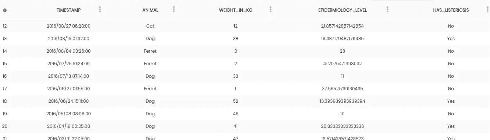

每一行都是患者的就诊记录，包括**体重**公斤、**流行病学**水平以及患者是否出现**李斯特菌病**。(都是模拟的疾病)。

对**流行病**的测试是昂贵的，并且可能是有害的，所以**的目标**是制作一个 ML 模型来**预测这个值**，其余的特征使用这个数据来训练&测试模型，从而防止动物受到伤害，并在这个过程中节省资金。

# 你需要什么

*   任何版本的 Python([https://www.python.org/downloads/](https://www.python.org/downloads/))
*   皮普([https://www.makeuseof.com/tag/install-pip-for-python/](https://www.makeuseof.com/tag/install-pip-for-python/))
*   安装熊猫、sklearn 和 openblender(带 pip)

```
$ pip install pandas OpenBlender scikit-learn
```

*   (推荐)一个 Python 编辑器比如 Jupyter Notebook([https://jupyter.org/install](https://jupyter.org/install))

# 第一步。获取数据

现在您已经有了运行 Python 的地方，让我们导入将要使用的库:

```
import OpenBlender
import pandas as pd
import numpy as np
import json
import sklearn
from sklearn.linear_model import LinearRegression
from sklearn.metrics import mean_squared_error
```

现在，让我们**通过 [OpenBlender](https://www.openblender.io/or/21) API **拉数据**。**您需要在[https://www . open blender . io](https://www.openblender.io.)中创建一个帐户，以获取令牌和 user_id(这是免费的)。

首先，我们将定义**参数**(在本例中，它只是数据集的 id):

```
# It only contains the id, we'll add more parameters later.
parameters = { 
    'token' : '**YOUR_TOKEN**',
    'id_user' : '**YOUR_USER_ID**',  
    'id_dataset':'5db079199516296099c9fb1e'
}
```

现在让我们将数据放入数据帧“df”中:

```
# This function pulls the data and orders by timestampdef pullObservationsToDF(parameters):
    action = 'API_getObservationsFromDataset'
    df = pd.read_json(json.dumps(OpenBlender.call(action,parameters)['sample']), convert_dates=False,convert_axes=False) .sort_values('timestamp', ascending=False)
    df.reset_index(drop=True, inplace=True)
    return dfdf_vet = pullObservationsToDF(parameters)
```

让我们来看看:

```
print(df_vet.shape)
df_vet.head()
```

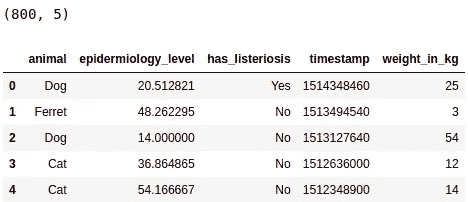

我们有 **800 个观察值**和 **5 个特性**。

# 第二步。制作 ML 模型

让我们观察相对于体重绘制的流行病水平:

```
%matplotlib inline
df_vet.plot.scatter(‘epidermiology_level’, ‘weight_in_kg’)
```

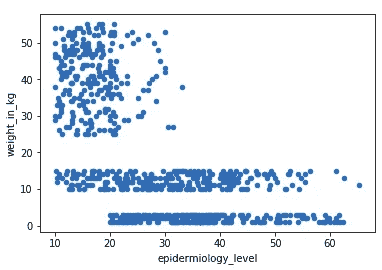

我们可以看到流行病学水平与体重呈负相关。

数字数据的一个非常简单的模型是线性回归，它通过绘制的数据调整一条直线(姑且称之为' **y** ')，如下所示:

> y =a+bx

直线到每个点之间的距离就是**误差**，我们希望*选择‘a’和‘b’的方式是* ***最小化*** 。

> 误差=真实值-y

让我们绘制回归图:

```
# First we declare it
regr = LinearRegression()# Then we fit (or train) it to relate epidermiology with weight
regr.fit(df_vet[['weight_in_kg']], df_vet[['epidermiology_level']])# Let's take a look at the intercpt (Our 'a')
print(regr.intercept_)# And the slope (Our 'b')
print(regr.coef_)
```

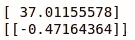

截距和系数

现在让我们将**添加到剧情**中:

```
axes = df_vet.plot.scatter(‘epidermiology_level’, ‘weight_in_kg’)
x_vals = np.array(axes.get_xlim())
y_vals = 37.01155578 + -0.47164364 * x_vals
axes.plot(x_vals, y_vals, ‘ — ‘)
```

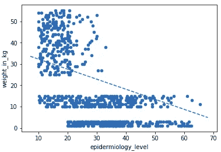

定量测量的方法是用数据(训练集)的一部分进行**训练，然后用剩余的**(测试集)进行**测试，这样我们可以看到它如何用“新”数据进行概括。**

```
# First we define ‘X’ and ‘y’
X = df_vet[[‘weight_in_kg’]]
y = df_vet[[‘epidermiology_level’]]# Then we separate 500 to train
X_train = X[:500]
y_train = y[:500]
print(“Train X and y:”)
print(X_train.shape)
print(y_train.shape)# And 300 to test
X_test = X[500:]
y_test = y[500:]
print(“Test X and y:”)
print(X_test.shape)
print(y_test.shape)
```

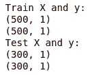

现在我们需要**对这 300 个测试观测值进行预测**，并且**通过获得 MSE ( **均方误差**)将**与真实值进行比较:

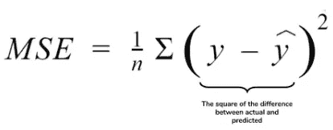

```
# First we traqin the model with the Test Set
lm = LinearRegression()
lm.fit(X_test, y_test)# Then we generate predictions and compare to ‘y’ test
predictions = lm.predict(X_test)
mean_squared_error(y_test, predictions)
```

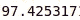

我们的 **MSE** 是 **97.43** ，这是所有误差之和的平方平均值。我们来看看预测值和真实值。

```
df_preds_res = pd.DataFrame({‘y_test’:y_test[‘epidermiology_level’], ‘y_pred’:pred[:,0]})
df_preds_res.head(15)
```

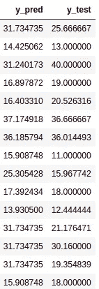

让我们看看是否可以通过增加其余的变量来改进它。

# 第三步。改进 ML 模型

好了，我们有了下面的数据，但是我们可以**只将数值特征**输入到我们的 LinearRegression 中，所以我们要将' *animal* 和' *has_listeriosis* 特征转换成数值。


我们的做法是将该列的每个类别转换成另一个“虚拟”列。幸运的是，OpenBlender API 可以为我们做到这一点:

```
#We add the 'categorical_treatment' parameter and pull again.parameters = { 
    'token' : 'YOUR_TOKEN',
    'id_user' : 'YOUR_USER_ID',  
    'id_dataset':'5db079199516296099c9fb1e',
 **'categorical_treatment':** {"treatment" : "convert_to_numeric", "exclude" : ["weight_in_kg"]}
}df_vet_numerical = pullObservationsToDF(parameters)
```

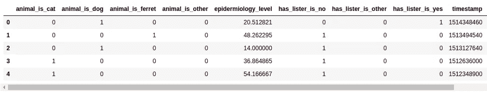

为了给**添加更多有用的特性**，让**的日期分解**拥有许多其他与时间相关的特性，如星期几、月份等。

```
parameters = {
    'token' : 'YOUR_TOKEN',
    'id_user' : 'YOUR_USER_ID', 
    'id_dataset':'5db079199516296099c9fb1e',
'categorical_treatment'**:** {"treatment" : "convert_to_numeric",    
    'exclude' : ["weight_in_kg"]},
 **'date_treatment'**:{"treatment":"breakdown"}
}df_vet_numerical = pullObservationsToDF(parameters)
df_vet_numerical.columns
```

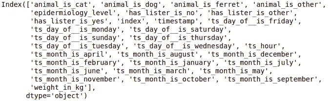

所以，我们开始吧。

```
target_variable = ‘epidermiology_level’**# First we define ‘X’ and ‘y’**
X = df_vet_numerical.loc[:, df_vet_numerical.columns != target_variable].values
y = df_vet_numerical.loc[:,[target_variable]].values**# Then we separate 500 to train**
X_train = X[:500]
y_train = y[:500]
print(“Train X and y:”)
print(X_train.shape)
print(y_train.shape)**# And 300 to test**
X_test = X[500:]
y_test = y[500:]
print(“Test X and y:”)
print(X_test.shape)
print(y_test.shape)
```

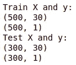

现在我们有了 **30 个预测特征**来馈入我们的线性模型。回归将增加其预测值特征，如下所示:

> y =a+b1x1 + b2x2 + … + bnxn

看看有没有进步。

```
# First we traqin the model with the Test Set
lm = LinearRegression()
lm.fit(X_test, y_test)# Then we generate predictions and compare to ‘y’ test
pred = lm.predict(X_test)
mean_squared_error(y_test, pred)
```

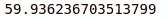

**59.93** 当然是对 **97.42 的**改进**。**我们来看看预测的和真实的。

```
df_preds_res = pd.DataFrame({'y_test':y_test[:,0], 'y_pred':pred[:,0]})
df_preds_res.head(15)
```

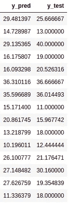