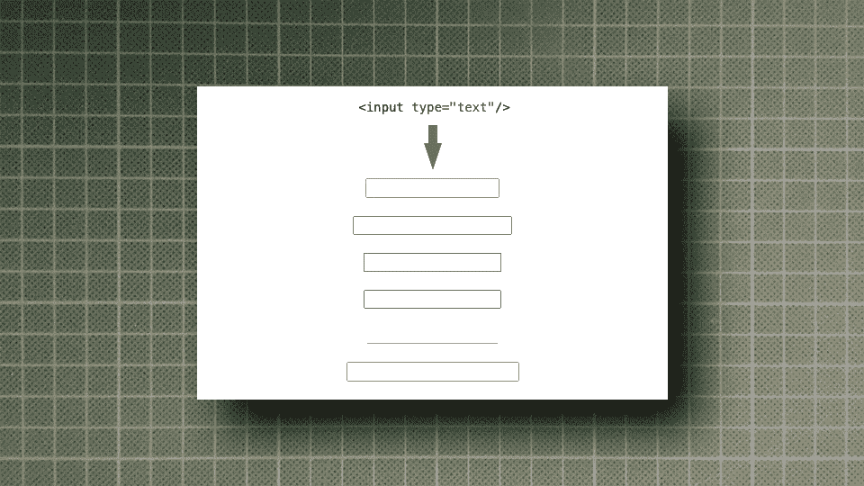
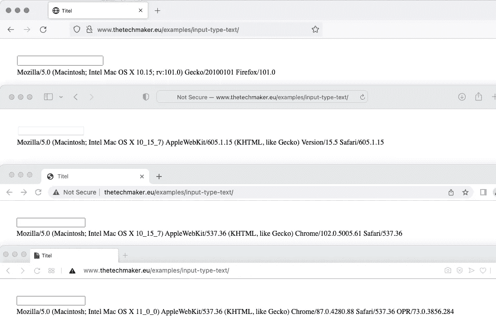
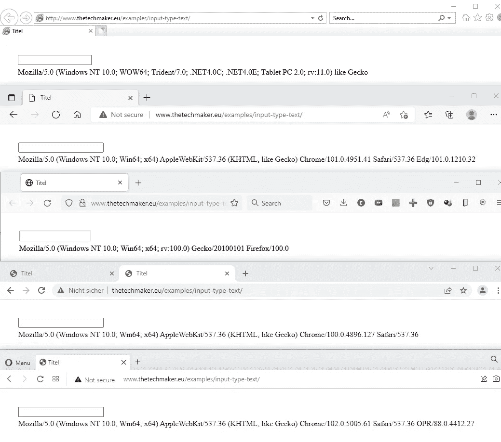
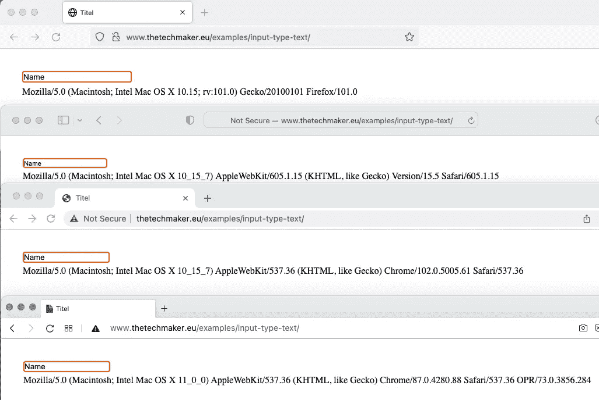
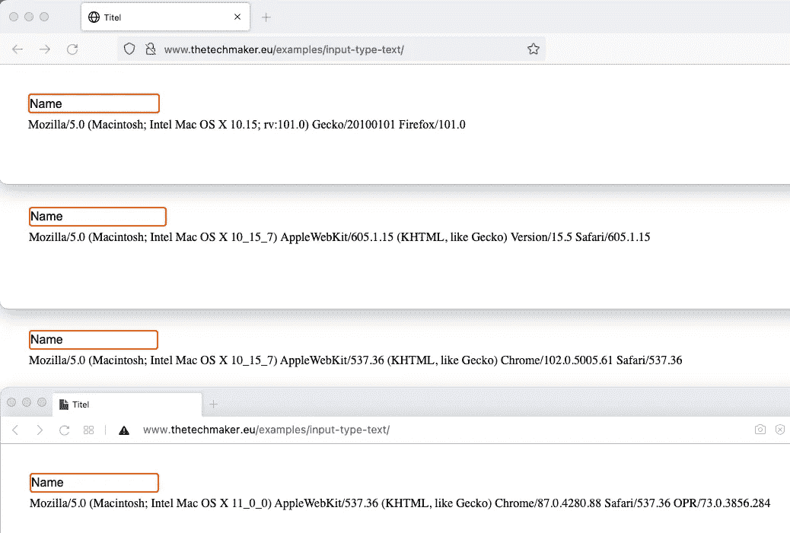
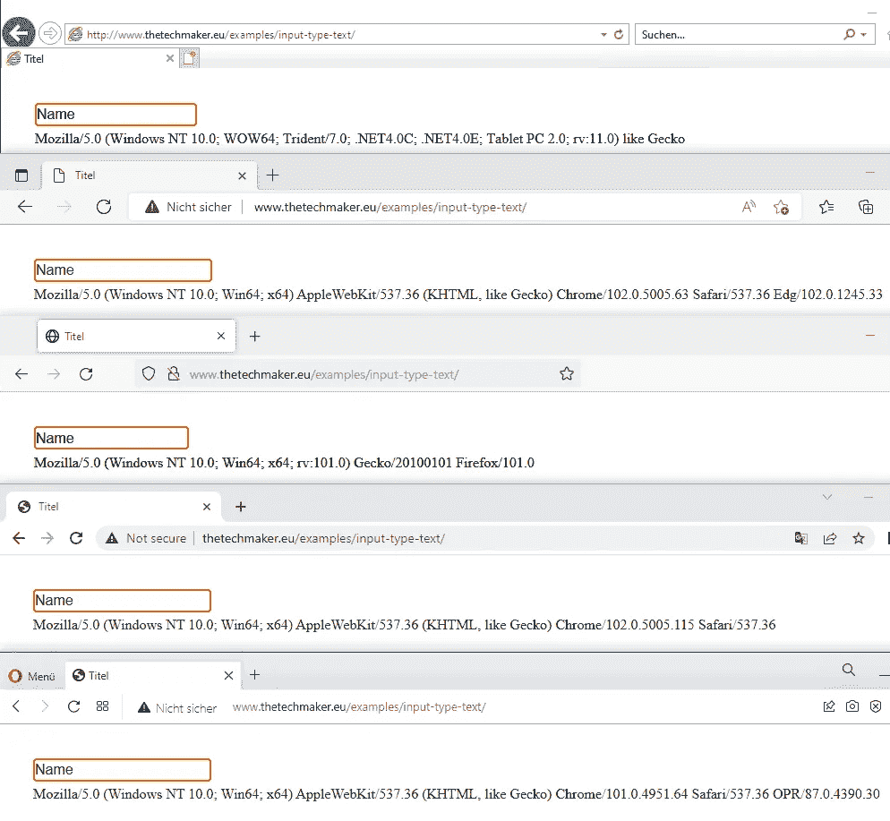
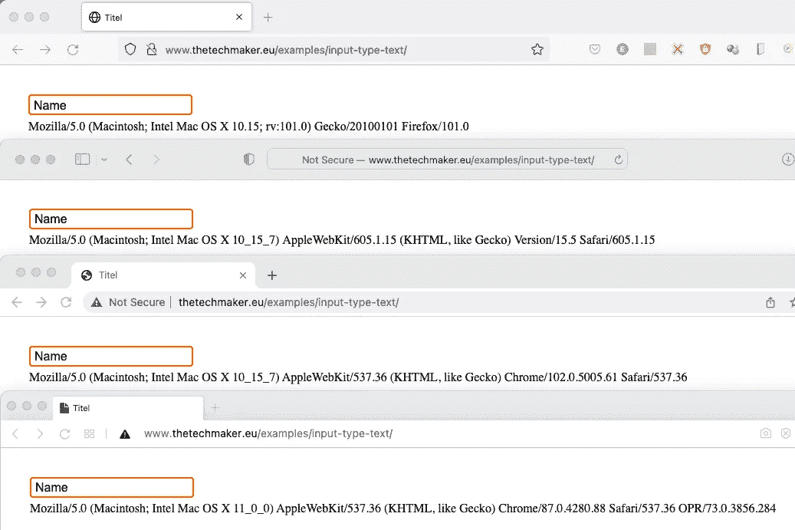

# 3 个步骤，帮助所有常见的网络浏览器的 HTML 文本输入的风格

> 原文：<https://levelup.gitconnected.com/3-steps-that-help-style-html-text-input-for-all-common-web-browsers-83a5e69853de>

## 如何确保文本输入元素在所有浏览器中看起来都一样



作者提供的图片

当我在 90 年代末开始 web 开发时，让网页布局在每个浏览器中都看起来一样是一件困难的工作。有 Netscape，后来的 Mozilla，早期版本的 Internet Explorer，如 4.5 后来的 IE6，Opera 和其他一些今天被遗忘的浏览器。甚至 MAC OS 也有一个特殊版本的 Internet Explorer。

所有这些浏览器对 CSS 的实现都很差，呈现的一切都不一样。幸运的是，这种情况在过去几年有所改变。苹果开始为 Safari 使用 WebKit 引擎，接着是谷歌 Chrome，然后 Opera 改用 WebKit，没错，就连微软也用最新版本的 Edge 从 Trident 换成了 WebKit。

所以现在，让网页在每个浏览器中都看起来一样要容易得多。但是仍然有一些小的不同，特别是输入元素。

# 基本的 HTML 代码如下所示:

```
<input type=text />
```

以下是不同浏览器对 MAC OS X 的测试结果:



从上到下:火狐、Safari、Chrome 和 Opera

这里是 Windows 10:



从上到下:IE11、Edge 火狐、Chrome 和 Opera

在第一个站点，我们看到所有的文本输入看起来非常相似，除了在 Safari 中，并且元素长度因浏览器而异。

# 第一步:

假设我们需要一个 2px 的橙色边框和 4px 的圆角作为输入。为了避免一些不必要的间距，我们将边距和填充设置为 0:

```
input {
   margin: 0px;
   padding: 0px;
   border: 2px solid #ff6600;
   border-radius: 4px;
}
```

MAC OS X 的结果:



从上到下:火狐、Safari、Chrome 和 Opera

Windows 10 的结果:


从上到下:IE11、Edge 火狐、Chrome 和 Opera

# 第二步:

间距、边框和半径完成。现在我们统一字体:

```
input {
   margin: 0px;
   padding: 0px;
   border: 2px solid #ff6600;
   border-radius: 4px;
   font-family: arial, helvetica, sans-serif;
   font-size: 16px;
   line-height: 22px;
}
```

MAC OS X 的结果:



从上到下:火狐、Safari、Chrome 和 Opera

Windows 10 的结果:


从上到下:IE11、Edge 火狐、Chrome 和 Opera

## IE11 在这里做什么？

它忽略了行高！因此，我们必须将输入的高度设置为与行高相同:

```
input {
   margin: 0px;
   padding: 0px;
   border: 2px solid #ff6600;
   border-radius: 4px;
   font-family: arial, helvetica, sans-serif;
   font-size: 16px;
   line-height: 22px;
   height: 22px;
}
```

现在看起来相当不错:



从上到下:IE11、Edge 火狐、Chrome 和 Opera

# 第三步

最后，我们将所有浏览器的宽度固定为一个固定值，并添加一些填充以在字段中的文本周围获得一个很好的空间:

```
input {
   margin: 0px;
   padding: 1px 5px 0px 5px;
   border: 2px solid #ff6600;
   border-radius: 4px;
   font-family: arial, helvetica, sans-serif;
   font-size: 16px;
   line-height: 22px;
   height: 22px;
   width: 200px;
}
```

MAC OS X 的结果:



从上到下:火狐、Safari、Chrome 和 Opera

Windows 10 的结果:


从上到下:IE11、Edge 火狐、Chrome 和 Opera

# 结论

现在浏览器差异没那么大了，但还是存在的。这里最好的例子是 Safari 记得第一张截图。稍微设计一下，我们就能修好它。

顺便说一下，几个月前，我写了一篇关于样式化复选框和单选输入的文章，请看:

[](/beautiful-radio-and-checkbox-inputs-only-with-css-1359980f94f9) [## 漂亮的单选按钮——只有 CSS 才有复选框输入

### 不需要 Javascript 来改变浏览器特定的输入外观

levelup.gitconnected.com](/beautiful-radio-and-checkbox-inputs-only-with-css-1359980f94f9) 

写这个故事的目的不仅仅是向您展示如何修复文本输入的浏览器差异。我想提醒开发者，世界上有比你每天使用的浏览器更多的浏览器。即使在 2022 年，我们也应该/必须用各种网络浏览器测试我们的代码。

编码快乐！