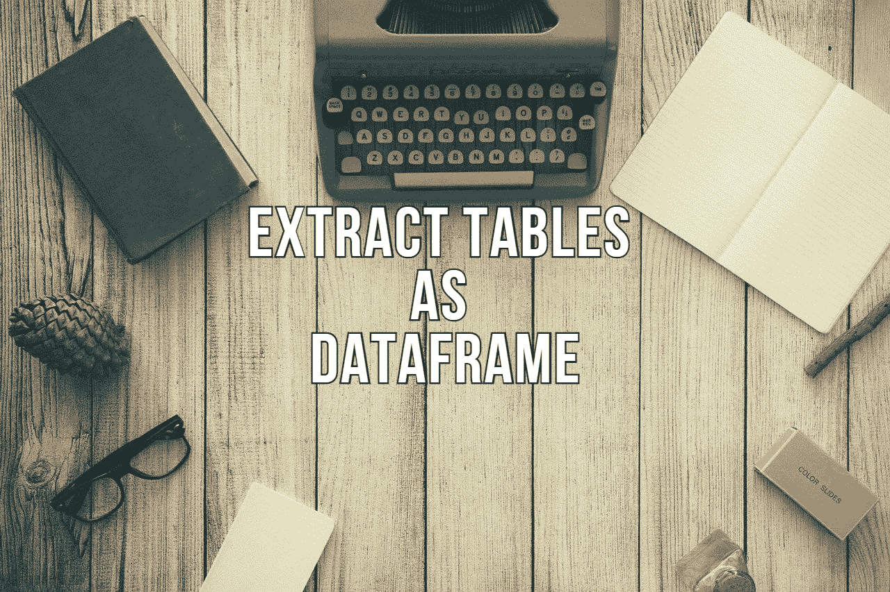
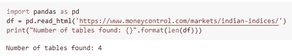
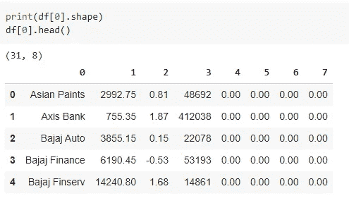
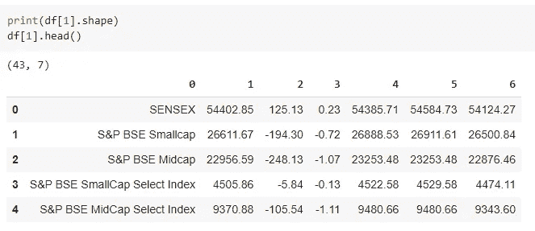

# 从 PDF / HTML 文件中提取表格作为 Pandas 数据框架的 3 种技术

> 原文：<https://levelup.gitconnected.com/3-techniques-to-extract-tables-as-pandas-dataframe-from-pdf-html-files-9a95c0b55f74>

## 用一行 Python 代码从 PDF、HTML、网页中抓取表格



图片由[免费提供-照片](https://pixabay.com/photos/?utm_source=link-attribution&amp;utm_medium=referral&amp;utm_campaign=image&amp;utm_content=801921)来自 [Pixabay](https://pixabay.com/?utm_source=link-attribution&amp;utm_medium=referral&amp;utm_campaign=image&amp;utm_content=801921)

数据收集是数据科学模型开发生命周期的第一步。数据集可以以任何格式呈现，数据工程师或数据科学家需要对原始数据集进行预处理，以使其适合建模。许多结构化或半结构化数据集可以以 PDF、HTML 文件、网页或图像格式呈现。从这样的非结构化文档中抓取数据集或表格是一项单调乏味的任务。开发一个定制的表格提取工具也需要大量的工作。

```
**Checklist:
(1) Pandas read_html() function
(2) Tabula-py library
(3) Camelot**
```

在本文中，我们将讨论 3 个这样的开源包，它们可以从 PDF、HTML 文件或网页中删除或提取表格，并将它们转换为 Pandas 数据框。

# (1.)熊猫 read_html():

可以使用 Beautiful Soup 之类的库从网页中抓取信息，但是当我们在网页上有了结构化的表格之后，就有可能使用`**read_html()**`函数将表格提取为 Pandas 数据帧。

## 用法:

```
**import pandas as pd
df = pd.read_html('-- web address --')**
```

熊猫的 read_html()函数从网页中拉出所有的表格。表格是按照它在网页的 HTML 代码中的书写顺序读取的。



上述网页上有 4 个表格。每个表都可以通过索引显示为熊猫数据框。



(图片由作者提供)，使用 read_html()作为 Pandas 数据框提取表格

# (2.)白板:

Tabula-py 是一个开源的 Python 库，允许从 PDF 文档中抓取表格或将整个 PDF 文档转换为 CSV、TSV、JSON 格式。它是 tabula-java 包的 python 包装器。

## 安装和使用:

`**tabula-py**`可以从 PyPI 安装软件包，使用

```
**pip install tabula-py**
```

要读取 PDF 文档并将表格转换为数据框列表，请使用:

```
import tabula
tables = tabula.read_pdf('file.pdf', pages = "all")
```

tabula-py 可以从一个 PDF 文档中提取表格，并将其保存为 CSV 格式。

```
# convert PDF into CSV file
**tabula.convert_into("test.pdf", "output.csv", output_format="csv", pages='all')**
```

# (3.)卡梅洛特:

Camelot 是另一个 Python 库，它从 PDF 文档中提取表格，这些表格可以导出为 CSV、TSV、JSON 数据格式。Camelot 最适合基于文本的 PDF 文档，而不是扫描的文档或图像。

Camelot 基本上使用两种解析技术从 PDF 文档中提取表格:

*   流解析
*   点阵解析

> 阅读[这篇文章](https://towardsdatascience.com/extract-tables-from-pdf-file-in-a-single-line-of-python-code-5b572cd9fbe5)以获得上述解析技术的分步方法。

## 安装和使用:

Camelot 需要 Ghostscript 依赖项，这两个库都可以从 PyPI 安装:

```
**!pip install "camelot-py[cv]"
!apt install python3-tk ghostscript**
```

导入 Camelot 库`**import camelot**`后，可以使用`**read_pdf()**`功能从 PDF 文档中提取表格。

```
**df_table = camelot.read_pdf('file.pdf', pages='1,2,4-5')**
```

默认情况下，表格将从 PDF 文档的第一页提取。使用参数`pages`，可以提取页码列表中提到的表格。在清理完这些表之后，可以使用索引号来访问每个表。

```
**#To display the ith table as Pandas Data frame
tables[i].df**
```

# 结论:

在本文中，我们讨论了 3 个开源 Python 库，它们可以从 PDF、HTML 文档或 web 页面中提取或抓取表格作为 Pandas data frame。这些都是方便的工具，可以用很少几行 Python 代码来加速数据收集工作流。

还有各种其他这样的库，包括 pdftables、pdf-table-extract、pdfplumber，它们执行类似的功能。

# 参考资料:

[1]Tabula-py GitHub:[https://github.com/chezou/tabula-py](https://github.com/chezou/tabula-py)

[2]卡梅洛特文献:[https://camelot-py.readthedocs.io/en/master/](https://camelot-py.readthedocs.io/en/master/)

> 感谢您的阅读