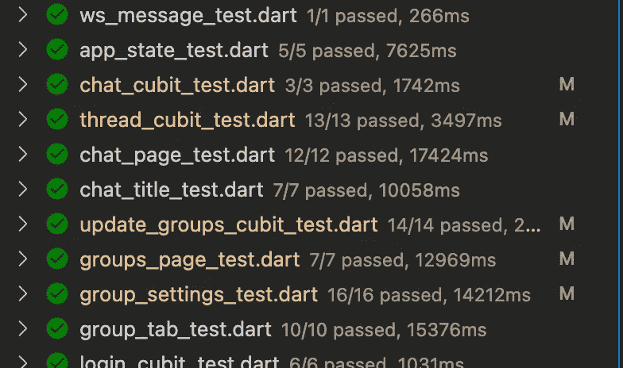

# 我在一个月内写 300 多个测试中学到的 3 件事

> 原文：<https://levelup.gitconnected.com/3-things-i-learned-writing-300-tests-in-a-month-a9d48a7184c7>



我们都经历过这种情况:给你一个要维护的应用程序。这款应用的测试数据糟糕透顶，几乎没有测试覆盖率。维护和扩展是一个很大的痛苦，没有真正的方法来告诉你是否已经破坏了什么。

这是一个非常困难的情况:在你之前的工程师认为他们不需要单元测试，他们是上天派来成为第一次就写出完美代码的唯一工程师的。

我继承的应用程序有 0 个单元测试。这是一场混乱&分别是 Typescript 前端和后端。不知何故，它设法在几乎没有错误的情况下完成了它的核心工作:也许在应用程序中投入了大量的人工测试。

我决定做我想看到的改变——在连续 4 周每周花费 40 个小时后，我最终将覆盖率提高到了 90%。以下是我学到的。

# 1.在编写实现时，您绝对需要考虑测试

你有没有尝试过在没有依赖注入的情况下为应用程序深处的组件编写单元测试？这几乎是不可能的——你需要模仿每一个小的交互，因为它的所有依赖都是真实的，而不仅仅是模仿。我愚蠢地花了第一周的时间，认为我可以不用重构实现代码。

我大错特错了。

引入依赖注入使得测试变得容易很多很多倍。能够创建您想要的确切的交互是非常好的，并且帮助我们创建健壮而简洁的测试。

如果你是用编译语言写的，很有可能你不能模仿导入。使用 TS/JS，您可以模拟一个导入的函数，然后导入您模拟的版本——这对于 Java 或 Dart 这两种编译语言来说不太适用。相反，您需要直接在对象中注入依赖关系。

测试时我不得不重构的其他事情是将所有字符串提取为常量。例如，如果用户要注销，我们会向他们显示文本“注销！”。

我们如何验证文本在屏幕上？它可能看起来像这样:

```
expect(find.text("logged out!"), toFindOneWidget);
```

但是如果 UI/UX 人员要求快速更改注销的副本，您就必须重构所有的测试来使用新的副本。相反，我提取出“注销！”文本到变量中。

简单，但是在编写单元测试时非常重要。

# 2.100%的测试覆盖率(可能是！)过度杀戮

当我开始的时候，我决定我还不如完整的发送它，去实现 100%的测试覆盖率。我很快了解到，有一些黑暗的角落很难测试或者测试起来毫无用处。以此为例:

```
MyListener(
    onEvent: (event) => event.join(
        (state1) => null, 
        (state2) => null, 
        (state3) => doSomething(state3.property)
   )
);
```

测试状态 3 完全有效，这是我最终测试的分支。但是编写一个类似“在 state1 / state2 上什么都不做”的测试是 1。没用，2。*不可能*。

想一想:你如何验证一个函数什么也不做？你会仔细检查每一个 mock 并确保它没有被调用吗？不太容易扩展。

我可能最终会对所有只对一种状态做出反应的事件编写扩展，但这是积压工作。我想专注于让应用程序更好地为我的用户服务，而不是当开发人员看到“覆盖率:100%”时，在他们的大脑中释放多巴胺！

不过，这并不意味着 100%的覆盖率对所有应用都不好。测试是一场马拉松，不是短跑——但我最终在这里跑完了马拉松。我在待办事项清单上添加了许多项目，等我有空的时候，我会慢慢开始挑选。

其中一项就是获得 100%的保险。

# 3.测试后端比前端容易

在你举起你的干草叉之前:这是一篇观点文章！如果你不同意，我很想在评论中听到原因。

后端代码是非常确定的。动作大多是线性的，(例如，一个路由调用一个服务)，每个入口点都非常清晰，输出也同样清晰。

前端不是这样的。

应用程序中的单个屏幕不只有一个入口点:也许一个 deeplink 推送通知会将你发送到该屏幕。也许有些字段是预填充的，或者用户不是管理员，所以他甚至不应该出现在那个屏幕上。

您可以编写易于测试的前端代码，但这是“在编写时请记住测试”的另一种情况。每个加载状态，故障状态，都需要有自己的单元测试，你只能知道当用户使用应用程序时会出现什么故障。

我的应用程序中有一个我没想过要测试但确实带来了错误的例子，当一个用户来回发送两个按钮时，他们会创建一个竞争条件。这个竞争条件意味着一个加载事件将在一个加载事件之后发送，整个应用程序将永远挂在一个加载屏幕上。

我怎么知道要测试这种互动？我知道在我的后端，我不会在一个循环中调用足够多的函数来让类似的行为发生。

总的来说，人类是不可预测的生物，而机器是不可思议的可预测的。测试机器行为比测试人类容易得多。

关于这一点的最后一点是，可以在前端进行数百种生活质量的改变，如缓存和预测。对于用户可能永远不会注意到的事情，至少要额外进行两次测试(当缓存正常时和出错时)。

不要让这阻碍你写测试。每次我添加一个新功能，就像呼吸了一口新鲜空气，因为我知道其他一切都在按预期运行。

作为一名开发人员，单元测试是我最喜欢做的事情之一，因为我对自己的代码感到无比的高效和快乐。我不再写没有测试的代码，持有微脚本，并且我是一个更高效的开发人员。

你有什么测试故事可以分享吗？有任何问题或意见吗？请在评论里告诉我！我总是在阅读和学习。

感谢阅读！