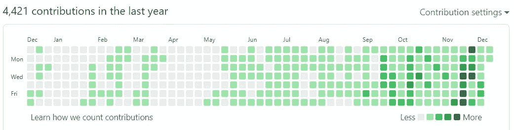

# 我在 Github 上 10 年学到的 3 件事

> 原文：<https://levelup.gitconnected.com/3-things-ive-learned-from-10-years-on-github-13f06920b5b2>

我在 2010 年开始使用 [Github，当时我已经学会了 Git，Ruby。Github 最初是用 Ruby on Rails 构建的，所以我在社区里听说过。我认为有一个网站来备份我的代码会很好，所以我试了一下。](https://github.com/chenyukang)

第二年，我开始了软件工程师的职业生涯。没想到这么多年过去了，向 Github 学习，为开源做贡献，已经成为一种习惯，一种爱好，一种生活方式。

我几乎每天都使用 Github，每当我在业余时间写了代码，我就会分享它，我也从 Github 学习，因为它有这么多优秀的参考资料和开源代码。

在过去的一年里，我业余时间写代码的时间比较多:(忽略最近两个月的提交次数，因为每天都有脚本同步笔记😁)

在此，我想分享我 10 年经验的收获。

# 自我完善

我会建议任何正在学习编码并希望提高开发技能的人参与开源贡献。

现在软件开发已经过了刀耕火种的时代。如今大多数软件开发都需要重用大量现有的库和工具。大规模软件开发是一种社会化的智力协作活动。在 Github 上分享代码，贡献给其他开源项目，是实践这种能力、协作能力，以及重用已有代码能力的最好方式。

在 Github 呆了这么长时间，我更喜欢[从源代码](https://coderscat.com/learn-from-source-code/)中学习和实践的方式，并且已经养成了贡献的自然习惯。例如:

*   我想学习 WebAssembly，所以我就把这个运行时 [wasmerio/wasmer](https://github.com/wasmerio/wasmer) 查出来借鉴一下，顺便修复了我发现的一些[的问题](https://github.com/wasmerio/wasmer/pulls?q=is:pr+is:closed+author:chenyukang)。
*   我看到了一个黑曜石插件的一些缺陷，所以我自己修复了它，并在[上和作者讨论如何改进](https://github.com/tadashi-aikawa/obsidian-various-complements-plugin/issues/30)。
*   在 Rust 中编码时，我看到一些重复的警告。我在 Github 上搜了一下，发现别人也遇到过，然后我就花时间做了一个 [PR 修复了](https://github.com/rust-lang/rust/pull/88493)。
*   我想了解容器是怎么实现的，于是我找了开源代码 [containers/youki](https://github.com/containers/youki) 来学习，然后修复我的[发现的问题](https://github.com/containers/youki/pulls?q=is:pr+author:chenyukang+is:closed)我甚至成为了一名维护者。

在这个过程中我自己也学到了很多。我不仅是用户和消费者，也是创造者和贡献者。这让我作为软件开发人员的职业生涯发生了巨大的变化。

贡献开源属于[在公共](https://wsvincent.com/working-in-public-book-review/)工作，也属于[在公共](https://www.swyx.io/learn-in-public/)学习。在公共场合工作的好处是，我们的贡献可以算作能力的证明。你的 Github 简介[就是最好的简历](https://www.codecademy.com/resources/blog/how-to-use-github-to-strengthen-your-resume/)。

在过去的几年里，我遇到了一些面试者，他们认可我在开源方面的贡献，并且在面试中不给大脑测试者那种 LeetCode 问题。

# 创造价值

我们的代码可能不会自己创造价值，但如果我们与全世界分享，它可能会帮助他人。

当我在读《编程语言基础》这本书的时候，我已经完成了大部分的练习:[我给人们的解决方案 3](https://github.com/chenyukang/eopl) 。我会收到一些学生发来的电子邮件，询问关于学习的问题，或者帮助我解决代码中的问题。因为这本书是一些大学的教材，所以我的代码是他们很好的参考。

再比如，我分享了一个我在学习数据结构和算法时实现的迷宫生成程序，然后我写了一些关于 A*寻路算法的文章。有一天，上海大学的一位教授看到了我的文章，问我是否可以帮助他们解决一个程序问题。他们想计算超过 1w 个节点中的第 k 条最短路径。我花了一些业余时间帮助他们用 c 语言实现核心算法。他们后来发表了[文章，并在作者列表](https://pubs.rsc.org/en/content/articlelanding/2013/mb/c3mb70089e#!divRelatedContent&articles)中出现了我的名字。

如果这些程序只存在我的硬盘里，它可能是没有价值的，因为我已经从代码中学到了知识。相反，与他人分享它，它是帮助他人和创造价值的东西，我们会得到深深的满足。我从来没有想过我会发表一篇关于分子生物学的文章，这是我从 share 得到的可能性。

# 更多可能性

> *你无法把向前看的点点滴滴串联起来；你只能回头看才能把它们联系起来。所以你必须相信这些点在你的未来会以某种方式连接起来。*
> 
> *——史蒂夫·乔布斯*

回想起来，我觉得我所做的灵感和贡献都是点点的，在某些方面给我的职业生涯带来了改变和可能。

我在社区中认识了更多的人，学习了编程的新知识，关注了我感兴趣的事情。最近，我开始了另一项兼职，我为一家公司的开源项目做贡献并获得报酬。这些都是我从来没有想过的可能性。

现在世界范围内出现了一波创建开源软件的公司，如 [Pingcap](https://github.com/pingcap) 、 [Vercel](https://github.com/vercel/vercel) 等等。这是一个非常好的趋势，这样除了 IT 巨头，我们这些喜欢写代码的人就有了更多的选择。

开源已经改变了一切，与他人分享你的代码将会有令人难以置信的回报。

那些伟大的改变世界的开源项目也是从一开始的一小步开始的。Linus 分享他的小内核的时候，他大概从来没有想过，整个操作系统行业都是他一个人改变的。当[尤雨溪](https://twitter.com/youyuxi)分享他的前端作品时，他没想到 Vue 会被这么多公司和人使用。

对于想了解更多信息的人，我强烈推荐这些:

*   [在公众中工作:开源软件的制作和维护](https://amzn.to/3EHlsBj)
*   [当众学习](https://www.swyx.io/learn-in-public/)
*   [我的十年回顾——反应过度](https://overreacted.io/my-decade-in-review/)
*   [全职开源之旅](https://scriptconf.org/blog/the-journey-to-full-time-open-source-evan-you/)