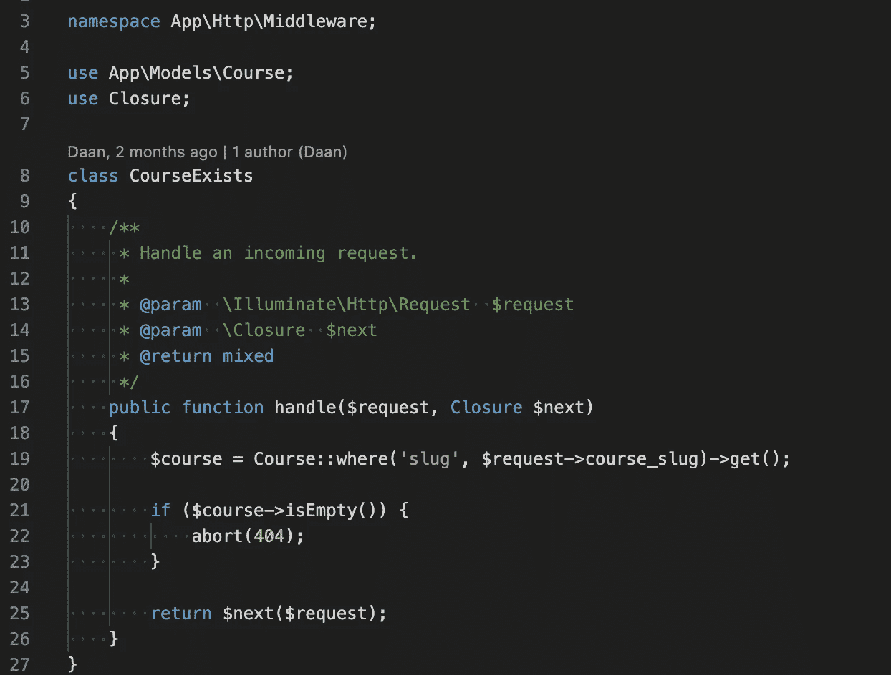

# 在开始编码之前，你可以做 3 件事来提高代码质量

> 原文：<https://levelup.gitconnected.com/3-things-you-can-do-before-you-even-start-coding-to-improve-the-quality-of-your-code-f9feed9e6605>

## 以下是如何提高你还没有编写的代码的质量

虽然现在听起来很奇怪，但是提高你没有编写的代码的质量是可能的。有一句老话是这样说的，一项精心构思的工作是成功的一半。这绝对适用于编写代码。做好准备并有一个计划对你的代码大有好处。确保你确切地知道你将要构建什么以及你将如何构建它，可以帮助你提高代码的质量。

在开始编码之前，你可以做以下三件事来提高代码质量。

# 1.要求

许多程序员都有一个坏习惯，那就是他们开始编码的速度太快。编码的欲望经常导致遗漏部分需求。当你不知道所有的需求时，事情就变得棘手了。

当你没有所有的需求时，你怎么知道要构建什么？测试人员如何知道要测试什么？这个功能什么时候准备好？最后但同样重要的一点是，客户能期待什么？

一开始，匆忙编写代码似乎很令人兴奋。然而，这种兴奋可能会耗费你大量的时间。当直接进入编码部分时，你最终会忽略更大的画面。很有可能你不得不重构你写的一部分代码。在最坏的情况下，你必须重写所有的代码。

最重要的是，当需求模糊、缺失或被误解时，bug 很容易潜入代码库。

当所有的需求都清晰时，开发人员就知道要构建什么，测试人员知道要测试什么，客户也知道要期待什么。这就产生了可以正确测试的简单代码，从而提高了代码的质量。

# 2.设计

想法比调试更便宜——抛弃一个想法比重构整个代码库更容易。

在构建某个功能时，设计或制定一个计划是必不可少的。当然，只有当你得到了所有的需求，你才能进行设计。

没有设计就直接开始编码就像没有蓝图就盖房子一样。你首先需要知道房间有多大，你把所有的门放在哪里等等。如果你没有蓝图就开始盖房子，不可避免地会遇到一些问题。这只会导致返工，浪费时间。

你花在设计上的时间是值得的。尽可能花时间去理解项目、风险和未知。提出正确的设计通常比以后修改代码花费的时间要少。

与在构建或维护阶段进行更改相比，在设计阶段进行更改的成本要低得多。对草图进行大幅度的修改比修改代码要节省时间。你不仅要改变你的代码，你还应该为这段代码调整所有的测试。

一个很好的经验法则是，在过程的早期比后期做出的改变越多，在时间和金钱花费方面就越好。

设计时，你应该考虑最佳实践。挑战在于使代码尽可能健壮和易于维护。花点时间想出正确的设计，最终产品会更有创意，质量更高。

# 3.约定

为了让没有自己编写过代码的其他开发人员能够轻松阅读和理解代码，拥有一个编码约定列表是很重要的。

每个开发人员对编码约定都有自己的想法。因此，当涉及到编码约定时，你必须确保团队中的每个人都在同一页上。很高兴知道有一些最佳实践可以作为编码约定列表的指南。

您可以添加到该列表中的规则数量是无限的，并且规则的数量可以变化。做对你和你的团队有用的事情。如果团队喜欢的话，可以随意在约定列表中添加新的规则。从列表中删除约定也是如此。

为了检查代码是否符合编码惯例，你基本上有两种选择。

您的第一个选择是在您的 IDE 中安装一个 linter。这样你可以自动检查代码是否以正确的方式编写。您可以在您的团队中共享您的 linter 的配置文件，或者将它放在存储库中。

另一种选择是构建一个管道来检查您的代码是否符合编码约定。每当开发人员提交到存储库时，管道都会运行 linter。管道有助于提高代码质量，因为它向开发人员提供了快速的反馈。如果测试失败，构建将会失败，开发人员将会得到通知。这是两个选项中最可靠的，因为它迫使开发人员在代码被合并之前修复它们。