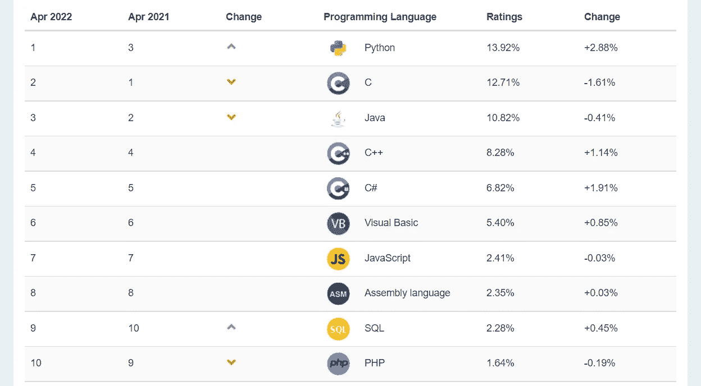

# 成为富有程序员的 3 个技巧

> 原文：<https://levelup.gitconnected.com/3-tips-for-becoming-a-rich-programmer-f1ecdf29a6be>

## 哪种方式是正确的？

肯尼·埃利亚松在 [Unsplash](https://unsplash.com?utm_source=medium&utm_medium=referral) 上的照片

回顾过去的日子，有喜有悲，选择程序员作为职业也是出于内心。在成为程序员的路上，我遇到了很多困惑，现在我有了一个新的视角来解读这些，希望能帮助到你，让你少走弯路，变得更富有。

# 技术方向？语言？

可能大家都遇到过这个问题，我该选择哪个技术方向，学哪门语言？哪些未来前景比较好？

我们可以先看看今年的 TIOBE 编程语言排名:

图片由 TIOBE 提供

这里只截取前 10 名，更多信息，点击[这里](https://www.tiobe.com/tiobe-index/)。

可以看出，编程语言的流行程度每年每个月都有波动，但总的来说，C、Java 这些老牌编程语言一直都在前排，正如美国作家 [*Nassim Taleb*](https://en.wikipedia.org/wiki/Nassim_Nicholas_Taleb) 曾经说过的 [*Lindy 效应*](https://en.wikipedia.org/wiki/Lindy_effect) :

> 信息或想法的预期寿命与其当前寿命成正比。

这意味着如果你想知道一种语言会存在多久，看看它已经存在了多久。这可能不准确，但也说明新技术新语言升级越快，越容易被取代。

此外，还有一些声音告诉我们:

> 语言无所谓，语言只是解决问题的工具，需要的时候可以在语言之间切换。

这句话有一定的道理，但大多数人不知道它的前提，即一个人必须精通一种语言，然后学习另一种语言才能容易。

但是精通一门语言通常不是一件简单的事情。除了熟悉语法，了解特性，每种编程语言背后都有一个庞大的生态系统，需要我们花费大量的时间和精力来达到“精通”。

那么我应该学哪种语言呢？选择哪个方向？以下是我个人的看法:

**大部分人应该先选择行业而不是语言**，不要因为我喜欢某个特定的编程语言就选择行业。因为兴趣可以让你进入前 50%，但是如果你想进入硕士领域的前 20%，仅仅依靠兴趣是不够的。因为前 20%是重复和无聊的，所以需要更多的努力和耐心才能到达那里(*当然还有运气*)。

那么为什么要选择一个行业呢？因为选择一个现阶段稳定或者未来可能快速成长的行业，能给你带来**足够的回报**，是你独立生存的能力。往往最好是在一个行业站稳脚跟，然后根据兴趣或工作需要选择下一个方向或语言。

# 为什么学习？怎么学？

假设我们选择了行业，选择了语言，成功进入职场，开始工作。如果把时间轴拉长，那些起点相同的人，有些人同时拿到的钱更多，这是为什么？

一个相当大的原因就是这些人一直在**系统的学习，不断的突破自己**。而有些人遇到那些压力大、任务重的工作就停止学习了。

所以尽量选择那些能平衡工作和生活的工作，在业余时间继续充实自己，提高自己的觉悟。

但是现在信息流动如此广阔，你只要在谷歌上搜索就能找到很多学习资料。如果你想全部学会，那是不可能的，所以你必须**做出选择**。

我个人的看法是:

第一次使用一门新的编程语言，最有效的方法是阅读该语言的经典入门书籍或官方介绍文档。每个人对入门书的看法都不一样，但总有那么几本。选择自己喜欢和理解的，坚持阅读并完成里面的练习就可以入门了。

这种类型的学习材料集中在一个领域，讲得足够详细和清晰，你不会拉下重要的东西。

把这些知识带到职场工作后，有了语言的实际编程经验，**就可以阅读与工作相关的特定领域的书籍。在碎片化的时间里，还可以浏览 Medium 等技术网站，了解自己不清楚、模糊、被忽略的技术点。**

这类材料集中于某一特定领域的思想和观点，可能是碎片化的。所以在获得知识点后，**要及时练习，用已有的知识进行推演。**否则，这些知识永远不属于你，就像快餐，你吃了就忘了。只有快速使用，才能真正成为自己的。

最好不要颠倒这两类信息的顺序，因为过早接触第二类信息可能会给你造成更多的误解和麻烦，而且后期要花很多精力去纠正。而这些困难也可能会挫伤你对编程的热情。

# 问什么问题？

还有很重要的一点就是要学会提问。这是一门艺术，不要羞于表达，也不要问那些愚蠢的问题。

比如，对于公司现有的设施，如果不问老员工问题，自己动手改造轮子，不仅会消耗大量无效能源还可能质量很差。**对于商业软件来说，从来都不是一个人的工作。**

同时，不要问那些愚蠢的问题。如果你在谷歌搜索栏只需点击两下就能得到答案，最好不要说出来，因为这样不仅得不到很低的评价还容易让你产生依赖感。从而失去独立思考的能力。

还有别的吗？

对于某个问题，一定要有自己的想法，不要盲目相信别人的答案，哪怕那个人有很多头衔。**只有在亲身实践之后才能得出结论。**

今天就到这里。我是 Zachary，我会继续输出与 web 开发相关的故事，如果你喜欢这样的故事并想支持我，请考虑成为 [*中级会员*](https://medium.com/@islizeqiang/membership) *。每月 5 美元，你可以无限制地访问媒体内容。如果你通过* [*我的链接*](https://medium.com/@islizeqiang/membership) *报名，我会得到一点佣金。*

你的支持对我来说很重要——谢谢。