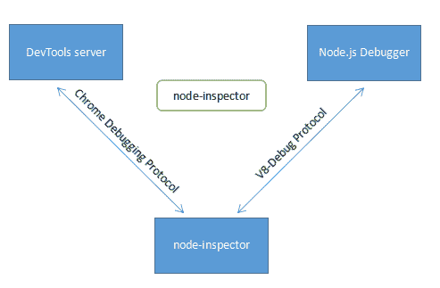
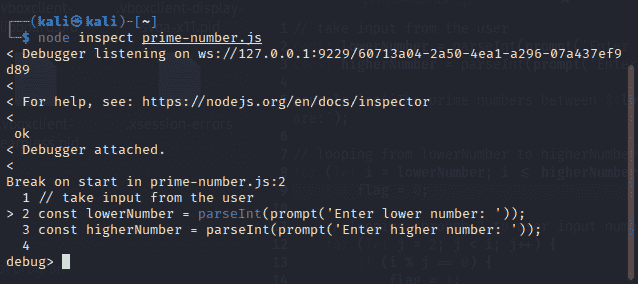

# 使用内置调试器调试 Nodejs 的 3 个技巧

> 原文：<https://levelup.gitconnected.com/3-tips-for-the-nodejs-debugging-using-the-built-in-debugger-247518686bff>

卢卡·布拉沃在 [Unsplash](https://unsplash.com/s/photos/software-coding?utm_source=unsplash&utm_medium=referral&utm_content=creditCopyText) 上的照片

软件工程师花时间写代码，只要代码在有效地编译和工作，他们就继续开发它。然而，当代码不起作用时，他们可能会感到恼火，如果代码超过 100 行，通过逐行检查来修改代码要么是不可能的，要么是非常耗时的。当他们仔细检查时，他们可能会经历更大程度的挫败感。现在的问题是，调试到底是什么？

调试是检测和消除可能已经引入到代码中的 bug、错误或不规则性的过程。本质上，它寻找并识别任何故障。调试过程允许开发人员纠正这些缺陷，并使程序能够按照必要的规范正确执行。

调试包括许多过程，例如找到软件中的错误，然后从本质上检查哪里出了问题以及如何跟踪问题。应用补丁后，必须重新执行代码，以便您可以检查它是否成功解决了问题。这是一个有点冗长的过程，如果您手动执行调试，那么这可能是一个相当耗时和令人沮丧的过程。

# 使用内置调试器调试 Nodejs 的 3 个技巧

[来源](https://blog.csdn.net/codebay118/article/details/72596929)

[nodejs 调试](https://sprkl.dev/node-js-debugging/)的过程可以用多种不同的方法进行，其中一种就是利用内置的调试器。您可以利用各种提示和过程，比如在代码中插入断点或者利用 Nodejs 的 inspect 特性。这只是两个例子。来说说他们吧。

# 1.在代码的关键部分使用断点

如果您的应用程序包含数千行代码，那么一步一步地手动调试整个程序可能是一个非常低效的过程。如果是这种情况，您可以利用断点。它基本上让你能够中断程序的正常执行，并在代码中的特定点暂停，以简化调试。

用户可以使用断点让你的程序正常运行，直到它碰到你怀疑有问题的关键代码段。如果没有错误，您将能够将断点重新定位到代码中的另一个重要位置，依此类推。

在编程中，可以用许多不同的方法来定义断点。通过使用 debugger 命令，任何 JavaScript 调试器都可以在特定位置暂停执行。

> //接受用户的输入
> const lowerN = parse int(prompt(' Enter lower number:'))；
> const higher n = parse int(prompt('输入更高的数字:'))；
> 
> console.log(`在${lowerN}和${higherN}之间的质数是:`)；
> 
> for(设 i = lowerN 我<= higherN; i++) {
> 让 flag = 0；
> 
> //通过 2 循环到用户输入的数字
> for(让 j = 2；j<I；j++){
> if(I % j = = 0){
> flag = 1；
> 破；
> 调试器；
> }
> }
> 
> // if 数大于 1 且不能被其他数整除
> if(I>1&flag = = 0){
> console . log(I)；
> }
> }

[代码来源](https://www.programiz.com/javascript/examples/prime-number-intervals)

# 2.使用检查模式可以更快地调试

所有这些调试策略，比如在不同的位置插入打印语句或利用断点，有时会非常耗时，并且需要开发人员进行大量的手动干预。此外，Nodejs 自带内置调试器，让程序员更容易找到并修复代码中的 bug。

如果代码中有问题，可以使用节点检查器或节点检查器。在调试过程中，您可以简单地在代码中向前移动，以确定哪里有问题或者代码在哪个点没有被执行。这可以通过使用几个不同的命令或选项来完成，所有这些命令或选项都可供用户使用。让我们进一步讨论。

假设我们有一个[程序](https://www.programiz.com/javascript/examples/prime-number-intervals)打印质数:

> //接受用户的输入
> const lowerN = parse int(prompt(' Enter lower number:'))；
> const higher n = parse int(prompt('输入更高的数字:'))；
> 
> console.log(`在${lowerN}和${higherN}之间的质数是:`)；
> 
> for(设 i = lowerNi <= higherN; i++) {
> 设 flag = 0；
> 
> //通过 2 循环到用户输入的数字
> 为(让 j = 2；j<I；j++){
> if(I % j = = 0){
> flag = 1；
> 破；
> }
> }
> 
> // if 数大于 1 且不能被其他数整除
> if(I>1&flag = = 0){
> console . log(I)；
> }
> }

为了调试该文件，只需在终端中键入以下命令

> >节点检查<filename></filename>

作者图片:使用检查器调试节点 JS

您基本上可以使用几个选项，比如按“n”前进到一个断点，“c”继续执行，而“s”前进到一个函数。因此，您可以通过使用 [inspect](https://nodejs.org/api/inspector.html) 来轻松调试错误。

# 3.使用打印语句进行调试

当我们谈论调试程序时，许多程序员通常会在多个不同的位置包含打印语句。如果程序中有错误，一些打印语句将不会被写入，这使得程序员能够容易地识别代码的哪个部分有错误。

这要求模块在 Nodejs 中添加打印语句，比如 console.log()或 [console.debug](https://nodejs.org/api/console.html) ()命令。虽然这是一个手动过程，但这种方法可以快速使用。然而，另一方面，这意味着它不像其他方法那样具有可扩展性，并且可能会产生一些错误。如果使用这种方法，可能会将一些敏感信息打印到控制台，恶意用户可能会利用这些信息对应用程序或用户采取行动。

> //接受用户的输入
> const lowerN = parse int(prompt(' Enter lower number:'))；
> const higher n = parse int(prompt('输入更高的数字:'))；
> 
> console.log(`在${lowerN}和${higherN}之间的质数是:`)；
> 
> for(设 i = lowerNi <= higherN; i++) {
> 设 flag = 0；
> 
> //通过 2 循环到用户输入的编号
> for(让 j = 2；j<I；j++){
> if(I % j = = 0){
> flag = 1；
> console . log(flag)
> break；
> }
> }
> 
> // if 数大于 1 且不能被其他数整除
> if(I>1&flag = = 0){
> console . log(I)；
> }
> }

# 结论

程序员写的脚本通常非常冗长，甚至一个错别字都会导致各种各样的问题。因此，在抛出错误的情况下，执行实际的代码调试是非常重要的。由于手工调试可能会导致大量的问题，所以使用内置调试器或其他技术检查所有代码的错误是非常重要的。我们已经讨论了一些有效调试代码的不同建议，每种方法都可以帮助开发人员更及时地调试代码。