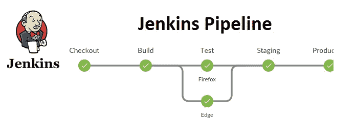

# 成为更好的 Java 开发人员的 3 个技巧

> 原文：<https://levelup.gitconnected.com/3-tips-medior-java-developer-learned-to-become-even-better-java-developer-e4ebda9aafe8>

## 本人拙见，打 Java 1.5 年多，关于如何成为一个更好的 Java 开发者。


照片由[克里斯蒂娜·莫里路](https://www.pexels.com/@divinetechygirl?utm_content=attributionCopyText&utm_medium=referral&utm_source=pexels)从[派克斯](https://www.pexels.com/photo/person-using-macbook-pro-on-person-s-lap-1181298/?utm_content=attributionCopyText&utm_medium=referral&utm_source=pexels)拍摄

我做 Java 开发人员[已经超过 1.5 年了。与不同经验的同事一起工作。有些人对 Java 领域非常了解。](https://www.linkedin.com/in/zivce/)

反复出现的软件问题是不充分的测试、糟糕的项目管理和低质量的代码。这篇文章将使你以正确的方式去追求那些问题。

你已经是 Java 开发者了？您可能会在本文中找到一些重复的提示。你想成为其中一员？那么这就是给你的文章。

让我们来看看实际的技巧。如果它获得了牵引力，我会进入更多的提示。

# 1.学黄瓜

[](https://cucumber.io/) [## 面向团队的 BDD 测试和协作工具| Cucumber

### 很简单。无论是开源还是商用，我们的协作工具都将提升您的工程团队的绩效…

cucumber.io](https://cucumber.io/) 

这将使你从其他 Java 开发者中脱颖而出。学习 BDD 会有很大的不同。用 Cucumber 框架实现 BDD 测试。

```
# Gherkin syntax of Cucumber feature test
Feature: Guess the word

  # The first example has two steps
  Scenario: Maker starts a game
    When the Maker starts a game
    Then the Maker waits for a Breaker to join

  # The second example has three steps
  Scenario: Breaker joins a game
    Given the Maker has started a game with the word "silky"
    When the Breaker joins the Maker's game
    Then the Breaker must guess a word with 5 characters
```

每个小黄瓜步骤—执行 Java 代码。这就是为什么你需要步骤定义。步骤定义是 Java 代码，它在 Cucumber 步骤解释上执行。

```
public class StepDefinitions {
    @Given("I have {int} cukes in my belly")
    public void i_have_n_cukes_in_my_belly(int cukes) {
        System.out.format("Cukes: %n\n", cukes);
    }
}
```

黄瓜有什么好的？传递测试数据。创建一个步骤`I have 3 cukes in my belly`。解释后，用 3 个 cukes 调用方法`i_have_n_cukes_in_my_belly`。

```
Scenario: Correct non-zero number of books found by author   Given I have the following books in the store     
 | title | author |   
 | The Devil in the White City| Erik Larson |
 | The Lion, the Witch and the Wardrobe | C.S. Lewis|
 | In the Garden of Beasts  | Erik Larson | When I search for books by author Erik Larson
Then I find 2 books# [Taken from here](https://www.baeldung.com/cucumber-data-tables)
```

你甚至可以使用数据表。要像这样使用它，你需要 dto。你明白了。

Cucumber 对测试数据很灵活。您可以将表、参数作为测试数据传入，并继续测试。

希望这能让你对[黄瓜](https://cucumber.io/docs/cucumber/api/)有更多的了解。

测试很棒。但是没有持续的测试，就没有结果。这就是为什么你需要学习詹金斯。

# 2.学习詹金斯

[](https://www.jenkins.io/) [## 詹金斯

### Jenkins 是一个社区驱动的项目。我们邀请每一个人加入我们的行列，推动它向前发展。任何贡献都很重要…

www.jenkins.io](https://www.jenkins.io/) 

Jenkins 使您的项目更加稳定。主要用于项目的自动构建、部署和其他任务。

詹金斯处理自动测试运行。它是以流水线方式完成的。您定义管道的几个测试阶段并运行它们。阶段可以并行或线性方式运行。



图片来源:[https://qautomation.blog/2019/05/28/jenkins-pipeline/](https://qautomation.blog/2019/05/28/jenkins-pipeline/)

这里有一个简单而完整的教程，教你如何创建一个简单的[管道](https://www.jenkins.io/doc/book/pipeline/)。

[](/jenkins-pipeline-with-gitlab-for-java-projects-d2e10c08e255) [## Jenkins Pipeline 与 GitLab for Java 项目

### 这篇文章将向你展示如何配置一个詹金斯管道，当你推…

levelup.gitconnected.com](/jenkins-pipeline-with-gitlab-for-java-projects-d2e10c08e255) 

我们还能拿詹金斯怎么办？自动部署到不同的环境。当构建稳定后，或者用开发人员的话来说是绿色的，您可以轻松地部署它。

当出现故障时，Jenkins 会保存日志。检查日志，改进代码，然后重新构建。我经常看黄瓜测试日志，或者声纳报告。

# 3.学习 Java 8 流

函数式编程现在真的很热。Java 不缺的东西。Java 有[个流](https://www.baeldung.com/java-8-streams)。这就是它如何触及函数式编程范式的。

使用 Streams 帮助我用更少的代码做更多的事情。每个人都喜欢小代码胜过大代码块。

以下是 Java 流如何改进代码。这里你继续看[。下面先睹为快，看看流如何改进 Java 代码。](https://medium.com/javarevisited/the-5-most-useful-java-8-stream-functions-to-improve-your-code-4abf11da7d1d)

```
// From this code **// people is simple a list of Person, with a name and email address
List**<InternetAddress> listOfEmail = new ArrayList<>();

for (Person p: people) {
  listOfEmail.add(new InternetAddress(p.getEmailAddress()));
}
return listOfEmail;// to this codepeople.stream()
.map(Person::getEmailAddress)
.map(InternetAddress::new).collect(Collectors.*toList*());
```

你应该从 Streams API 中学到什么？了解如何使用贴图、缩小和过滤功能。这将使你的 Java 代码更简洁，更易读。

似乎不言而喻，但是我有团队成员在 Java 流中挣扎。他们不了解函数式编程，他们还停留在 OOP 范例中。

了解更多关于方法引用的信息，即`Person::getEmailAddress`。将函数作为参数传递，了解高阶函数并创建更简洁的 Java 代码。

# 结论

了解更多关于 BDD 的信息。在 Cucumber 中创建测试特征。学会融入詹金斯。这就是你与其他 Java 开发人员的不同之处。

了解 Java Streams API。用更少的代码做更多的事情。了解更多关于 Java 环境下的函数式编程。

# 让我知道你的回应技巧。谢了。