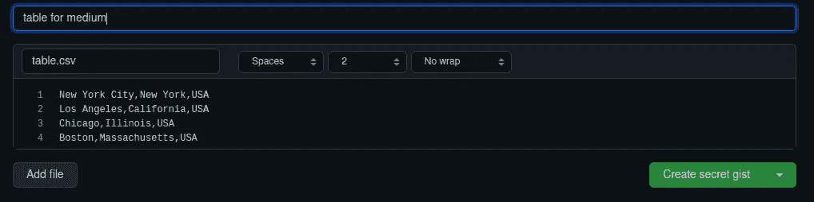
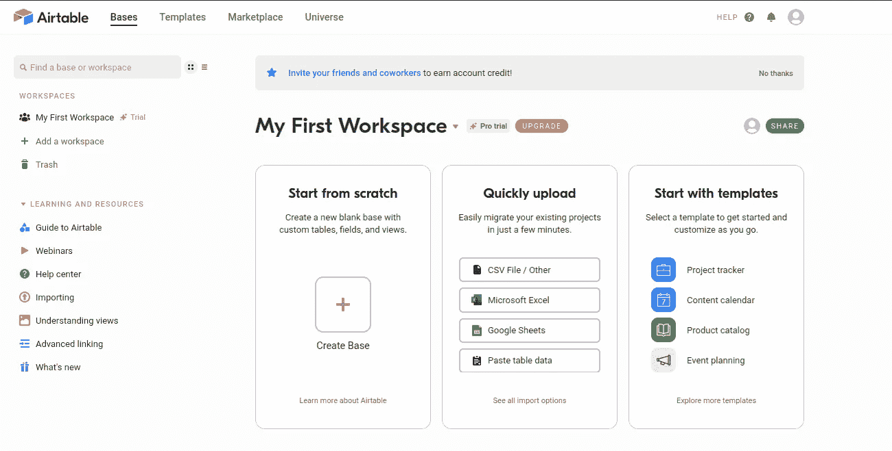
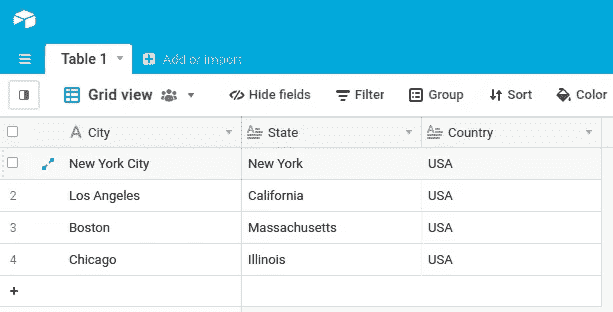

# 在 Medium Post 上分享漂亮表格的 3 个技巧

> 原文：<https://levelup.gitconnected.com/3-tips-to-sharing-beautiful-tables-on-medium-post-25dab18670e>

## 了解如何在介质上轻松有效地共享表格


伊恩·杜利在 [Unsplash](https://unsplash.com?utm_source=medium&utm_medium=referral) 上拍摄的照片

你有没有想过如何简单有效地在你的文章中添加一个表格，而不需要弄乱格式？我经常写关于人工智能和数据科学的帖子，这往往需要嵌入一个表格来说明。然而，我还没有找到一个简单的解决方案来做到这一点，除了插入一个使用降价如下。

```
| City          | State        | Country |
| ------------- | ------------ |-------- |
| New York City | New York     | USA     |
| Los Angeles   | California   | USA     |
| Chicago       | Illinois     | USA     |
| Boston        | Massachusetts| USA     |
```

正如你可能想到的，一个大的表格很难插入到文章中，因为不同设备的格式可能不同。

在本文中，我将分享一些关于如何轻松有效地共享 table 的技巧。

# Github Gist

您可以访问`gist.github.com`并开始在那里创建一个表，而无需注册。但是，建议注册，因为您可以在将来根据需要修改代码/数据。

首先，你用`<filename>.csv`格式写下你要点的文件名。然后，将逗号分隔的值复制并粘贴到提供的空白处。



Github 表格创建要点(图片由作者提供)

然后，我们点击`create`按钮，将地址栏中的链接复制/粘贴到你的文章中。

这就是你要的，一个漂亮的小桌子，增加了交互性，比如`search`功能。

# 充气台

Airtable 现在似乎越来越受媒体作家的欢迎。一旦你在[https://airtable.com 注册，](https://airtable.com,)你将会看到下面的主页。



Airtable 主页(图片由作者提供)

目前没有从 Github Gist 导入数据的功能。所以我们要做的就是点击`Create Base`从头开始。

然后，您可以通过以下方式根据您拥有的数据修改该表

*   更改列的数据类型
*   添加更多行(快捷键为`shift-enter`
*   删除/添加新列
*   *甚至*，对表格应用颜色



在 Airtable 上编辑表格数据(图片由作者提供)

编辑完成后，您可以复制共享链接并将其粘贴到您的中型帖子上。点击顶部面板上的`Share view`可以找到链接，如下所示。


共享表格(作者图片)

在粘贴链接后，你的表格就很好地嵌入到你的文章中了！

Airtable(图片由作者提供)

# 如果其他都失败了，截图吧…

正如小节的标题所暗示的，你可以随时使用截图。对于作者来说，这是共享表格的最简单的方法，但是对于想要复制内容的读者来说，这可能有点烦人。


米卡·鲍梅斯特在 [Unsplash](https://unsplash.com?utm_source=medium&utm_medium=referral) 上的照片

# 总结想法

这些是在 Medium post 上简单有效地分享你的表格的一些小技巧。虽然没有一个像嵌入代码块那样简单，但是这里介绍的平台提供了可以满足每个人需求的功能；这篇文章仅仅触及了你可能做的事情的表面。

因此，如果你有任何其他想法或替代方案，请随时让我知道在回应部分！一如既往，如果你喜欢这个帖子，请考虑订阅我的 [**电子邮件简讯**](https://tinyurl.com/2npw2fnz) ，在那里我会定期用简单的英语和漂亮的可视化语言总结编程技巧和人工智能研究论文。