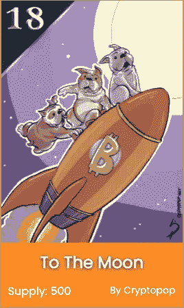

# 三种类型的 NFT 项目将登上月球！

> 原文：<https://levelup.gitconnected.com/3-types-of-nft-projects-thatll-go-to-the-moon-8e3eeb43585b>

或者至少给你一个机会…

古玩卡

首先，我无法预测未来。尽管如此，看着人们以彩票投资的心态买入项目，并称之为完全投机，还是很有趣的。

这是你的生活，这是你的钱，你他妈的爱怎么用就怎么用。作为一个母亲是英国人的南非人，英镑的价值在我出生时就已经根深蒂固了。所以我从来没有忘记我在 1 ETH 花了多少钱。

想象一下，当我解释说我刚刚用相当于 5000 英镑的菲亚特币买了一张苹果照片(古董卡)时，我母亲脸上的表情

她以为我已经完全失控了。

不管怎样，关于她的事到此为止。以下是我对未来几年可能仍然有价值的东西的看法，在 80%的项目屈服于零，而另外 18%的项目仍然承诺接管元宇宙之后。

试着用回顾的眼光来看待这一时刻，并对未来可能发生的事情做出一些判断是很重要的。

我相信这些是 NFT 项目的最佳投资类型；下面继续，我会告诉你为什么。

# **1。强有力的女性主导的 NFT 项目**

58%的女性弥补了(web2)电子商务销售，与男性同行相比，她们更类似于品牌从属关系。不管是男是女，我们都在社会上表明我们是谁，我们代表什么部落。

一旦新员工入职时的明显摩擦变得更加顺畅，我认为男性和女性 NFT 参与者之间的竞争环境就会变得平等。由于女性主导的项目不到 2%，我们可以看到一个有趣的供需动态，更多的女性被吸引到女性起源的项目中。

三个真正值得研究的项目

*   女人的世界
*   妇女和武器
*   老板美人

# 2.具有历史意义的非物质文化遗产

有些人觉得把 2018 年的一个项目称为“历史性的”是可笑的……我可能部分同意这一点。

但是，如果我们认为区块链技术有一天将成为我们几乎所有事情的基础，特别是以太坊(它一直是海报儿童)。利用收藏家的心态，以太坊上最早的 NFTs 迭代将成为化石，其他所有项目都被构建并视为人工制品。

目前，只有 150 万“热钱包”在以太坊上积极购买 NFT。我们走得太早了，以至于你可以看到任何购买压力都会影响那些已经拥有重大价值的最早的历史项目。

当“正常人”来到这里，钱包的数字不可避免地达到 1 亿，狗屎会弹出。那是“可能有潜力”的专业术语。

最后一件事。随着时间的推移，收藏家们总是会回到这些“第一次”和“早期”的 2020 年前的项目。这比从一个匿名的第一次创业者那里铸造下一个 10k PFP 强多了。

完全披露:我拥有以下两个历史项目的 NFT，但它们 100%值得研究。

*   古董卡片
*   被包裹的罢工者

# 3.有全明星操作员的项目

我对是否包括第三部分犹豫不决，因为在大多数情况下，你可能没有能力见到创始人，与他们一起工作，或者观看他们的行动。

像 Garyvee 这样的人，记录了他的商业旅程，可能会给你一半的机会。在媒体上高调的成功也可能是一个信号。

这里有一些你可以考虑的事情。

项目背后的人是全明星/ A '球员吗？

抛开他们的技能和记录，这些都是显而易见的因素，但想象一下一个真正的“全明星”的心态……他们会愿意因为拿了一个“L”而毁掉自己的声誉，离开 NFT 的一个项目，甚至可能为了一个小小的麻烦而毁掉自己一生的工作或当前的业务，让全世界都看到吗？

他们是成功经营真正企业的“真正企业家”吗？你的 Twitter 账号里有“CEO”或“创始人”不算数。

在我看来，这些人与众不同，并找到了商业乐趣。这几乎和我看待打板球或艺术家如何利用他们的艺术进行创造性释放的方式一样。我相信这一点很重要，因为如果那些粉丝遇到了麻烦，他们很可能会继续做他们喜欢的事情，不管遇到什么困难。

我喜欢看到有人带领他们的企业度过衰退，并从另一边走出来。只是有些东西让战时将军尖叫。

一个挑起不和的少年找到一个艺术家来启动一个项目，我觉得这很值得钦佩，但这不值得一个月的工作和 MINT 第一天的售罄花掉 200 万英镑。老实说，不是的。

Web3 中需要关注的人

*   凯文·罗斯
*   加里·维纳查克
*   盖伊·奥塞里

他们都是野兽，冒着名誉受损的危险四处游荡。

***以上都不是理财建议。我不是一个合格的财务顾问，尽管我尽了最大努力，我也无法预测未来。***

***NFT 空间有风险。***

***专家说，目前 99%的项目都在走向 0。***

# 另外，阅读

*   [币安期货交易](https://coincodecap.com/binance-futures-trading)|[3 comas vs Mudrex vs eToro](https://coincodecap.com/mudrex-3commas-etoro)
*   [如何购买 Monero](https://coincodecap.com/buy-monero) | [IDEX 评论](https://coincodecap.com/idex-review) | [BitKan 交易机器人](https://coincodecap.com/bitkan-trading-bot)
*   [CoinDCX 评论](https://medium.com/coinmonks/coindcx-review-8444db3621a2) | [加密保证金交易交易所](https://coincodecap.com/crypto-margin-trading-exchanges)
*   [红狗赌场评论](https://coincodecap.com/red-dog-casino-review) | [Swyftx 评论](https://coincodecap.com/swyftx-review) | [CoinGate 评论](https://coincodecap.com/coingate-review)
*   [Bookmap 评论](https://coincodecap.com/bookmap-review-2021-best-trading-software) | [美国 5 大最佳加密交易所](https://coincodecap.com/crypto-exchange-usa)