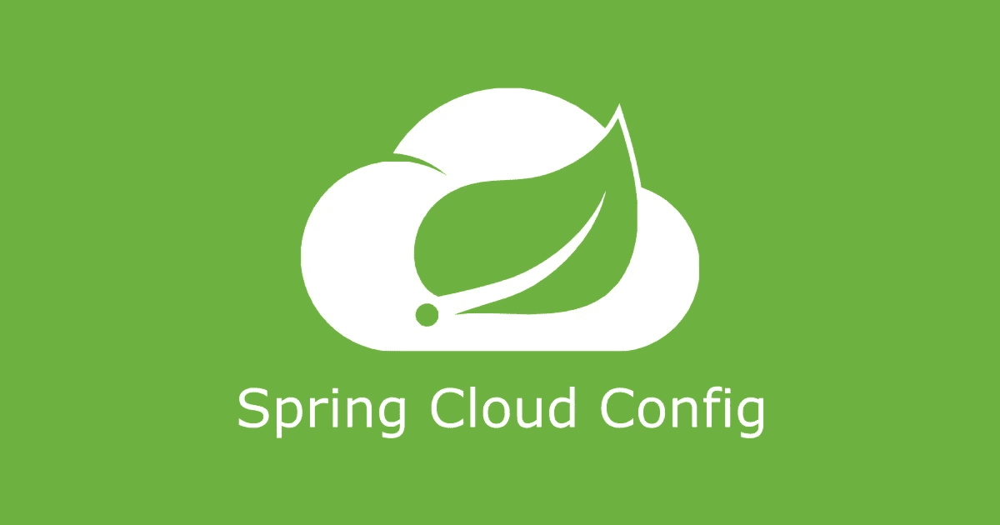
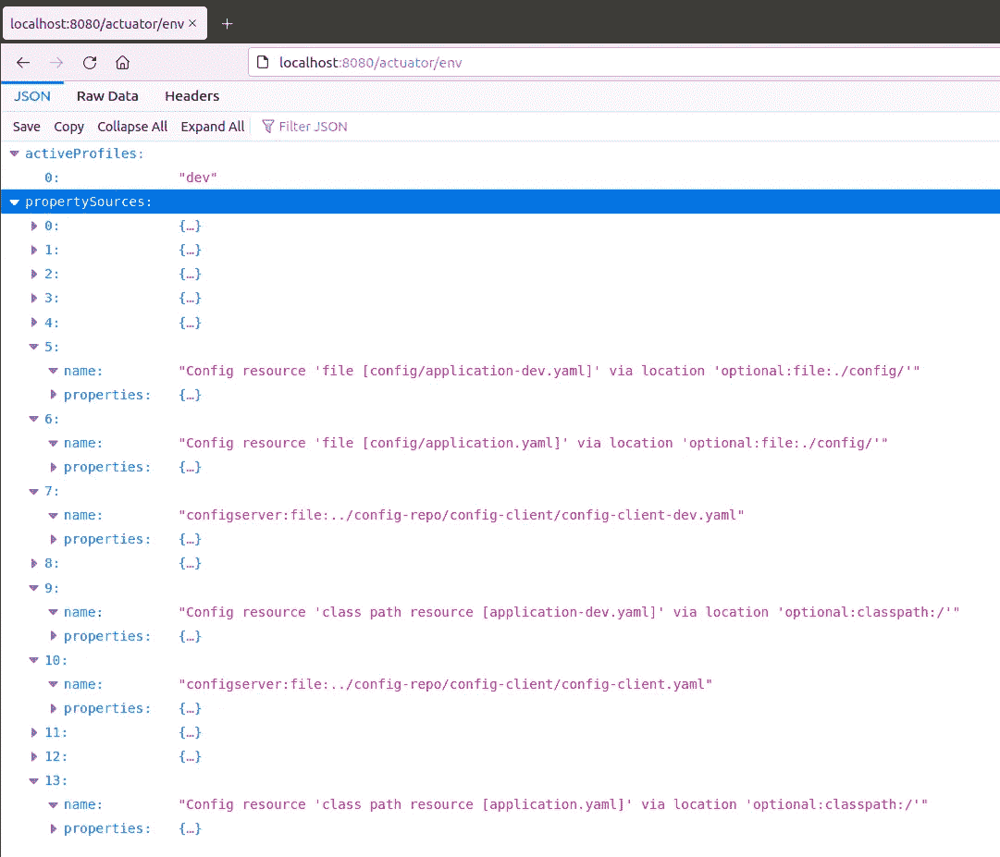
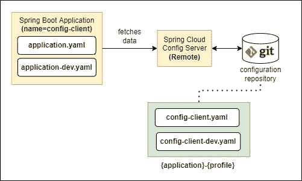
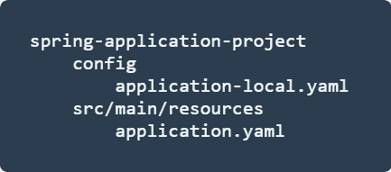

# 开发人员在使用 Spring Cloud Config 时的 3 个有用提示

> 原文：<https://levelup.gitconnected.com/3-useful-tips-for-developers-when-using-spring-cloud-config-de7b874f9911>

## 与 Spring Boot 分享我在理解 Spring Cloud Config 时发现的有用内容



[之前，我写过关于使用 Spring Boot 和 Spring Cloud Config](https://betterprogramming.pub/5-observations-on-spring-boots-loading-precedence-for-properties-files-with-spring-cloud-config-331d1af9052e) 开发时属性文件的优先顺序。如果你还没有这样做的话，一定要检查一下。在本文中，我将分享一些有用的技巧，帮助我理解属性文件的优先顺序，以及使用 Spring Cloud Config 高效开发的方法。事不宜迟，我们开始吧！

[](https://github.com/bkjam/config-server-order) [## GitHub-bkjam/config-server-order:了解 Spring boot 的优先顺序…

### 这是我的探索，尝试了解在 Spring Boot 使用时属性文件是如何加载的

github.com](https://github.com/bkjam/config-server-order) 

# 技巧 1:调试属性源加载优先顺序

调试 Spring Boot 应用程序的属性源加载优先级的最简单方法是启用 [Spring Boot 执行器 API](https://docs.spring.io/spring-boot/docs/current/actuator-api/htmlsingle/) 中的`env`端点。


向 build.gradle.kts 添加执行器依赖项

添加上面的致动器依赖项，并在应用程序的`application.yaml`中设置下面的配置，以启用`env`端点。

```
management.endpoints.web.exposure.include: env
```

然后，浏览到`http://localhost:8080/actuator/env`查看房产来源信息。你应该得到这样的东西。



[/执行器/环境](http://localhost/actuator/env)端点示例的屏幕截图

优先级顺序是自上而下的，其中索引 0 具有最高优先级。除了属性文件，您还可以找到通过命令行参数、系统属性或环境变量设置的属性。这对于确保为所有部署环境加载正确的属性非常有用。

# 技巧#2:使用 Spring Cloud Config 进行本地主机开发

当您的 Spring Boot 应用程序从外部源(例如 Spring Cloud Config Server)加载属性时，在开发时测试您的配置可能会令人沮丧和乏味。这是因为要更新属性，您必须更新属性文件，提交更改并将其推送到远程 git 存储库。



演示设置概述

以上面的设置为例，我们将有一个从 Spring Cloud 配置服务器加载属性的 Spring Boot 应用程序(config-client)。为了促进本地主机的开发，我们希望能够更新属性并立即反映变化。为此，我们可以使用以下几种方法:

## 1-使用属性“spring . cloud . config . allow-override”

如果您参考 Spring Cloud 文档中的[覆盖远程属性的值](https://cloud.spring.io/spring-cloud-static/spring-cloud.html#overriding-bootstrap-properties)一节，您会发现通过在远程 git 存储库中的`application.yaml`中设置以下配置，可以用本地属性覆盖远程属性。

```
# application.yaml
spring.cloud.config:
    allow-override: true
    override-none: true
    override-system-properties: false
```

然而，这只有在您使用引导配置(`spring-cloud-starter-bootstrap`)从 Spring Cloud Config Server 导入属性时才有效。例如。

```
# bootstrap.properties
spring.application.name=config-client
spring.cloud.config.fail-fast=true
spring.cloud.config.uri=http://localhost:8888 # Config Server URL
```

在 Spring Boot 2.4 更新中，从 Spring Cloud Config Server 导入属性的推荐方式是使用`application.yaml`文件中的`spring.config.import`属性，而不是`bootstrap.properties`文件中的`spring.cloud.config.uri`属性。

因此，`override-none`属性不再像预期的那样工作，因为它是在引导配置中处理的，这不再是推荐的方法。在 [Spring Cloud Config 的 Github 问题](https://github.com/spring-cloud/spring-cloud-config/issues/1856)中也强调了这个问题。

因此，如果您不使用引导配置从 Spring Cloud Config Server 导入属性，属性`spring.cloud.config.allow-override`可能不适合您。

## 2-使用“局部”弹簧轮廓

正如我在[上一篇文章](https://betterprogramming.pub/5-observations-on-spring-boots-loading-precedence-for-properties-files-with-spring-cloud-config-331d1af9052e)中提到的，外部属性文件总是覆盖打包的文件(无论是否特定于概要文件)。因此，我们可以利用 Spring 概要文件来加载特定于环境的属性文件。为此，我们将使用一个`local` Spring 概要文件，并在项目的根中使用一个相应的特定于概要文件的属性文件(`application-local.yaml`)。



典型 Spring Boot 应用程序项目的文件夹结构

本质上，我们在`src/main/resource/application.yaml`中从 Spring Cloud Config Server 导入远程属性文件。然后我们将在项目根目录下的 config 文件夹中创建一个`application-local.yaml`属性文件。设置好这个文件夹结构后，我们现在可以在本地主机上运行 Spring Boot 应用程序了:

```
gradle config-client:bootRun \
    -Pargs=--spring.profiles.active=dev,local
```

Spring Boot 应用程序将使用活动的 Spring 概要文件`dev`和`local`执行，后者具有更高的优先级。因此，它将按以下顺序(从高到低)加载属性文件:

*   `application-local.yaml`(配置文件夹)—外部(本地)
*   `config-client-dev.yaml`(配置服务器)—外部(远程)
*   `config-client.yaml`(配置服务器)—外部(远程)
*   `application.yaml`(类路径)—内部(本地)

如您所见，`application-local.yaml`将具有最高的优先级，这在您在本地主机上开发时非常有用。

此外，当我们整理或构建 Spring Boot 应用程序时，config 文件夹将不包含在内。因此，在 git 存储库中包含 config 文件夹是安全的，以便于其他开发人员进行本地主机开发。

## 3 —连接到本地主机 Spring 云配置服务器

最后一种方法是运行 localhost Spring Cloud Config Server 实例。我们可以在文件系统中本地定位属性文件，而不是从远程 git 存储库中加载属性文件。幸运的是，Spring Cloud Config Server 为我们提供了`native`配置模式，简化了这种配置。


Spring Cloud Config Server 中的“本地”配置文件配置示例

使用 localhost Spring 云配置服务器有几个注意事项。

*   首先，当我们在本地开发时，我们必须将 Spring Boot 应用程序配置为指向本地 Spring Cloud Config Server 实例，而不是远程实例。这可以通过使用不同的弹簧轮廓很容易地实现。
*   其次，我们必须手动更新本地文件系统中的配置，以便从远程 git 存储库中获取最新的配置。当我们在远程属性文件可以随时更新的团队中工作时，这是非常重要的。
*   最后，如果 Spring Cloud Config Server 被配置为从多个远程 git 存储库加载，这种方法可能很难管理。

总的来说，这是一个“不错”的方法，但是我会推荐方法 2，因为这种方法需要开发人员大量的手动干预。

# 技巧#3:在运行时刷新属性

最后一点是，Spring Cloud 提供了一些方法，允许 Spring Cloud Config 客户端刷新它们的属性，而无需重启客户端。为此，只需在 Spring Boot 应用程序(config-client)中启用 [Spring Boot 执行器 API](https://docs.spring.io/spring-boot/docs/current/actuator-api/htmlsingle/) 的`refresh`端点。


向 build.gradle.kts 添加执行器依赖项

添加上面的致动器依赖关系，并在`application.yaml`中设置下面的配置，以启用`refresh`端点。

```
management.endpoints.web.exposure.include: refresh
```

`/actuator/refresh`端点只刷新由`@ConfigurationProperties`标注的属性。如果我们想要刷新用`@Value`注释的属性，我们必须包含`@RefreshScope`注释。下面是一个使用 Restful API 用例的例子。

Spring Boot Restful API 端点代码示例

在上面的例子中，每当我们更新属性`my.custom.property`时，我们可以使用执行器端点`/actuator/refresh`在 config-client 中触发刷新。要验证属性是否已经更新，只需点击我们创建的 API 端点`/api/print`。这是一个简单的用例，目的是向您介绍 Spring Cloud Config 的`/refresh`特性。

然而，在典型的云环境中，会有多个客户机实例，使用`/actuator/refresh`端点刷新每个客户机的配置会非常繁琐。幸运的是，Spring Cloud Bus 通过一个轻量级的消息代理(例如 Kafka / RabbitMQ)来帮助自动更新属性。我不会在这篇文章中讨论这个问题，但是请自行查看:)

# 结论

这是我在使用 Spring Cloud Config 开发时学到的 3 个技巧。谢谢你一直读到最后。我希望你能从这篇文章中学到一些新的东西。如果你喜欢这篇文章，请关注我！快乐学习:)

# 分级编码

```
Thanks for being a part of our community! More content in the [Level Up Coding publication](https://levelup.gitconnected.com/).
Follow: [Twitter](https://twitter.com/gitconnected), [LinkedIn](https://www.linkedin.com/company/gitconnected), [Newsletter](https://newsletter.levelup.dev/)Level Up is transforming tech recruiting👉[**Join our talent collective**](https://jobs.levelup.dev/talent/welcome?referral=true)
```