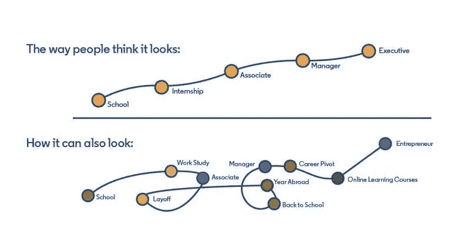

# 更有同理心地面试，打造更多样化的团队

> 原文：<https://levelup.gitconnected.com/3-ux-ideas-that-can-help-us-become-better-technical-interviewers-987e02864992>

## 我们如何利用 UX 原则来设计一个更好的、更有同理心的技术面试体验

如果你在技术领域呆的时间超过一秒钟，你可能会知道[技术面试被打破了](https://about.gitlab.com/blog/2020/03/19/the-trouble-with-technical-interviews)。关于[白板算法](https://www.freecodecamp.org/news/why-is-hiring-broken-it-starts-at-the-whiteboard-34b088e5a5db/)和[晦涩难懂的脑筋急转弯](https://www.newyorker.com/tech/annals-of-technology/why-brainteasers-dont-belong-in-job-interviews)如何不能很好地表明一个人制造产品的能力，有很多争论。那可能是真的，但是问题的症状并不是问题的根源。今天技术面试的真正问题是**我们没有足够重视多样化的技能和工作理念**。这种理解的缺乏反映在我们如何设计和优化我们的技术面试体验，使之成为一维的；他们通常不了解你的公司可能真正需要的技能。这种方法与建立包容性团队背道而驰。

《你不是候选人》，一部上演于[尼尔森诺曼集团的《你不是用户》](https://society6.com/product/you-are-not-the-user_print)

一个非常流行的 UX 口头禅是“你不是用户”，我想介绍一下“你不是候选人”的想法。就像设计师和开发人员可以把他们的信念投射到他们的用户身上一样，面试官和招聘经理也可以把他们自己的偏见投射到他们的候选人身上。

已经被多次证明的是[无意识的偏见导致面试官偏爱与自己相似的人](https://www.forbes.com/sites/forbescoachescouncil/2018/05/01/why-you-mistakenly-hire-people-just-like-you/?sh=72461bce3827)。这种偏见经常导致我们设计为自己设计的技术面试，甚至建议我们[可能只接受有特定背景的人的简历。最近，我们把话题更多地集中在身体特征上，如性别或种族，但我们同样应该意识到不那么有形的属性，如哲学、](https://www.raconteur.net/hr/diversity-inclusion/ethnic-name-bias/)[思维/学习风格](https://www.avadolearning.com/blog/the-7-different-learning-styles-and-what-they-mean/)，以及生活经历。

我们能做些什么来解决这个问题？这里有一个想法:为什么我们不以创造良好的用户体验为目标，来创造良好的面试体验呢？

# 1.理解提炼和探索的价值

许多人认同 IDEO(和斯坦福的)[设计思维](https://designthinking.ideo.com/)范式。第一步是[设计探索](https://medium.com/inside-heetch/design-exploration-is-never-a-waste-of-time-1b3be98ff1bf)，探索解决设计“问题”的多种方法。目的？通过穷尽各种可能性来找到最佳解决方案。通过经历许多潜在的现实，您可以测试用户体验可能是什么样的，并找到最好的一个，然后迭代和提炼最佳选项。

在我看来，这也适用于一些人的职业发展。

有些人是直射者，因此有时会错过机会。其他人探索了许多途径，最终花了更多时间到达目的地(来源:[莎拉·霍克](https://uxmastery.com/author/sarah-hawk/)

## 每个人都有不同的职业旅程

并不是每个人一开始都是“精致的”,然后去一所四年制认证大学获得与工作相关的学位，有三份实习，在技术领域找到一份工作，并在 5-10 年内发现自己处于领导地位。即使这是典型的故事，它甚至不是大多数，它可能不是对每个人都是最好的。

反而很多人走的是风大的路，在你的简历堆里落地之前，尝试了很多路径，很多可能性。有时这些人在他们的细化和迭代旅程中到达那里，而有时你只是他们探索树中的另一个分支。

LinkedIn 上偶尔会出现一张图片，我非常喜欢它:

科技行业的职业是什么样的(来源:未知，如果你知道原始来源，请告诉我！)

很多时候，我们缩小了招聘的漏斗顶端，因为我们没有为这些大风旅程腾出空间。我们在工作描述中说“需要 5 年以上的 X 经验”或“需要 4 年 Y 学位”，并设置了所有 LinkedIn 过滤器，从不看其他任何东西。这可能是某些职业所需要的，比如医生或律师。然而，在科技领域，正规教育体系之外有如此多的学习机会，无论是通过训练营、在线课程，还是科技领域的不同角色。对特定背景的硬性要求通常是不必要的，并且这种类型的思考排除了可能有益于我们团队的经验。

在我看来，我们可以首先通过扩展我们的漏斗顶端来尊重不同的经历，这从我们的工作描述开始。最近看到一个 JD 让我会心一笑:

Zoox TPM 工作描述,它对不同的背景保持开放

更新我们的 JDs 会影响谁申请这些角色以及我们对他们的看法。即使候选人的经历并不丰富，我们有时也会对他们打折扣，因为我们对自己想要什么的看法太狭隘了。

在我之前工作的公司，[我们面试了一个有 10 年工作经验的人，他是一个全栈职位](https://karomancer.medium.com/to-the-sweetie-that-got-away-dd730d2460d8)。然而，我们对“全栈”的理解是非常以产品为中心的，需要 4 年的计算机科学学位，而她没有。最糟糕的是，它忽略了她在简化 SQL 查询、减少 JS 包大小和优化 API 以仅返回所需内容方面的相关经验。我们的 web 应用程序花了整整 5 秒钟来加载，我们本可以利用她的专业知识，但我们当时太固执和狭隘了，没有看到这一点。她最终在谷歌找到了一份工作。不仅候选人应该被允许探索，公司也应该感到自由。

# 2.“过程和结果一样重要”

在 UX，[记录你的过程极其重要](https://uxdesign.cc/the-importance-of-process-documentation-in-a-ux-project-895cb3688e50)。有时候，和实现本身一样重要。你发展理论的过程增加了或者质疑了你的解决方案的有效性。它创造了你的产品故事的叙述。

## 每个人都有不同的想法

就像每个人有不同的职业生涯一样，每个人的想法也不同。事实上，这可能就是为什么我们有不同的职业生涯！

为了更好地适应这一点，不要把你的面试设计成只接受单一路径和单一答案。尽管我们都愿意把工程学看作是一门精确的科学，但它不是；现实世界中很少有完美的解决方案。相反，大多数事情都有取舍。当我们开发产品时，我们一直在做出妥协，同时试图优化运行时性能、编译时间、部署时间、存储空间、开发时间、测试覆盖率、服务器调用次数、首次呈现时间等等。很少有一个时候，我们可以一举最大限度地发挥上述所有特征。

同样，当你进行面试时，评估这个人的想法是很重要的。快速编码并不是衡量一个优秀工程师的唯一标准，还包括候选人在解决你的编码问题时如何识别他们必须做出的取舍，以及他们接受反馈和合作开发更好的解决方案的开放程度。

不要因为一个候选人不记得如何一次性写出冒泡排序，就马上否定他。相反，当他们试图找到解决方案时，倾听他们的考虑和顾虑，并确定他们的方法是否对您的团队有益。如果你幸运的话，他们甚至会考虑你团队中的人经常忽略的问题。我们前面提到的性能工程师没有完成她的一个编码问题，但是她指出了我们提供给她的初始代码中的性能不足之处。这应该是我们的暗示，我们应该重新评估我们的招聘标准。

# 3.让候选人选择发挥他们的优势，但保持选择的有限性

几周前，我[问了 400 多名工程师，他们更喜欢哪种类型的现场前面试体验](https://karomancer.medium.com/which-type-of-pre-onsite-technical-interview-is-the-best-for-recruiting-engineers-5121ea508feb?sk=31e2be145ede5e886f352384ec176417)。

 [## 哪种现场前技术面试最适合招聘工程师？

### 我问了 400 多名工程师，他们更喜欢哪种类型的现场前面试体验，这是我的发现。

uxdesign.cc](https://uxdesign.cc/which-type-of-pre-onsite-technical-interview-is-the-best-for-recruiting-engineers-5121ea508feb) 

事实证明，大多数人(64%)更喜欢带回家评估，因为他们觉得这样能更好地发挥他们的优势。也就是说，人们喜欢一种类型的面试而不喜欢另一种的原因很能说明人们处理问题的方式有多么不同。我很清楚，如果你的目标是建立一个包容和平衡的团队，你的面试过程应该吸引尽可能多的不同的人，你可以通过让候选人选择他们喜欢的面试方式来做到这一点。

可以通过多种方式实现这一点。Patreon 和 Mailchimp 都为候选人提供了两个编码电话屏幕或 4-5 小时回家评估的选择，然后再进行现场面试。Eaze 要求每个候选人做几个电话筛选，深入研究技术主题(但不编码)，然后让他们选择要么在家做一个项目，并准备在现场的一个小组上展示，要么直接去现场做同样的项目，但有一个面试官。一种情况下，你可以在自己舒适的家中工作，从而缩短现场工作时间，另一种情况下，你有机会与他人合作和工作。

那么，我们应该创造无限多的面试选择吗？绝对不是。这不仅对你、招聘人员和面试官来说是不可持续的，而且太多的选择也是糟糕的求职体验。完全开放式的提示会导致候选人在你的评估上花费太多时间，过多的面试选择会导致他们出现选择麻痹。不要忘记希克斯定律，确保提供足够的选择来展示他们的能力，但不要太多，以免他们陷入瘫痪。

用户需要一些选择，但不要太多。(来源:[希克斯法则初学者指南](https://bootcamp.uxdesign.cc/beginners-guide-to-hicks-law-3d855bbb3e8c))

以安抚两三个主要群体为目标，围绕这个目标展开你的采访。在这个后 COVID 世界，这可能意味着为那些更喜欢远程工作和更喜欢在办公室工作的人创造同样好的体验。或者你也可以这样理解，有些人喜欢先独立完成工作，然后不时地分享他们的想法，而另一些人喜欢从一开始就与同事结对合作。确定你可能已经拥有的人的类型，做你自己的民意调查，找出适合你的工作文化的东西。

在经历了几年双方的糟糕经历后，我挑战自己，试图从不同的角度看待技术招聘。我认识的每一个工程师都讨厌带着激情去面试，当我每周看到另一篇关于系统有多坏的文章时，感觉就像是每周一样。招聘时，重要的是要记住，我们要招聘的是合适的人，而不是合适的应试机器人或合适的纸张。无论你怎么看，**候选人的体验就是用户体验**，我敢打赌，如果我们这样对待它们，面试体验将变得更加愉快，我们将找到更好的匹配——对双方都是如此。

 [## 喜欢这篇文章？考虑给我买杯茶吧！

### 我过去常常把我的文章放在中等收费的墙后面，但当谈到教育时，我完全关注可访问性，所以现在它们都是免费的。如果你觉得你从这篇文章中得到了一些东西，并且有一些闲钱，请考虑给我买杯茶来表示你的支持！🫖

www.buymeacoffee.com](https://www.buymeacoffee.com/karomancer)