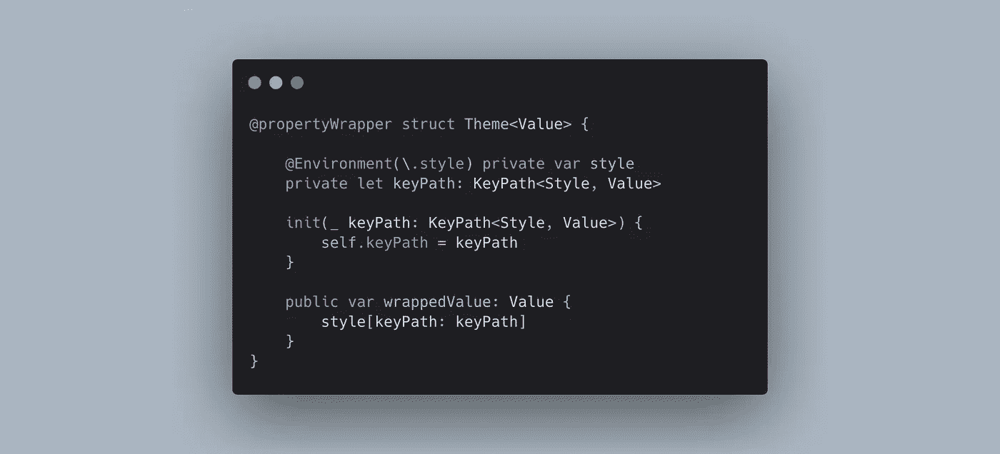
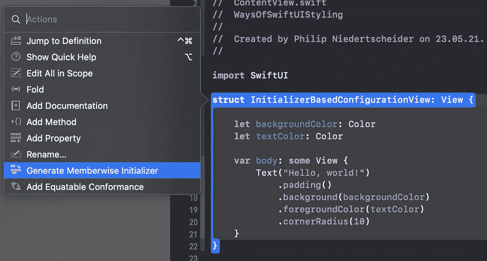

# 设计 SwiftUI 视图的 3 种方式

> 原文：<https://levelup.gitconnected.com/3-ways-of-styling-swiftui-views-d32c40cbc667>

设计视图是构建漂亮用户界面最重要的部分。当谈到实际的代码语法时，我们希望在代码中有可重用的、可定制的和干净的解决方案。

这篇文章将向你展示这三种设计风格的方法:

1.  基于初始值的配置
2.  使用返回自身的方法链接
3.  环境中的样式

一般来说，任何方法都是可行的。最后，它归结为您的一般代码风格指南和个人偏好。

你将在第 3 章“环境中的样式”中找到的属性包装器

# 1.基于初始值的配置

这是一个简单的例子，可以很快地形象化:

这个视图有两个参数`backgroundColor`和`textColor`，这两个参数在实例化结构时都是必需的。它们也是常量`let`值，因为视图很可能不会发生变化(此时)。

方便的是，Swift 自动合成(内部)所需的初始化程序，但它们也可以由我们手动定义:

> **快速提示:**
> Xcode 还为我们提供了一个生成成员式初始化器的内置函数。你所要做的就是在类型名称上选择`CMD(⌘) + left-click`，并选择动作。

Xcode 可以自动生成成员式初始化器

使用自定义初始化器允许我们直接添加默认值，而无需将参数的`let`更改为`var`:

如前所述，Swift 只合成内部初始化器，所以如果你的视图是包的一部分，需要成为`public`，你需要使用这种方法。否则，使用该包的应用程序将无法找到或实例化视图。

另一方面，如果该视图仅在您的应用程序内部使用，您也可以让 Swift 编译器为您完成这项工作🚀所需要做的就是从`let`更改为`var`，并直接在实例属性上设置默认值:

# 2.使用返回自身的方法链接

您的视图不断增长，需要设置更多参数。随着初始化器的不断增长，它最终会变成一大段代码。

然而，从我的个人经验来看，Swift 编译器在某个时候有太多的工作要同时做，就干脆放弃了(它崩溃了)。

分解大型初始化器(带有默认值)的一种方法是使用返回自链接模式:

由于视图本身是不可变的，但是由纯数据组成(结构不是对象)，我们可以用`var view = self`创建一个本地副本。由于现在这是一个局部变量，我们可以在返回它之前对它进行变异并设置动作。

# 3.环境中的样式

除了手动配置每个视图，我们还可以定义一个全局样式指南。一个示例可能如下所示:

不幸的是，这个解决方案有一个大问题:
全局静态变量意味着，它们不能为不同的用例定制(例如在 Xcode 预览中)😕

我们的解决方案是再次选择实例配置:

这看起来很有希望，因为我们现在可以随时随地将样式配置传递到视图中:

相当干净的解决方案。但是你可能已经在想“但是等等！这怎么会是一个**全球**解决方案？”你的怀疑是有道理的！这个解决方案要求我们将样式传递给每一个视图，如下面的代码片段所示:

仅将“全局”样式对象放入嵌套的`FooBar`视图就花了三次。这是不可接受的。我们不想要这么多不必要的代码(特别是因为你也努力争取干净的代码，不是吗？).

好吧，那我们还能想到什么？那么，如何混合静态和实例解决方案呢？
我们所需要的是一个静态对象，在那里我们可以从`Foo`设置样式并从`FooBar`读取它……听起来像一些共享的*环境*💡

SwiftUI 引入了属性包装器`[@Environment](https://developer.apple.com/documentation/swiftui/environment)`，它允许我们从 view🥳的共享环境中读取一个值

首先，通过创建一个实现`defaultValue`的结构来创建一个新的`EnvironmentKey`:

接下来，您需要添加新的环境键作为对`EnvironmentValues`的扩展，以便可以从属性包装器中访问它:

最后，使用根视图中的`.environment(\.style, ...)`设置值，并使用子视图中`@Environment(\.style)`中`style`的关键路径读取值:

厉害！不再传递不必要的实例，仍然可以从根视图进行配置🚀

## **奖励:自定义属性包装**

我们的环境解决方案已经很不错了，但是下面的不是更干净吗？

对于这个漂亮的语法，您只需要创建一个定制的属性包装器`@Theme`,它包装我们的环境配置并通过一个 keypath 访问样式值。

更好的是，使用`View`扩展可以让我们完全隐藏`Environment`的用法！

> 注意:
> 风格现在被称为`theme`的原因老实说只是一个属性包装`@Style`和`struct Style`的命名冲突。如果重命名样式结构，也可以将此名称用于属性包装。

# 结论

SwiftUI 提供了多种不同的方法来构建我们的视图层次结构，我们只探索了其中的几种。额外的选择，例如`ViewModifier`已经存在，将来会有更多。

在写这篇文章的时候，最佳实践还不存在，因为这项技术还很新。相反，我们有不同的**好的**实践可供选择，可以专注于代码的可重用性、可定制性和干净性。

如果您想了解更多信息，请查看我的其他文章，在[推特](https://twitter.com/philprimes)上关注我，并随时给我发一份 DM。
你有什么特别的话题想让我介绍吗？让我知道！😃