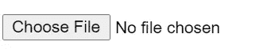

# 从 Web 浏览器访问本地文件的 3 种方式

> 原文：<https://levelup.gitconnected.com/3-ways-to-access-local-files-from-web-browser-70f57fa57e50>

## 您可以使用 HTML APIs 来浏览、拖放或粘贴文件


照片由 [Maksym Kaharlytskyi](https://unsplash.com/@qwitka?utm_source=unsplash&utm_medium=referral&utm_content=creditCopyText) 在 [Unsplash](https://unsplash.com/s/photos/file?utm_source=unsplash&utm_medium=referral&utm_content=creditCopyText) 拍摄

在本文中，我们将讨论在将文件上传到 Angular 应用程序的[上下文中访问本地文件的不同方式。这些方法也适用于其他 JavaScript 框架。](/upload-files-to-s3-using-angular-and-nestjs-64721d815d18)

让我们一个一个地浏览这些方法。

向前跳:

*   [文件类型输入](#8d8f)
*   [拖放](#31df)
*   [从剪贴板粘贴](#0f9e)

## 背景

从浏览器访问本地文件是特性和安全性之间的平衡。这是必要的，因为我们都需要从浏览器上传文件。另一方面，如果浏览器可以不受限制地访问所有本地文件，那么攻击者从您的浏览器启动恶意软件的大门就敞开了。

出于安全考虑，从浏览器访问本地文件受到限制。Web 浏览器(和 JavaScript)只能在用户许可的情况下访问本地文件。

为了标准化从浏览器访问文件，W3C 在 2014 年发布了`HTML5 File API`。它定义了如何在 web 应用程序中使用文件对象访问和上传本地文件。由于所有现代浏览器都遵循 HTML5 标准，我们有一个标准的编程 API 来操作 Angular 应用程序中的文件。

基于 HTML API，我们有 3 种方法来访问本地文件。让我们深入了解一下。

## 文件类型输入

HTML [文件](https://developer.mozilla.org/en-US/docs/Web/API/File) API 定义文件接口如下。

> `***File***`接口提供关于文件的信息，并允许网页中的 JavaScript 访问它们的内容。

下面的`<input type="file">`代表一个文件选择域和一个“选择文件”按钮。这个简单的按钮允许用户从浏览器访问本地文件。我们可以使用`accept`属性来限制上传文件的类型。在这个例子中，我们只允许用户选择图像文件。

```
<input type="file" id="myfile" accept=".jpeg,.png">
```



不幸的是，我们不能改变默认文件选择按钮的样式。解决方案是使用另一个自定义按钮来调用默认按钮。在下面的示例代码中，我们隐藏了默认按钮，并设置了自定义按钮的样式。


在上面的 Angular 示例代码中，我们使用`@ViewChild` decorator 来获取对模板中隐藏的文件选择按钮的引用。我们可以调用组件类中的隐藏按钮 click，而不是调用 HTML 模板中的 click 处理程序，如下所示。这种方式更好地分离了组件类和它的 HTML 模板。

```
this.fileInput.nativeElement.click();
```

请注意，浏览器不允许 JavaScript 获取文件的真实路径。出于安全原因，您只能获得文件名而不是完整路径。

## 拖放

拖放是将文件移动到 web 应用程序中更直观的方式。为了启用它，我们需要使用 HTML [拖放接口](https://developer.mozilla.org/en-US/docs/Web/API/File/Using_files_from_web_applications#selecting_files_using_drag_and_drop)。

首先，让我们定义一个 HTML 元素作为我们的拖放区。

下一步是定义事件处理程序来捕获丢弃的文件。

有 4 个[事件](https://developer.mozilla.org/en-US/docs/Web/API/HTML_Drag_and_Drop_API#Drag_Events)与拖放文件直接相关。它们是*下降、拖拽、拖拽离开、拖拽进入*。最重要的一个是 *drop* ，其他的都是用来在拖拽动作中创造视觉效果的。

为了监听这些事件，我们使用 Angular HostListener。

如上图所示，可以从`event.dataTransfer.files`检索文件内容数据。我们还需要调用`[preventDefault()](https://developer.mozilla.org/en-US/docs/Web/API/Event/preventDefault)`来关闭浏览器的默认拖放处理程序。

在 Angular 的上下文中，可以使用`@angular/cdk/drag-drop`模块。它提供了一个名为`cdkDropList`的组件，可以用来创建一个拖放区，用户可以在其中拖放文件。下面是一个例子:

```
import { CdkDropList } from "@angular/cdk/drag-drop";

// In template:
<div dropDivArea (cdkDropListDropped)="fileDropped($event)">
  <div class="file" *ngFor="let file of files" cdkDrag>
    {{ file.name }}
  </div>
</div>

// In component's class:
fileDropped(event: CdkDragDrop<string[]>) {
  // Get the dropped files
  const files = event.item.data;

  // Do something with the files
  // ...
}
```

这个例子创建了一个`dropDivArea` 组件，并为`cdkDropListDropped`事件定义了一个事件处理程序。当用户将文件放入拖放区时，调用`fileDropped`方法并接收拖放的文件作为参数。您可以在应用程序中根据需要处理这些文件。

## 从剪贴板粘贴

将文件从剪贴板粘贴到浏览器是上传文件的一种便捷方式。例如，我们可以使用它直接从 snipping 工具上传屏幕剪辑。

该特性之所以成为可能，是因为“`paste`”动作触发了所选 Html 元素中的“`paste`”事件。

实现粘贴功能相当简单。首先，我们注册了`paste` 事件处理程序。

```
<div contenteditable="true" (paste)="onPaste($event)">
```

为了从粘贴事件处理程序中获取文件，我们使用了`[clipboardData](https://developer.mozilla.org/en-US/docs/Web/API/ClipboardEvent/clipboardData)`。它包含一个 file 属性，该属性公开剪贴板中的文件列表。

文件内容可以分配给 [FormData](https://developer.mozilla.org/en-US/docs/Web/API/FormData) 或者转换成`blob/ArrayBuffer`，然后发送到你的后端服务。

浏览器中的默认粘贴行为是将剪贴板的内容插入到屏幕的当前光标位置。我们可以通过使用 *e.preventDefault()来取消默认动作。*

有了 Angular，我们可以使用来自`@angular/cdk/clipboard`模块的`Clipboard`服务。该服务提供了一个名为`paste`的方法，允许您获取剪贴板的内容。下面是一个例子

```
import { Clipboard } from "@angular/cdk/clipboard";

constructor(private clipboard: Clipboard) {}

copyFromClipboard() {
  // Get the clipboard content
  this.clipboard.paste().then(
    (value: string) => {
      // Do something with the clipboard content
      // ...
    },
    (error: any) => {
      // Handle any errors
      // ...
    }
  );
}
```

在上面的代码示例中，`Clipboard`服务被注入到组件的构造函数中。然后我们使用`paste`方法获取剪贴板的内容。在幕后，它使用相同的剪贴板 API。

# 摘要

在本文中，我们概述了从 web 浏览器访问本地文件的各种方法。这些方法是:

*   文件类型输入
*   拖放
*   在可编辑的 HTML 元素中粘贴

示例 stackblitz 项目可从[这里](https://stackblitz.com/edit/angular-ivy-wgu9cl)获得。