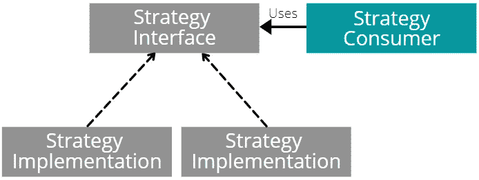

# 在 C#中实现策略设计模式的 3 种方法

> 原文：<https://levelup.gitconnected.com/3-ways-to-implement-strategy-design-pattern-in-c-a58548d8a4ad>

## 战略模式的实际应用。

在 [Unsplash](https://unsplash.com?utm_source=medium&utm_medium=referral) 上由[马腾·范登赫维尔](https://unsplash.com/@mvdheuvel?utm_source=medium&utm_medium=referral)拍摄的照片

策略设计模式的目的可以归结为在运行时替换一些通用算法的部分。

# 使用策略模式的真实场景

*   数据可以转换为 CSV，HTML，JSON 格式。将来，可能还需要添加对降价格式的支持。在这种情况下，可以使用策略模式从数据如何被**转换**中抽象出代码，从而更容易扩展应用程序。
*   一些应用服务可能需要在不同的**数据存储**之间切换:数据库、文件系统、消息总线、另一个服务(通过 HTTP 调用)。与特定数据存储进行通信的每个提供者都是一个单独的策略。
*   任何在线商店的网站上的产品都可以通过不同的参数进行分类:价格、评级、发布年份和许多其他参数。策略对象将封装不同的属性选择器，这些选择器将被传递到通用排序算法中。
*   **验证**某些对象的规则可以封装在单独的策略对象中，以允许动态地改变规则。
*   订单的价格可以根据用户状态、折扣等进行不同的计算。
*   应用程序的配置值可以从不同的**源**中提取:应用程序设置文件、环境变量、Azure Key Vault。每个配置源都是一个单独的策略。

# 实施#1:动态策略

实现策略的最常见方式是定义一个策略接口，然后从表示一般算法的类中实现和使用该接口。

让我们来看一个实际的例子。需要处理类似`key1=value;key2=value;`的字符串。字符串处理包括常规部分，如字符串验证，以及移动部分，如将字符串转换并保存为 XML 或 JSON 格式。

这就是用策略模式实现键值字符串处理的方式:

`KeyValueStringProcessor`对象不知道它将把字符串转换和存储成什么格式。这些知识封装在单独的可重用的`XmlOutputStrategy`和`JsonOutputStrategy`对象中，这些对象可以在运行时注入到`KeyValueStringProcessor`中。

## 有什么好处？

`KeyValueStringProcessor`类可以使用 if-else 风格独立实现所有内容，但是，该策略提供了以下好处:

*   具体的策略`XmlOutputStrategy`和`JsonOutputStrategy`很容易在其他类中重用。`KeyValueStringProcessor`不一定是唯一的消费者。
*   `KeyValueStringProcessor`类遵循开闭原则，因为它的行为可以在不改变代码的情况下被扩展/改变。
*   `KeyValueStringProcessor, XmlOutputStrategy, JsonOutputStrategy`类更容易进行单元测试，因为它们遵循单一责任原则。

# 实现#2:基于代表的策略

实现策略设计模式背后的主要思想是，算法可以在运行时被其他算法替换，并且这些算法不总是需要像前面的例子那样封装在单独的类中。

还记得 LINQ 的疑问吗。每次你调用`Where, Select, TakeWhile`或其他扩展方法时，你使用策略设计模式，你将**策略定义为λ表达式**。

`Where`方法实现了遍历项目集合并为集合中的每个项目应用您指定的谓词(`i => i % 2 == 0`)的框架算法。

自定义谓词是一种策略，它使方法`Where`变得灵活——您可以通过将策略作为 lambda 表达式传入来改变 LINQ 方法的行为。

通常，您将谓词“硬编码”到 LINQ 方法调用中，因为它们很简单。然而，当谓词更复杂，代表一个可重用的领域知识时，谓词可以被封装到单独的对象中。

## 接口与委托

当策略只有一个方法时，可以使用基于委托的实现。但是当策略有几个方法时，将它们封装在一个单独的类中并提取接口会更方便。

# 实现#3:静态策略

在以前的策略模式实现中，策略消费者类不知道在编译时将使用哪个特定的策略。

然而，当不需要用动态灵活性实现多态行为时，有一种方法可以静态地而不是动态地将策略消费者和某些策略实现结合起来。

静态组合是通过使用泛型类实现的。下面是如何重构`KeyValueStringProcessor`类来静态构建策略。

注意，一旦用其中一个策略实例化了`KeyValueStringProcessor<T>`类，就不能再改变该实例的策略了。我们所能做的就是创建`KeyValueStringProcessor<T>`类的另一个实例，指定不同类型的策略。

# 关键要点

*   策略设计模式允许您在运行时替换算法。
*   该模式允许将算法封装到单独的对象中，这提高了可重用性、单元测试和可维护性。
*   当一个策略定义了一组方法时，它最好用一个接口来实现。
*   如果策略只有一个方法，则可以使用委托来实现该策略。

## 我的其他文章

 [## 快速数据库—快速应用程序(有用的数据库性能优化技术)

### 了解加速关系数据库的最佳实践。

levelup.gitconnected.com](/fast-database-fast-application-useful-db-performance-optimization-techniques-34b6926d1196)  [## 如何专业地对 Bug 修复进行代码审查

### 审查 bug 修复时要问的几个重要问题。

levelup.gitconnected.com](/how-to-professionally-to-do-a-code-review-of-a-bug-fix-f17de72d42e0)  [## 5 GitHub。净回购，让你的技术技能更上一层楼

### 亲身体验 GitHub 资源库。

levelup.gitconnected.com](/5-github-repositories-for-net-developers-to-take-tech-skills-to-the-next-level-84f244f6257b)