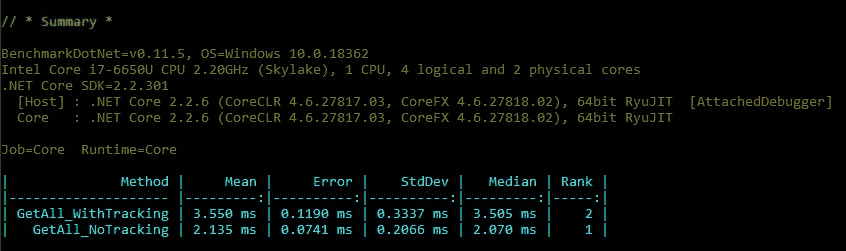

# 提高您的 EF 内核性能的三种方法。网络核心应用

> 原文：<https://levelup.gitconnected.com/3-ways-to-improve-the-ef-core-performance-in-your-net-core-app-d9b6295188cc>


ORM(对象关系映射)框架真的简化了所有数据库相关任务的开发人员的生活。

然而，正如通常发生的那样，这种简化是有代价的。大多数情况下，代价是灵活性和性能。

在本文中，我将描述三种最直接的方法来提高您的。NET 核心应用程序。

# **1。不要偷懒。渴望**

我们从最明显的建议开始，当 EF 核心没有被正确使用时，这些建议实际上可以给你最大的性能提升。

所以，想象一下下面这种很常见的情况:

*   两个实体之间存在主-从关系。让它成为一个经典的订单-客户示例，其中每个订单实体引用一个客户。
*   您需要检索指定期间(例如，从今年年初)所有订单的信息，并显示每个订单的客户名称。

EF Core 2.1 引入了一个叫做[“惰性加载”](https://docs.microsoft.com/en-us/ef/core/querying/related-data#lazy-loading)的东西(或者更确切地说是“重新引入的”，因为这个特性在传统的 Entity Framework 6.x 中是可用的)，所以现在你可以用下面的代码实现所描述的任务:

```
var thisYearFirstDay = new DateTime(DateTime.Now.Year, 1, 1);
var thisYearOrders = context.Orders
   .Where(o => o.OrderDate > thisYearFirstDay);foreach (var order in thisYearOrders)
{
    Console.WriteLine($"{order.Id} {order.OrderDate} {order.Customer.CompanyName}");
}
```

很简单，对吧？
**错了！**其实挺懒的:)而且这段代码会给你带来巨大的性能打击。

为什么？因为 EF Core 会将您的代码转换成对数据库的 1+N 个查询，其中 N —是`thisYearOrders`结果集中的记录数。

如果您在 DbContext 中添加一个日志记录器，并查看日志消息，您将会看到如下查询:

```
SELECT [o].[OrderID], [o].[CustomerID], . . .
FROM [Orders] AS [o]
WHERE [o].[OrderDate] > @__thisYearFirstDay_0
```

然后是 N 个这样的查询:

```
SELECT [e].[CustomerID], [e].[Address], . . .
FROM [Customers] AS [e]
WHERE [e].[CustomerID] = [@__get_Item_0](http://twitter.com/__get_Item_0)
```

显然，如此多的查询会花费很多时间，尤其是在连接不良或数据库很大的情况下。

为了解决这个问题，我们需要使用所谓的[“急切加载”](https://docs.microsoft.com/en-us/ef/core/querying/related-data#eager-loading)，并在我们的请求中添加“Include”调用:

```
var thisYearOrders = context.Orders
        .Include(o => o.Customer)
        .Where(o => o.OrderDate > thisYearFirstDay);
```

现在，如果我们查看日志，我们将只看到一个查询，而不是 1+N:

```
SELECT [o].[OrderID], [o].[CustomerID], . . . /* all other columns from Orders and Customers */
FROM [Orders] AS [o]
LEFT JOIN [Customers] AS [o.Customer] ON [o].[CustomerID] = [o.Customer].[CustomerID]
WHERE [o].[OrderDate] > [@__thisYearFirstDay_0](http://twitter.com/__thisYearFirstDay_0)
```

正如你可能会想到的，“热切的”方法会比“懒惰的”方法执行得更快。

在实际应用中，这种优势的价值可能是百分之几十甚至百分之几千！

# **2。不要太急切。只拿你要用的东西**

我们第一个例子中的“急切”方法的问题是，在大多数情况下，它可能太“急切”了。

看，我们实际上只需要三个字段(两个来自 Orders 表，一个来自 Customers 表)，但是相反，我们从两个表中获取了整组列。

解决方案很简单:只获取那些通过`Select`调用需要的列:

```
var thisYearFirstDay = new DateTime(DateTime.Now.Year, 1, 1);
var thisYearOrders = context.Orders
        .Where(o => o.OrderDate > thisYearFirstDay)
                .Select(o => new { o.Id, o.OrderDate, o.Customer.CompanyName })foreach (var rec in thisYearOrders)
{
    Console.WriteLine($"{rec.Id} {rec.OrderDate} {rec.CompanyName}");
}
```

产生的 SQL 语句将如下所示:

```
SELECT [o].[OrderID] AS [Id], [o].[OrderDate], [o.Customer].[CompanyName]
FROM [Orders] AS [o]
LEFT JOIN [Customers] AS [o.Customer] ON [o].[CustomerID] = [o.Customer].[CustomerID]
WHERE [o].[OrderDate] > [@__thisYearFirstDay_0](http://twitter.com/__thisYearFirstDay_0)
```

它肯定会有更好的性能，因为从数据库服务器传输到客户机(您的)的数据会更少。NET app，在这种情况下)。

上面的代码中有两件事应该注意。

首先，我们不再需要一个`Include`调用，因为实体框架从`Select`调用中“理解”我们需要另一个表中的一个字段(`Customer.CompanyName`)，并自动将必要的 JOIN 子句添加到结果 SQL 中。

其次，正如你所看到的，我们用`new {o.Id, ...}`命令创建了一个动态对象(不属于任何特定类的对象)列表。

为了强调这一事实，我们在从`order`到`rec`的`foreach`循环中替换了变量的名称(来自“record”)——因为它不再是一个“订单”。我们在结果中得到的动态对象只包含三个属性:`Id`、`OrderDate`和`CompanyName`(这就是为什么我们现在直接访问‘company name’，而不是前面例子中的‘order . customer . company name’。

# **3。使用 AsNoTracking()。但是明智地**

当您对您的`DbContext`中的一些实体运行查询时，返回的对象被上下文自动跟踪，以允许您修改它们(如果需要的话)，然后用`context.SaveChanges()`操作保存更改。

但是，如果它是一个只读查询，并且返回的数据不应该被修改，那么就没有必要让上下文执行一些建立跟踪所需的额外工作。`AsNoTracking`方法告诉实体框架停止额外的工作，这样就可以提高应用程序的性能。

因此，从理论上讲，带有`AsNoTracking`的查询应该比不带`AsNoTracking`的查询执行得更好。问题是:好多少？让我们弄清楚。

我已经使用 BenchmarkDotNet 库创建了一个小的测试应用程序。这里有两个被检查的函数:

```
public void GetAll_WithTracking()
{
   var allRecords = _dbContext.OrderDetails;
   var list = allRecords.ToList();
}public void GetAll_NoTracking()
{
   var allRecords = _dbContext.OrderDetails.AsNoTracking();
   var list = allRecords.ToList();
}
```

正如我们所料,“不跟踪”方式表现更好。一般来说，它似乎比“带跟踪”快 1.5 倍:



基准测试结果 01

当我们试图将 AsNoTracking 添加到两个表的查询中时，奇怪的事情开始了(使用 JOIN):

```
public void GetWithInclude_Tracking()
{
    var allRecords = _dbContext.OrderDetails
            .Include(od => od.Product); var list = allRecords.ToList();
}public void GetWithInclude_NoTracking()
{
    var allRecords = _dbContext.OrderDetails
            .AsNoTracking()
            .Include(od => od.Product); var list = allRecords.ToList();
}
```

结果令人困惑:


基准测试结果 02

带跟踪的查询比不带跟踪的查询性能稍好！

GitHub 上有一个关于这种奇怪(乍一看)行为的问题。

然而，如果我们试着想象实体框架是如何在内部实现的，这种行为可能是相当符合逻辑的。连接两个表的查询需要来自两个表的记录来进行匹配，如果这些记录已经被上下文跟踪并存储在内存中，这显然会更快。

不过，这只是我的猜测。如果你对此有其他想法，请告诉我。

# **收尾**

我希望我在本文中列出的关于性能改进的建议能够帮助您编写更高效的代码。

我只想给你一个更笼统的建议:**用源**:)

就使用 EF Core 而言，这意味着:查看您的代码生成的 SQL 语句(在调试时，您可以在 VS 的输出面板中看到它们)。

它让你了解“幕后”发生了什么，在某些情况下，可能会帮助你显著提高应用程序的性能。

感谢您的阅读。祝您愉快！