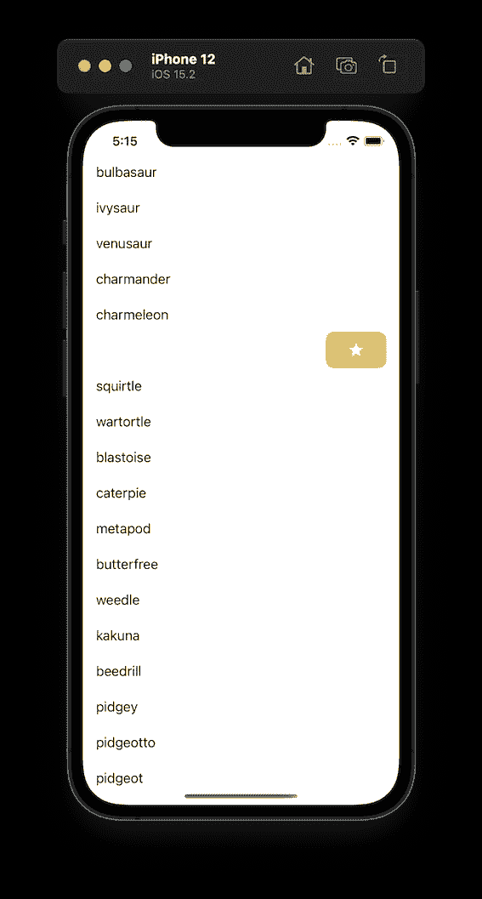
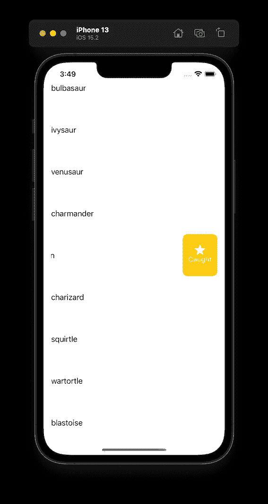
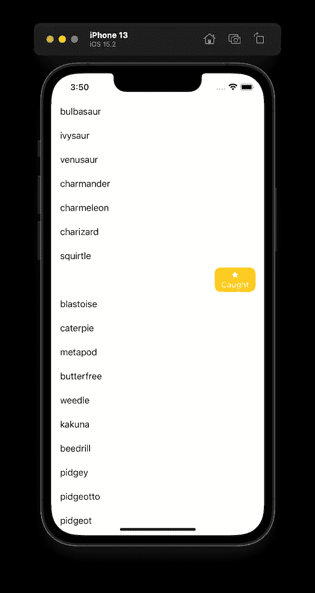
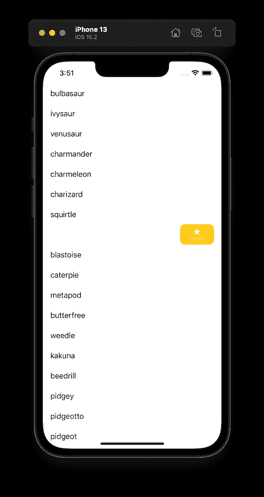

# 3 种在滑动动作上显示图像和标题的方式

> 原文：<https://levelup.gitconnected.com/3-ways-to-show-both-image-and-title-on-swipe-action-4aeb61fe64ad>

## 这是苹果的设计，只有当单元格高度等于或大于 90 时，图像和标题才会在滑动动作上显示。有三种方法来展示这两者。

下面的代码将动作标题设置为“catched ”,并将图像设置为系统星形图标。

```
let starAction = UIContextualAction(style: .normal, **title: “Caught”**) { _, _, _ in }
let starImage = UIImage(systemName: “star.fill”)
**starAction.image = starImage**
```

我们希望图像和标题都显示在滑动动作上，但是当单元格高度小于 90 时，我们会得到以下结果。



这是苹果的设计，只有当单元格高度等于或大于 90 时，图像和标题才会在滑动动作上显示。当单元格高度小于 90 时，如果您同时设置了图像和标题，则只有图像会出现在滑动操作中。你可以在一些内置的 app 上观察，比如 Messages。

如果你想同时给他们看呢？你可以考虑以下三种方式。

# **1。将单元格的高度设置为> = 90**

很直白。将单元格的高度设置为等于或大于 90，则图像和文本都会出现。



# **2。用 Unicode 字符替换图像**

如果你的图标很常见，比如一颗星、一颗心或者一个垃圾箱，也许你可以用一个 [Unicode 字符](https://unicode-table.com/en/)替换这个图像。

```
let star = UIContextualAction(style: .normal, title: “**\u{2605}**\nCaught”) { _, _, _ in }
```



在滑动操作中，Unicode 字符看起来比系统图标小。您可能希望通过调整字体大小来放大图标，但这也会放大文本。

这种方法的缺点是你不能单独调整图标的大小而不影响文本的其余部分。在标题中放一个 Unicode 图标意味着你的图标大小会随着字体大小而改变。

你可能会想到属性化字符串。遗憾的是，`UIContextualAction`的标题不支持属性化字符串。

# 3.将图像和标题转换为图像

我们可以通过`NSAttributedString`和`NSTextAttachment`创建一个包含文字和图片的标签，然后将标签转换成图片。

首先，创建一个包含文本和图像的属性字符串。

```
let text = NSMutableAttributedString(string: **“Caught”**)
let attachment = NSTextAttachment()
attachment.image = **UIImage(systemName: “star.fill”)**
text.append(NSAttributedString(attachment: attachment))
```

然后创建一个标签来保存属性化的字符串。

```
let label = UILabel(frame: CGRect(x: 0, y: 0, width: 50, height: 50))
label.textAlignment = .center
label.numberOfLines = 2
label.attributedText = text
```

最后，将标签转换成图像。

```
let renderer = UIGraphicsImageRenderer(bounds: label.bounds)
let image = renderer.image { context in
    label.layer.render(in: context.cgContext)
}if let cgImage = image.cgImage {
    let finalImage = UIImage(cgImage: cgImage, scale: UIScreen.main.scale, orientation: .up)
}
```



这种方法有一些缺点:

图像的字体大小是固定的，因此滑动操作中的图标和文本都不支持动态字体。

此外，滑动动作上的图像有最大尺寸；如果您的标签太宽，图像将在滑动操作时缩小。

此外，文本字体看起来比标题上显示的要小。如果您尝试将字体设置得更大，文本将被截断。


## 参考资料:

[](https://stackoverflow.com/questions/27740884/uitableviewrowaction-title-as-image-icon-instead-of-text) [## UITableViewRowAction 标题作为图像图标而不是文本

### 我想在 Swift 的 tableviewCell 中的滑动操作中放置图标(图像)而不是文本。但是我不知道如何表达这个形象…

stackoverflow.com](https://stackoverflow.com/questions/27740884/uitableviewrowaction-title-as-image-icon-instead-of-text) [](https://stackoverflow.com/questions/29421894/uitableviewrowaction-image-for-title) [## 标题的 UITableViewRowAction 图像

### 我做了一个自定义的 UITableViewRowAction。现在，我想添加一个图像，而不是文本。我知道这是可能的，但是…

stackoverflow.com](https://stackoverflow.com/questions/29421894/uitableviewrowaction-image-for-title)  [## Apple 开发者文档

### 编辑描述

developer.apple.com](https://developer.apple.com/documentation/uikit/uiimage/configuring_and_displaying_symbol_images_in_your_ui/)