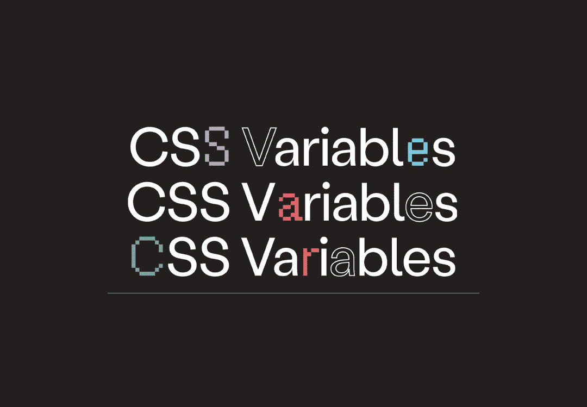

# 增强 CSS 自定义属性的 3 种方法

> 原文：<https://levelup.gitconnected.com/3-ways-to-supercharge-your-css-custom-properties-41e6596b8a6e>

[Lena Vargas](https://www.behance.net/LenaLaBallena?isa0=1#) 在[增量](https://increment.com/frontend/a-users-guide-to-css-variables/)上拍摄的照片

自定义属性使我们能够在 CSS 中拥有对变量的本地支持，为代码重用和可扩展性提供了革命性的可能性。这些变量的作用域是声明它们的选择器。因此，实现概念遵循相同的 CSS 级联原则。浏览器支持令人满意，但 Internet Explorer 除外。

这些属性通常放在`:root`选择器中，以获得更高程度的特异性。有效地使代币值可全局访问。然而，自定义属性声明在 HTML 元素选择器中没有得到充分利用。让我们定义一些常规方法来增强 CSS 自定义属性在项目中的使用。

# 抽象

假设您定义了一个宽度设置为`min(100% — 2rem, 60rem);`的`.container`类。阅读该选择器的人可能不会立即明白所声明的逻辑。`min()`函数将输出两个传递值中较小的一个。根据视口大小，`100%`可能比`60rem` ( `960px`)大。

因此，集装箱的有效最大宽度为`60rem`。当视口缩小到宽度小于`60rem`时，将使用`100% - 2rem`代替。我们可以分解传递的值，使实现更容易阅读和理解。

## 变化

作为上述抽象的结果，我们可以轻松地创建变体，而不必重写部分核心逻辑。本质上，我们可以通过覆盖`--max-width`自定义属性来创建一个`.small`和`.large`容器。

## JavaScript 中的 CSS 自定义属性

切换 class 属性的各个部分以支持不同的样式是一个 JavaScript 约定。例如，当[构建模态对话框组件](/build-an-accessible-modal-dialog-window-with-react-35f6938e58c4)时，我们生成了一个名为`size`的属性，它引入了一个额外的类来定义模态的宽度尺寸。

虽然，有另一种方法可以得到同样的结果。我们可以用`style`属性直接改变在 HTML 类名范围内定义的定制属性。

# 参考资料和进一步阅读

 [## 级联变量模块级别 1 的 CSS 自定义属性

### 大型文档或应用程序(甚至是小型的)可能包含相当多的 CSS。CSS 中的许多值…

www.w3.org](https://www.w3.org/TR/css-variables-1/)  [## CSS 变量用户指南-增量:前端

### CSS 中的变量已经成为万维网联盟 CSS 工作组的一个被高度要求的特性，我…

increment.com](https://increment.com/frontend/a-users-guide-to-css-variables/)  [## 自定义属性的完整指南| CSS 技巧

### 卡片{ -间距:1.2 雷姆；填充:var(-spacing)；margin-bottom:var(-spacing)；} /*不，不在选择器内*/…

css-tricks.com](https://css-tricks.com/a-complete-guide-to-custom-properties/) 

# 如果你觉得这篇文章有用，请与他人分享。一些掌声👏🏻下面多多帮忙！

*通过鼓掌，你帮助其他人发现这些内容，并激发更多关于可访问性、设计、反应和 JavaScript 的文章的写作！*