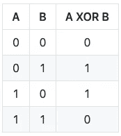

# 3 种不用临时变量交换值的方法

> 原文：<https://levelup.gitconnected.com/3-ways-to-swap-values-without-a-temporary-variable-c5a2fbee4527>

## 去掉那个尴尬的 tmp。


在这篇文章中，我将展示不需要第三个变量交换两个值的三种方法。尽管这些方法可能适用于任何语言，但我将展示它们在 Python 中的实现。

# 交换任务

这可能是最广为人知的方法，它包括**在一条语句中给每个变量赋予另一个变量的值。**该解决方案可按如下方式实施:

```
x = 3
y = 5x, y = y, xprint(x)  # 5
print(y)  # 3
```

一个简单的方法来拯救我们从一个额外的变量！

# 算术交换

这种方法使用了**，一个优雅的算术技巧**，其中我们用这两个值的和来覆盖两个变量中的一个，然后从结果值中减去第二个变量来获得第一个变量。然后，我们用总和减去先前获得的值来覆盖第一个值。迷茫？让我们来看看它的实现:

```
x = 3
y = 5x = x + y  # x = 3 + 5 = 8
y = x - y  # y = 8 - 5 = 3
x = x - y  # x = 8 - 3 = 5print(x)  # 5
print(y)  # 3
```

如果您喜欢这种方法，您将会看到，如果您用乘法代替加法，用除法代替减法(不过在 Python 3 中，将结果数字转换为浮点值)，这种方法也是可行的。

# 异或交换

最后但同样重要的是(实际上这是我最喜欢的)，异或交换。如果您不记得什么是**XOR(异或)运算符**，它是一个按位运算符，类似于 OR 运算符，只是为了获得输出值 1，输入值中只有一个(而不是两个)应该为 1。为了更好地理解，请看一下它的真值表:



让我们来看看这种方法的实现。请注意，Python 的 XOR 运算符用^符号表示:

```
x = 3
y = 5x = x ^ y
y = x ^ y
x = x ^ yprint(x)  # 5
print(y)  # 3
```

这种方法为什么有效？让我们一步一步地看一下我们的例子:

1.  3 的 3 位二进制表示是 011，而 5 的表示是 101。
2.  x = x ^ y = 011 ^ 101 给出的结果是 110。
3.  y = x ^ y = 110 ^ 101 给出的结果是 011(相当于十进制表示中的 3)。
4.  x = x ^ y = 110 ^ 011 得出的结果是 101(相当于十进制表示中的 5)。

请注意，尽管在您的代码库中包含这样一个优雅的技巧很有诱惑力，但出于两个原因，我建议不要这样做(请原谅，我不得不在列表中包含这种技术，它实在太美了):

*   你的同事对此不会很高兴:好吧，你今天已经学会了这个技巧，但你的同事可能不知道，而且我不确定如果有一个 bug 需要修复，他们是否会喜欢。
*   它有一些技术说明:看看[这个](https://stackoverflow.com/q/1723575/)和[这个](https://stackoverflow.com/q/32218275/)。**TLDR；**您将被限制为整数值，即使在这种情况下，您也需要小心，因为一个值与其自身进行 XOR 运算将总是返回 0(比如，您想用它来对可能有重复数字的列表进行排序)。

就是这样！你刚刚学习了三种交换两个值的方法，而不需要第三个变量。**如果你的编程语言允许的话，希望你会使用第一种解决方案**，主要考虑它的可读性(而且，从 CPU 的角度来看，它应该更便宜)。