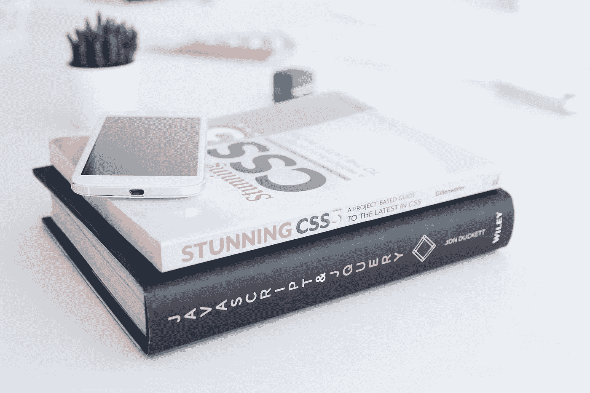
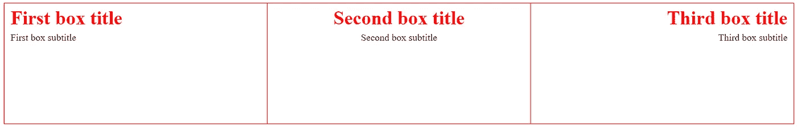
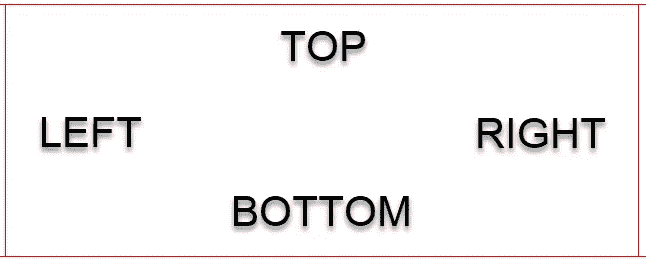
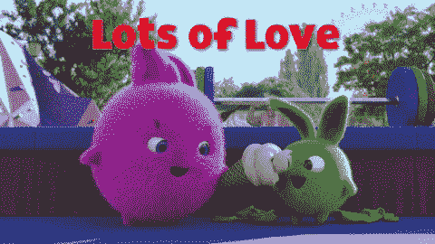

# 写更好的 CSS 的 3 个简单方法

> 原文：<https://levelup.gitconnected.com/3-ways-to-write-better-css-ce4c8a1294fa>



[KOBU 社](https://unsplash.com/@kobuagency?utm_source=unsplash&utm_medium=referral&utm_content=creditCopyText)在 [Unsplash](https://unsplash.com/s/photos/css-books?utm_source=unsplash&utm_medium=referral&utm_content=creditCopyText) 拍摄的照片

对于 UI 开发，CSS 文件很容易随着项目设计需求的发展而增长。如果你在一个敏捷的环境中工作，一个被归类为频繁和一致的旋转变化的环境，这种设计进化通常是更加渐进的。考虑到渐进的、一致的变化，开发人员通常会“添加”新的样式，而不是重写现有的样式。

假设你有一个带有黑色边框的三个盒子的设计。在接下来的 sprint 中，有人说他们希望第二个框有红色边框。您的直觉可能是简单地添加一个新类来将该框与其他框分开，并给它一个边框样式属性作为`solid 1px red`。这是可行的，但是当您考虑以下因素时，这并不是最佳的。

## 项目规模

大多数项目都比上面的例子要大。如果您将项目的大小增加一倍，您的 CSS 将保持不变，但是您需要向另一个 div 添加另一个类名。你需要的框越多，你的 HTML 中就有越多的类名。

## 设计需求

在上面的例子中，对于*一个*元素，只有*一个*样式差异。想象一下，如果他们想根据文本框的位置向文本框添加不同的文本对齐方式的文本。使用上面的过程，你最终会添加更多的类来做更多的改变，你的 HTML 和 CSS 文件都会变得越来越大，越来越没有组织性和灵活性。这让我们想到了最后一点。

## 灵活性

如上所述，随着项目的增长和设计需求的变化，拥有一个灵活且重量尽可能轻的基础非常重要。如果应用程序的需求发生变化/增长，添加更多的样式/类并不是不合理的，但是任何可以用高效/可重用的代码替换方便的代码的地方都将极大地提高应用程序的灵活性，因此在需要更改时需要更少的工作。为了创建一个可持续和灵活的生态系统，语法非常重要。

## 该项目

下面是我们将在这篇博文中开发的项目的用户界面。



我们有三个红色边框的盒子，一个标题(`h1`)和一个副标题(`p`)。第一个框左对齐，第二个框居中对齐，第三个框右对齐。

这是最初的 HTML。

```
<div class='container'>
  <div class='containerChild' style='border-left: solid 1px red;'>
    <h1>First box title</h1>
    <p>First box subtitle</p>
  </div>
  <div class='containerChild'>
    <h1 class='two'>Second box title</h1>
    <p class='two'>Second box subtitle</p>
  </div>
  <div class='containerChild'>
    <h1 class='three'>Third box title</h1>
    <p class='three'>Third box subtitle</p>
  </div>
</div>
```

这是 CSS。

```
.container{
  display: flex;
  justify-content: space-evenly;
}.containerChild{
  width: 100%;
  height: 200px;
  border-top: solid 1px red;
  border-bottom: solid 1px red;
  border-right: solid 1px red;
  border-left: none;
  padding: 0px;
  padding-left: 10px;
  padding-right: 10px;
}h1 {
  text-align: left;
  color: red;
  margin-bottom: 5px;
  margin-top: 5px;
}p {
  text-align: left;
  color: black;
  margin-bottom: 5px;
  margin-top: 5px;
}.two{
  text-align: center;
}.three {
  text-align: right;
}
```

给定上面的代码，让我们探索三种方法，我们可以提炼和精简我们的 CSS，以确保我们的应用程序更加灵活，轻量级和精简。

## TRBL(上、右、下、左)

我们可以从识别重复属性开始。每当看到`PARAMETER-DIMENSION`(比如`margin-top`，就有浓缩代码的机会。除非是只需要一个维度而其他维度可以忽略不计的情况，或者所有维度都需要相同的参数，否则更有效的维度书写方式是考虑缩写 **TRBL** 。



在 CSS 中，您可以遵循这种模式为 margin 和 padding 等属性编写可变尺寸。下面是这种模式可以派上用场的几个领域。

```
.containerChild{
  ...
  border-top: solid 1px red;
  border-bottom: solid 1px red;
  border-right: solid 1px red;
  border-left: none;
  padding: 0px;
  padding-left: 10px;
  padding-right: 10px;
}h1{
  ...
  margin-bottom: 5px;
  margin-top: 5px;
}p {
  ...
  margin-bottom: 5px;
  margin-top: 5px;
}
```

在`.containerChild`中，我们可以使用`border`来定义颜色和样式，而我们可以使用`border-width` T 来定义 TRBL 边框的宽度。

```
.containerChild{
  ...
  border: solid red;
  border-width: 1px 1px 1px 0;
  padding: 0 10px;
} /*SAVINGS OF 4 LINES */h1{
  ...
  margin: 5px 0 5px 0;
} /*SAVINGS OF ONE LINE*/p {
  ...
  margin: 5px 0;
} /*SAVINGS OF ONE LINE*/
```

这很好，但是我们可以进一步改进我们的速记。因为 top 和 bottom 的值是相同的，left 和 right 的值也是相同的，所以我们可以只使用两个参数来重写。

```
margin: 5px 0 5px 0;
/*CAN BE REWRITTEN AS BELOW*/ 
margin: 5px 0;
```

到目前为止，我们已经使用 TRBL 技术节省了 6 条生产线。下一个改进 CSS 的方法证明了分享真的是关爱。



## 共享属性(使用逗号分隔选择器)

你可能已经注意到我们的一些元素有相似的风格。再来看看`h1`和`p`。

```
h1{
  text-align: left;
  color: red;
  margin: 5px 0 5px 0;
}p {
  text-align: left;
  color: black;
  margin: 5px 0 5px 0;
} 
```

在这种情况下，两个元素风格的唯一区别是`color`。为了避免其他样式的重复，我们可以使用逗号来分隔选择器，然后给它们一个共享的样式组。

```
**h1, p{** /*CONSOLIDATED*/
  text-align: left;
  color: red;
  margin: 5px 0 5px 0;
}p {
  color: black;
}
/*SAVINGS OF TWO LINES*/
```

通过使用逗号分隔选择器`h1`和`p`，我们可以合并相似的样式。至于不同的样式，我们可以为具有不同样式的元素添加一个选择器(在本例中是`p`)，然后只给它我们想要更改的属性。

至此，我们总共节省了 8 行。看起来不多，但是我们最初的 CSS 只有 33 行。代码量减少了 24%多一点。如果您将这个节省率应用到一个有 1000 行的样式表中，就可以节省 240 多行。


## 组合子(而不是类和内联样式)

> 组合子可以通过最大化元素关联来确保你的 CSS 是精确的，而不会淹没你的 HTML。

CSS 组合子[的使用可以帮助你保持你的 HTML 更加轻便和灵活。大量的类和 id 会阻碍样式的可重用性并增加标记。我们的应用程序有几个实例可以用组合子代替类选择器。](https://medium.com/better-programming/understanding-css-combinators-a36e013b1bed)

```
.containerChild{
  ...
}.two{
  text-align: center;
}.three {
  text-align: right;
}
```

`.containerChild`是用于定位父`.container`中的三个盒子的类选择器。这可以通过使用**子组合符** ( `>`)在`.container`中选择子`div`来完成。

```
.container > div {...}
```

这不会替换/减少 CSS 代码，但是它允许我们从盒子中移除`.containerChild`类名。同样可以使用子组合器和`nth-child`选择器的组合来定位`two`和`three`的样式。

```
.container > div:nth-child(2) h1, .container > div:nth-child(2) p {
  text-align: center;
}.container > div:nth-child(3) h1,  .container > div:nth-child(3) p {
  text-align: right;
}
```

我们能够捕获盒子`div`以及它们的`h1`和`p`标签。同样，这并没有为我们节省 CSS 代码，但是看看我们的新 HTML。

```
<div class='container'>
  <div>
    <h1>First box title</h1>
    <p>First box subtitle</p>
  </div>
  <div>
    <h1>Second box title</h1>
    <p>Second box subtitle</p>
  </div>
  <div>
    <h1>Third box title</h1>
    <p>Third box subtitle</p>
  </div>
</div>
```

我们现在只需要一个类名就可以实现我们最初的结果。到目前为止，我们已经减少了大约 21%的 CSS 行数，并且**减少了 87.5%的标记中表示值的使用** ( 8 个元素和类名减少到一个)！

随着我们的 HTML 变得更加轻量级，我们的 CSS 变得更加精炼，还有一个潜在的效率领域我们已经提高了。

## 编程含义(JavaScript)

想象一下，如果每个盒子都代表列表项，会怎么样？还是博文缩略图？现在，除非您计划将每个列表项硬编码到 HTML 中(这种解决方案不是动态的，可能不可持续)，否则您需要使用 JavaScript 来呈现每个列表项，并应用上面概述的样式。

通过消除对类名和内联样式的需求，我们消除了对数据进行每次迭代的多行 JavaScript 代码。假设项目列表的长度为 100。因为我们使用了组合子，所以我们不需要对任何元素使用`element.className = ...`(除了`.container`)。在使用组合子之前，我们需要以编程方式将类添加到元素中。

这是**100 项**我们能够避免的`element.className`的三个实例，这相当于减少了 **300 项操作** (3 * 100 = 300)。

# 摘要

写出更好的 CSS 的三个快速方法如下…

## TRBL

当你试图应用不同尺寸的样式时，比如填充、边距和边框，使用缩写词 **TRBL(上、右、下、左)**。

## 共享属性

使用逗号，您可以合并多个元素的共享样式，而不必为每个元素多次指定这些样式。

## 组合子

组合子可以帮助你避免在 HTML 中大量使用类名和 id。这可以使您的 HTML 更简单、更灵活，并且减少您想要结合 JavaScript 所需的编程操作的数量。

这篇文章的源代码可以在 [CodePen](https://codepen.io/macro6461/pen/XWmwYJe) 上找到。

*注意:本文提供的 HTML 结构并不代表符合可访问性标准的 HTML。它被用于与 CSS 细化相关的方便和演示目的。有关这些指南的更多信息，请阅读* [*W3C 标准指南*](https://www.w3.org/WAI/standards-guidelines/) *。*

[*在此处将您的免费媒体会员升级为付费会员*](https://matt-croak.medium.com/membership) *，每月只需 5 美元，您就可以获得数千名作家的无限量无广告故事。这是一个附属链接，你的会员资格的一部分帮助我为我创造的内容获得奖励。谢谢大家！*

# 参考

[](https://medium.com/better-programming/understanding-css-combinators-a36e013b1bed) [## 理解 CSS 组合子

### 如何使用它们，为什么

medium.com](https://medium.com/better-programming/understanding-css-combinators-a36e013b1bed) [](https://skilled.dev) [## 编写面试问题

### 一个完整的平台，在这里我会教你找到下一份工作所需的一切，以及…

技术开发](https://skilled.dev) [](https://www.w3.org/WAI/standards-guidelines/) [## W3C 可访问性标准概述

### 本页介绍了与网页可访问性相关的指南和其他标准。万维网的页面内容…

www.w3.org](https://www.w3.org/WAI/standards-guidelines/)