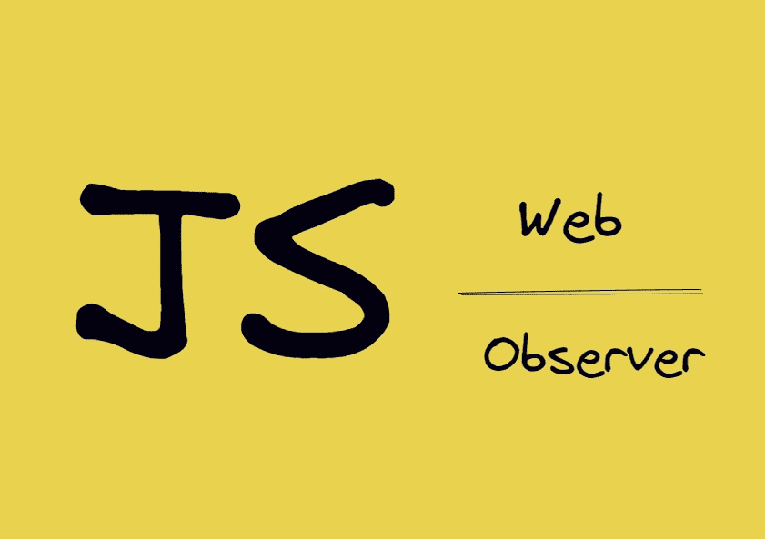
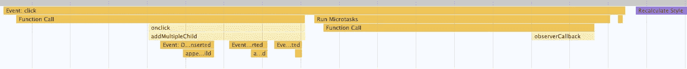

# 每个 Web 开发人员都应该知道的 3 个 Web 观察者

> 原文：<https://levelup.gitconnected.com/3-web-observers-every-web-developer-should-know-c2f65302b5df>

## 你可能知道变异观测者，但你知道其他人吗？

在浏览器中，我们可以使用`addEventListener`来监听用户事件，但是如果我想监听 DOM 的变化或者监听一些浏览器行为呢？

浏览器为我们提供了几个观察者来满足这些需求。你知道有哪些吗？它们的具体用途是什么？本文将为您揭晓。

# 突变观察者

MutationObserver 接口可以监视 DOM 树中的变化，并且是 DOM3 事件规范的一部分。它可以监视当前节点的属性变化、子节点的变化等等。这里有一个简单的例子:

点击按钮，可以看到 MutationObserver 监听到了变化，可以清楚的知道是`attributes`变了还是`childList`变了。

特别重要的是，所有观察者事件回调都是**微任务**，这有两个好处。

1.  它是异步的。这不像[突变事件](https://developer.mozilla.org/en-US/docs/Web/API/MutationEvent)每次 DOM 改变时都会触发同步回调。相反，它会在触发异步回调之前等待多次 DOM 更改。
2.  它能保证实时性，在下一个宏任务开始之前肯定会被调用。

下面是一个使用突变事件和突变观测器的示例:

使用默认的数字 3，当点击`Add Multiple Child`时，可以看到`insertCallback`被调用三次，而`observerCallback`只被调用一次。并且在`mutationsList`中可以得到这三次变化的记录。你也可以改变其他数字来测试。

以下是表演截图:

用户单击事件是一个宏任务。点击按钮后，可以看到`DOMNodeInserted`事件被调用三次，微任务中`observerCallback`被调用一次。下一步是浏览器呈现一个新的框架。如果用户再次单击，将启动一个新的宏任务。

**所以它巧妙地利用了事件循环的机制，在不影响性能的情况下解决了实时性问题。**

# resize 观察者

要监听浏览器窗口大小的变化，我们可以使用`addEventListener`来监听`resize`事件，要监听单个元素，可以使用`ResizeObserver`。

ResizeObserver 接口报告元素内容或边框的尺寸变化，或者 SVGElement 的边界框的尺寸变化。

这里有一个简单的例子:

注意`ResizeObserver`在初始化时也会触发一个回调。拖动上面的滑块可以看到回调是按顺序触发的，你不会感觉到任何滞后，这也是由于上面提到的微任务。

`resizeObserver`在进行可视化图表适配时会很有用。

# 交叉观测器

IntersectionObserver 接口可以观察目标元素与祖先元素或`document`视口的交集的变化。创建时，可以指定交叉点可见比例的阈值等。

这里有一个简单的例子:

滚动`container`区域的滚动条查看控制台输出。其中`intersectionRatio`表示当前交叉点的比率。我们指定输出为 0.5 和 1。

该 API 对于图像的延迟加载或数据收集非常有用，*和 Medium 的延迟加载可能使用该*😃

# 额外的

除了上述三种监控元素的观测器，还有另外两种类型的观测器，分别是`PerformanceObserver`和`ReportingObserver`。

`PerformanceObserver`用于监控绩效测量事件。一旦有测量事件([性能条目](https://developer.mozilla.org/en-US/docs/Web/API/PerformanceEntry/entryType#performance_entry_type_names))就会触发回调功能，然后您可以选择报告它进行性能分析。

`ReportingObserver`允许收集和访问报告。例如，当使用浏览器的废弃 API 时，它会触发一个回调函数。既然这不是错误，那就只能用`ReportingObserver`来听了。

*今天就到这里。我是 Zachary，我将继续输出与 web 开发相关的故事。如果你喜欢这样的故事，想支持我，请考虑成为* [*中等会员*](https://medium.com/@islizeqiang/membership) *。每月 5 美元，你可以无限制地访问媒体内容。如果你通过* [*我的链接*](https://medium.com/@islizeqiang/membership) *报名，我会得到一点佣金。*

你的支持对我来说很重要——谢谢。