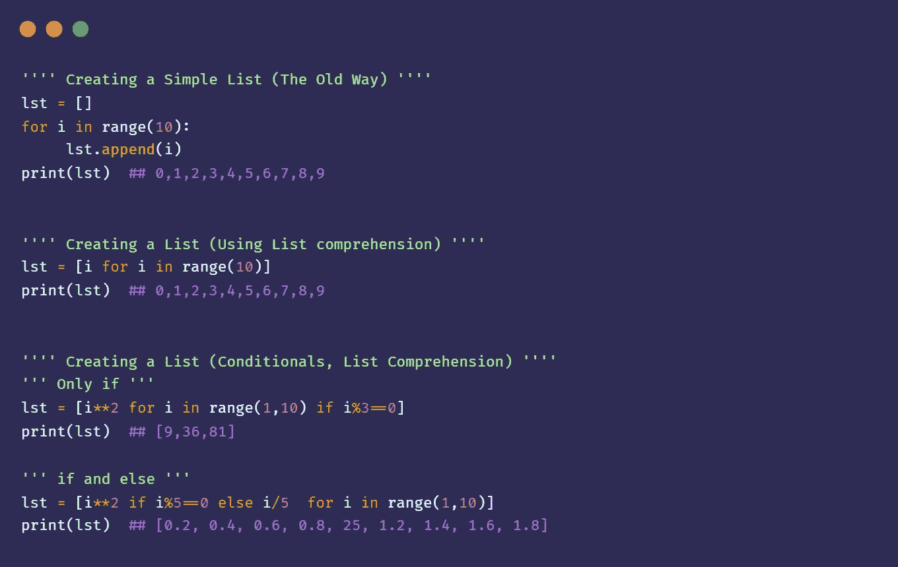
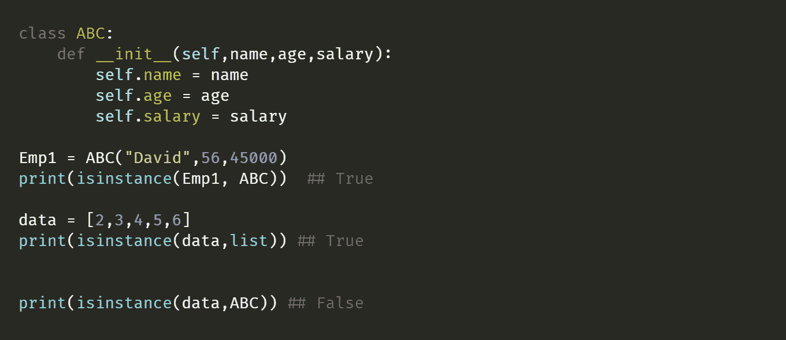
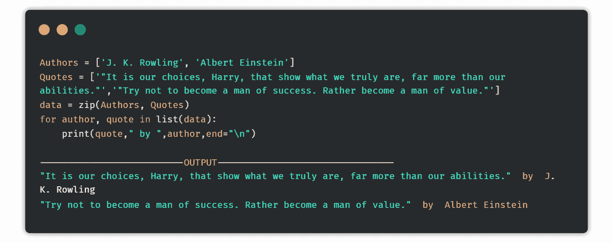
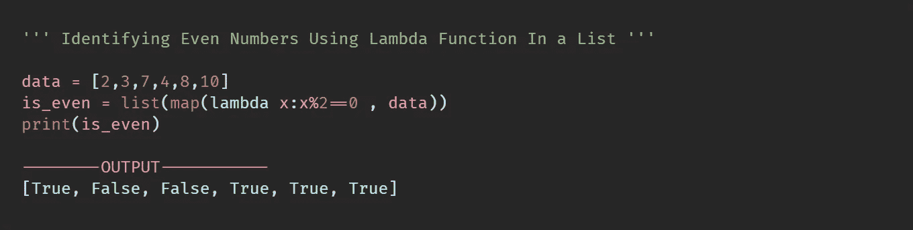
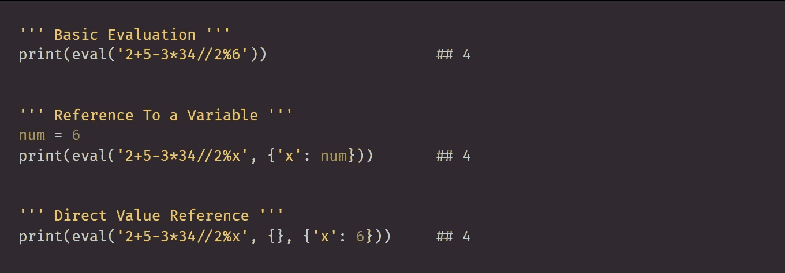
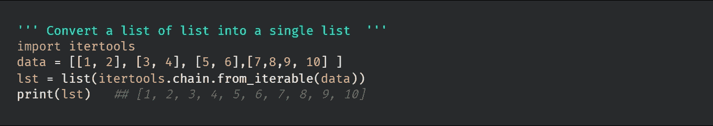
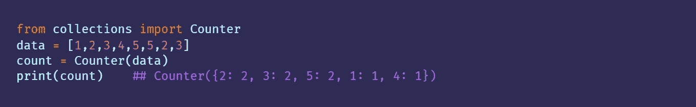

# 每个开发人员都应该知道的 30 个 Python 技巧

> 原文：<https://levelup.gitconnected.com/30-python-hacks-every-developer-should-know-11d4b5f95be5>

## 让您感受到 Python 威力的技巧


"作者使用 [Canva](http://canva.com) 创建的图像"

根据 StackOverflow 的最新调查，python 是世界上被搜索和标记最多的编程语言。它拥有最大的活跃开发者社区之一。Python 之所以在初学者中如此出名，是因为它语法简单，基础简单易学。它是一种通用语言，可以用来创建软件行业中的几乎所有东西。python 最大的优势之一是它的一行程序和包可以用很少的代码行完成任何任务。有了这么多的内置功能，在用 python 编码时，有一些技巧你应该记住。在这篇博客中，我将分享每个开发者都应该知道的 30 个 Python 技巧。

## 1.生成文件共享服务器

Python 提供了一种非常简单的方法，通过创建免费的在线 FTP 服务器，将文件从您的计算机共享到另一台计算机或移动设备。

```
python -m http.server 5000
```

您可以选择从 0 到 65353 的端口范围。一旦代码被执行，你会看到你的服务器在`127.0.0.1:5000`运行

现在打开手机上的 chrome 或任何浏览器，只需输入`YOUR_COMPUTER_IP_ADDRESS:PORT_NUMBER`

要获得 IP 地址，你可以在电脑终端上做`ipconfig`。在你的下方，会看到 IPv4 地址。例如，如果你的 IP 地址是`192.168.39.145`，端口号是`5000`，那么文件共享服务器将在`192.168.39.145:5000`运行

## 2.传递多个没有声明的参数

在 Python 中，借助于`*args`,你可以传递任意数量的参数给一个函数，而不需要指定数量。

```
def add_numbers(****numbers***):
       sum = 0
       for number in numbers:
           sum += number
       return sum
print(add_numbers(5,6,233,56,3,5,2,5)) ## 315
```

通过指定`**kwargs`，您可以向函数传递任意数量的关键字参数。

## 3.智能创建列表元素

Python 中的列表类似于数组。它是可变的，可以存储异构元素，并且易于使用。现在，要向数组中添加元素，您需要运行一个循环，然后逐个添加元素。此外，如果涉及到任何条件，那么代码的大小就会增加。Python 提供了一种更有效的方法，将所有步骤组合在一个叫做 **List comprehension** 的单行程序中。



## 4.类型检查 2.0

检查变量的类型是一项任务，您将反复执行这项任务以获取知识。`isinstance()`python 中的函数根据给定对象是否是指定类的实例返回布尔值。它有两个参数对象和类本身。它也可以用于普通的类型检查。



## 5.修整废弃数据

当我们抓取一些文本时，标题中有许多不需要的文本(\t，\n，\t，等等。)也挨刮。修剪是去除不需要的数据的一种方式。python 中有一个名为`strip()`的方法，会修剪所有刮下的数据。

```
**-------------- Trimming A String -----------** 
data = "\n\n\n \t  David's Foord and Restaurant \t \n\n\n    "
print(data.strip())
*--o/p-----*
*David's Foord and Restaurant***--------- Trimming List of Strings ---------** data = ["\n\n\n Burger \t   ","\n\t Pizza \t  "]
cleaned_data = [i.strip() for i in data]
print(cleaned_data)
*---o/p----*
*["Burger","Pizza"]*
```

## 6._ 运算符

单下划线`_`在 python 中是有效字符。它可以用作变量名。这是一个特殊字符，用于根据 python 文档存储先前评估的结果。

```
---------- As a Variable -----------
_ = 10
b = 20
sum = _+b
print(sum)
------
30------------ Restoring The Previous Evaluation Result ------
>>> 200+400
600
>>> _*5
3000
```

## 7.较短的名称

python 最大的特点之一就是它的大量库。当你不得不在你的程序中一次又一次地使用它们时，问题就来了，因为它们中的一些有着更大的和不友好的名字。Python 提供了一种更简单的方法，在`as`关键字的帮助下缩短库名。

```
## Normal Way 
import numpy 
import speech_recognition## Shorten Name
import numpy as np
import speech_recognition as sr
```

## 8.专业地迭代多个列表

大多数时候，当你从网上抓取数据时，你把它存储在一个不同的列表中。这个技巧可以让你打印出列表中的每个元素对应的另一个列表中的每个元素。



## 9.为了利益而切片

切片是 python 的一个内置特性，允许您访问序列的某些部分。它还可以用来修改或删除其中的项目。有大量的例子可以让你使用切片来减少代码的大小。

```
**''' Checking For Palindrome '''**
name = "wow"
print(name==name[::-1])
-----------
True**''' Retriving Even Numbers From a Natural Sequence '''**
natural_numbers = [1,2,3,4,5,6,7,8,9,10]
even_numbers = natural_numbers[1::2]
print(even_numbers)
-------------
[2,4,6,8,10]
```

## 10.用\分隔长行

代码变得不可读的最大原因之一是因为长的文件地址、链接或列表元素。

```
url = 'https://medium.com/pythoneers/10-underrated-python-packages-every-data-scientist-should-know-86b4355cc35e'
```

您可以借助反斜杠`\`更改换行点

```
url = 'https://medium.com/pythoneers/'**\**
       '10-underrated-python-packages-every-'**\**
       'data-scientist-should-know-86b4355cc35e'
print(url)
----------------
https://medium.com/pythoneers/10-underrated-python-packages-every-data-scientist-should-know-86b4355cc35e
```

> 用一个披萨的费用成为真正的中等会员。一个月也就 **5$** 而已。可以用 [***我的推荐链接***](https://abhayparashar31.medium.com/membership) 合二为一。 ***“不要只是读书，也要支持作家”***

## 11.计算元素的出现次数

了解元素在数据结构中出现的次数是有好处的。

```
from collections import Counter
data= [96,95,96,87,87,88,56,57,57]occurences = Counter(data)
print(occurences)
---------------
Counter({96: 2, 87: 2, 57: 2, 95: 1, 88: 1, 56: 1})
```

## 12.接受多个输入(Pythonic 方式😎)

Python 提供了一种使用一行代码获取多个输入的更简单的方法。您也可以在一行中定义多个变量。

```
x, y **=** input().split()## Interger Inputs
x, y **=** map(int, input().split())## Space Seperated Inputs
data = list(map(int, input().split()))
```

## 13.一个线性函数

Python 提供了一个叫做 lambda 函数的单行函数。它也被称为“匿名函数”。原因是它不需要`def`关键词来定义。它可以接受任意数量的参数，但一次只能接受一个表达式。一个好的做法是将其用作表达式，而不是将其绑定到变量。



## 14.对列表中的每个元素应用函数

使用`map`函数对列表中的每个元素应用相同的转换。

```
ID = ["R72345","R72345&"]
results = list(map(str.isalnum, ID))
print(results)
-----------------
[True, False]
```

## 15.计算程序的执行时间

这是机器学习中的一个主要任务。了解你的代码或函数运行所花费的时间是很重要的，这样你就可以用一些[技巧](/10-python-tricks-for-speed-up-your-code-8c189d8c99b6)来改进它。

```
**''' The Simplest Way '''**
import time
start_time = time.time()
...
func()
...
end_time = time.time()
print("Execution Time: ",(end_time-start_time))*Check Out This StackOver Flow Discussion For More Examples On How To Calculate Execution* [*Time*](https://stackoverflow.com/questions/1557571/how-do-i-get-time-of-a-python-programs-execution)*.*
```

[](https://medium.com/pythoneers/8-high-paying-carriers-to-choose-after-learning-python-cb5263383550) [## 学习 Python 后可以选择的 8 个高薪职业

### 选择一份你热爱的工作，你这辈子一天都不用工作

medium.com](https://medium.com/pythoneers/8-high-paying-carriers-to-choose-after-learning-python-cb5263383550) 

## 16.在方括号中使用 Get 方法

大多数 Python 开发人员在从字典这样的数据结构中访问元素时习惯使用方括号。方括号是没有问题的，但是当遇到一个不存在的值时，它会显示一个难看的错误。现在，为了避免这个错误，你可以使用`get`方法。

```
data_dict = {a:1, b:2,c:3}print(data_dict**['d']**) ## KeyError: 'd'print(data_dict.**get('d')**) ## None 
```

## 17.运行时处理异常

异常是在程序执行过程中由于某种原因而发生的中断执行的情况。为了处理 python 中的异常，我们使用了`try`和`except`块。`try`块包含需要执行的代码，而`except`块包含在 try 块中出现错误时将执行的代码。

```
''' Exception '''
a = 5
b = 0
print(a/b) *## ZeroDivisionError: division by zero*''' Exception Handling '''
try:
    a = 5
    b = 0
    print(a/b)
except:
    print("Can't Divide Number With 0")
-----------------------
*Can't Divide Number With 0*
```

## 18.将普通方法转换为静态方法

静态方法是 python 类中绑定到类的特定状态的一种方法。他们不能访问或更新类的状态。您可以借助`staticmethod(function)`将普通方法或实例方法转换为静态方法

```
class ABC:
    def abc(num1,num2):
        print(num1+numn2)

# changing torture_students into static method
ABC.abc = staticmethod(ABC.abc)

ABC.abc(4,5) ## 9
```

要知道为什么您应该将普通或实例方法转换为静态方法，请查看此[讨论](https://stackoverflow.com/questions/136097/difference-between-staticmethod-and-classmethod)。

## 19.打印可读结果

普通的`print`语句在大多数情况下工作良好，但是当输出是表格、JSON 的形式，或者包含多个结果时，就必须添加一些功能或者使用一些外部包。

## 20.部门版本 2.0

`divmod()`是 python 中的一种内置函数，它接受两个数字作为输入，并返回元组中的余数和商。

```
a = 2560
b = 27result = divmod(a,b)
print(result)
--------------------
(94, 22)
```

## 21.在一行中求解表达式

Python 为求解表达式提供了一个非常有用的函数`eval()`。它接受三个参数作为输入——要计算的数学表达式、对变量的引用、直接值引用。



## 22.For Else 方法

您可以在`for`循环中使用 else 关键字。它将指定一个代码块，该代码块将在成功执行您的`for`循环后运行。此块可用于指定循环的任何结束条件或消息。

```
for x in range(9):
  print(x)
else:
  print("Finally finished!")
```

[](/7-must-try-python-projects-to-improve-your-freelancing-gigs-d8d0bafa80de) [## 7 个必须尝试的 Python 项目来提高你的自由职业水平

### 提供真正价值的项目

levelup.gitconnected.com](/7-must-try-python-projects-to-improve-your-freelancing-gigs-d8d0bafa80de) 

## 23.将可变的强制转换为不可变的

类型转换是 Python 的一个特性，允许您将一种数据结构转换成另一种数据结构。在它的帮助下，你也可以把可变的数据结构变成不可变的数据结构。

```
**''' Mutable List '''**
lst = [1,2,3,4,5]
lst[0] = 6
print(lst)
**------------**
*[6,2,3,4,5]***''' Converting It to Immutable '''** lst = [1,2,3,4,5]
lst2 = tuple(lst)
lst[0] = 6 **--------------** *TypeError: 'tuple' object does not support item assignment*
```

## 24.根据要求生成序列

python 中的 Generator 是一种返回可迭代对象的函数。简而言之，生成器可以在需要时生成一个序列。它们的内存效率很高。生成器允许你创建迭代器和执行惰性计算。

```
def fibo(limit):
    a,b = 0,1
    while a<limit:
       yield a
       a, b = b, a+b
series = fibo(10)print(next(series)) ## 0
print(next(series)) ## 1
print(next(series)) ## 1
```

## 25.记录而不是打印用于调试

日志记录是在代码执行时捕获代码流的过程。这对于轻松调试代码非常有帮助。与打印相比，日志记录的一个主要优点是，即使在应用程序关闭后，日志也会保存在一个文件中，以供以后查看，该文件中包含日志消息和其他记录，如行号和模块名。仅打印保存并显示数据，直到应用程序激活并运行。Python 提供了一个名为`logging`的模块来生成和写入日志。

## 26.巧妙添加新功能

Decorator 是 Python 的一个特性，它允许您在不显式修改代码的情况下向现有代码添加新功能。decorator 的一个很好的应用是在不修改函数的情况下，向计算加法和百分比的函数添加平均功能。

## 27.使用上下文管理器进行资源处理

在 python 中，上下文管理器是一个很好的工具，可以让你在需要的时候分配和释放资源。上下文管理器最常用和公认的例子是`with`语句。`with`主要用于打开和关闭文件。使用的最大优点之一是它确保文件在使用后关闭。

```
with open ('content.txt','w') as f:
    f.write("Hello Python")
```

## 28.PyForest(仅限懒惰的开发人员)

这是我最喜欢的技巧之一，我在每个项目中都使用它。大多数时候，你会花很多时间来导入基本库，比如 Numpy，Pandas 等等。为了节省时间和消除头痛`pyforest`是一个图书馆给你。它会自动导入机器学习项目所需的所有必要的库。

```
from pyforest import *
```

## 29.Itetools

这个模块实现了许多迭代器构建块，灵感来自 APL、Haskell 和 SML 的构造。它提供了许多惊人的功能，使这个库成为 python 的瑰宝。查看[文档](https://docs.python.org/3/library/itertools.html)，了解该库中可用的不同功能。



## 30.Python 中的集合

python 中的集合是用于存储数据集合的容器。Python 提供了一个包`collection`，其中包含不同类型的有用容器，可以用于不同的目的。
***例如:***
**Counter** —取一个 iterable，返回一个字典，其中 Keys = elements，Value =它们在 iterable 中的计数。
**namedtuple** —返回一个元组，其中包含元组中每个位置的名称。
**有序字典** —一种不惜一切代价维持秩序的字典。
**默认字典** —包含每个键的默认值(如果未指定)。



***“喜欢你所读的东西，成为一个中等会员就可以这样无限制地阅读内容”***

[](https://abhayparashar31.medium.com/membership) [## 通过我的推荐链接加入灵媒

### 作为一个媒体会员，你的会员费的一部分会给你阅读的作家，你可以完全接触到每一个故事…

abhayparashar31.medium.com](https://abhayparashar31.medium.com/membership) 

## 一些精选的文章供你接下来阅读

你是 Python 的新手，还是想更新技能的老开发人员，看看这个博客，很好地理解和更新 Python 的基本概念。

[](https://medium.com/pythoneers/the-ultimate-python-tutorial-for-beginners-5574199a2959) [## 初学者的终极 Python 教程

### 涵盖所有基本主题，从变量到类和对象

medium.com](https://medium.com/pythoneers/the-ultimate-python-tutorial-for-beginners-5574199a2959) 

不是新手，那么看看下面的文章，学习一些 Python 的高级概念。

[](/10-advance-python-concepts-to-level-up-your-python-skills-da3d6284ad53) [## 提升 Python 技能的 10 个高级 Python 概念

### 有助于增加 Python 知识的概念

levelup.gitconnected.com](/10-advance-python-concepts-to-level-up-your-python-skills-da3d6284ad53) 

对学习不感兴趣，想在这个周末完成一些项目，看看下面的文章。

[](https://medium.com/pythoneers/6-cool-python-projects-that-you-can-finish-this-weekend-4d87a8d8210f) [## 这周末你可以完成 6 个很酷的 Python 项目

### 增强您思考和编码能力的项目

medium.com](https://medium.com/pythoneers/6-cool-python-projects-that-you-can-finish-this-weekend-4d87a8d8210f)