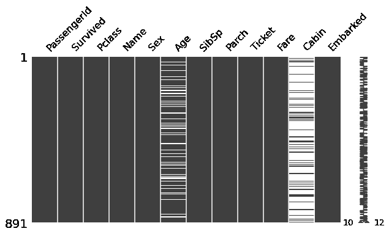
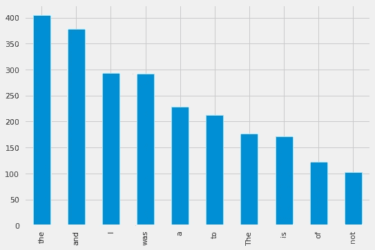

# 你必须尝试的 30 个 Python 单句程序

> 原文：<https://levelup.gitconnected.com/30-python-one-liners-you-must-try-31cf3686fc05>

## 使用一行 Python 代码解决大部分任务


由[纳丁·沙巴纳](https://unsplash.com/@nadineshaabana?utm_source=medium&utm_medium=referral)在 [Unsplash](https://unsplash.com?utm_source=medium&utm_medium=referral) 上拍摄的照片

从我用 Python 写下第一行代码的那一天起，我就对它的简单性、广泛的软件包和编写一行程序的能力着迷了。在这篇博客中，我想分享一些我用来提高工作效率的最好的 python 一行程序。

## 1.清理一行中的文本数据

NLP 是机器学习的一个子领域，它处理文本数据并从中提供有用的见解。NLP 的主要部分致力于清理文本并使其符合模型构建的条件。我创建了一个 python 包，使用它你可以在一行代码中清理你的文档和数据帧。

```
*# !pip install* [*crazytext*](https://pypi.org/project/crazytext/)sample = 'Batman (@batmanfromgotham) Belongs To Gotham ID batman@gotham.com #batman'import **crazytext** as ct
cleaner = ct.Cleaner(text=sample)
cleaner.**quick_clean**(remove_complete=False,make_base=False)
-------------------
batman batmanfromgotham belongs to gotham id EMAIL batman
```

## 2.千位分隔符

您向用户展示的输出比您编写的生成输出的代码更重要。这个一行程序将通过使用逗号分隔千位，帮助您以简单易读的形式显示大数字。

```
n = 1000000000
print(f'{n:,}')
----------------------
*1,000,000,000*
```

## 3.通过对其他列表应用一些操作来创建新列表

假设您有一个 2D 列表，其中包含不同用户的姓名、电子邮件和手机号码等一般信息。你的任务是将 Gmail 提供的所有邮件提取到一个列表中。

```
users = [['Karl','b@gmail.com','41132424'],  
         [ 'Ana','LA','c@gmail.com','e@gmail.com',
                      'random@xyz.com',418765485]]import re 
emails = [i for j in lst for i in j if re.findall(r'(\w+@(gmail).com)',str(i)) ]
print(emails)
---------------------
*['b@gmail.com', 'c@gmail.com', 'e@gmail.com']*
```

## 4.密码生成器

密码是用于访问某个网站的单词的秘密组合。这个一行程序将为你的社交媒体应用程序提供一个强密码。

```
from random import choice
print(''.join([choice('abcdefghijklmnopqrstuvwxyz0123456789%^*(-_=+)') for i in range(10)]))
-----------------------------
*g6n9m+pus**
```

## 5.展平 2D 列表

列表是 python 中最常用的数据结构之一。每当我们从 SQL 数据库或 JSON 文件中收集数据时，它都会进入 2D 列表。访问 2D 列表中的元素比访问 1D 列表更难。这个一行程序将把一个 2D 列表变成一个 1D 列表。

```
l = [[1,2],[2,3,4],[4,4,5]]
flattned_list = [i for j in l for i in j]
print(flattned_list)
-----------------------------------
*[1, 2, 2, 3, 4, 4, 4, 5]*
```

## 6.多重条件语句

条件语句根据给定的条件执行一些任务。if-else 是最著名和使用最多的条件句。在这个一行程序中，我将给出一个编写嵌套 if-else 的想法。

```
x = 85
print("Grade A") if x > 90 else print("Grade B") if x <90 and x>75 else print("Grade C") if x<75 and x>60 else print('Grade D')
--------------------------
*Grade B*
```

## 7.将数据从列表写入文件

```
predictions = [0.02, 0.05,0.80,0.02,0.05,0.03,0.02,0.01]with open('output.txt', 'a') as f:
    [f.write(f'{item} \t') for item in predictions]
```

## 8.计算文本中的数字、空格和字母的数量

```
text = 'adam@123 for real'print(sum(c.isdigit() for c in text))   *## Digits
-----------
3*print(sum(c.isalpha() for c in text))   *## Letters
-----------
11*print(sum(c.isspace() for c in text))   *## Whitespace
-----------
2*
```

## 9.正在启动文件共享服务器

Python 提供了一种非常简单的方法，通过创建免费的在线 FTP 服务器，将文件从您的计算机共享到另一台计算机或移动设备。

```
python -m http.server 5000
```

您可以选择从 0 到 65353 的端口范围。一旦代码被执行，你会看到你的服务器在`127.0.0.1:5000`运行

现在打开手机上的 chrome 或任何浏览器，只需输入`YOUR_COMPUTER_IP_ADDRESS:PORT_NUMBER`

## 10.将数字文本转换为整数

有时，当处理数据集时，数值数据以其分类形式表示。使用它变得非常困难，但是使用下面的一行程序，你可以很容易地把它转换回原来的整数形式。

```
*# !pip install numerizer*import numerizer; int(numerizer.numerize('Fourty Seven'))
```

## 11.替换文本文件中的数据

文本文件用于存储多种类型的数据。每当有新的更新时，手动更新文件就变得非常困难。这个一行程序将有助于在加载时改变文本文件的某些部分。

```
open('sample.txt').read().replace('Dehli','Delhi')
```

## 12.在同一行打印数据

编码黑客马拉松通常要求输出打印在一行中。在 python 中，可以通过在 print 语句中传递`end= ' '`参数来做到这一点。

```
lst = [1,2,3,4,5]for i in lst:
    print(i,end=' ')
-----------------------
*1 2 3 4 5*
```

## 13.获取关于名人的信息

无论您的项目是否需要这些信息，或者您只是好奇想知道，python 提供了一个 python 库 Wikipedia，它有一个简单的一行程序来从 Wikipedia 中提取信息。

```
*# !pip install wikipedia*import wikipedia; wikipedia.summary('*Dwyane Johnson*', sentences=2)
-------------
*Dwayne Douglas Johnson (born May 2, 1972), also known by his ring name The Rock, is an American actor, businessman, and former professional wrestler. Widely regarded as one of the greatest professional wrestlers of all time, he wrestled for WWE for eight years prior to pursuing an acting career.*
```

## 14.一次打开多个 Web 链接

每天睡觉前，我有一个习惯，就是上网找一些文章、论文和电子书，为第二天阅读。在写这个脚本之前，我曾经在我的 chrome 浏览器上将所有的网页链接加入书签，然后在第二天再次手动重新打开它们。现在，我不再每天早上打开笔记本电脑时都这样做了，我保存在下一个文件中的所有链接都会打开。

```
*# !pip install webbrowser*## Opens Raw Links
import webbrowser; webbrowser.open('https://www.kaggle.com/')*## Opens Multiple Links From a Text File* import webbrowser
with open('weblinks.txt') as f:
  links = f.readlines()
  for link in links:  
     webbrowser.open(link)
```

## 15.一次导入所有数据科学库

这个一行程序是我最喜欢的程序之一，我在每个项目中都使用它。数据科学家和机器学习工程师花了大量时间来计算他们需要导入哪一组库。现在不再是了，加载`pyforest`库的一行程序提供了对我们完成一般数据科学任务所需的所有主要库的访问。

```
*# !pip install pyforest*from pyforest import *
```

## 16.一次接受多个输入

这个 python 一行程序展示了从用户那里获取多种输入的不同方法。

```
x, y = input().split()*## Interger Inputs* x, y = map(int, input().split())*## Space Seperated Inputs* data = list(map(int, input().split()))
```

## 17.一次训练所有机器学习模型的数据

在机器学习中，我们在数据上拟合不同的模型来检查性能，并在数据上筛选出性能最高的最佳模型。这个过程需要大量的工作和多行代码。我分享的这个一行程序解决方案将根据数据训练 20-30 个机器学习模型，并对所有模型进行评分。

```
*# !pip install lazypredict*from lazypredict.Supervised import LazyClassifier
clf = LazyClassifier(predictions=True)
models, predictions = clf.fit(X_train, X_test, y_train, y_test)
```

## 18.计算列表中元素的出现次数

下面的一行程序将计算列表中不同元素的出现次数。这个脚本对于查找最频繁和最不频繁的值很有用。

```
from collections import Counter
print(Counter([6,5,6,7,7,8,6,7,7]))
------------
*Counter({7: 4, 6: 3, 5: 1, 8: 1})*
```

## 19.评估数学表达式

这个一行程序将对所有计划构建像计算器这样的数学应用程序的开发人员有所帮助。

```
eval('5+5*10-50/20')
--------
*52.5*
```

## 20.为你的文字获得一个感性的分数

情感分析是指将文本分类为不同情感的技术，主要是积极的、消极的和中性的。这个一行程序只需要一些文本来生成它的情感分数。如果分数大于 0，则认为是正面的，如果小于 0，则认为是负面的，如果等于 0，则认为情绪是中性的。

```
*# !pip install textblob*from textblob import TextBlob
testimonial = TextBlob("Amazing video game!! loved the graphics and gameplay.")
print(testimonial.sentiment.polatiry)
-----------
*0.225**'''
positive
'''*
```

## 21.在控制台上绘制创意文本

每个大的技术项目都被描述成一个小的命令行界面。这个一行程序将为您的 CLI 提供一个吸引人的外观。

```
*# !pip install pyfiglet*import pyfiglet
print(pyfiglet.figlet_format('Python'))
```


## 22.从两个列表中生成所有可能的组

```
lst1 = ['a', 'b']
lst2 = [1, 2, 3]groups = [(a, b) for a in lst1 for b in lst2]
print(groups)
----------------
*[('a', 1), ('a', 2), ('a', 3), ('b', 1), ('b', 2), ('b', 3)]*
```

## 23.可视化数据集中缺失的值

缺失值是指数据中缺失的数据点，通常在数据帧中表示为 NaN。这个一行脚本将使用`missingno`库以更加用户友好的格式可视化所有缺失的值，从而有助于提升您的分析。

```
import missingno as mi
import pandas as pd
data = pd.read_csv('[titanic.csv](https://raw.githubusercontent.com/Abhayparashar31/datasets/master/titanic.csv)')mi.matrix(data, figsize = (10,5))  ## One-Liner Code
```



## 24.生成虚假数据

在我们的生活中，有时我们需要一些虚假的数据，因为我们不想分享我们的真实和个人数据。互联网上有许多网站需要填写证书表格才能访问网站，在这种情况下，这种一行程序非常有用。它会为你生成假数据。

```
*# !pip install faker*from faker import Faker
names = [Faker().name() for i in range(0,5)]
print(names)
----------------------
['Michael Kramer', 'Lori Smith', 'Veronica Fox', 'Margaret Williams', 'Peter Taylor']
```

## 25.获取两个文本之间的相似性得分

相似性分数是对不同文档进行分类、建立剽窃检查器、从数据中移除相似单词等的重要度量。这个 python 单行脚本利用`fuzzywuzzy`库来生成两段文本之间的相似性得分。

```
*# !pip install fuzzywuzzy*from fuzzywuzzy import fuzz
fuzz.ratio("This is an orange", "This one is an orange")
---------------------
89
'''
Quite Similar
'''
```

## 26.一次分析大量数据

良好的数据知识是构建更好的模型所必需的，该模型可以很好地执行并生成正确的预测。python 的 Autoviz 库证明是一次性分析大量数据的一行解决方案。

```
#!pip install autovizfrom autoviz.AutoViz_Class import AutoViz_Class
AV = AutoViz_Class()df = AV.AutoViz('[titanic.csv](https://raw.githubusercontent.com/Abhayparashar31/datasets/master/titanic.csv)')
```

## 27.对数据执行任何数据结构和算法

python 的算法包有超过 20k 的 starts 和将近 4.5k 的 forks，有许多内置的单行解决方案，用于执行不同的大型算法，如贪婪搜索、merge_sort、bucket sort 等。下面是一个合并排序的单行示例。

```
*# !pip install algorithms*from algorithms.sort import merge_sort
merge_sort([3,4,2,1,6,5,7])
---------------
*[1, 2, 3, 4, 5, 6, 7]*
```

## 28.下载网页的源代码

Web 抓取是一种从 web 中以文本、图像、链接、表格等形式提取数据的技术。它通过向网络服务器发送访问数据的请求来工作。当我们试图抓取一个拥有大量数据和一个非同寻常的 [robots.txt](https://developers.google.com/search/docs/advanced/robots/intro) 文件的网站时，这个过程失败了，而且花费了太多时间。在这种情况下，这个一行程序将有助于在几秒钟内下载整个 web 页面的源代码。

```
#!pip install wgetimport wget
wget.download("https://en.wikipedia.org/wiki/Deep_learning")
```

## 29.单行字典理解

```
labels = ['Name','Salary','State']
data = ['Alice',30000,'LA']print(dict(zip(labels,data)))
-----------
*{'Name': 'Alice', 'Salary': 30000, 'State': 'LA'}*
```

## 30.生成最常用单词图

频繁词是在文本数据中出现频率很高的一组词。library 提供了一个类数据框架，它有一个从一系列文本数据中获取最常用单词的单行解决方案。

```
import pandas as pd
data = pd.read_csv('[titanic.csv](https://raw.githubusercontent.com/Abhayparashar31/datasets/master/titanic.csv)')import crazytext as ct
dc = ct.Dataframe(df=df,col='Review')
dc.get_df_words_frequency_count()[:10].plot(kind='bar'); # One-Liner
```



感谢你读到这里，如果你喜欢我的内容并想支持我—

D *o 关注我上* [**中*****和我的***](http://abhayparashar31.medium.com/) **[**惊艳发布**](http://medium.com/pythoneers) *面向 Python 开发者和 AI 爱好者。***

**A *在*[**LinkedIn**](https://www.linkedin.com/in/abhay-parashar-328488185/)*上与我关联。***

**T *瓮中之鳖* [**我的引荐链接**](https://abhayparashar31.medium.com/membership) *。你会费的一小部分会归我。***

**一个一个*把自己附到* [**我的邮件列表**](https://abhayparashar31.medium.com/subscribe) *永远不要错过阅读我的另一篇文章。*
落款— [阿沛·帕拉沙尔](https://medium.com/u/76f234261155?source=post_page-----31cf3686fc05--------------------------------) 🧑‍💻**

****

## **一些精选的文章供你接下来阅读**

*   **[**关于 Python 你不知道的 10 个事实**](https://medium.com/pythoneers/10-facts-you-didnt-know-about-python-b18d87529c23)**
*   **[**提升你的 Python 技能的 10 个高级 Python 概念**](/10-advance-python-concepts-to-level-up-your-python-skills-da3d6284ad53)**
*   **[**10 个有用的自动化脚本你需要尝试使用 Python**](https://medium.com/pythoneers/10-useful-automation-scripts-you-need-to-try-using-python-de9c993f1f5)**
*   **[**35 个对开发者最有价值的 GitHub 库**](https://medium.com/pythoneers/35-most-valuable-github-repositories-for-developers-45ab9df1af81)**
*   **[**针对日常问题的 22 个 Python 代码片段**](/22-python-code-snippets-for-everyday-problems-4c6a216c33ae)**
*   **[**15 个你可能不知道的 Python 包退出**](https://medium.com/pythoneers/15-python-packages-you-probably-dont-know-exits-aef0525a965f)**
*   **[**每个开发者必访问的 10 个黑仔网站**](https://medium.com/pythoneers/10-killer-websites-every-developer-should-try-170b365a0590)**
*   **[**每个开发者都应该知道的 30 个 Python Hacks**](/30-python-hacks-every-developer-should-know-11d4b5f95be5)**

****

# **分级编码**

**感谢您成为我们社区的一员！在你离开之前:**

*   **👏为故事鼓掌，跟着作者走👉**
*   **📰查看[级别提升编码](https://levelup.gitconnected.com/)中的更多内容**
*   **🔔关注我们:[Twitter](https://twitter.com/gitconnected)|[LinkedIn](https://www.linkedin.com/company/gitconnected)|[时事通讯](https://newsletter.levelup.dev)**
*   **🚀👉 [**软件工程师的顶级工作**](https://jobs.levelup.dev/)**