# 面向开发者的 35 个网站备忘单

> 原文：<https://levelup.gitconnected.com/35-website-cheat-sheets-for-developers-f8da96aa84f1>

# 什么是备忘单？

随着 web 编程技术的快速发展，我们需要学习的知识越来越多。有时你将无法记住一门编程语言或框架的所有语法、方法。于是小抄就为了解决上述问题而诞生了。它将综合所有的语法，概念…以一种系统的和直观的方式，使你很容易找到你想要在你的 web 开发过程中应用的东西。

# 开发人员备忘单

# OverAPI.com

OverAPI.com 是一个网站，汇集了许多流行的 web 编程语言的备忘单，如 Javascript、NodeJS、PHP、Python、CSS …

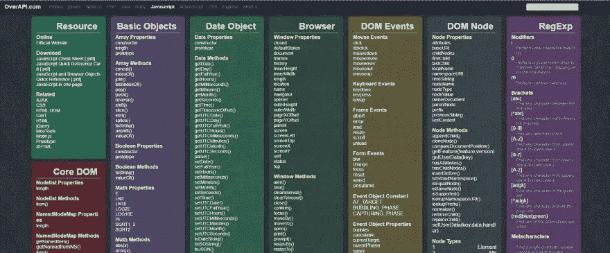

[OverAPI.com](https://overapi.com/javascript)

# 太棒了-备忘单

Awesome-Cheatsheets 也是一个流行的 web 编程语言 cheatsheet 的集合，包括 Django Cheatsheet、Node.js Cheatsheet、Laravel Cheatsheet。…前端团队有 HTML5 Cheatsheet，Vue.js Cheatsheet，React.js Cheatsheet …可以参考它的主页！

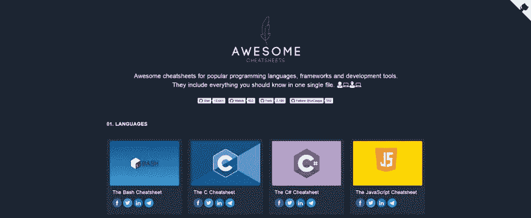

[超赞——小抄](https://lecoupa.github.io/awesome-cheatsheets/)

# 自举 4 备忘单

Bootstrap 4 Cheat Sheet 是一个集合了 Bootstrap 版本 4.3.1 中所有功能和组件的站点。你只需要选择一个类，它会自动显示该类的代码和例子。它还有一个复制功能，允许你快速地将代码复制到你的程序中。

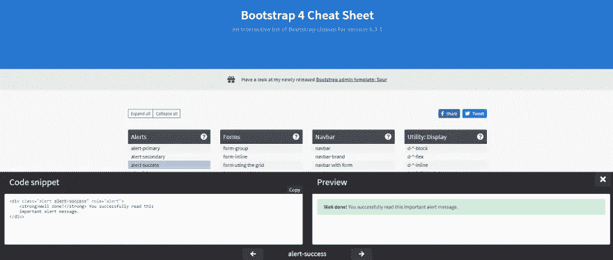

[自举 4 小抄](https://hackerthemes.com/bootstrap-cheatsheet/)

# GitSheet

GitSheet 是一个经常与 Git 一起使用的命令聚合器。对于每个语句，它描述了详细的用法。你只需要选择命令并按下复制按钮，它就会自动为你复制命令。

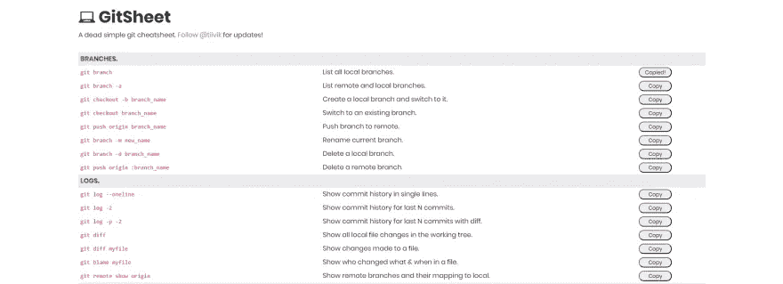

[GitSheet](https://gitsheet.wtf/)

# HTML5 元素索引

HTML5 元素索引是在 HTML5 版本中聚集新的或重新定义的对象的网页。对于每个 HTML5 对象，都有完整描述其特性的内容，并提供了与该对象相关的附加文章来帮助您更好地理解。此外，当您单击代码时，它将显示与我们选择的对象相对应的示例代码片段。网页中的 HTML5 对象将按字母顺序排列！

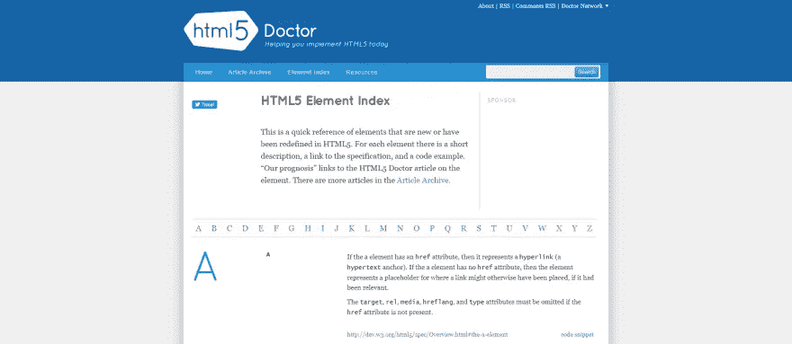

[HTML5 元素索引](http://html5doctor.com/element-index/)

# HTML 备忘单

HTML CheatSheet 是一个网站，它综合了用于 web 开发的有用示例和工具，帮助我们减少 web 开发中的时间和精力，例如选择颜色、创建链接、创建图像、创建表格…用于 HTML。它也有其他类型的网络编程工具，如 CSS，Javascript，Jquery，SEO …你可以在它的主页上看到更多！

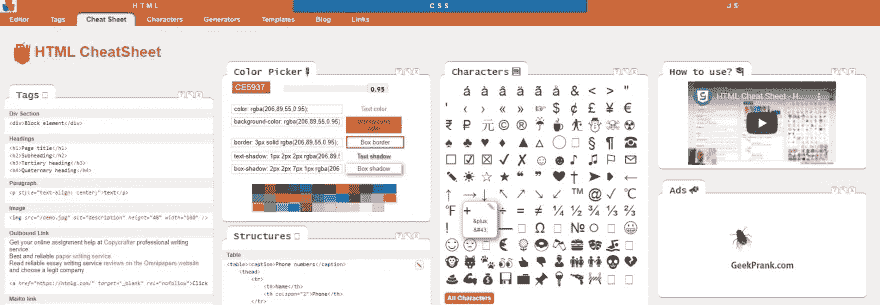

[HTML 备忘单](https://htmlcheatsheet.com/)

# 我能用吗

我可以使用的是一个网站，提供关于每个不同的浏览器版本的信息，它将帮助程序员知道哪些 web 技术可以用于这些浏览器。它还提供了 Chrome、Firefox、IE 等当前流行浏览器的完整信息。此外，支持的功能将以彩色显示，红色表示不支持，暗黄色表示部分支持，灰色表示不支持。

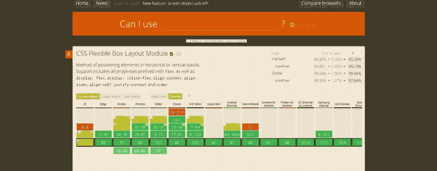

[我能用](https://caniuse.com/)吗

# Rico 的备忘单

Rico 的 cheatsheets 是一个针对 React、Vue、ES6、Vim、Kotlin 等 web 开发人员的几乎完整的汇总 cheatsheets 对于每个类别，它将被划分为许多更小的部分，以帮助您轻松找到您想要的 cheatsheet。您还可以找到代码编辑器的常用键盘快捷键，如 Visual Studio Code、Atom、Sublime Text …

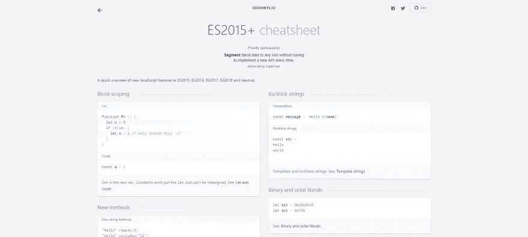

[Rico 的小抄](https://devhints.io/)

# 全息照相术

Cheatography 也是一个 web 开发的备忘单集合，分为几个子类别，如杂项、网络、DevOps、数据库、编程语言…它有 800 多个编程备忘单。并增加了搜索功能，通过多种标准过滤，帮助您找到适合您的备忘单。您还可以找到更多软件、教育、营销、游戏的备忘单…

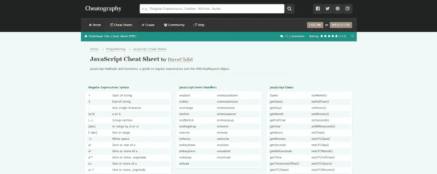

[照相术](https://cheatography.com/programming/)

# CSS3 动画备忘单

CSS3 动画备忘单是为您的 web 项目收集的 CSS3 动画。您只需要加载 animations.css 文件，并在 HTML 中为对象调用所需的效果类。提供了完整和详细的示例来帮助您更容易地选择效果。这部分你在演示页面看到的更多参考！

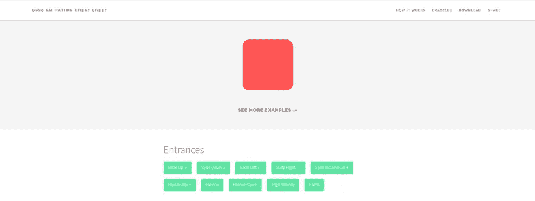

[CSS3 动画备忘单](http://www.justinaguilar.com/animations/)

# CSS 网格备忘单

CSS Grid Cheat Sheet 是一个帮助你使用 CSS3 为网页轻松创建网格系统的网站。使用支持完整功能的工具，如定义网格-模板-列、网格-模板-行、网格-列-间隙…您只需输入这些属性的信息，网页就会自动显示网格系统。它给你一个更直观的外观，并使它更容易确定这个网格系统是否适合你的网站。

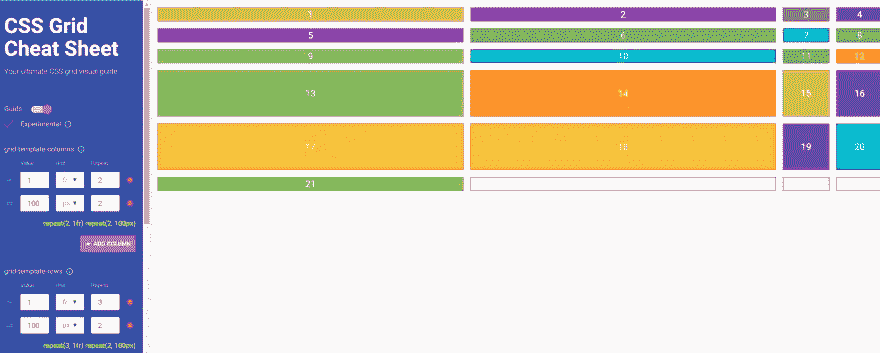

[CSS 网格备忘单](https://alialaa.github.io/css-grid-cheat-sheet/)

# 格子

Grid 是一个网页，它聚集了为网站定义 CSS3 网格系统时使用的每个属性的完整详细示例。你只需要点击这个例子，代码就会被自动复制，我们只需要把它粘贴到要使用的程序中。

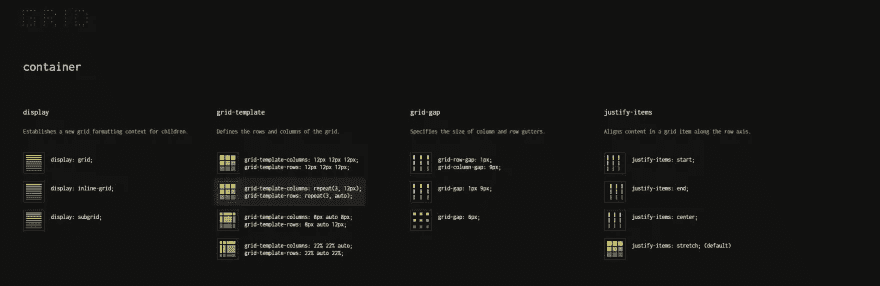

[网格](https://grid.malven.co/)

# 缓解功能

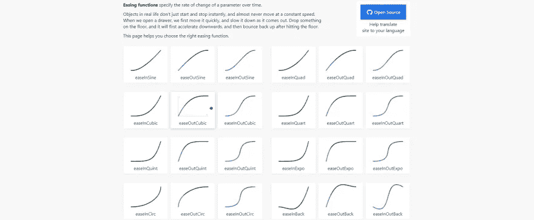

[缓和功能](https://easings.net/en#)

# 媒体查询备忘单

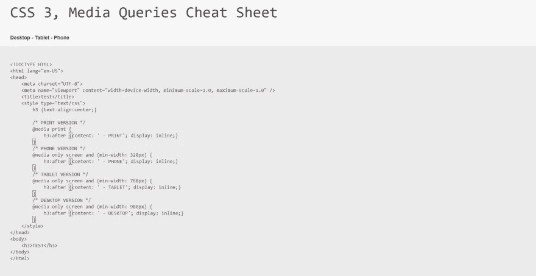

[媒体查询小抄](https://mac-blog.org.ua/css-3-media-queries-cheat-sheet/)

# 响应式网页设计备忘单

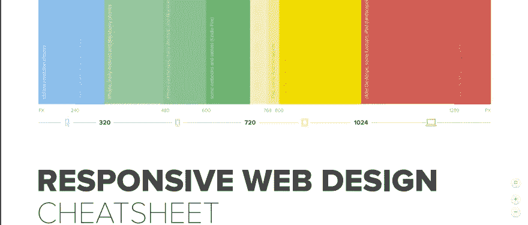

[响应式网页设计备忘单](https://uxpin.s3.amazonaws.com/responsive_web_design_cheatsheet.pdf)

# HTML5 画布备忘单

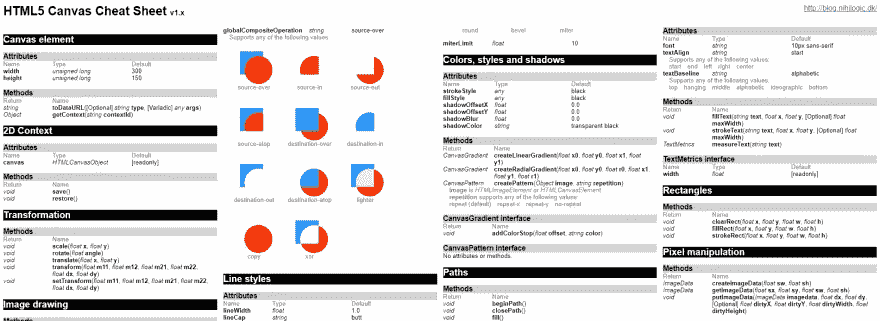

[HTML5 画布备忘单](https://simon.html5.org/dump/html5-canvas-cheat-sheet.html)

# Web 开发人员的 SEO 备忘单

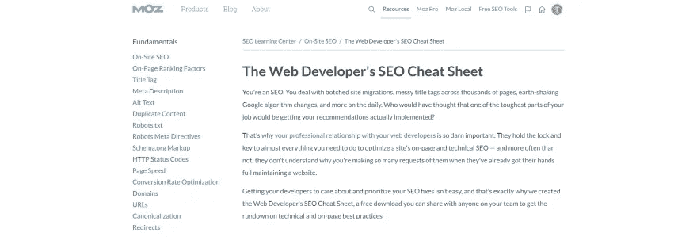

[网络开发者的 SEO 备忘单](https://moz.com/learn/seo/seo-cheat-sheet)

# 现代 JavaScript 备忘单

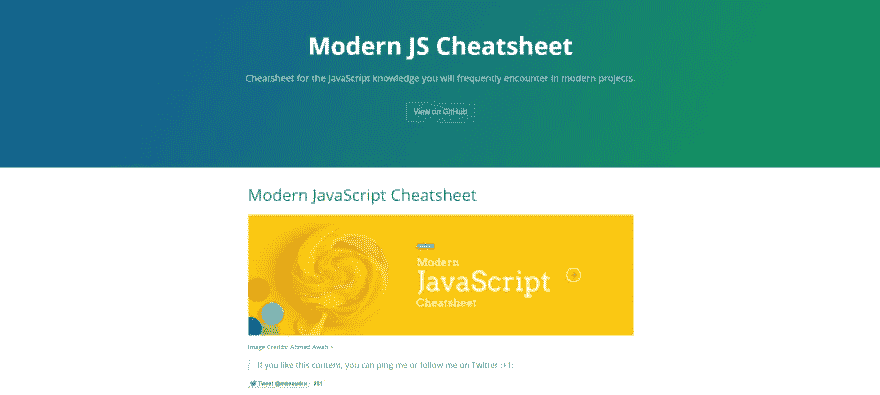

[现代 JavaScript 备忘单](https://mbeaudru.github.io/modern-js-cheatsheet/)

# HTML5 安全备忘单

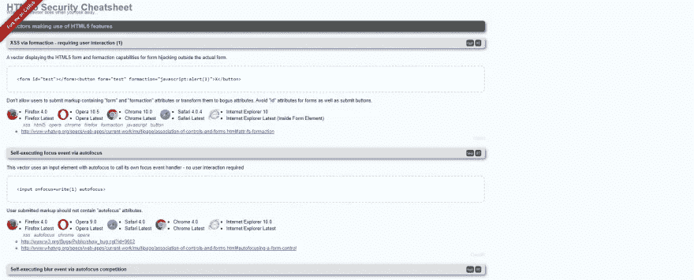

[HTML5 安全备忘单](https://html5sec.org/)

# Html 词汇

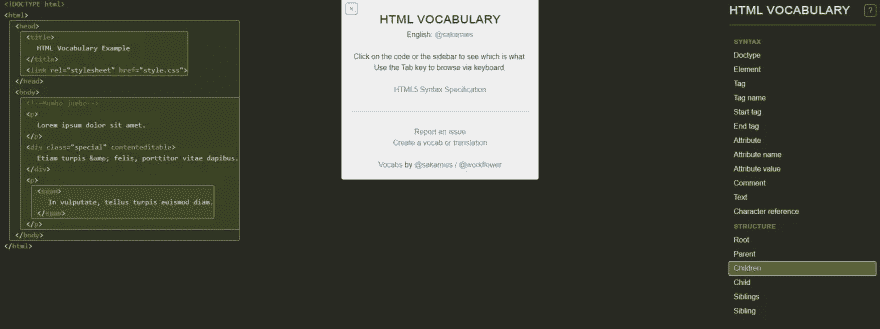

[Html 词汇](http://apps.workflower.fi/vocabs/html/en#children)

# 正则表达式备忘单

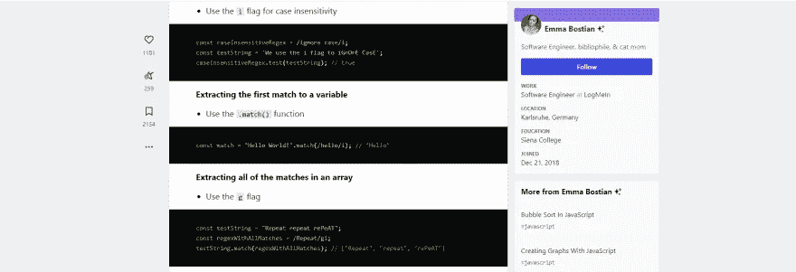

[正则表达式备忘单](https://dev.to/emmabostian/regex-cheat-sheet-2j2a)

# 开发者备忘单

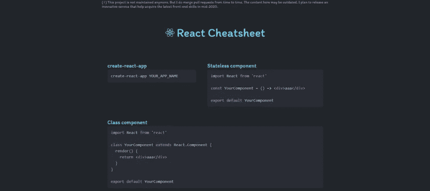

[开发者备忘单](http://www.developer-cheatsheets.com/)

# Vue 备忘单

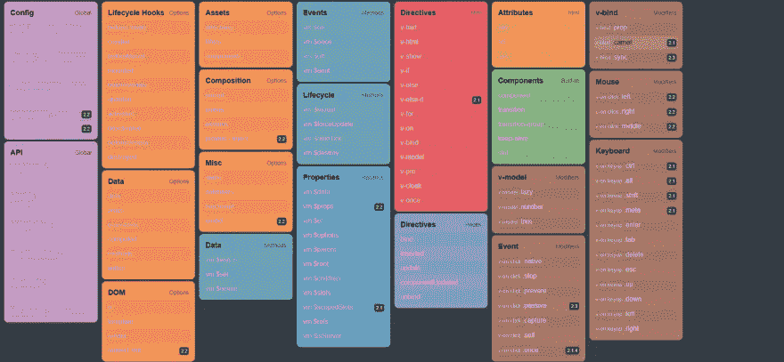

[Vue 备忘单](https://marozed.com/vue-cheatsheet/)

相关文章:

*   [面向前端开发者的开源项目](https://us.niemvuilaptrinh.com/article/63-open-source-web-development-tools)
*   [初学者学习编码的网站](https://us.niemvuilaptrinh.com/article/15-github-projects-for-web-developer)
*   [网站分享代码片段在线免费](https://us.niemvuilaptrinh.com/article/15-website-share-code-snippet-free)
*   [Udemy 上十大最佳网络开发课程](https://us.niemvuilaptrinh.com/article/top-10-best-web-development-courses-on-udemy)
*   [Web 开发的优秀文章和工具第 1 部分](https://us.niemvuilaptrinh.com/article/great-articles-and-tools-for-web-development-part-1)

# 分级编码

感谢您成为我们社区的一员！[订阅我们的 YouTube 频道](https://www.youtube.com/channel/UC3v9kBR_ab4UHXXdknz8Fbg?sub_confirmation=1)或者加入 [**Skilled.dev 编码面试课程**](https://skilled.dev/) 。

 [## 编写面试问题+获得开发工作

### 掌握编码面试的过程

技术开发](https://skilled.dev)