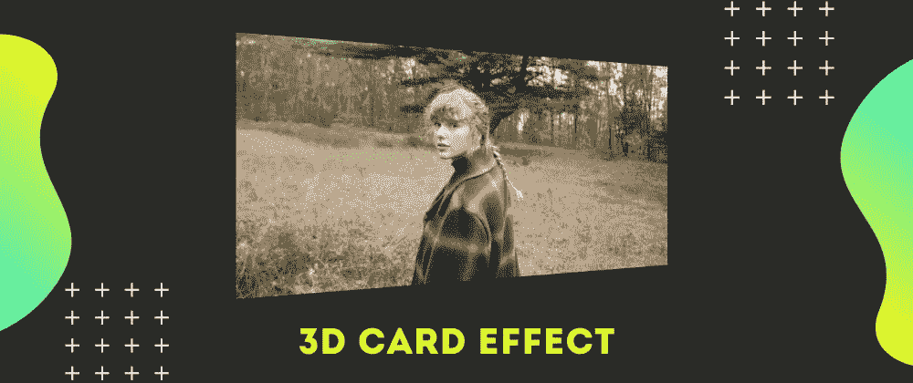
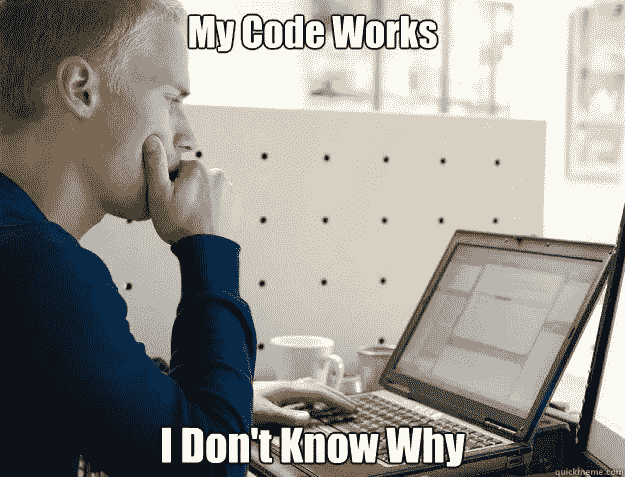

# 带有普通 HTML 和 CSS 的 3D 卡片翻转效果

> 原文：<https://levelup.gitconnected.com/3d-card-flipping-effect-with-vanilla-html-and-css-41ebaa2b2546>



Cules 编码的 3d 卡片效果

在这篇文章中，我将向你展示如何用普通的 HTML 和 CSS 创建 3D 卡片翻转效果。

# 视频教程

我已经在我的 youtube 频道上制作了一个视频。看看这个。

请喜欢并订阅 [Cules 编码](https://www.youtube.com/channel/UCBaGowNYTUsm3IDaHbLRMYw?sub_confirmation=1)。它激励我创造更多这样的内容。

# 超文本标记语言

```
<div class="flip-box">
    <div class="flip-box-inner">
        <div class="flip-box-front">
            
        </div>
        <div class="flip-box-back">
            <h1>Taylor Swift</h1>
        </div>
    </div>
</div>
```

# 解释:

*   `flip-box`是父元素。它将保持不变。
*   `flip-box-inner`是子元素。它实际上会旋转。
*   `flip-box-front`是前面的部分，会被看到。
*   `flip-box-back`是后面的部分，会被隐藏。

# 半铸钢ˌ钢性铸铁(Cast Semi-Steel)

```
* {
    padding: 0;
    margin: 0;
    box-sizing: border-box;
}

body {
    display: grid;
    place-items: center;
    min-height: 100vh;
    overflow: hidden;
    font-family: 'Segoe UI', Tahoma, Geneva, Verdana, sans-serif;
}

h1 {
    font-size: 3rem;
}

.flip-box {
    background-color: transparent;
    width: 60vw;
    perspective: 1000px;
    cursor: pointer;
}
```

# 解释:

*   使翻转框居中的一些基本样式。
*   `perspective`属性是为了 3d 效果。我不明白它是如何工作的，但它确实工作了。



点击了解更多关于透视属性[的信息。](https://www.w3schools.com/cssref/css3_pr_perspective.asp)

```
.flip-box-inner {
    position: relative;
    width: 100%;
    height: 100%;
    padding-top: 52.65%;
    text-align: center;
    transition: transform 0.8s;
    transform-style: preserve-3d;
}

.flip-box:hover .flip-box-inner {
    transform: rotateY(180deg);
}

img {
    width: 100%;
    height: 100%;
    object-fit: cover;
}
```

# 解释:

*   `flip-box-inner`是位置相对。前元素和后元素将相对于父元素进行定位。
*   `padding-top`是母元素的 52.65%。这是为了保持比例，使我们的形象保持响应。如果想更深入的了解，可以看下面的视频。

*   `transform-style`是 preserve-3d。这是为了保持 3d 效果。

```
.flip-box-front,
.flip-box-back {
    position: absolute;
    top: 0;
    left: 0;
    width: 100%;
    height: 100%;
    -webkit-backface-visibility: hidden; /* Safari */
    backface-visibility: hidden;
}

.flip-box-front {
    color: black;
}

.flip-box-back {
    background-color: #ff6f00;
    color: white;
    transform: rotateY(180deg);
    display: grid;
    align-content: center;
}

@media screen and (max-width: 600px) {
    .flip-box-inner {
        padding-top: 100%;
    }
    .flip-box {
        width: 90vw;
    }
}
```

# 解释:

*   `flip-box-front`和`flip-box-back`与父元素对齐。
*   `backface-visibility`用于在旋转时隐藏元素的背面。
*   `transform: rotateY(180deg);`用于旋转背部元件。因为我们希望前端元素在页面加载时可见
*   最后是一些媒体查询的代码。

# 无耻的插头

我用普通的 HTML、CSS 和 JavaScript 制作了一些基于项目的视频。

您将了解到:

*   Javascript 交叉点观察器添加酷效果
*   DOM 操作
*   将元素与 CSS 位置对齐。
*   如何做响应式网站？

这些都是提升你前端技能的好项目。

如果你感兴趣，你可以看看视频。

请喜欢并订阅 [Cules 编码](https://www.youtube.com/channel/UCBaGowNYTUsm3IDaHbLRMYw?sub_confirmation=1)。它激励我创造更多这样的内容。

这个博客到此为止。我试图简单地解释事情。如果你卡住了，你可以问我问题。

顺便说一下，我正在一家公司寻找一个新的机会，在那里我可以用我的技能提供巨大的价值。如果你是一名招聘人员，正在寻找精通全栈 web 开发的人，请随时联系我。此外，我愿意谈论任何自由职业者的项目。

从[这里](https://www.thatanjan.me/projects)看我的作品

# 联系人

*   邮箱:【thatanjan@gmail.com 
*   LinkedIn: [@thatanjan](https://linkedin.com/in/thatanjan/)
*   投资组合:[安健](https://thatanjan.me/)
*   Github: [@thatanjan](https://github.com/thatAnjan/)
*   推特: [@thatanjan](https://twitter.com/thatAnjan)