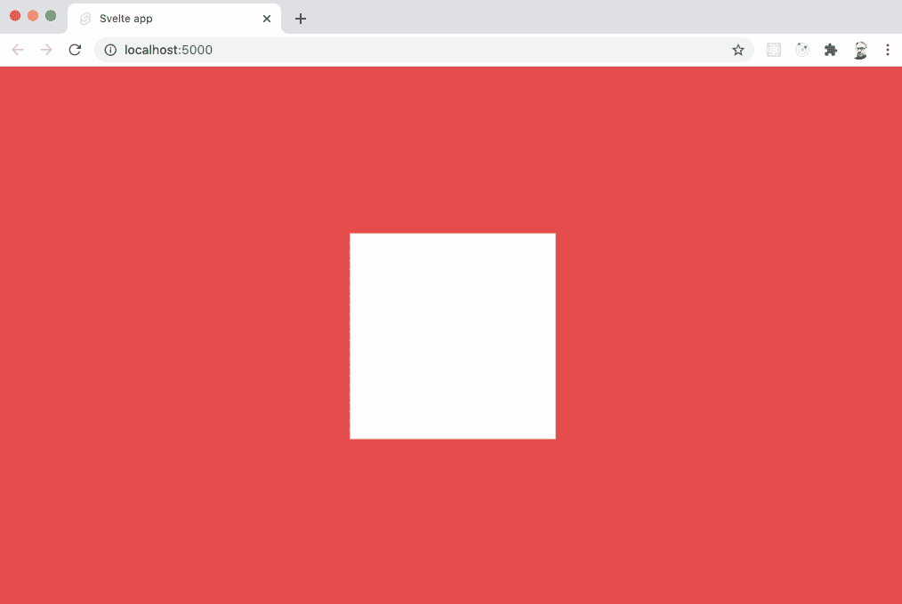

# 带 Svelte 和 Babylon.js 的 3D

> 原文：<https://levelup.gitconnected.com/3d-with-svelte-and-babylon-js-4f9387728d35>


作为我上一篇关于[3D with svelite and three . js](https://jasonsturges.medium.com/3d-with-svelte-and-three-js-f4366f342f9f)的帖子的后续，这里有一个类似的例子，将[svelite](https://svelte.dev/)与 [Babylon.js](https://www.babylonjs.com/) 引擎结合在一起。

跟随，或者[在 GitHub 上检查库](https://github.com/jasonsturges/babylonjs-svelte-boilerplate)。

# 创建解决方案

首先，通过在终端中执行以下命令，使用`npx degit`设置 Svelte 的模板来搭建项目:

```
npx degit sveltejs/template svelte-app
```

继续添加`babylonjs`包:

```
npm add babylonjs
```

Npm 会添加 Babylon.js 并自动安装包。

# App.svelte

在`App.svelte`中创建一个`canvas`元素，使用 Svelte 的[绑定](https://svelte.dev/tutorial/bind-this)链接 DOM 元素，并将其传递给`createScene()`函数。

App.svelte

需要注意的是，这需要 Svelte 的`onMount()`的[生命周期](https://svelte.dev/tutorial/onmount)方法，该方法在组件首次呈现到 DOM 后运行。

# scene.js

创建一个名为`scene.js`的新文件——我们将镜像一个与 Three.js 示例中相似的场景，但是使用他们的 [Getting Started](https://github.com/BabylonJS/Babylon.js) GitHub 使用文档的示例代码来适应巴比伦。

scene.js

在上面的代码中，巴比伦`engine`被实例化为`canvas`。一个`scene`、`camera`和`light`被设置为利用自动旋转摄像机控制器环绕场景。

在这个场景中，构建了一个`cube`网格，并应用了一个`material`来给网格一个外观。

渲染动画的每一帧都使用 Babylon engine 内置的`runRenderLoop()`函数。

为了调整浏览器窗口的大小，添加了一个`resize`事件监听器来将引擎更新为新的画布大小。

# global.css

最后，对于视觉外观，更新`global.css`以填充屏幕:

global.css

# 发射它

从终端执行`npm run dev`启动 Svelte 的 live reload with Rollup，打开 [http://localhost:5000](http://localhost:5000/) 查看结果。



使用鼠标环绕场景。