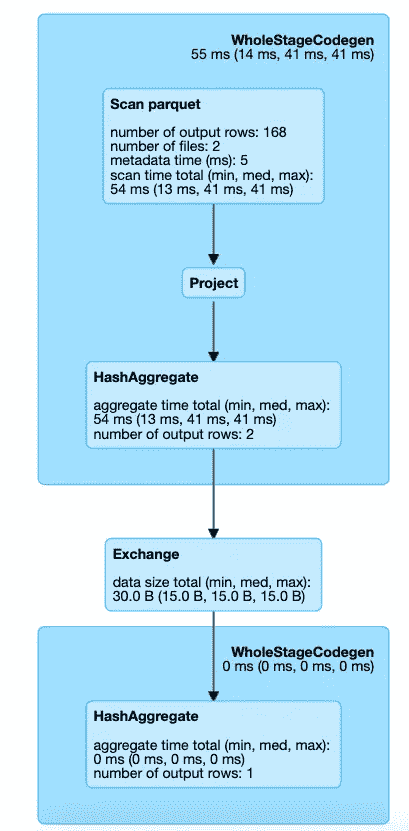

# 4 个先进的火花尖端，性能更快

> 原文：<https://levelup.gitconnected.com/4-advanced-apache-spark-tips-for-faster-performance-dd0a1cc829aa>


Marc-Olivier Jodoin 在 [Unsplash](https://unsplash.com/s/photos/fast?utm_source=unsplash&utm_medium=referral&utm_content=creditCopyText) 上拍摄的照片

Apache Spark 是最流行的数据处理分布式框架，包括批处理和流处理。它是由来自 300 多家公司的众多开发人员构建的。自 2009 年以来，已有超过 1200 名开发者为 Spark 做出了贡献。它在许多组织中用于处理大型数据集。

深入了解 Apache Spark 可以帮助您解决 Spark 中的性能问题。这里有 5 个提升 Spark 性能的技巧

# 分组集合

我在网上很少看到这方面的文档，但它对提高 Spark 的性能非常有用。让我们看看这是怎么回事。

假设您有一个包含列的数据集

```
ID, Age, Gender, Role, Salary
```

你需要创建这些集合

```
ID, Age, SUM(Salary)
Age, Gender, Role, SUM(Salary)
Role, SUM(Salary)
```

一种方法是为每个数据框创建单独的数据框，然后合并最终的数据框。在执行 union 时，您还必须填充虚拟列。

**分组设置**解决了这个问题。让我们看看如何

```
spark.sql("""
SELECT grouping_id(),ID, Age, Gender, Role, sum(Salary) as salary
FROM GrpSetDemo
GROUP BY ID, Age, Gender, Role
GROUPING SETS (
  (ID, Age), 
  (Age, Gender, Role), 
  (Role)
)
order by grouping_id()
""")
```

这是输出的样子

```
+-------------+----+----+------+----+------+
|grouping_id()|ID  |Age |Gender|Role|salary|
+-------------+----+----+------+----+------+
|3            |3   |41  |null  |null|5200  |
|3            |3   |34  |null  |null|6000  |
|3            |3   |12  |null  |null|3500  |
|3            |1   |12  |null  |null|5000  |
...
|3            |1   |22  |null  |null|3900  |
|3            |3   |32  |null  |null|4200  |
|8            |null|32  |M     |Tech|4200  |
|8            |null|12  |F     |Tech|3500  |
...
|14           |null|null|null  |Tech|47100 |
```

您可以看到它是如何为我们请求的每个组合创建一个独特的组的。 **Grouping_id** ()是一种识别每个组合的方式。如果您不知道生成了 grouping_id，也没关系。我会解释的

让我们看看表中 select 语句请求的列。

```
ID, Age, Gender, Role
```

如果该列存在于组中，我们就给它赋值 0，如果它不存在，我们就给它赋值 1，这样这些组看起来就像这样

```
ID, Age, SUM(Salary) --> 0011 (ID, Age, Gender, Role is the master)
Age, Gender, Role, SUM(Salary) --> 1000
Role, SUM(Salary) --> 1110
```

十进制表示是分组集合。

```
0011 --> 3
1000 --> 8
1110 --> 14
```

以下是使用分组集的优点。

→ **性能** : Spark 使用多种优化来运行分组集，比如从基本数据中访问数据等。

→ **干净的代码**:编写多重并集不是一种干净的编码方式。

如果你还有任何疑问，请在评论区留下你的问题。我会回答他们。

# Scala / Java 中的用户自定义函数

使用 UDF，您可以创建自己的转换来管理数据。虽然我们可以用 Scala、Java 或 Python 编写 UDF，但建议用 Scala 或 Java 编写 UDF。我来解释一下原因。

如果函数是用 Python 编写的，Spark 会在 worker 上启动一个 Python 进程，将所有数据序列化为 Python 可以理解的格式，在 Python 进程中对这些数据逐行执行函数，最后将行操作的结果返回给 JVM 和 Spark。如果这个函数是用 Scala 或 Java 编写的，那么您可以在 Java 虚拟机(JVM)中使用它

请参见下面的图示


作者图片

启动这个 Python 过程代价很高，但是真正的代价是将数据序列化为 Python。这是昂贵的，原因有二

→这是一项昂贵的计算

→数据进入 Python 后，Spark 无法管理 worker 的内存。如果资源受限，这可能会导致工作线程失败，因为 JVM 和 Python 都在同一台机器上竞争内存

我还做了一个测试来确认这个性能问题。我在 10 次迭代中运行了简单和复杂两种类型的查询，并生成了这个测试结果。


作者收集的统计数据

我们清楚地看到了 Scala UDF 和 Python UDF 之间的区别。自己尝试一下，留下你的回答。

# 分区和存储桶

**数据的分区**指的是根据一个关键字将文件存储在单独的目录中，比如数据中的日期字段。像 Hive 这样的元数据管理器支持这个概念，Spark 的许多内置数据源也是如此。当 Spark 只需要具有特定范围的键的数据时，对数据进行正确的分区可以让它跳过许多不相关的文件。让我们看一个例子

**不分区数据**

```
val rawData= spark.read.parquet("<location>/part-0000*")
rawData.filter(*col*("event_type") === 22).count()res5: Long = 168
```

让我们看看 Spark UI 是什么样子的


Spark UI —作者截图

**分割数据后**

```
val partionedData = rawData.write.partitionBy("event_type").parquet("<locationOP>")

val PartitionData = spark.read.parquet("<locationOP>")
PartitionData.filter(*col*("event_type") === 22).count()res5: Long = 168
```



Spark UI —作者截图

两种情况下的输出是相同的。然而，在第二个例子中，Spark 读取的数据较少(读取了 168 行，而第一个例子中读取了 452K)，因此性能要快得多。

我们可以用*得到类似的结果。桶比*

**分桶**是一种文件组织方法，通过这种方法，您可以控制专门写入每个文件的数据。这有助于避免以后读取数据时的混乱，因为具有相同存储桶 id 的数据将全部被分组到一个物理分区中。

在下面的示例中，我们为 event_type 列创建了 6 个存储桶。性能结果与上面类似。仅提取相关数据。

```
val bucketData = rawData.write.bucketBy('6',"event_type").saveAsTable("bucketFiles")
spark.sql("select count(1) from bucketFiles where event_type == 22").show(10,false)
```

但是，只有 Spark 管理的表才支持分桶。

下面是关于使用 Spark UI 的更多信息

[](https://medium.com/swlh/spark-ui-to-debug-queries-3ba43279efee) [## 如何仅使用 Spark UI 调试查询

### 您已经有了调试查询所需的东西

medium.com](https://medium.com/swlh/spark-ui-to-debug-queries-3ba43279efee) 

# 静态数据— Apache 拼花地板

通常情况下，当您写入和保存数据时，它会被多次读取，以便进行各种分析。确保您存储的数据能够有效读取，这对于成功的大数据项目是绝对必要的。

这包括选择您的存储系统、选择您的数据格式，以及利用某些存储格式中的数据分区等功能。

**Apache parquet** 是数据的最佳存储格式之一。Parquet 是 Hadoop 生态系统中的一种开源文件格式。它是一种扁平的列存储格式，在存储和查询方面都具有很高的性能。

这些是拼花地板中的并行单元

*   MapReduce —文件/行组
*   IO —列块
*   编码/压缩—第页

所有这些都有助于优化对 parquet 文件的查询。拼花文件有一个页脚，用于保存文件中的数据信息。这有助于减少查询时读取的数据。如果一个目录中有 100 个文件，每个文件的页脚包含每个文件包含的内容的信息。这有助于过滤所需的数据。

可以使用**拼花工具**访问页脚信息

```
**parquet-tools** **meta** hdfs://host:port/<location>/file1
creator:              parquet-mr version 1.10.0 (build abc)row group 1:          RC:12527 TS:179580--------------------------------------------------------------------
country: BINARY SNAPPY DO:0 FPO:4 SZ:5240/5373/1.03 VC:12527 ENC:PLAIN_DICTIONARY,BIT_PACKED,RLE ST:[min: Afghanistan, max: Zimbabwe, num_nulls: 1307]
```

我在另一篇文章中详细介绍了拼花文件的内部原理。

[](https://medium.com/swlh/insights-into-parquet-storage-ac7e46b94ffe) [## 对拼花储物的洞察

### 从事大数据工作的大多数人都会听说过 parquet，以及它是如何针对存储等进行优化的。在这里我将…

medium.com](https://medium.com/swlh/insights-into-parquet-storage-ac7e46b94ffe) 

我在我的个人工作中使用了以上所有方法来提高绩效。成为 Spark 和数据工程的冠军。

如果您对索引的基础知识以及 Druid 如何使用它感兴趣，请查看我最近的文章

[](/insights-into-indexing-using-bitmap-index-c28a3db1ad97) [## 使用位图索引进行索引的见解

### 以及 Apache Druid 如何使用它进行超快速分析

levelup.gitconnected.com](/insights-into-indexing-using-bitmap-index-c28a3db1ad97)