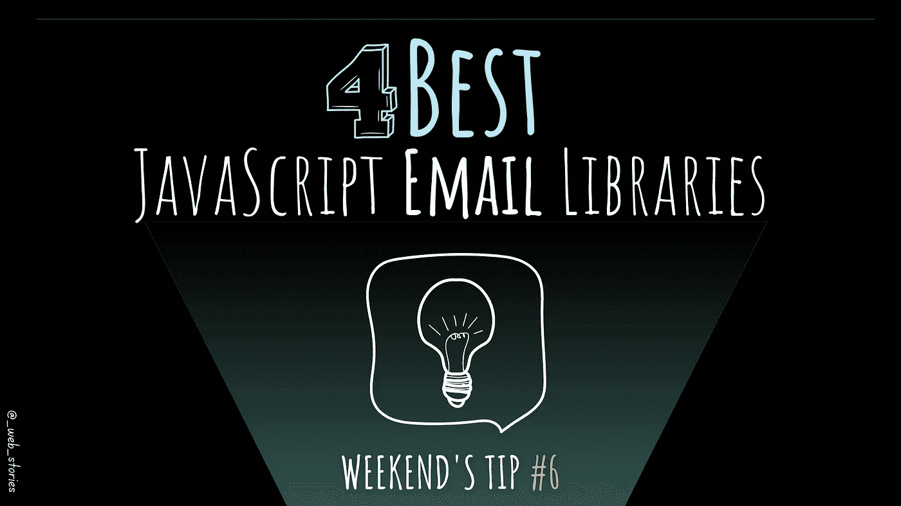

# 4 个最佳 JavaScript 电子邮件库

> 原文：<https://levelup.gitconnected.com/4-best-javascript-email-libraries-308fd1f5eeb6>

## 用于在 JS 应用程序中发送电子邮件的资源

作者:FAM

## 你好👋

该是周末小费的时候了！电子邮件是我们日常任务和习惯的一部分。这篇文章是关于你可以用来在你的应用中发送电子邮件的最好的库。保存这篇文章。谁知道呢，有一天你可能需要通过你的应用程序发送电子邮件😉

开始吧！

# 节点邮件程序

> Nodemailer 是 Node.js 应用程序的一个模块，可以轻松发送电子邮件。该项目始于 2010 年，当时没有发送电子邮件的合理选项，今天它是大多数 Node.js 用户默认采用的解决方案。—官方网站

 [## 节点邮件程序

### Nodemailer 是 Node.js 应用程序的一个模块，可以轻松发送电子邮件。该项目始于…

nodemailer.com](https://nodemailer.com/about/) 

## 了解更多信息:

 [## 带有 Gmail 的 Nodemailer 无法工作？

### 了解其工作原理第一部分:如何在 Gmail 中使用 Nodemailer？…

levelup.gitconnected.com](/nodemailer-with-gmail-not-working-4ed254258ac)  [## 如何用 Nodemailer 和 OAuth2 发送 Gmail 邮件？

### 使用 Node.js、OAuth2 和 nodemailer 的编码部分

javascript.plainenglish.io](https://javascript.plainenglish.io/sending-emails-with-nodemailer-with-gmail-and-oauth2-e0b609587b7a) 

# 电子邮件

> 要很好地理解 EmailJS，一个快速而简单的方法是遵循我们的“联系表单”教程，它涵盖了 EmailJS 的所有基础知识。本教程将指导您构建一个联系人表单，将表单内容发送到您的电子邮件中。—官方网站

## 3 个主要步骤:

*   连接您的电子邮件服务
*   创建电子邮件模板
*   从 JavaScript 发送电子邮件

 [## 从 Javascript 发送电子邮件-不需要服务器代码| EmailJS

### 直接从您的客户端 Javascript 代码发送电子邮件——不需要服务器端代码。添加静态或动态…

www.emailjs.com](https://www.emailjs.com/) 

# 邮戳

> 邮戳有助于传递和跟踪申请电子邮件。简而言之，该服务用一个更加可靠、可扩展和无忧的环境取代了 SMTP(或 Sendmail)。此外，您还可以跟踪统计数据，如发送或处理的电子邮件数量、打开次数、退回次数和垃圾邮件投诉次数。—官方网站

 [## 邮戳:快速、可靠的电子邮件递送服务| SMTP | API

### Sendgrid = FrustrationPostmark =💌- Mike Verbruggen 撕掉了 Sendgrid 并转移了 Growform 的事务性电子邮件…

postmarkapp.com](https://postmarkapp.com/) 

# 邮件订阅-客户端

> 在代码和测试中发送和接收来自无限自定义电子邮件地址的电子邮件。MailSlurp 是面向开发人员、QA 测试人员和电子邮件营销团队的领先电子邮件 API。—官方网站

 [## 电子邮件示例

### 将 MailSlurp 集成到您的应用程序或测试中。尝试一个示例项目来了解如何操作。如何创建 SDK 库…

www.mailslurp.com](https://www.mailslurp.com/examples/) 

今天就到这里，看阿雅🙋

如果您有任何问题或反馈，请点击评论或通过 LinkedIn 联系我— **我洗耳恭听！**

[**想请我喝杯咖啡吗？☕️**](https://www.buymeacoffee.com/fatimaamzil)

> 让我们为 2022 年打造一个更好的‘我们’！

> 如果你喜欢我的文章， [**订阅**](https://famzil.medium.com/subscribe) 获取我的最新。如果你自己喜欢体验媒介，可以考虑通过[**注册会员**](https://famzil.medium.com/membership) 来支持我和其他成千上万的作家。它只需要每月 5 美元，它支持我们，作家，你也有机会用你的作品赚钱。当然，你可以随时取消会员资格。通过注册[这个链接](https://famzil.medium.com/membership)，你将直接用你的一部分费用来支持我，不会花你更多的钱。如果你这样做了，万分感谢！

让我们**联系上** [**中**](https://medium.com/@famzil/)**[**Linkedin**](https://www.linkedin.com/in/fatima-amzil-9031ba95/)**[**脸书**](https://www.facebook.com/The-Front-End-World)**[**insta gram**](https://www.instagram.com/the_frontend_world/)**[**YouTube**](https://www.youtube.com/channel/UCaxr-f9r6P1u7Y7SKFHi12g)**或**********

**** [## 通过我的推荐链接——FAM 加入 Medium

### 作为一个媒体会员，你的会员费的一部分会给你阅读的作家，你可以完全接触到每一个故事…

famzil.medium.com](https://famzil.medium.com/membership)****