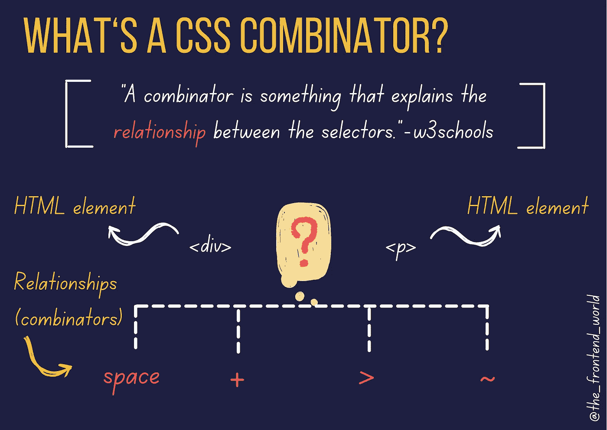
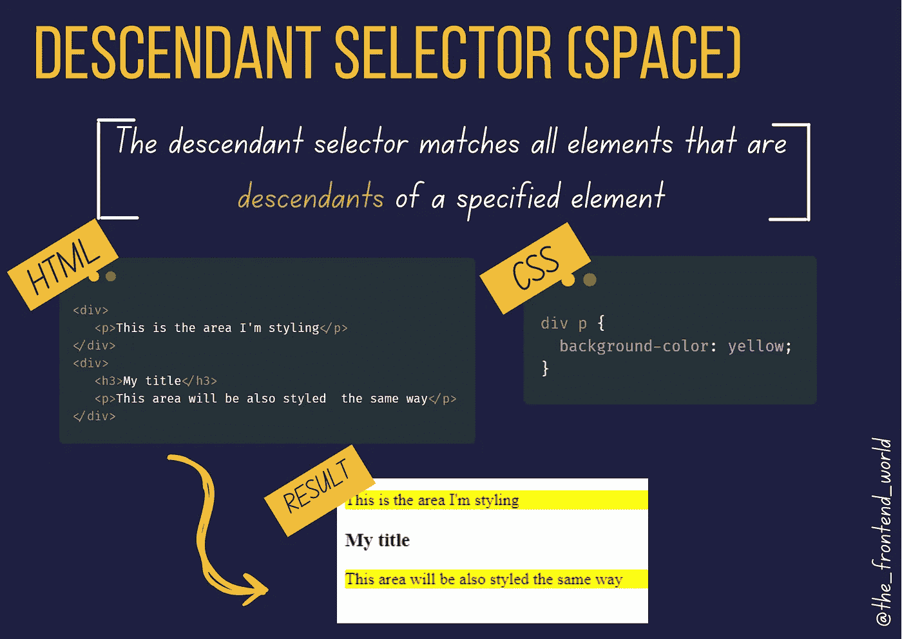
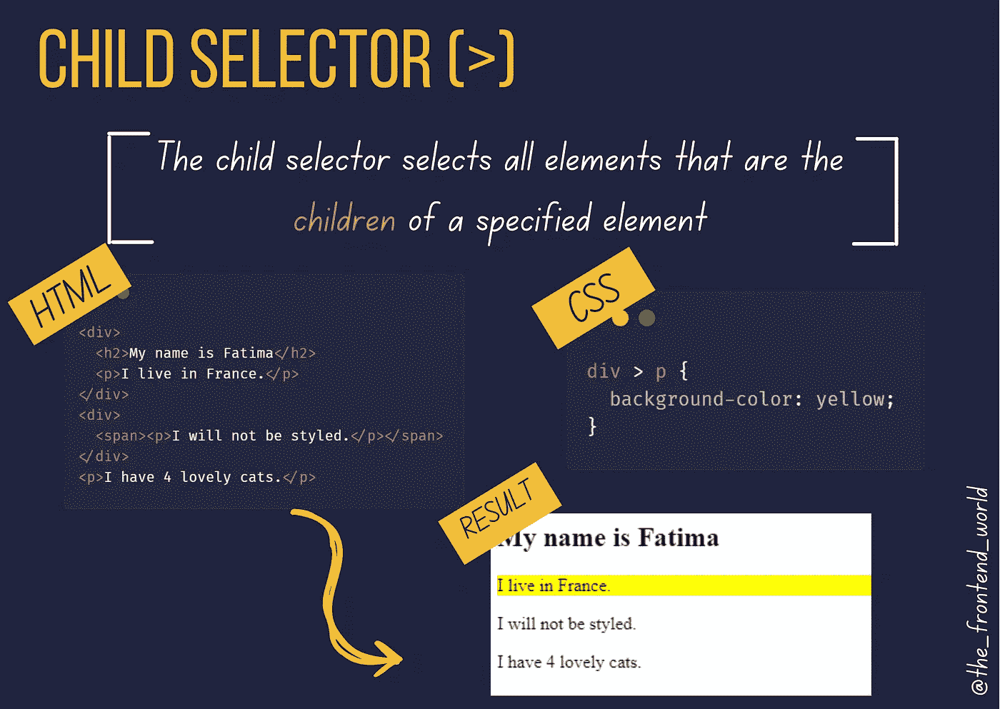
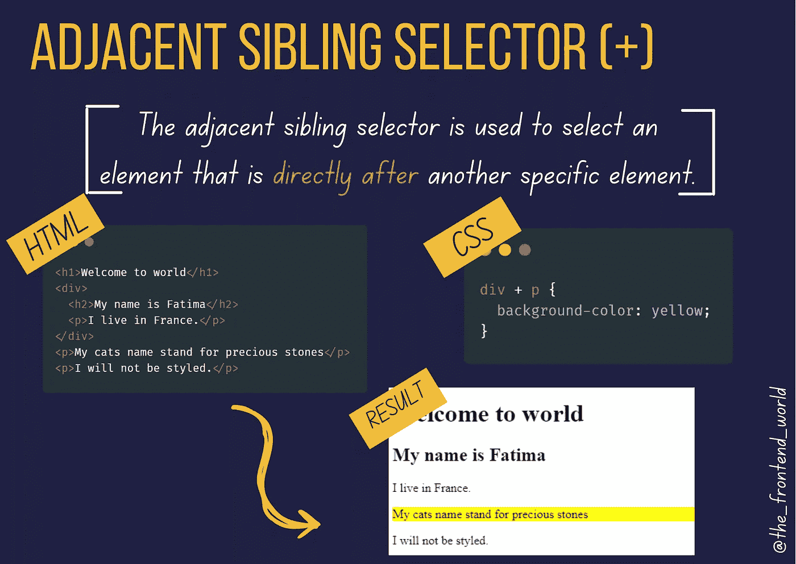
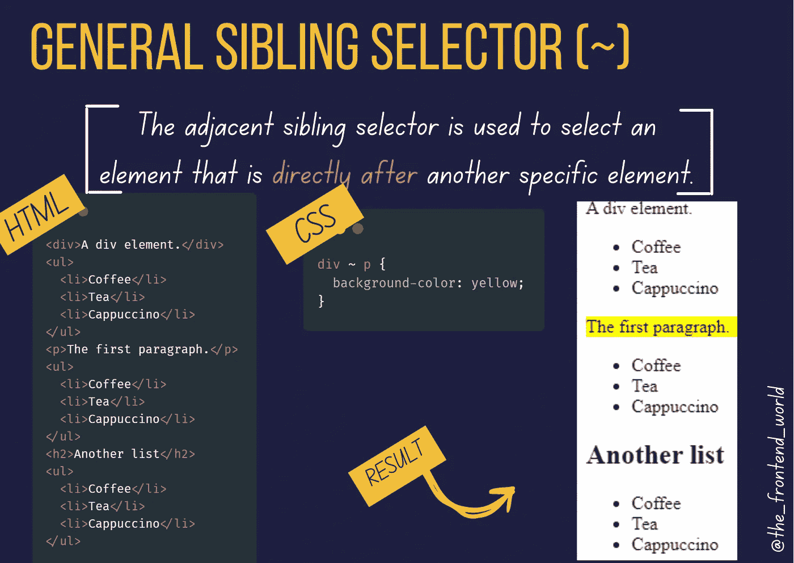
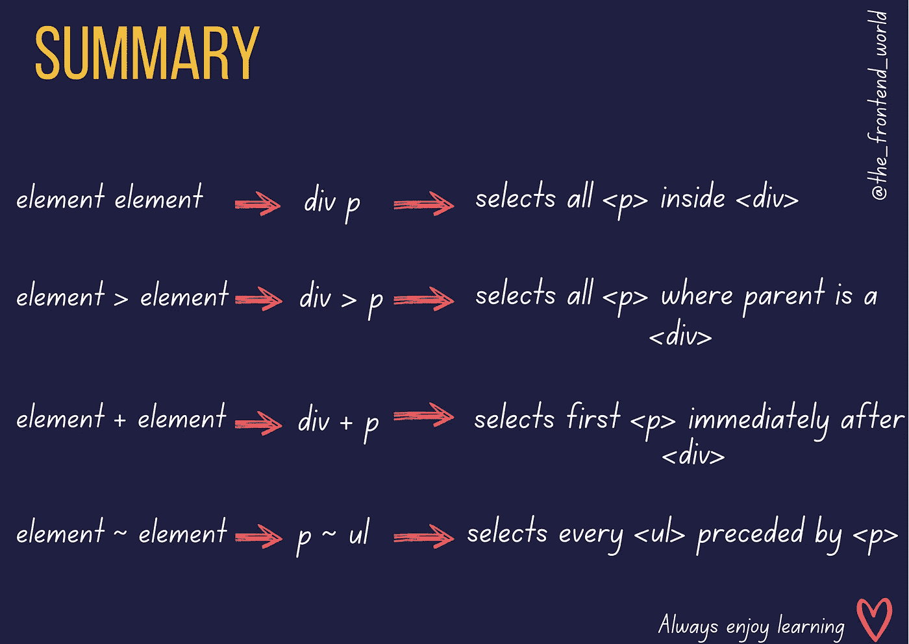

# 如果你是一个网站开发者，你应该知道的 4 个 CSS 组合器

> 原文：<https://levelup.gitconnected.com/4-css-combinators-you-should-know-if-you-are-a-web-dev-3ca64331bbe5>

## CSS 组合子终极指南

作者:FAM

如果你是一个网页开发者，你会知道 CSS 是多么令人沮丧。学习 CSS 中的关键内容会让你的体验更好，效率更高！

在 CSS 中需要学习的一个重要内容是组合子。总之，它是选择器之间的 ***关系*** 。

我们走吧！

# 什么是 CSS 组合子

> "组合子解释了选择器之间的关系."— w3schools

CSS 中的选择器用于选择 HTML 元素，以便我们可以对它们进行样式化。选择器的示例可在此处找到:

 [## CSS 选择器参考

### 组织良好，易于理解的网站建设教程，有很多如何使用 HTML，CSS，JavaScript 的例子…

www.w3schools.com](https://www.w3schools.com/cssref/css_selectors.asp) 

一个 CSS 选择器可以包含多个简单的选择器。在简单的选择器之间，我们可以添加一个关系，这叫做组合子。

**CSS 中有四种不同的组合子:**

*   *后代选择器(* ***空格*** *)*
*   *相邻同胞选择器(****+****)*
*   *子选择器(****>****)*
*   *通用同级选择器(****~****)*

CSS 组合子

让我们进一步了解他们:

# 后代选择器( ***空格*** )

后代选择器匹配作为指定元素后代的所有元素。比如:

以下 CSS 示例选择了`***
***`元素中的所有`***
***`元素:

想自己测试一下吗？

 [## 后代 CSS 组合子

### 添加外部样式表/笔此处添加的任何 URL 都将按顺序添加到编辑器中的 CSS 之前。如果…

codepen.io](https://codepen.io/famzil/pen/GRmeJEj) 

# 子选择器(>)

子选择器选择作为指定元素的子元素的所有元素。比如:

以下示例选择作为`***
***`元素子元素的所有`***
***`元素:

想自己测试一下吗？

# 相邻兄弟选择器(+)

相邻同级选择器用于选择直接位于另一个特定元素之后的元素。

兄弟元素必须有相同的父元素，“相邻”意味着“紧随其后”

以下示例选择紧接在`***
***`元素之后的第一个`***
***`元素:

**想自己测试一下吗？**

# 通用同级选择器(~)

常规同级选择器选择指定元素的下一个同级元素。

以下示例选择作为`***
***`元素的下一个同级的所有`***
***`元素:

想自己测试一下吗？

# 外卖

主要有 4 种不同的关系可以链接两个 HTML 选择:*`**>**``**+**`和`**~**`。*

**

*CSS 组合子*

*视频版本:*

*[https://youtu.be/n-IqnIwG70I](https://youtu.be/n-IqnIwG70I)*

**

## *感谢您宝贵的时间，希望这对您有用！*

*亲爱的读者，我希望这是明确和有用的。我希望你无论在哪里都是安全的，你的家人也是！坚持住。明天会更好！*

***让我们联系一下**[**LinkedIn**](https://www.linkedin.com/in/fatima-amzil-9031ba95/)**[**脸书**](https://www.facebook.com/The-Front-End-World)**[**insta gram**](https://www.instagram.com/the_frontend_world/)**[**Youtube**](https://www.youtube.com/channel/UCaxr-f9r6P1u7Y7SKFHi12g)**或**[**Twitter**](https://twitter.com/FatimaAMZIL9)**。*********

*****[www.fam-front.com](http://www.fam-front.com/)*****