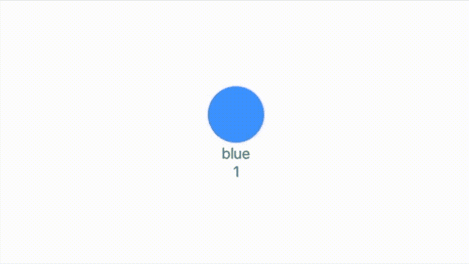

# 使用 SwiftUI 展示了 4 个自定义闭包、语法和语义

> 原文：<https://levelup.gitconnected.com/4-custom-closures-syntax-and-semantics-illustrated-using-swiftui-c48db97e4210>

## 在 Swift 中处理延迟

如果您曾经尝试过编写访问 web 或云的代码，您会对闭包很熟悉。熟悉，因为它们是苹果框架最喜欢的特性。一个超级有用的代码组件，你可以在自己的应用程序中使用；尽管语法有时有点晦涩难懂。

考虑到这一点，我认为回顾一些简单的例子可能是好的。首先是最基本的。

## 一个简单的自定义关闭。

案情摘要。要求是下载 X，一直等到作业完成才呈现 X. Simple。这里的目标是展示如何在代码中使用闭包来管理事件的顺序。


上面这个动画背后的代码。

查看代码时，您应该注意的几点是 download 方法下的代码在完成之前不会执行。在下载方法中，我执行了两次延迟来模拟某种网络延迟。

## 带有参数的自定义闭包

接下来，我为下一个版本做了两个小改动。这个函数在调用“theDownload”时传递一个参数，如果您愿意，可以命名为 X。

```
.onAppear(perform: {
  theDownload("orange") {
    self.color = .orange
    self.text = "orange"
    self.timer.upstream.connect().cancel()
  }
})
```

新的下载方法。

## 带有参数+参数的自定义闭包

代码的第三个版本不仅命名了要下载的 X，而且下载方法返回了完成这项工作所花费的时间——当然，所有这些都是通过一个自定义闭包来来回回传递的。

```
.onAppear(perform: {
  theDownload("orange") { timeReturned in
  self.color = .orange
  self.text = "orange downloaded in \(timeReturned) seconds"
  self.timer.upstream.connect().cancel()
  }
})
```

新的下载方法。注意，我在这里添加了一个随机下载时间，以使它表现得更真实。

## 带有参数+带有返回值的参数的自定义闭包

最后也是最复杂的。这做了版本 1 到 3 做的所有事情，增加了一个从返回的下载方法返回的参数。在这种情况下，返回将最终消息更改为“下载完成”。



最终版本的新代码如下所示。

```
.onAppear(perform: {
  theDownload("orange") {timeReturned -> String in
  self.color = .orange
  self.text = "orange downloaded in \(timeReturned) seconds" 
  self.timer.upstream.connect().cancel()
  return "finished downloading"
  }
})
```

这段代码展示了新的 theDownload 方法。

这就把我带到了这篇短文的结尾。我希望你发现它是未来有用的参考。在 medium.com 上跟随我，以确保你得到关于编码的未来帖子的副本。

保持冷静，继续编码。