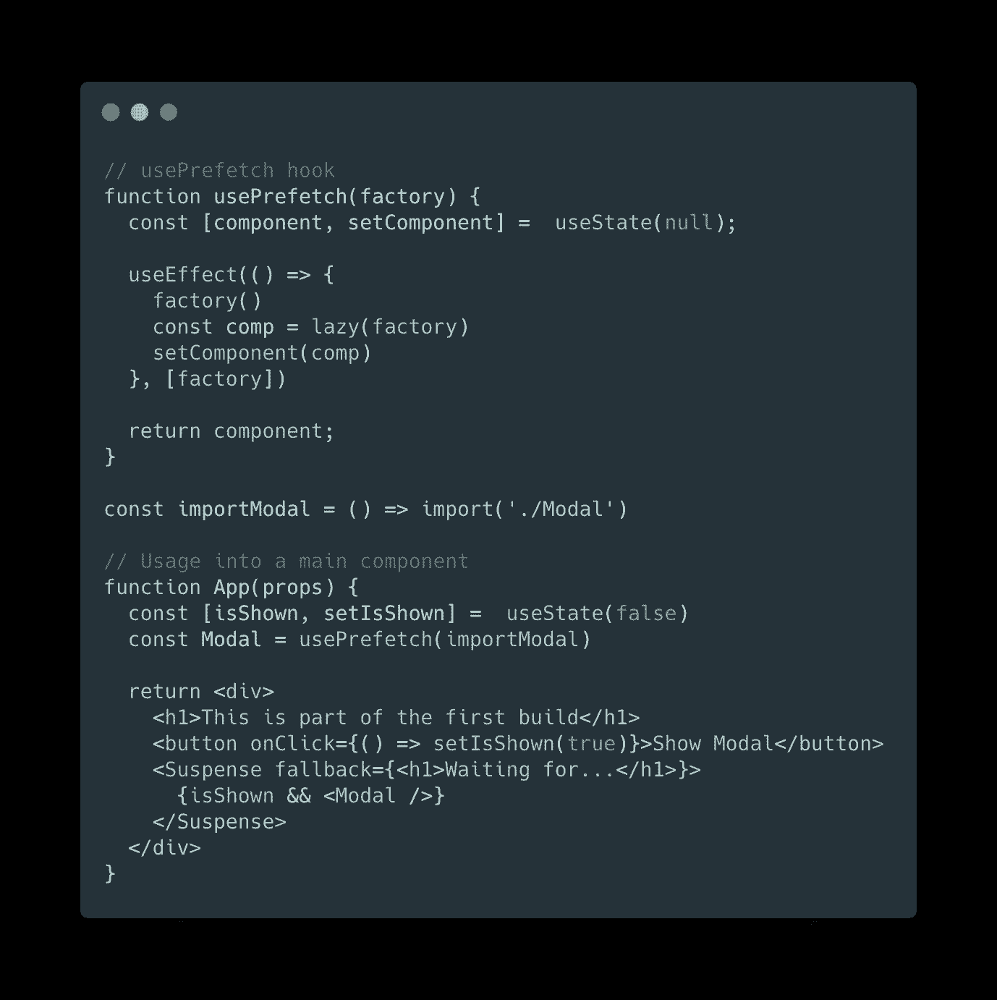
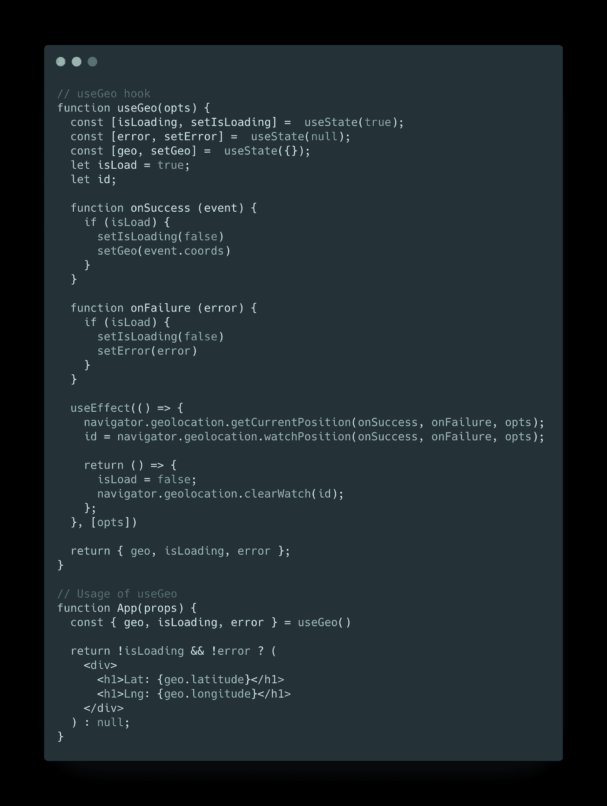
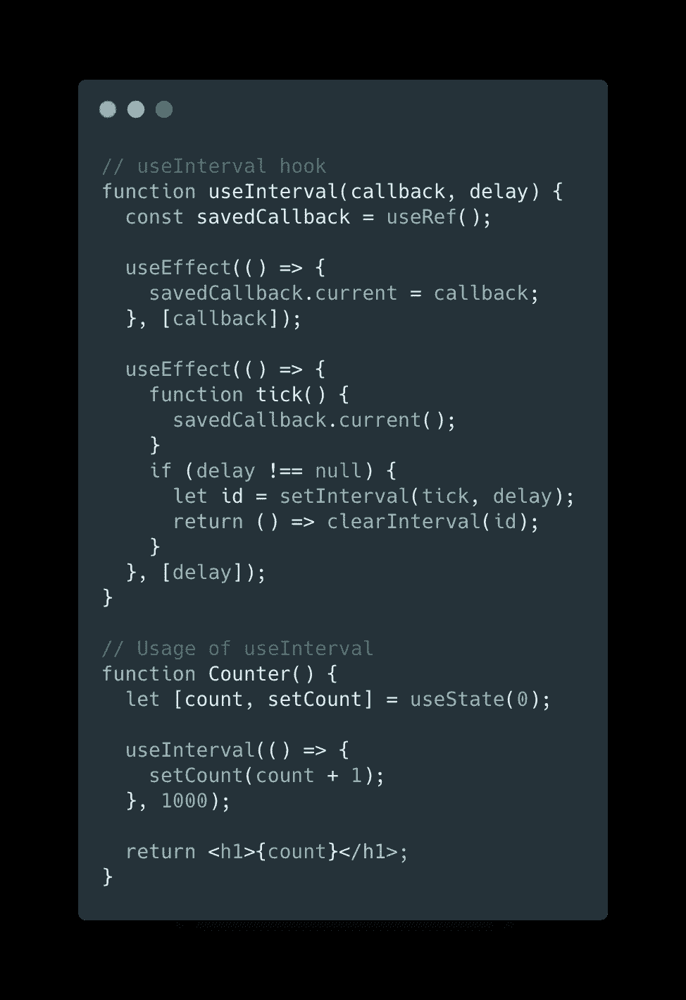
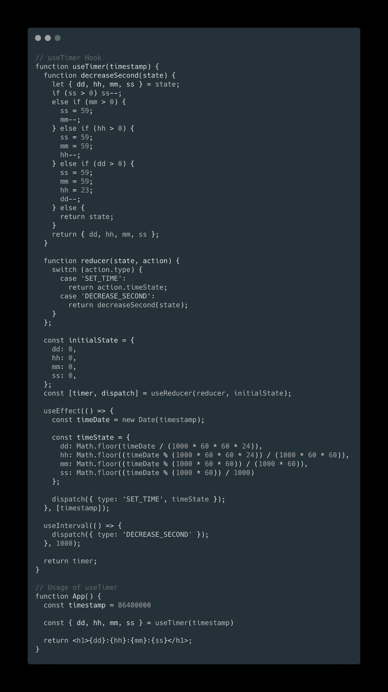

# 4 个定制挂钩来提升您的 React 应用程序

> 原文：<https://levelup.gitconnected.com/4-custom-hooks-to-boost-your-react-app-d54aefe34061>

## 使用定制的 react 钩子使你的代码更整洁，更可重用。

由[塔蒂亚娜·罗德里格兹](https://unsplash.com/@tata186?utm_source=medium&utm_medium=referral)在 [Unsplash](https://unsplash.com?utm_source=medium&utm_medium=referral) 拍摄的照片

在第一个稳定版本发布 9 个月后，React 挂钩改变了前端开发人员编写 React 组件的方式。这是库发展过程中的正常步骤，新特性的引入决定了哪些库和框架在前端开发的持续竞争中胜出。React 已经是一个备受推崇的前端库，但是随着 React Hooks 的引入，它向前迈进了一大步。

# 为什么要反应钩子？

它们帮助开发人员控制我们的功能组件的副作用，而不需要使用类方法和生命周期方法，如`componentDidMount`、`componentDidUpdate`等。此外，它们允许开发人员跨组件共享逻辑，减少代码重复和人为错误。

React 具有内置的钩子，可以提供围绕组件控制过程的功能，但最令人惊叹的功能是将它们组合起来创建自定义钩子的能力，以及钩子与浏览器的 API 进行交互的能力。

有许多库提供了定制的钩子，其中一些可以更好地处理我们在这里创建的功能。然而，看到您每天都在使用的函数背后发生的事情总是好的！让我们来编写我们的定制钩子吧！

# 使用预取

`usePrefetch` 钩子可以通过在第一个视图上懒加载其他不需要渲染的次要组件，帮助你提高 app 主页面的加载时间。目标是减少包的大小，使您的应用程序响应更快。

对于我们的示例，假设我们有一个包含一些信息的页面和一个打开模态的按钮。在我们按下按钮之前，模态不应该呈现，我们还不需要它。但是如果我们在主组件的开头导入它，我们将需要更多的时间来下载它的 JavaScript 代码，因为它将包含在原始的包中。我们想做的是延迟加载模态组件，将它的代码从主组件中分离出来，并在主组件第一次呈现时预取它。

**问:为什么我们要定义一个** `**importModal**` **函数？因为如果我们以内联方式编写导入，它将在每次调用新函数时发生，并且它将在每次渲染时运行钩子内的`useEffect`。**

# 使用地理

每当用户移动时，这个钩子获取当前位置和更新的值:

**Q.A .为什么我们要定义一个** `**isLoad**` **变量？**由于获取位置是一个异步操作，你的组件有可能被重新渲染。因此，我们在它有效地检索位置之前运行清理函数。有了这个解决方法，如果组件被卸载得太快，我们可以防止运行`onSuccess`或`onFailure` 处理程序。

# 使用间隔

`useInterval`效果可能是最著名的自定义 React 钩子，但这里我将展示由 [Dan Abramov](https://medium.com/u/a3a8af6addc1?source=post_page-----d54aefe34061--------------------------------) 实现的效果，因为我们将在下一个钩子中使用它:

# 使用计时器

有时，开发人员需要实现一种有效的方式来获得倒计时定时器，所以让我们从一个时间戳开始创建一个倒计时定时器，该时间戳代表我们希望倒计时的时间量，以毫秒为单位:

关于这个话题的评论、分享和讨论总是很受欢迎，我很乐意回答你的任何问题！

> **随时联系我**[**Linkedin**](https://www.linkedin.com/in/marcoantonioghiani/)

 [## 重构复杂的 React 组件——编写高效可读组件的 5 个最佳实践

### 使用最佳实践编写高效可读的 React 组件的 5 条规则

levelup.gitconnected.com](/refactoring-a-complex-react-component-5-best-practices-to-write-efficient-and-readable-components-b0d06f4f22b4)  [## 如何在 React 中使用组件组合创建灵活的复合组件

### 按照组合模式创建坚固而灵活的 react 组件。

levelup.gitconnected.com](/how-to-use-component-composition-to-create-a-flexible-compound-component-in-react-4024660b9613)  [## 我是如何通过改变习惯快速学习的。

### 9 个有效的习惯可以让你学得更快，提高工作效率。

medium.com](https://medium.com/swlh/how-i-became-a-fast-learner-changing-my-habits-5e8f125ce42f)