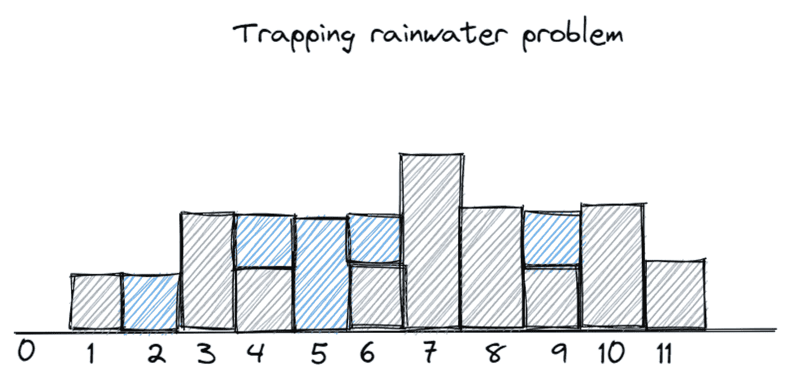
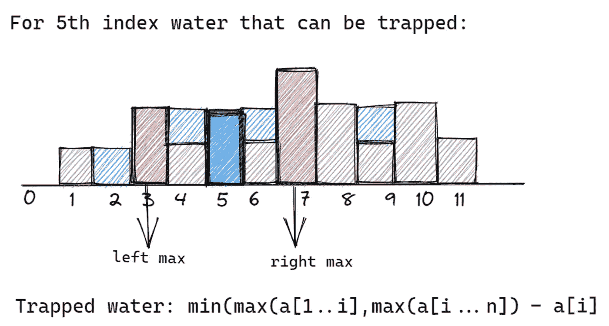
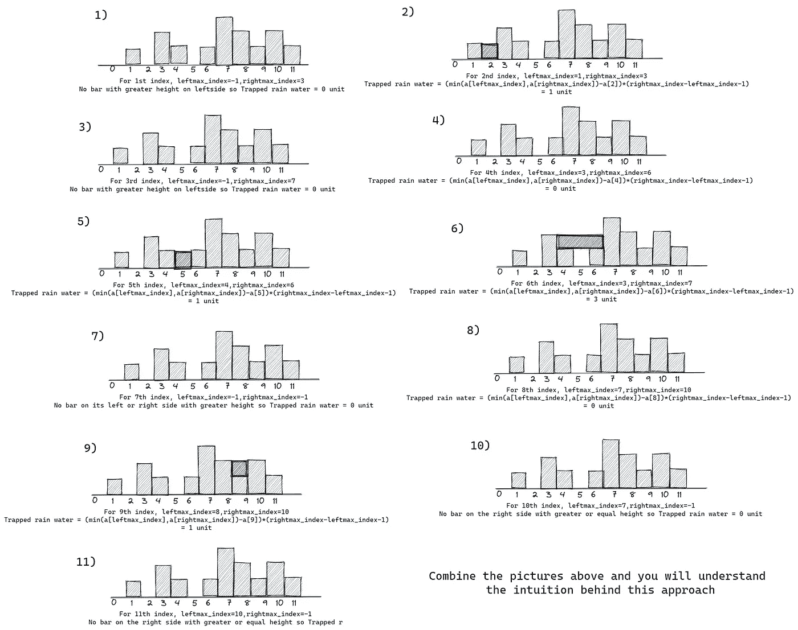

# 解决截留雨水问题的 4 种不同方法

> 原文：<https://levelup.gitconnected.com/4-different-ways-to-solve-trapping-rain-water-problem-c69c09e4f96b>

给定 n 个非负整数表示一个高程图，其中每个条形的宽度为 1，计算下雨后它可以收集多少水。

我们将查看 4 种不同的方法来解决上述问题，为此，我们将遵循给定的输入测试用例

输入:a = [1，0，2，1，0，1，3，2，1，2，1]

看看下面的图片，了解有多少水将被困在酒吧之间。

了解水是如何在每个索引处被截留的|作者图片

## 我们先来了解一下问题背后的直觉。

*   仔细观察上面的图片，你会注意到，为了让水在第 I 个栅栏处被捕获，它的左侧和右侧都应该有一个更高的栅栏。
*   为了找到在第 I 个索引处被捕获的水量，我们需要找到其左侧的最大元素 max(a[1]，…a[i])，以及其右侧的最大元素 max(a[i]…a[n])。
*   现在，如果在第 I 个指数处的棒的高度是 a[i],那么在第 I 个指数处收集的水将是

> **min(leftmax，rightmax) — a[i]**
> 
> **min(max(a[1]，…a[i])，max(a[I]…a[n])—a[I]**

参考下图更好理解。

作者图片

我们可以对每第 I 个指数下收集的水进行求和，并找出实际收集的水的总量。

现在，当你理解了问题陈述及其背后的直觉，让我们跳到第一个也是最天真的方法。

# 蛮力:

首先，对于每个第 I 个索引，我们将找到其左侧的最大元素以及其右侧的最大元素，然后找到在第 I 个索引处可以捕获的水。

有关上述方法，请参考下面的代码。

**时间复杂度:O(N )**

**空间复杂度:O(1)**

我们能做得更好吗？让我们看看下面的方法:

# **基于前缀和的优化方法:**

我们可以预先计算每个索引 I 的 leftmax 和 rightmax，而不是找到每个索引 I 的 leftmax 和 rightmax。请看下面的步骤！

*   我们将创建大小为 n 的 2 个数组 ***前缀*** 和 ***后缀*** 。
*   ***【I】***前缀会存储 ***max(a[1]，…a[i])* 。**
*   ***后缀【I】***会存储 ***max(a[i]，…a[n])。***

现在，我们可以对输入数组进行迭代，找到条块之间的总水量。

请参考上述方法的代码。

**时间复杂度:O(N)**

**空间复杂度:O(N)**

你能想出另一种同样复杂的方法吗！

# 基于堆栈的方法:

这种方法基于著名的面试问题[直方图中的最大矩形。](https://leetcode.com/problems/largest-rectangle-in-histogram/)

按照下面的步骤来理解这种方法。

*   找到第 I 个元素左侧 最近的 ***更大的元素和第 I 个元素右侧*** 最近的 ***更大或相等的元素。***
*   如果 leftmax 的指数是 x，rightmax 的指数是 y，则将(min(leftmax，rightmax)-a[i])*(y-x-1)加到总截留水。没明白吗？参考下图。

作者图片

请参考上述方法的代码:

**时间复杂度:O(N)**

**空间复杂度:O(N)**

还不满意上面的复杂？让我们来看看一种更加优化空间的方法。

# **双指针方法:**

在第二种方法中，我们使用了额外的空间来存储每个索引 I 的 leftmax 和 rightmax 的预计算值

相反，我们可以保留两个变量 leftmax 和 rightmax。现在我们可以用 low=1 和 high=n 来定义我们的范围。

*   如果***a[low]≤a[high]***那么我们知道在它的右边有一个大于 a[low]的元素，并且从公式 ***min(leftmax，right max)-a[I]***我们将考虑***left max-a[low]***进入 trappedwater 并且 ***递增我们的低指针。***
*   如果 ***a【低】> a【高】*** 那么我们知道在其左侧有某个大于 a【高】的元素，并且从公式 ***min(leftmax，right max)-a【I】***我们将考虑 ***rightmax-a【高】*** 进入 trappedwater 并且 ***递减我们的高指针*** 。

为了更好地理解，请参考上述方法的代码。

**时间复杂度:O(N)**

**空间复杂度:O(1)**

我希望现在你对截留雨水的问题有了清楚的了解。

感谢阅读:)