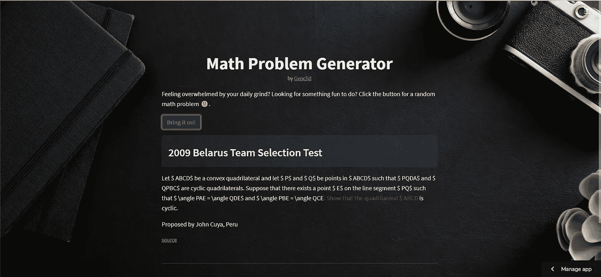
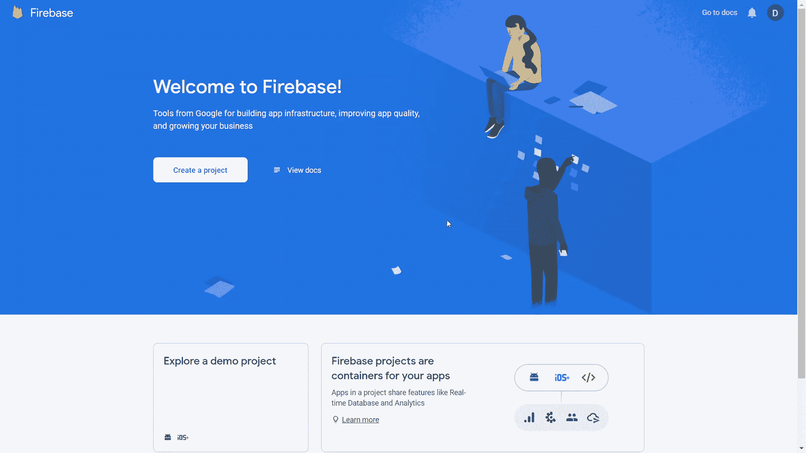
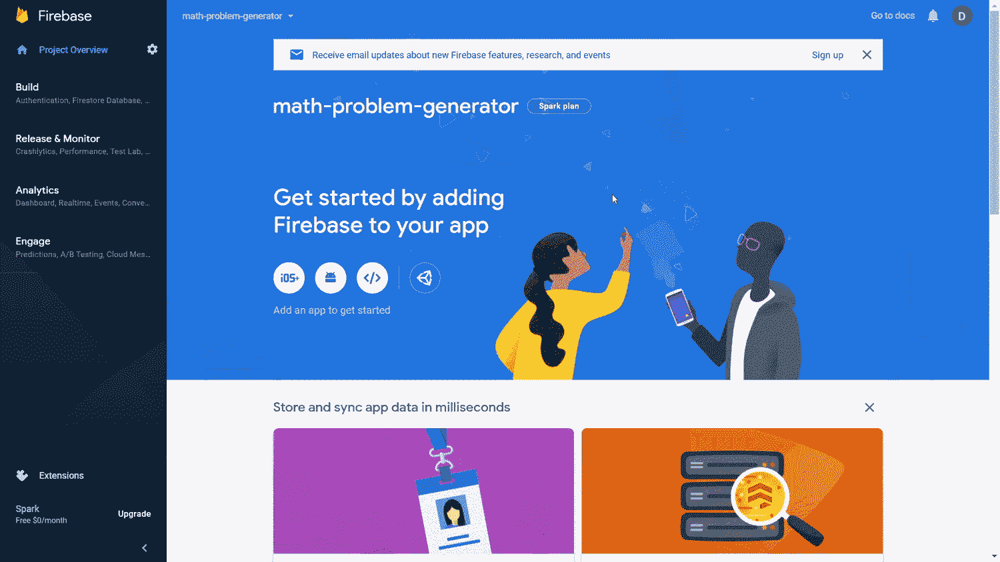
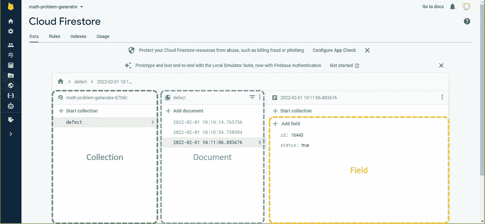
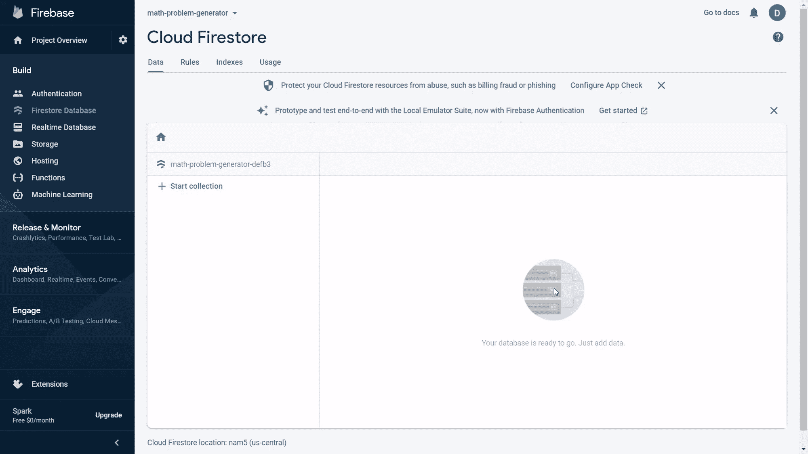
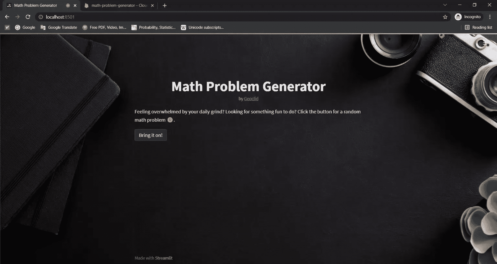
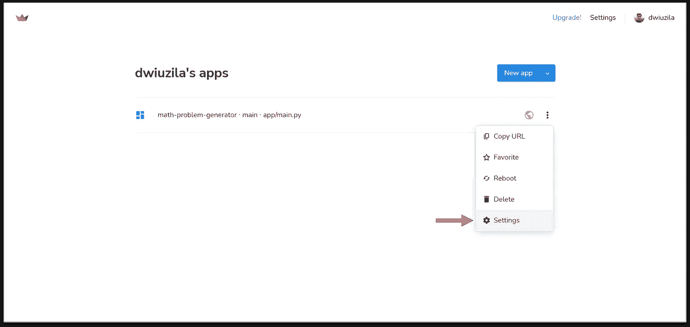

# Firestore × Streamlit:完美网络应用的强大组合

> 原文：<https://levelup.gitconnected.com/4-easy-steps-to-set-up-a-firestore-database-for-your-streamlit-apps-825c5de5b5bc>

## 实践教程

## 利用 Streamlit 机密和会话状态与您的用户充分互动


图片由[作者](http://dwiuzila.medium.com/membership)编辑

```
**Table of Contents**[**Motivation**](#647f)[**🔥 Step 1: Firestore Basics**](#6217)
  ∘ [What is Firestore?](#2f64)
  ∘ [Setting-up Firestore](#d6a9)
  ∘ [Generate Private Key](#259c)[**👑 Step 2: Upgrade Your Streamlit Functionality**](#e9f1)
  ∘ [Resketch!](#e586)
  ∘ [Database Structure](#8352)[**👨‍💻 Step 3: Backend Code**](#e440)
  ∘ [Install Libraries](#1eaf)
  ∘ [Build the Footer](#699e)
  ∘ [Session State](#f3ef)[**🔗 Step 4: Connecting to Firestore**](#a28d)
  ∘ [From Your Local Machine](#5ea8)
  ∘ [Streamlit Secrets](#f04b)[**Wrapping Up**](#ea7a)
```

# 动机

[**Streamlit**](https://www.streamlit.io/) 是一个开源库，可以轻松创建和共享漂亮的、定制的机器学习和数据科学 web 应用。据说这是最快的方法。

> 只需几分钟，您就可以用 Python 构建和部署强大的数据应用程序，全部免费，不需要任何前端经验。

有时候，你的应用程序比平常要复杂一点。它接受用户的输入，甚至显示输入，就像[媒体](https://medium.com/u/504c7870fdb6?source=post_page-----825c5de5b5bc--------------------------------)中的鼓掌或响应功能，Youtube 上的评论或订阅按钮等。要做到这一点，你的应用程序需要随时知道你的用户输入，因此需要把它存储在某个地方。这就是数据库的用武之地。

如果您跟随前面的故事，您应该已经熟悉我们一起构建的项目: [**数学问题生成器**](https://share.streamlit.io/dwiuzila/streamlit-demo/app/main.py) 。否则可以直接从我的 [**GitHub repo**](https://github.com/dwiuzila/streamlit-demo) 中克隆项目。

[](/8-simple-steps-to-build-your-first-streamlit-app-91fe7b3bef9e) [## 构建首个 Streamlit 应用的 8 个简单步骤

### 从你的第一行代码，缓存，到部署到野外

levelup.gitconnected.com](/8-simple-steps-to-build-your-first-streamlit-app-91fe7b3bef9e) 

下面是目前这个项目的项目结构。它将随着我们的进展而更新。文件夹`math-problem-generator`是我们的工作目录，它包含应用程序运行所需的几个文件和文件夹。

```
math-problem-generator
│
├── .streamlit
│   └── config.toml
│
├── app
│   ├── main.py
│   └── utils.py
│
├── assets
│   ├── background.png
│   └── icon.png
│
├── data
│   └── olympiad-problems.csv
│
└── requirements.txt
```

该项目是伟大的，所有，工作以及预期的，但当你尝试产生问题，有些有不必要的格式。这可能是由于糟糕的抓取方法或不熟悉某些 LaTeX 语法的应用程序。

[](https://medium.com/geekculture/how-i-ended-up-having-25-000-math-problems-for-free-f460dbb5e193) [## 我是如何免费得到 25000 道数学题的——理解网络抓取

### 如果你跟着读，你也能得到它们！

medium.com](https://medium.com/geekculture/how-i-ended-up-having-25-000-math-problems-for-free-f460dbb5e193) 

生成的问题具有错误的格式|图片作者[作者](http://dwiuzila.medium.com/membership)

如果用户可以直接向您报告糟糕的问题，这样您就可以在幕后手动或编程地纠正它们，这将非常有帮助。但是嘿！该任务与[媒体](https://medium.com/u/504c7870fdb6?source=post_page-----825c5de5b5bc--------------------------------)中的鼓掌或响应功能具有完全相同的性质。所以，数据库要走了！

# 🔥步骤 1: Firestore 基础知识

## 什么是 Firestore？

作为数据从业者，数据是我们每天都会遇到的东西。在开发数学问题生成器时，您需要处理数据:一个名为`olympiad-problems.csv`的 CSV 文件。这些类型的数据是静态的 T4，这意味着你很少更新它们来运行你的应用。然而，用户报告需要频繁地写入数据(因此它是动态的*)，这就是数据库的用途。*

*在数据库方面有很多选择，比如 MongoDB 或 SQLite。我们使用 Firestore 是因为它的 [**星火计划**](https://firebase.google.com/pricing) 是免费的，并且有很大的入门限制。你不需要信用卡，如果你的应用超过免费限额，他们会通知你并自动停止新的写入。*

*Firestore 是一个 NoSQL 数据库，这意味着它是非表格数据库，存储数据的方式不同于关系表。它托管在云上，这意味着数据在所有用户之间实时同步，并且在您的应用程序离线时仍然可用。*

## *设置 Firestore*

*要开始使用 Firestore，请前往[*console.firebase.google.com*](https://console.firebase.google.com/)并使用您的 Google 帐户登录。然后，单击“创建项目”按钮，按如下步骤完成整个过程。*

**

*作者插图[作者](http://dwiuzila.medium.com/membership)*

*创建项目后，您将被定向到项目登录页面。现在您将创建一个 Firestore 数据库。为此，请转到侧面板中的“构建→ Firestore 数据库”,然后单击“创建数据库”按钮。在**测试模式**下启动，这意味着你的数据在 30 天内对所有人开放读取或写入。但是，您应该稍后对此进行更改。之后就按照流程走就行了。*

**

*作者插图[作者](http://dwiuzila.medium.com/membership)*

*在 Firestore 中，存储单位是*文档*。文档是一个轻量级记录，包含映射到值的*字段*。文档存在于*集合*中，集合仅仅是文档的容器。*

**

*图片由[作者](http://dwiuzila.medium.com/membership)*

## *生成私钥*

*为了将您的 Streamlit 应用程序连接到 Firestore，您需要某种密码。密码是一个 JSON 文件，您不应该与任何人共享，也绝对不应该提交给您的 GitHub repo。*

*要下载您的私钥，请转到侧面板中的齿轮符号，然后单击“项目设置”。导航到“服务帐户”标签，你会看到一个关于 Firebase Admin SDK 的窗口。选择“Python”并按下“生成新私钥”按钮。将下载 JSON 文件。将文件重命名为更简单的名称，如`firestore-key.json`，并将其保存到工作目录。*

**

*插图作者[作者](http://dwiuzila.medium.com/membership)*

# *👑步骤 2:升级您的 Streamlit 功能*

*我之前提到过，你希望用户直接向你报告糟糕的数学问题，这样你就可以提高整体问题的质量。这可以通过一个简单的按钮来完成。如果用户点击这个按钮，它将触发一个到 Firestore 的连接，并在数据库中记录这个问题实际上是一个缺陷。但是在进入后端之前，让我们:*

1.  *讨论按钮的放置位置，并*
2.  *定义数据库中的集合、文档和字段。*

## *雷斯克。*

*我们已经有了一个 [**运行 app**](https://share.streamlit.io/dwiuzila/streamlit-demo/app/main.py) ，包含以下部分:*

1.  *Head:包括标题“数学题生成器”，副标题，以及一两句关于 web app 的话，后面是一个生成数学题的按钮。*
2.  *Body:包括问题所在的比赛(来自`olympiad-problems.csv`数据集的`contest`列)、问题本身的文本(来自`problems`列)，以及 AoPS 在线子页面的源链接(来自`link`列)。*

*现在，报告按钮在哪里？当然是页脚了。*

*3.页脚:包括鼓励支持的句子，后面是报告和支持按钮。*

**

*图片作者[作者](http://dwiuzila.medium.com/membership)*

## *数据库结构*

*您将只创建一个名为“缺陷”的集合，其中包含所有有缺陷问题的文档。每个文档本身将是一个接收报告的时间戳，包含两个字段:“id”(整数，问题在`olympiad-problems.csv`数据集中的索引)和“status”(布尔值，总是为真，这意味着问题是一个缺陷)。“状态”字段意味着解释缺陷的类型:错误的 LaTeX 格式，不可识别的 LaTeX 语法，等等。但是现在，它将总是存储一个真实的对象。*

*你已经在上面看到了数据点的例子。我会再放一遍。*

**

*图片作者[作者](http://dwiuzila.medium.com/membership)*

*现在我们准备好一些代码。*

# *👨‍💻步骤 3:后端代码*

## *安装库*

*除了`streamlit`和`pandas`之外，您还将使用另外两个库:*

1.  *`google-auth-oauthlib`，提供 [oauthlib](https://github.com/idan/oauthlib) 与 [google-auth](https://github.com/googleapis/google-auth-library-python) 的集成。*
2.  *`google-cloud-firestore`，以 pythonic 式的方式与 Firestore 合作。*

*因此，将这个脚本输入到`requirements.txt`文件中。为了确保可再现性和避免将来的错误，请注意我们还编写了库版本。*

```
*pandas==1.2.3
streamlit==1.3.1
google-auth-oauthlib==0.4.6
google-cloud-firestore==2.3.4*
```

*在您选择的 python 环境中使用`pip`命令安装这些库。您可能希望首先在终端中运行下面的代码，为这个项目创建一个新的虚拟环境。*

## *构建页脚*

*支持的鼓励句很简单，用`st.caption`。然而，按钮有点复杂。*

*首先，按钮是不能横向排列的，至少对于你正在做的 Streamlit 版本是这样。一种解决方法是使用`st.columns`将按钮存储在列中。因此，创建宽度比为 1:8 的两列。第一列位于报告按钮，第二列用于支持按钮。报告按钮可以使用`st.button`来构建，但是支持按钮是一个定制按钮，需要一个聪明的方法来构建。*

*幸运的是，如果你有一个 [**给我买杯咖啡**](https://www.buymeacoffee.com/dwiuzila) 的账户，他们会给你一个在网站上嵌入按钮的方法。这个不用担心，我给你复制了代码，必要的话编辑一下。*

*所有这些新代码都包装在一个`footer()`函数中，并保存在`utils.py`文件中，如下所示。*

*注意，点击报告按钮会触发`report()`功能。现在，我们将让`report()`为空。*

*我们还没完呢。*

*转向`main.py`。从`utils.py`导入`footer`并在“开始吧！”按钮被单击。*

*在终端上运行 Streamlit，看看是否一切运行顺利。*

**

*插图作者[作者](http://dwiuzila.medium.com/membership)*

*我们马上发现了一个问题(正如我所说的，这有点复杂)。当您单击“报告”按钮时，它会刷新页面。这是意料之外的。当您按下报告按钮时，您希望页面保持不动，只在后台与 Firestore 通信。但是 Streamlit [和**就是这么工作的**和](https://www.youtube.com/watch?v=EnXJBsCIl_A&t=79s)。幸运的是，有一个变通方法:会话状态。*

## *会话状态*

*对于每个用户会话，会话状态是在重新运行之间共享变量的一种方式。它可以通过调用`st.session_state`来使用，并且像字典一样工作。您的会话状态将有三个键:*

1.  *`prob_click`，是否该“放马过来！”按钮是否被点击(布尔值)。*
2.  *`report_click`，报告按钮是否被点击(布尔值)。*
3.  *`sample`，存储来自`olympiad-problems.csv`的采样观测值。*

*首先，定义会话状态，然后用 False 初始化`ss['prob_click']`的值。*

*如果“放马过来！”按钮被按下，我们做通常的事情(没有`footer()`函数)，但是现在更新会话状态:*

*现在，整合`footer()`如下。确保您理解代码的作用:*

*   *如果你之前按了“来吧！”按钮，显示页脚并设置`ss['report_click'] = True`。*
*   *如果您先前按下了报告按钮(`ss['report_click']`已经设置为真)，显示正文和页脚，而不再次采样。*

*你看到现在`footer()`接受一个参数，就像`body()`一样。这是为了设置下一步在`utils.py`中编写`report()`函数。*

*组合所有代码，我们必须`main.py`如下。这是文件的最终版本。*

# *🔗步骤 4:连接到 Firestore*

## *从本地机器*

*让我们做你的最后一个任务:完成`report()`功能。首先，您需要导入一些库。*

*`report()`功能将执行三步过程:*

1.  *使用 JSON 帐户密钥向 Firestore 进行身份验证，*
2.  *创建对 Google post 的引用，*
3.  *然后将一些数据上传到引用。*

*注意，`report()`接受了一个名为`sample`的自变量，这个自变量就是要上报的数学题。既然`report()`被调入`footer()`，那它也必须接受`sample`。相应编辑`footer()`即可。*

*组合所有代码，我们必须如下`utils.py`。*

*当你运行应用程序时，一切都很顺利，包括报告按钮。按下它，您将看到一个文档已被写入您的 Firestore 数据库。*

**

*作者插图[作者](http://dwiuzila.medium.com/membership)*

*现在是时候承诺你的 GitHub 回购并收工了，对吧？小心点！*

*你不应该把`firestore-key.json`提交给 GitHub。否则，任何人都可以在未经你同意的情况下使用你的 Firestore 账户。但是，如果`firestore-key.json`不在你的 GitHub repo 中，那么应用部署后如何连接 Firestore 呢？答案是 Streamlit secrets，字面意思。*

## *精简秘密*

*这正是建立 Streamlit 秘密的原因。但是，它接受 [**TOML**](https://toml.io/en/latest) 格式，不接受 JSON。所以，你需要把 JSON 转换成 TOML。将这个脚本复制到工作目录中名为`key-to-toml.py`的新 python 文件中。*

*Ans 从终端运行脚本。*

*一个新文件`secrets.toml`将被创建在`.streamlit`文件夹中。复制其内容。转到 [share.streamlit.io](https://share.streamlit.io/) ，然后在应用程序的下拉菜单中点击“设置”。*

**

*图片由[作者](http://dwiuzila.medium.com/membership)*

*将出现一个窗口。将您的 Firestore 密钥粘贴到机密部分。*

*我们还没完呢。您的`report()`函数应该通过`st.secrets`使用 Streamlit 机密进行认证，而不是使用 JSON 帐户密钥向 Firestore 进行认证。但是首先，再导入两个库。*

*然后，修改这个脚本*

*在您的`report()`功能中对此*

*现在，`utils.py`的最终版本将会是这样的*

*剩下的就是把你的作品提交给 GitHub 了。您只需要提交三个文件:`requirements.txt`、`main.py`和`utils.py`。你可能还想在 [share.streamlit.io](https://share.streamlit.io/) 中重启你的应用。*

*恭喜，您已经将 Firestore 数据库连接到您的 Streamlit 应用程序！这里 可以看到最后的结果 [***。***](https://share.streamlit.io/dwiuzila/math-problem-generator/main/app/main.py)*

# *包扎*

*为了与你的 Streamlit 应用程序的用户充分互动，你可以使用 Firestore 数据库，如果互动更好地被 NoSQL 数据库捕获的话。您可以通过传递 Streamlit 秘密的 Firestore 密钥来连接 Streamlit 和 Firestore，而不会将其暴露给 GitHub repo 和整个世界。在这个故事中，我们已经看到了这一点。*

*在我们的过程中，我们遇到了许多问题，其中一个问题涉及到*按钮内部按钮*Streamlit 的特性，如果按下内部按钮，就会重置应用程序。我们用 Streamlit 会话状态处理了这个问题。*

**

*🔥你好！如果你喜欢这个故事，想支持我这个作家，可以考虑 [***成为会员***](https://dwiuzila.medium.com/membership) *。每月只需 5 美元，你就可以无限制地阅读媒体上的所有报道。如果你注册使用我的链接，我会赚一小笔佣金。**

*🔖*想了解更多经典机器学习模型的工作原理，以及它们是如何优化参数的？或者 MLOps 大型项目的例子？有史以来最优秀的文章呢？继续阅读:**

*

[艾伯斯·乌兹拉](https://dwiuzila.medium.com/?source=post_page-----825c5de5b5bc--------------------------------)* 

## *从零开始的机器学习*

*[View list](https://dwiuzila.medium.com/list/machine-learning-from-scratch-b35db8650093?source=post_page-----825c5de5b5bc--------------------------------)**8 stories********

[艾伯斯·乌兹拉](https://dwiuzila.medium.com/?source=post_page-----825c5de5b5bc--------------------------------)* 

## *高级优化方法*

*[View list](https://dwiuzila.medium.com/list/advanced-optimization-methods-26e264a361e4?source=post_page-----825c5de5b5bc--------------------------------)**7 stories********

[艾伯斯·乌兹拉](https://dwiuzila.medium.com/?source=post_page-----825c5de5b5bc--------------------------------)* 

## *MLOps 大型项目*

*[View list](https://dwiuzila.medium.com/list/mlops-megaproject-6a3bf86e45e4?source=post_page-----825c5de5b5bc--------------------------------)**6 stories********

[艾伯斯·乌兹拉](https://dwiuzila.medium.com/?source=post_page-----825c5de5b5bc--------------------------------)* 

## *我最好的故事*

*[View list](https://dwiuzila.medium.com/list/my-best-stories-d8243ae80aa0?source=post_page-----825c5de5b5bc--------------------------------)**24 stories********

[艾伯斯·乌兹拉](https://dwiuzila.medium.com/?source=post_page-----825c5de5b5bc--------------------------------)* 

## *R 中的数据科学*

*[View list](https://dwiuzila.medium.com/list/data-science-in-r-0a8179814b50?source=post_page-----825c5de5b5bc--------------------------------)**7 stories********[](https://dwiuzila.medium.com/membership)*