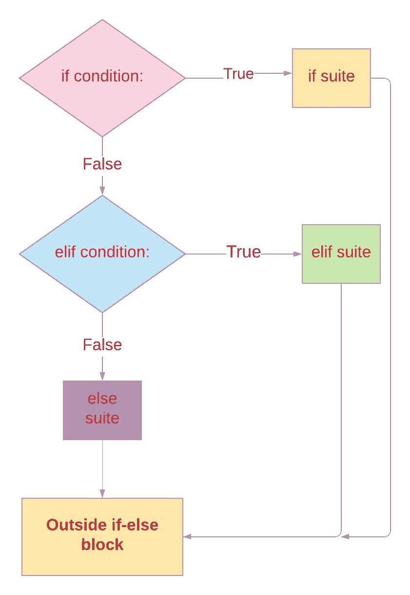
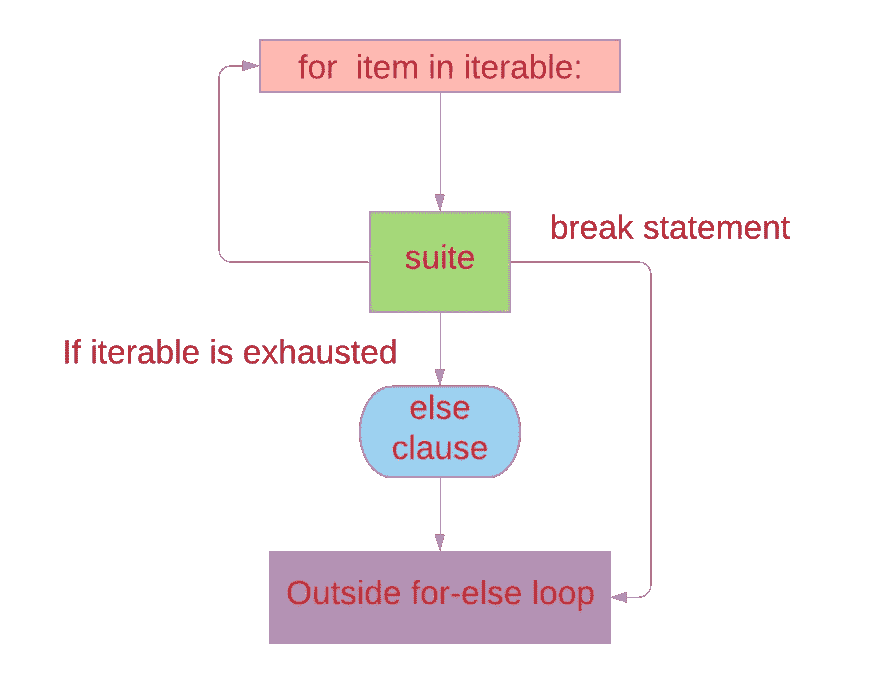
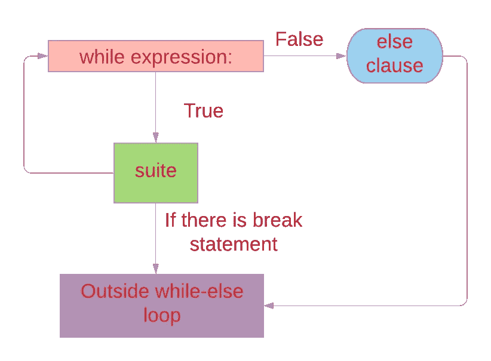
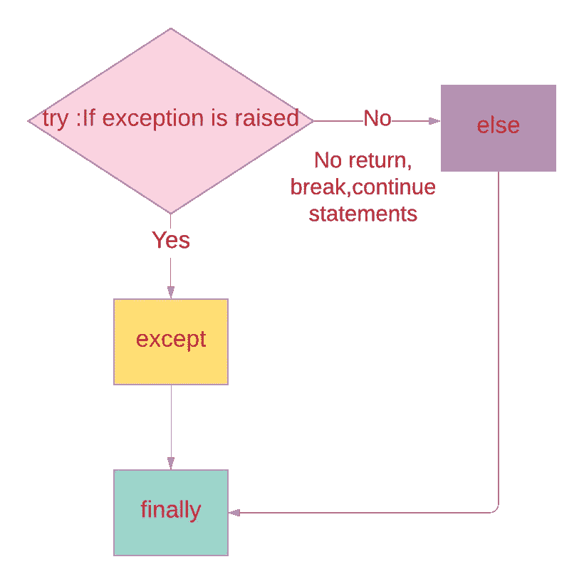

# Python 中的 4 个“Else 子句”

> 原文：<https://levelup.gitconnected.com/4-else-clauses-in-python-d4e7ccd2432>

## 让我们学习一下 Python 中的 if-else、for-else、while-else 和 try-else 子句。


[优 X 创投](https://unsplash.com/@youxventures?utm_source=unsplash&utm_medium=referral&utm_content=creditCopyText)在 [Unsplash](https://unsplash.com/s/photos/what-else-you-need?utm_source=unsplash&utm_medium=referral&utm_content=creditCopyText) 上的照片

# Python 中的 Else 子句

在 Python 中，我们可能会在 `if` 语句中找到 **else 子句**， `for`，`while`循环，还有`try` 块。在所有这些语句中，else 子句都是可选的。让我们看看 else block 在所有这些语句和循环中是如何执行的。

## python 中的 4 个 else 子句:

1.  如果-否则
2.  for-else
3.  而-否则
4.  尝试-否则

## 复合语句

> 复合语句包含(一组)其他语句；它们以某种方式影响或控制其他语句的执行。— [python 文档](https://docs.python.org/3/reference/compound_stmts.html)

`if`、`while`、`for`、`try`都是复合语句。

`if`、`while`和`for`语句实现传统的控制流结构。

`try` 为一组语句指定异常处理程序和/或清理代码。

## **-else 子句的语法:**

```
**for** item **in** iterable:    --->header
    suite
**else:** suite
```

## If-Else 子句:

`if`语句用于条件执行。

## 语法 if-else 子句:

```
**if** assignment_expression:
    suite
**elif** assignment_expression:
    suite
**else**:
    suite
```

如果语句将通过逐个评估表达式来选择套件中的一个，直到发现一个为真，则执行该套件(如果执行或评估了语句，则不执行**的其他部分)。**

如果所有表达式都为假，则执行 **else** 子句集(如果存在的话)。

在 **if 语句**中只会执行一个套件。[if-suite 或 elif-suite 或 else-suite]。

可以有零个或多个 **elif** 子句，并且 **else** 子句是可选的。



作者照片

例 1: If-else 子句

执行下面的代码三次。

1.  第一次输入给定为`7`。If 子句`x>5` 评估为**真**并且仅 **if 套件**被执行。不计算或执行 if 语句的其他部分。
2.  如果子句 `x>5`和 elif 子句`x<5`评估为假，则第二次输入为`5\.` ，因此默认执行 **else 套件**。
3.  第三次输入为`3`。如果子句 `x>5`被评估为假。然后 elif 子句求值返回 True，因此执行 **elif suite** 。不执行 Else 条款。

```
x = int(input(**"Please enter an integer: "**))
**if** x>5:
    print (**"Greater than 5"**)
**elif** x<5:
    print (**"Less than 5"**)
**else**:
    print (**"The  number is 5"**)

print (**"Outside if-else block"**)
**'''
 Output 1 :  
Please enter an integer: 7 
Greater than 5
Outside if-else block

Output 2:
Please enter an integer: 5
The  number is 5
Outside if-else block

Output 3:
Please enter an integer: 3
Less than 5
Outside if-else block
'''**
```

## for-else 子句

`**for**` 语句用于迭代序列(比如字符串、元组或列表)或其他可迭代对象的元素。

for 循环可能有一个`else`子句；当 for 循环由于 iterable 的耗尽而终止时，它被执行。
但不是当循环被 **break** 语句终止时。

**语法:**

```
**for** item **in** iterable:   
    suite
**else:** suite
```

*   iterable 只计算一次。为 iterable 的结果创建一个迭代器。
*   然后，按照迭代器返回的顺序，对迭代器提供的每个项目执行一次**套件**。
*   当项目用尽时，`else`子句中的套件(如果存在)被执行，并且**循环终止。**



作者图片

## 示例:for-else 子句

*   **当循环**的**在 iterable 用尽后终止时，执行 else 子句**。

```
**for** i **in** [1,2,3,4,5]:
    print (i)
**else**:
    print (**"for loop is done"**)

print (**"Outside the for loop"**)
**'''
1
2
3
4
5
for loop is done
Outside the for loop
'''**
```

## While-else 子句

只要表达式为真， **while** 语句就用于重复执行。

```
**while** expression:
    suite
**else**:
    suite
```



作者照片

这将重复测试表达式，如果为真，则执行第一个套件；如果表达式为 false(这可能是第一次测试),则执行`else`子句集(如果存在),循环终止。

**示例 9:在 while 循环中使用 else 子句。**

*   **同时执行循环**直到条件`i<5`为假。
*   **else 子句**在条件为假后执行。

```
i=0
**while** i<5:
    print (i)
    i+=1
**else**:
    print (**"Element is greater than 5"**)**'''
Output:
0
1
2
3
4
Element is greater than 5
'''**
```

参考我的故事 [break，continue 语句中 for，while 循环](https://medium.com/better-programming/break-continue-and-else-clauses-on-loops-in-python-b4cdb57d12aa)

## try-else 子句

`try`语句为一组语句指定异常处理程序和/或清理代码:

**语法:**

```
**try**:
    suite
**except** Exception:
    suite
**else**:
    suite
**finally**:
    suite
```

**try:**
在 try 块中，执行代码，如果出现异常，控制转到 except 子句。如果没有引发异常，则不执行异常处理程序。

**except:**
except 子句指定一个或多个异常处理程序。
仅当 try 块中出现异常时，才执行该块。

**else:**
`else`子句如果控制流离开 **try** 套件，没有引发异常，也没有执行 return、continue 或 break 语句，则执行该子句。

**最后:**
`finally`指定了一个**【清理】**处理程序。
无论 try 块中是否出现异常，该块总是被执行。

即使在`try`……`finally`语句的 **try** 套件中执行了 **return、break 或 continue** 语句，也要执行 **finally** 子句



作者图片

**例 try 块中没有引发异常。**

执行 try、else 和 finally 块。

```
**def** add(a,b):
    **try**:
        result=a+b
    **except** Exception **as** e:
        print (e)
    **else**:
        print (result)
    **finally**:
       print (**"Executed finally"**)

add(4,5)
**'''
Output:
9
Executed finally
'''**
```

**示例 try 块引发了异常。**

执行 try、except 和 finally 块

```
**def** add(a,b):
    **try**:
        result=a+b
    **except** Exception **as** e:
        print (e)
    **else**:
        print (result)
    **finally**:
       print (**"Executed finally"**)

add({**'a'**:1},{**'b'**:2})
**'''
Output:
unsupported operand type(s) for +: 'dict' and 'dict'
Executed finally
'''**
```

## 结论:

*   else 子句在`if`、 `for`、`while`和`try`块中是可选的。
*   在 **if 语句**中只会执行一个套件。[if-suite 或 elif-suite 或 else-suite]。
*   如果 try 块中没有引发异常，则执行 else 子句
*   当 for 循环通过用尽 iterable 而终止，并且没有被 **break** 语句终止时，执行 for 循环中的 else 子句。
*   在 while 循环中，在条件**为假**后，执行 **else 子句**。如果在 `while`套件中执行`break`语句，它将终止循环，而不执行`else`子句的套件。

## 参考资料(Python 文档)。

while-else 子句

[for-else 子句](https://docs.python.org/3/reference/compound_stmts.html#the-for-statement)

[try-else 子句](https://docs.python.org/3/reference/compound_stmts.html#the-try-statement)

[if-else 子句](https://docs.python.org/3/reference/compound_stmts.html#the-if-statement)

[例外](https://docs.python.org/3/reference/executionmodel.html#exceptions)

[复合报表](https://docs.python.org/3.8/reference/compound_stmts.html)

*请关注此空间，了解更多关于 Python 和数据科学的文章。如果你喜欢看我的更多教程，就关注我的* [***中***](https://medium.com/@IndhumathyChelliah)[***LinkedIn***](https://www.linkedin.com/in/indhumathy-chelliah/)*[***推特***](https://twitter.com/IndhuChelliah) ***。****

*感谢阅读！*