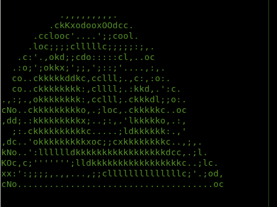
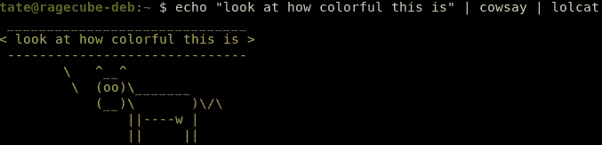
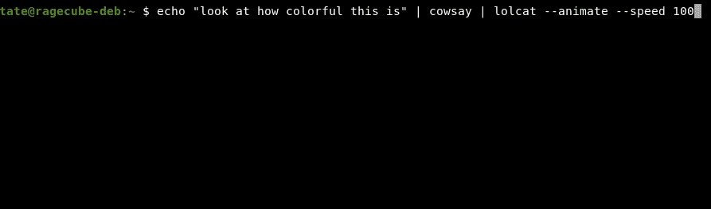

# 4 个有趣的命令行实用程序，让您轻松应对

> 原文：<https://levelup.gitconnected.com/4-fun-command-line-utilities-to-take-the-edge-off-472129b1af41>


照片由 [Cookie 在](https://unsplash.com/@cookiethepom?utm_source=unsplash&utm_medium=referral&utm_content=creditCopyText) [Unsplash](https://unsplash.com/s/photos/computer?utm_source=unsplash&utm_medium=referral&utm_content=creditCopyText) 上的 Pom 拍摄

整天盯着代码真的很烦人。Git 可能令人沮丧，即使在最好的情况下也令人麻木。代码评审和项目计划不会带来喜悦。你必须给你的一天注入一点乐趣。你得花点时间发泄一下。有什么比使用一些简洁的命令行工具更好的方法呢？

给你的终端增加一些乐趣，尤其是一点颜色，会让心情变得轻松，当工作任务开始变得棘手时，这真的会有帮助。其中一些实用程序功能更多，实际上服务于技术目的，而另一些只是纯粹的娱乐。这看起来像是无意义的分心，那是因为它们大部分都是。在适当的情况下，分散注意力可能是件好事。

当你过度专注于在截止日期前完成某个大项目，或者修复一个特别棘手的 bug 时，你的大脑需要休息一下。一些人站起来四处走走来休息，另一些人用其他任务或游戏来分散注意力。这正是这些可以为您的生产力；有益健康的消遣。让你的大脑休息一下，用一些愚蠢的应用程序放松一下。

## [考赛](https://linux.die.net/man/1/cowsay)

[](https://en.wikipedia.org/wiki/Cowsay) [## 考赛

### cowsay 是一个生成带有信息的奶牛的 ASCII 图片的程序。它还可以生成图片使用预先制作的…

en.wikipedia.org](https://en.wikipedia.org/wiki/Cowsay) 

这绝对是经典。自 1999 年问世以来，提供了无限的使用可能性。最简单的形式是，`cowsay`为您提供了一个 ASCII 艺术奶牛，它接受`stdin`，然后在一个会说话的奶牛泡泡中显示结果。让单调的任务变得有趣会有很多乐趣。

`Cowsay`可以做成许多不同的有用的东西。您可以在您的机器登录横幅中包含`cowsay`，或者甚至通过`cowsay`显示错误和警告(可能不在生产中)。`Cowsay`甚至已经作为一个可选的输出主题被内置到一些广泛流行的应用程序[中，比如 Ansible](https://docs.ansible.com/ansible/latest/reference_appendices/faq.html#how-do-i-disable-cowsay) 。

试用`cowsay`非常简单，只需使用下面这些奶牛告诉你的命令为你的平台安装即可:

```
### debian install
 _________________________
< sudo apt install cowsay >
 -------------------------
        \   ^__^
         \  (oo)\_______
            (__)\       )\/\
                ||----w |
                ||     ||### MacOS install
 _____________________
< brew install cowsay >
 ---------------------
        \   ^__^
         \  (oo)\_______
            (__)\       )\/\
                ||----w |
                ||     ||# run it!
echo "hello from cowsay!" | cowsay
 ____________________
< hello from cowsay! >
 --------------------
        \   ^__^
         \  (oo)\_______
            (__)\       )\/\
                ||----w |
                ||     ||
```

## [Parrot.live](https://github.com/hugomd/parrot.live)

[](https://github.com/hugomd/parrot.live) [## hugomd/鹦鹉. live

### 🐦将动画鹦鹉带到各地的终端- hugomd/parrot.live

github.com](https://github.com/hugomd/parrot.live) 

派对鹦鹉是我一直以来最喜欢的东西之一。有这么多不同形式的派对鹦鹉。不管是澳大利亚鹦鹉，爆炸鹦鹉，都没关系，因为我都爱它们。许多使用 Slack 的公司都增加了鹦鹉表情符号。

但是如果你被困在一台只有终端的无头机器上工作呢？如果你真的不能像这样安装多余的东西，而你能接触到的只有无聊的老`curl`怎么办？别担心，你还是可以狂欢的！



鹦鹉。住在终点站。

只需输入以下内容，就可以开始鹦鹉学舌了:

```
curl parrot.live
```

## [SL(蒸汽机车)](https://github.com/mtoyoda/sl)

[](https://github.com/mtoyoda/sl) [## mtoyoda/sl

### SL(1):改掉你打字错误的坏习惯解散 GitHub 是超过 5000 万开发者的家园，他们一起工作来托管…

github.com](https://github.com/mtoyoda/sl) 

在基于 Unix 的系统上，您能使用的最有用的命令之一是什么？没错。是`ls`。

以前有没有不小心把`ls`打错的？也许你已经发现自己犯了这个经典的胖手指:

```
tate@computer:~ $ sl
bash: sl: command not found
```

是的，很明显我们指的是`ls`,但是我们却在这里和巴什一起对我们大喊一个经典的误解。

是时候训练自己走出这种病态的`ls`打字错误行为了。`sl`来救援了！下一次当你无意中键入`sl`时，迎接你的将是一辆长长的蒸汽机车突突地驶过你的终点站:


sl 的端子输出。

在等待那辆该死的火车滚动完屏幕后，你将会害怕再次不小心输入`sl`。现在就开始纠正这些讨厌的习惯，使用以下命令进行安装:

```
### debian
sudo apt install sl### MacOS
brew install sl
```

## [lolcat](https://github.com/busyloop/lolcat)

[](https://github.com/busyloop/lolcat) [## 忙碌循环/lolcat

### 解散 GitHub 是超过 5000 万开发者的家园，他们一起工作来托管和审查代码，管理项目，以及…

github.com](https://github.com/busyloop/lolcat) 

你的终端需要更多的颜色(可能)。到目前为止，让你的终端“品尝彩虹”最简单的方法是使用`lolcat`。这个方便的小工具将接受`stdin`,并以彩虹渐变效果绘制你传递的任何东西。看，我们甚至可以把它和`cowsay`结合起来:



给 lolcat 发短信。

如果这还不够有趣的话，我们甚至可以通过使用`--animate`标志，让`lolcat`在我们传递文本时使其动画化:



在 lolcat 中使用动画标志。

通过安装`lolcat`将一些单调文本输出着色:

```
# Debian
sudo apt install lolcat# MacOS
brew install lolcat
```

*感谢您的阅读！我希望你可以发泄一下，也许还可以用这些有趣的工具笑一笑。不要忘记在那些编码马拉松中休息一下，娱乐一下自己！*