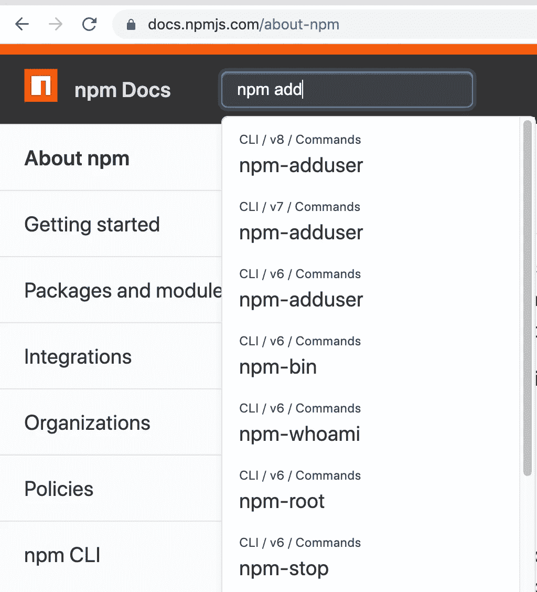
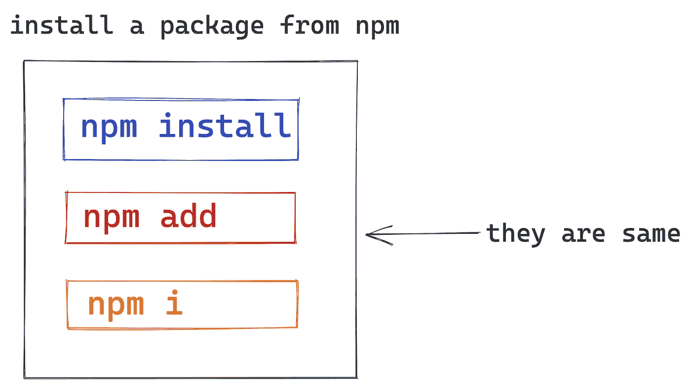
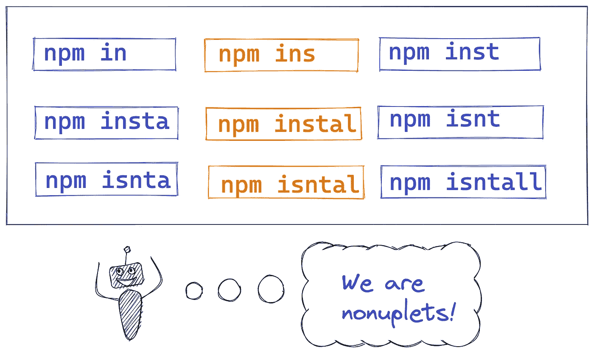
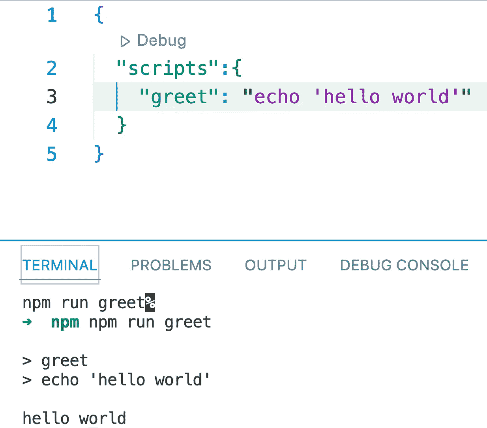
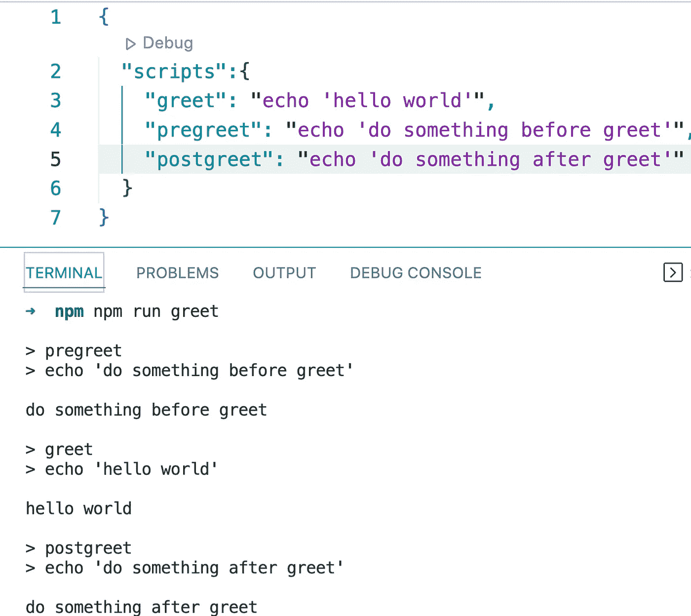
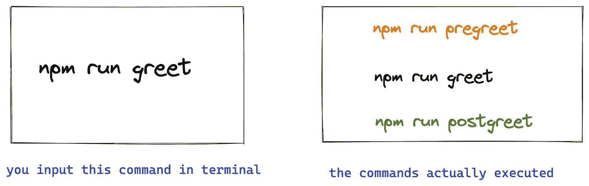
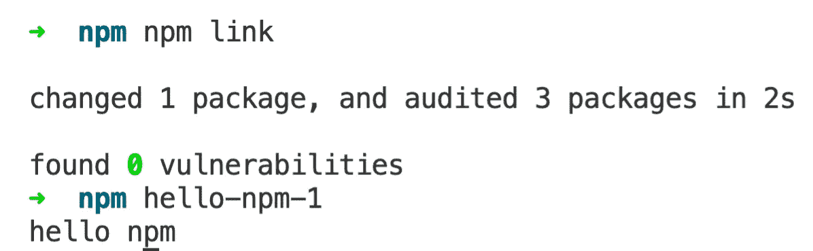
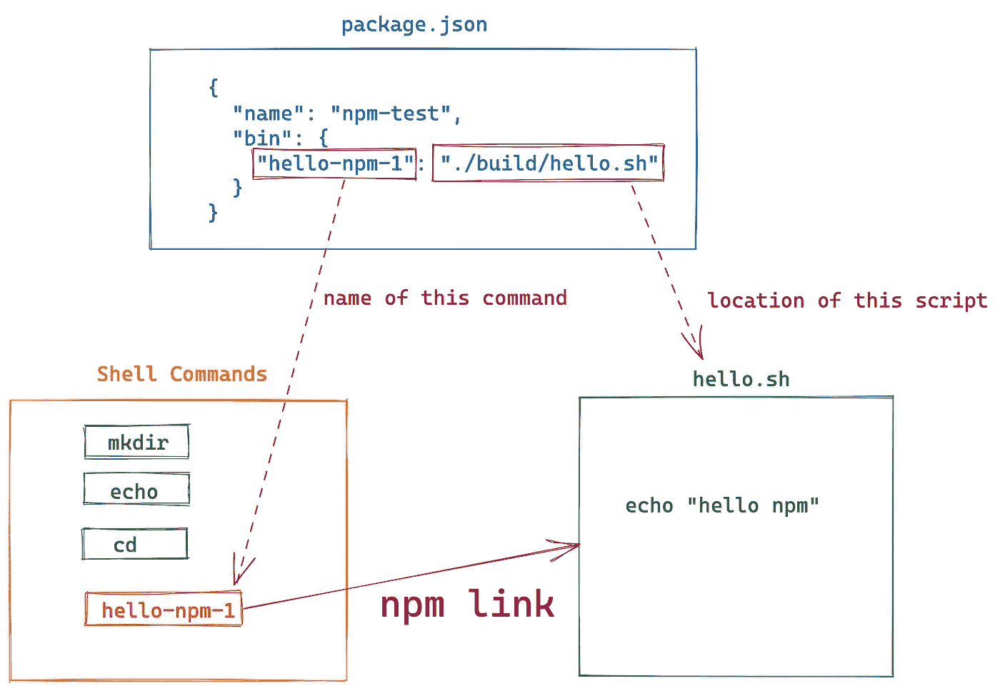

# 你可能不知道的 NPM 的 4 个有趣用法。用图表解释

> 原文：<https://levelup.gitconnected.com/4-funny-usages-of-npm-you-may-not-know-explained-with-diagrams-de77732e6fc2>


# 1.npm 添加=== npm 安装

如果你尝试在 npm 官方文档中搜索`npm add`命令，你会发现这个命令似乎根本不存在，如下图:



但是我们确实可以在终端上使用这个命令:

```
$ npm add lodash
```

其实，`npm add`是`npm install`的别名之一。所以当我们使用`npm add`的时候，完全等同于对 npm 执行`npm install`！

同理，`npm i`也是`npm install`的别名。



# 2.已安装 npm？没关系

细心的读者可能已经发现，上面副标题中的`instal`是这个单词的拼写错误。但它确实有效。

```
$ npm instal lodash
```

其实这是 npm `8.x`版本的一个新特性，叫做容错设计。如果用户不小心拼错了一个单词，NPM 仍然工作正常。

所以在`8.x`版本中，`npm install`得到了 9 个别名，分别是:

```
in, ins, inst, insta, instal, isnt, isnta, isntal, isntall
```



# 3.您可以在每个脚本执行前后执行一些附加操作

假设我们有一个名为`greet`的脚本:



现在我们想:

*   greet 执行前输出一些东西:`do something before greet`；
*   并在执行 greet 后输出一些东西:`do something after greet`。

那么我们该怎么办呢？

我们可以添加一个`pregreet`脚本和一个`postgreet`脚本。这是 NPM 的机制，以`pre`和`post`开头的脚本被视为特殊脚本。



当项目自动部署时，通常使用这种机制。

# 4.用`npm link`安装一些终端命令

如果您在项目的`package.json`中定义了`bin`属性，并将其指向一个可执行脚本文件。

例如:

`package.json`:

```
{
  "name": "npm-test",
  "bin": {
    "hello-npm-1": "./build/hello.sh"
  }
}
```

`hello.sh`:

```
echo "hello npm"
```

然后我们可以用`npm link`将它安装到 shell 命令中:



在图表中:



这就是`create-react-app`和`vue-cli`在电脑上的安装方式。