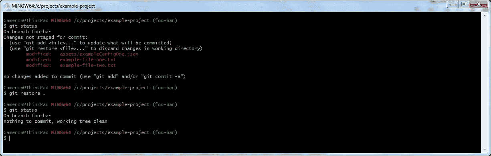
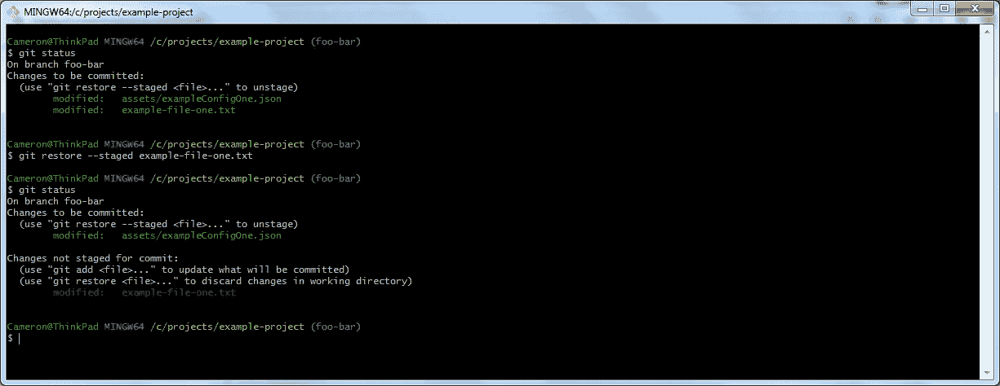
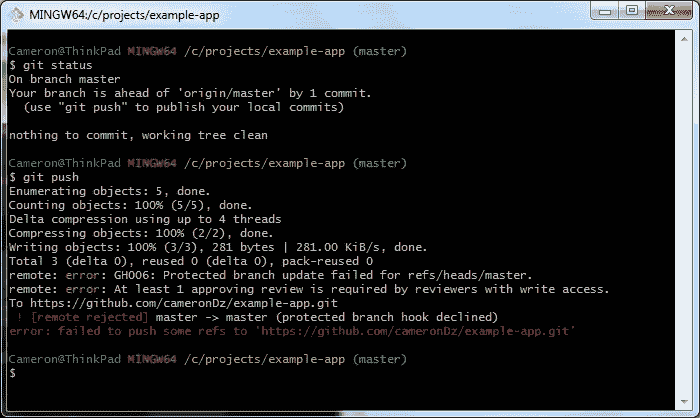
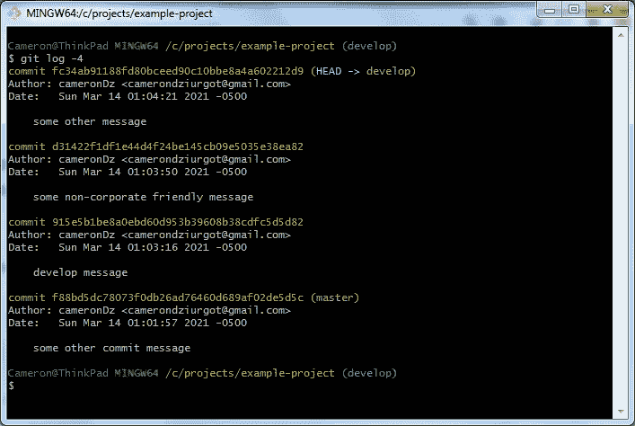
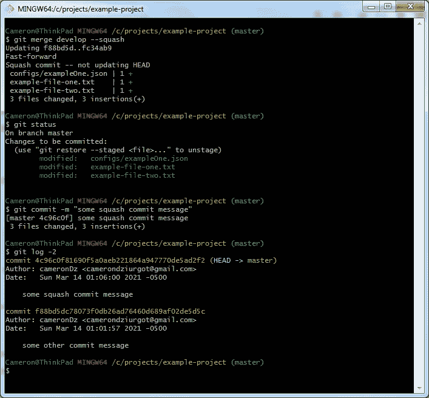

# 面向高效开发人员的 4 个 Git 命令

> 原文：<https://levelup.gitconnected.com/4-git-commands-for-productive-developers-eda9da16004>

Git 是大多数开发人员日常生活的一部分。许多人没有充分利用 git 的特性。下面是我经常使用的一些有用的命令，它们有助于保持我的工作效率和交付代码。


在 [Unsplash](https://unsplash.com?utm_source=medium&utm_medium=referral) 上 [Matteo Catanese](https://unsplash.com/@matteocatanese?utm_source=medium&utm_medium=referral) 拍摄的照片

# 1.git 还原

[恢复](https://git-scm.com/docs/git-restore)命令可用于删除您对暂存和未暂存文件所做的更改。下面是使用 restore 命令的两个用例。

## 未分级文件

假设您正在处理您的分支。您已经对一些文件进行了更改，并意识到您实际上并不需要这些更改。您可以对工作目录中的所有文件使用 restore 命令，而不是转到编辑器中的文件并尝试按 Ctrl+Z 键(或计算机上的任何快捷键来撤消)将文件恢复到原始状态。



对未转移的文件使用 restore 命令。

从上面可以看到，当我们第一次检查状态时，有三个未分级的变更，两个在工作目录中，一个在子目录中。下一个命令是“git restore”，在工作目录上运行 restore。当运行下一个 status 命令时，您可以看到所有的更改都已从文件中删除。

## 暂存文件

现在，假设您已经对您的分支进行了更改，并且已经暂存了一些文件，并且意识到您意外地暂存了一个不需要的更改。为了撤消暂存的更改，请使用“- staged”标志，并添加从工作目录到需要撤消更改的文件的路径。



对暂存文件使用还原。

你可以在上面的初始状态命令中看到，有两个暂存文件。然后，使用分段选项对特定文件运行还原。文件中的更改会被保留，但在第二个状态命令中不会被转移。

# 2.git 贮藏

Git 有分支和标签来帮助团队跟踪远程存储库中的代码。在本地存储库中，也有一个[存储库](https://git-scm.com/docs/git-stash)开发者可以用来存储代码。有几个使用存储的用例。

## 快速换挡

有时候，当您正在编写一个特性时，有人拍了拍您的肩膀，或者 ping 偷偷溜到您的屏幕上，您正因为一个需要立即优先处理的生产 bug 而离开当前的工作。您检查您的 git 状态，并且您有阶段化的变更、新文件、未阶段化的变更，所有这些都在您的工作分支上。所有这些都需要消失，这样您就可以开始工作在最新的生产发布标签。这是可以利用的地方。

```
$ git stash save --no-keep-index --include-untracked
```

此命令将获取工作分支中的所有更改；新文件，分阶段的和未分阶段的，并把它们放在你的存储库的顶部，它本质上是一个代码变更引用的堆栈。您将引用放入存储库，然后在需要时按照后进先出的顺序将它们取出。当您处理完生产 bug 并返回到您的功能工作时，您可以运行以下命令来获取您隐藏的更改。

```
$ git stash pop
```

请注意，当您弹出您隐藏的变更时，被暂存的变更现在未被暂存，但是仍然在文件中。您所做的更改将被恢复，您可以继续处理该特征。

## 快速抛出变化

使用 git stash 的另一个例子是，当你正在处理一个特性时，你对解决方案进行了一些提交。现在，您已经做了一些未分级的更改，添加了一些文件，并意识到您所做的更改和创建的文件是解决方案的错误方向。在这种情况下，您可以将所有未暂存的更改和新文件放入您的存储中，然后删除存储中的最后一个项目。

```
$ git stash save --keep-index --include-untracked
$ git stash drop
```

keep-index 选项用于不隐藏任何分段更改。stash drop 命令用于删除 stash 顶部的最后一条记录。

# 3.git 重置

[reset](https://git-scm.com/docs/git-reset) 命令可用于撤回已提交的代码更改。当您偶然提交到一个分支时，这可能是有用的。

我所在团队的一个常见做法是锁定主分支和开发分支，并且只允许通过拉请求将代码更改移入分支。当您尝试将提交推送到这些分支时，您会看到类似下面的消息。



GitHub 拒绝对受保护分支的推送。

如果您意外地将更改提交到远程服务器上受保护的本地分支，您可以使用以下命令将这些更改回滚到未转移状态。

```
$ git reset HEAD~
$ git checkout -b new-feature-branch
$ git commit -am "commit changes to correct branch"
```

reset HEAD~命令将上次提交的更改拉回到未转移状态。所有的更改都是未分级的，您可以创建并检出一个新的特征分支，这是通过 checkout -b 命令完成的。一旦在那个分支上，您就能够将变更提交到正确的分支。

# 4.git 合并-挤压

[merge](https://git-scm.com/docs/git-merge) 命令很常见，无论开发人员是在积极使用 git GUI、Git Bash，还是让 IDE 来处理它，他们都很可能每天使用它。

合并时可以使用挤压选项来清理提交历史。有些提交可能是无用的，比如当您修改代码样式以匹配其他文件中的标准时。其他提交可能不适合出现在远程服务器的日志历史或公司标准中。无论哪种方式，如果您想清理您的日志历史，您可以在合并时使用挤压选项。



提交要清理的历史日志。

查看上面的日志，有四个提交；三个来自开发分支，最后一个来自主分支，这是创建开发分支之前的最后一次提交。



挤压提交开发分支变成主

现在,“开发”分支合并到“带有挤压选项的母版”中。当运行 status 命令时，您会看到有已暂存但未提交的更改。这是因为 develop 中的所有提交都被删除了，只保留了更改。下一个命令是在执行挤压合并时需要提交新的更改。最后，当我们检查最后两次提交的日志时，您会看到来自开发分支的提交都不见了，取而代之的是单个压缩的合并提交，然后是在创建开发分支之前来自主分支的单个原始提交。

当多人在一个分支上工作时，压制合并是一个不好的做法。提交应该归功于开发人员。这也会引起问题，因为历史实际上已经被删除了。只有当您是唯一一个在被合并的分支中进行更改的开发人员时，才使用 git squash 是一个好的实践。

# 结论

Git 是许多开发人员日常生活的一部分。许多允许 ide 处理 git 交互。花时间学习命令行，并使用不常用的命令将有助于您成为更高效的开发人员，并帮助您成为团队中有价值的一员。

编码快乐！