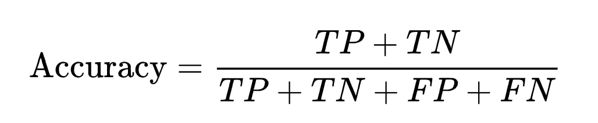
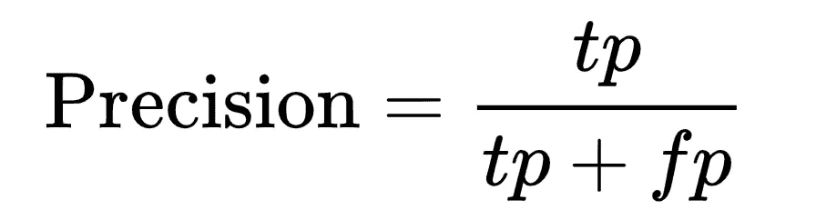
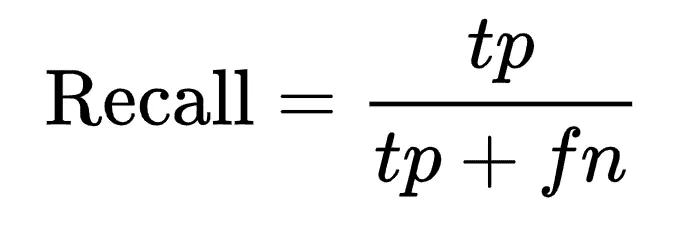
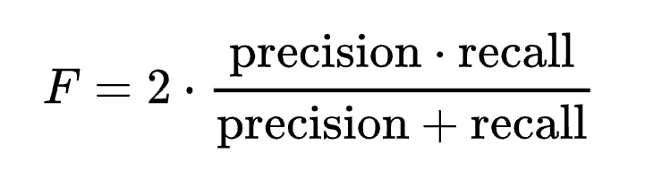

# 什么时候应该使用准确度、精确度、召回率和 F-1 评分？

> 原文：<https://levelup.gitconnected.com/4-important-metrics-for-classification-machine-learning-models-when-how-to-use-them-6aa7c85d7665>


图片由 [Freepik](https://www.freepik.com/free-vector/robot-vs-human-flat-vector-illustration-robotic-machine-tired-woman-working-computer-office-humanoid-versus-person-artificial-intelligence-challenging-employee-modern-ai-technology_16503947.htm#query=machine%20learning&position=43&from_view=search&track=sph) 上的 [redgreystock](https://www.freepik.com/author/redgreystock) 提供

机器学习通常用于**分类问题**，但用于评估模型性能的**指标**可能会令人困惑。

让我们为你简化一下(鉴于**二进制分类**)。

开始之前，我们先弄清楚几件事。

假设我们有一群肠癌患者，我们开发了一个人工智能模型，可以根据他们的粪便样本诊断疾病。

该模型的预测结果可分为:

*   **真阳性(TP)——**当模型说患者患有癌症，而患者实际上患有癌症时
*   **假阳性(FP)——**当模型显示患者患有癌症，但患者并未患病
*   **真阴性(TN)** —当模型说患者没有癌症，而患者实际上没有癌症
*   **假阴性(FN)** —当模型说患者没有癌症，但患者实际上患有癌症。我们不想这样，对吗？

让我们考虑下面经常使用这些术语的指标。

# 1.准确(性)

它是**最常用的**模型分类评价指标。

准确度是**正确的**预测占**总**结果数量的比例。

换句话说，就是**正确分类率**。



请注意:

> *TP + TN =所有正确预测的数量*
> 
> *TP + TN + FP +FN =结果总数*

## 什么时候用？

在以下情况下，我们使用准确性作为模型评估指标:

*   我们想要准确地对这两个类进行分类(我们对 TP 和 TN 都感兴趣)
*   我们有一个**平衡的**训练数据集(两个类的数量相等)。对于大多数实际上不平衡的真实世界数据集来说，这是不正确的。

## 怎么用？

```
from sklearn.metrics import accuracy_score

print(accuracy_score(labels, predictions))
```

# 2.精确

是**正确**预测**阳性**病例占所有**预测阳性**病例的比例。



## 什么时候用？

在以下情况下，我们使用精度作为模型评估指标:

*   **假阳性预测成本太高，假阴性预测成本低。**例如，当构建用于检测一种癌症的模型时，该癌症具有非常低的死亡率/扩散率，但是其治疗非常昂贵并且具有许多副作用。
*   我们有一个**不平衡的**训练数据集(两个类的数量不相等)。
    例如，一个高度精确的模型将预测训练数据集中出现频率最高的类。这是一个有缺陷的模型，尽管是一个非常精确的模型)。

## 怎么用？

```
from sklearn.metrics import precision_score

print(precision_score(labels, predictions))
```

# 3.回忆/敏感度

是**正确**预测**阳性**病例占全部**实际阳性**病例的比例。



## 什么时候用？

我们在以下情况下使用召回:

*   **假阴性预测的成本太高**。例如，建立一个模型来诊断一种容易治疗的癌症，但如果不及早治疗，死亡率会很高。
*   我们有一个**不平衡的**训练数据集

> 请注意，当精确度提高时，回忆下降，反之亦然。

## 怎么用？

```
from sklearn.metrics import recall_score

print(recall_score(labels, predictions))
```

# 4.F1 —分数

是**精度**和**召回**的调和平均值。



## 什么时候用？

我们使用 F1 —在以下情况下得分:

*   **两个假阳性&假阴性预测对我们都很重要**。例如，在建立诊断癌症的模型时。
*   我们有一个**不平衡的**训练数据集

> 请注意，如果精度或召回率较低，F1-得分会降低。

## 怎么用？

```
from sklearn.metrics import f1_score

print(f1_score(labels, predictions))
```

感谢您阅读这篇文章！

*如果你是 Python 或编程的新手，可以看看我的新书《没有公牛**t 学习 Python 指南**’***》:**

[](https://bamaniaashish.gumroad.com/l/python-book) [## 学习 Python 的无牛指南

### 你是一个正在考虑学习编程却不知道从哪里开始的人吗？我有适合你的解决方案…

bamaniaashish.gumroad.com](https://bamaniaashish.gumroad.com/l/python-book) [](https://bamania-ashish.medium.com/membership) [## 通过我的推荐链接加入 Medium-Ashish Bama nia 博士

### 阅读 Ashish Bamania 博士(以及 Medium 上成千上万的其他作家)的每一个故事。您的会员费直接…

bamania-ashish.medium.com](https://bamania-ashish.medium.com/membership)