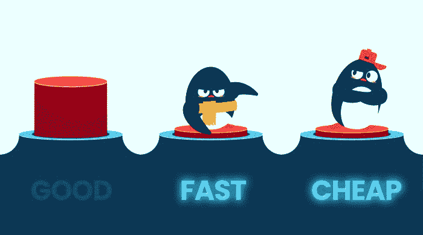

# 程序员/数据科学家更快更好地学习的 4 条人生经验

> 原文：<https://levelup.gitconnected.com/4-life-lessons-programmers-data-scientists-learn-sooner-and-better-8f72e38d1385>

一个有趣的博客分享了编码教给我的人生经验

**这听起来很怪，但编程中有很多智慧**。在这篇文章中，我想分享我在日常生活和技术世界中发现的 4 件事。

## №1:编码就像冥想一样

当我沉浸在编码中时，我**会专注于当下**，而不是沉思过去或担心未来。我唯一想的是这个问题以及如何解决它。我们活在当下，不就像冥想一样吗？

在现代生活中，我们痴迷于**多任务处理**，因为它似乎能帮助我们充分利用时间。就我个人而言，我曾经有太多的想法浮在我的脑海里，而我最终却一事无成。

多年来，我一直从事编码工作，我已经学会专注于一件事，而且只专注于一件事！我打破了我一心多用的习惯。这让我更有效率，更少焦虑，因为我更愿意在更长的时间内投入时间和精力来完成事情。

图片来源:[冰屋创意屋](https://www.igloocreative.co/blog/respect-your-video/)

## №2:没有所谓的完美

在编程界，**可靠，快速，便宜，我们只能挑两个！**这里是交易:可靠+快速=为好程序员买单；快+便宜=不要指望可靠的产品；可靠+便宜=更多的迭代和时间(前提是我们足够幸运能做到这一点)。无论我们选择哪种组合，我们都必须妥协。

生活也是一种长期的妥协行为。在每一种情况下，我们做的每一个或大或小的决定，从吃什么晚餐到走什么职业道路，没有一个完美的决定能给我们一切。

******你也可以在我的频道这里看视频版*** 🎥,

从小到大，我一直是个完美主义者，竭尽全力让一切都“完美”。现在与此相反，当我做任何决定时，我不再试图寻找绝对最好的。而是我只是**记下每个选项的利弊**，看看哪些是我需要**优先考虑的**，哪些是此刻可以牺牲的。

## №3:生活中的问题=程序中的错误

大概和你有共鸣的是**调试**是编程界最讨厌的事情。要翻遍 2K+行代码才能找到那个小 bug，真是让人头疼！

随着我对调试技术的掌握越来越好，我知道总有办法**追溯错误**的根源。为了永久修复这个错误，我们必须**直接修复根本原因**，而不是寻找黑客方法来临时修补它。

程序中的 bug 就像生活中的问题一样。和这个调试思路一样，重要的是我们**要面对这些问题**，而不是想尽一切办法避免它们，或者当它们真的发生时逃避。解决问题让我成为一个更自信的人，就像调试让你成为一个更好的开发者一样。

[图像来源](https://giphy.com/gifs/jerseydemic-l3q2KRkOVYvi8WfU4)

## №4:执行前先计划

说到错误，虽然它不是完全可以避免的，但是最小化它的一个方法是通过**思考我们的项目并为它做计划**。例如，当开发一个应用程序时，在编码之前，我们需要一个详细描述语言、UI 设计、交付管道等的路线图。

这条规则适用于生活。没有人会否认制定旅行计划的重要性，对吗？就我个人而言，我的家人非常喜欢旅行，每次我们去旅行之前，我们都会做好计划，例如，我们想去什么地方，或者我们应该带什么药物。

提前做好计划，可以节省我们的时间，并有助于节省资金。我们可以去不同的地方，品尝当地的食物，这真的让我们的旅行经历最大化。

## 更多想法？

希望这个博客能让你开心😃你从编码中学到的可能改变你的一课是什么？请在评论区分享你的见解👇

***想要更多数据科学和编程技巧？使用*** [***我的链接***](https://yilistats.medium.com/membership) ***注册 Medium，获得我所有内容的全部访问权限。查看我的🎥YouTube 频道*** [***数据对话 Kat***](https://www.youtube.com/channel/UCbGx9Om38Ywlqi0x8RljNdw) ***在这里我帮你提升编码和分析技能。***

**你可能会发现其他博客也很鼓舞人心，**

 [## 每个数据科学家都应该知道的 6 个 SQL 技巧

### 提高分析效率的 SQL 技巧

towardsdatascience.com](https://towardsdatascience.com/6-sql-tricks-every-data-scientist-should-know-f84be499aea5)  [## 两全其美:来自 Python 的自动化和动态 SQL 查询

### 通过 SQL 和 Python 集成将自动化带到新的高度

towardsdatascience.com](https://towardsdatascience.com/best-of-both-worlds-automated-and-dynamic-sql-queries-from-python-5b74a24501b0)