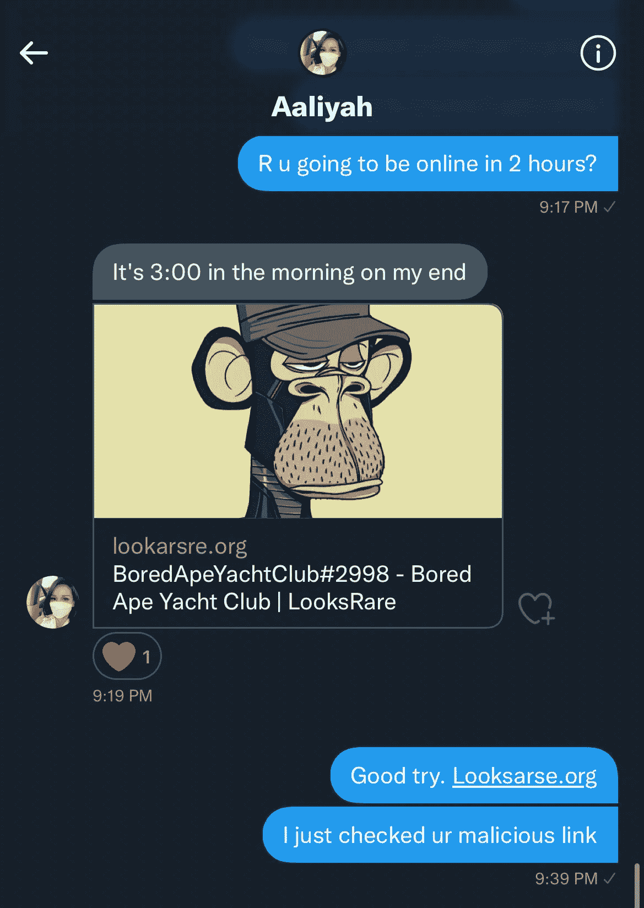
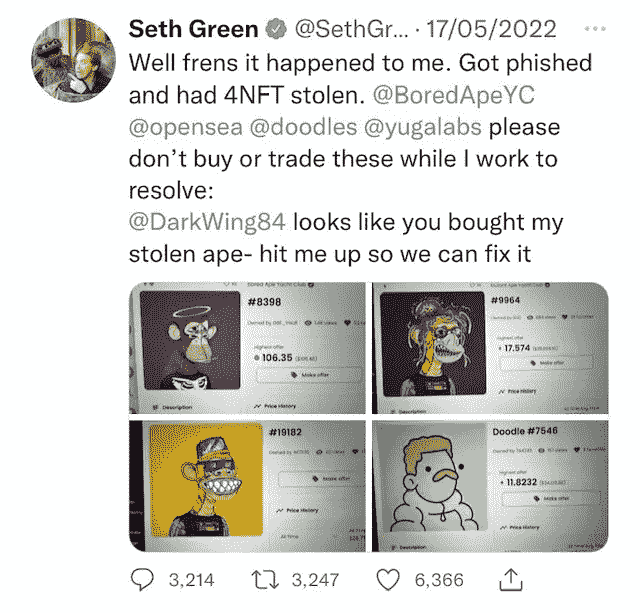

# 保证您的 NFTs 安全的 4 个主要步骤

> 原文：<https://levelup.gitconnected.com/4-major-steps-to-keeping-your-nfts-safe-5edaec9801d7>

自我主权和对你的数字资产 100%负责让大多数人感到害怕。"你说没有客户支持热线是什么意思？"

虽然骗子找到了新的复杂方法来敲诈 NFT 社区，但我们仍然可以采取措施来保护我们珍贵的财产安全。

这一概念至关重要——新人们在进入空间时，对他们的非功能性测试存储在哪里有很大的误解。

最重要的是要明白，你的资产是作为一段代码存储在以太坊区块链上的，而不是存储在 Metamask、你的硬件钱包或你的电脑上。

想想你的加密钱包(Metamask，Ledger，Rainbow 等。)地址作为在以太坊区块链上查看您的 NFT 的窗口。

当你出售、购买或“移动”你的 NFT 时，你并没有移动任何东西；相反，访问这段代码所有权的地址会发生变化。

任何能够访问私钥(种子短语、秘密短语)的人都可以访问与该地址相关的资产的所有权。

同样，掌握这一点对于理解如何安全地保护您的 NFTs 是至关重要的。

# 1.获得一个硬件钱包

你的 Metamask，Rainbow 或者任何热钱包都不是保护你的 NFTs 的安全措施。连接到一个糟糕的链接后钱包被“掏空”的噩梦故事让我夜不能寐。

使用硬件钱包的目的是离线存储您的私钥。为了简单起见，如果有人要访问您的资产，他们需要从您的硬件设备上签署一条消息，或者访问您的种子短语(秘密恢复短语)。

一旦您的硬件设备开始运行，您将永远不需要为该设备输入您的种子短语(机密短语),除非您完全丢失了该设备。(如果发生这种情况，您可以购买另一个硬件设备来使用机密恢复短语访问您的资产)。

Ledger 和 Trezor 是当今市场上最受欢迎的硬件设备。我使用一个 Ledger Nano X，它在同一个硬件设备上有 50 个子钱包，节省了我管理多个种子短语的精力。

这也给了我一个额外的安全层，因为每个钱包地址在彼此之间创建了一个防火墙。因此，如果最坏的情况发生，我点击了钱包 1/50 中的一个恶意链接，那只是那个钱包受到了损害，而不是其他 49 个。

如果你认为你的硬件钱包是一个保险库，那会有所帮助；你永远不会打开你的“金库”去买面包和牛奶。因此，永远不要用它来购买，销售，铸造或进入“小鱼苗”赠品。

相反，将你希望出售的资产转移到你积极使用的“热钱包”中。这样，你的硬件钱包就不会暴露在任何网站上。

# 2.安全存储您的机密恢复短语(种子短语)

最好是平衡您的秘密恢复短语的安全性和可访问性。

访问您的资产成为一项噩梦般的任务，有太多的障碍需要跨越。或者，薄弱的安全性可能会导致一些不良行为者访问您的数字资产。

确保你已经在纸上写下了至少四次秘密恢复短语。

在把你的 24 或 12 个单词的秘密短语存放在一个隐蔽的地方之前，比如一个保险箱或保险箱，你应该把秘密短语分成两三份。

分离这将确保完整的秘密短语不被访问，如果你的隐藏位置被破坏。

如果你担心洪水、火灾或长时间的腐烂会危及纸张，你的秘密短语就出现了。我推荐使用隐钢胶囊。这是一种坚固的金属设备，设计用于在极端条件下生存，几乎可以在所有情况下工作。

如果你非常谨慎，并想更进一步，你可以买一台全新的笔记本电脑或手机，它永远不会连接到互联网。您可以在设备上加密您的机密短语信息，并用密码保护它。

也许在未来的某个时候，大众不会对分权过于大惊小怪。大多数人可能会选择一个集中的合作伙伴来安全地备份他们的私钥。

比特币基地提供实用的保管和非保管钱包选择。

# 3.关掉你的不和谐 DM

通过直接信息引起不和不会有什么好结果，所以打开你的服务器设置，关掉你的 DM(直接信息)。

大多数项目都没有创造新版本的紧迫性，因为他们意识到这将他们的社区向骗子敞开大门。取而代之的是，视频公告通常在多个频道上级联发布。

# 4.你的想法

如果我们要直言不讳，扮演最重要角色的个人就是被骗的受害者。

通常，他们对快速获胜、免费赠品或快速现金的渴望使他们容易受到骗子的伤害。如果任何事情感觉好得不真实，不要 FOMO。很高兴错过，甚至给自己一些时间来再次检查你的钱包是合法的。

如果你免费得到一些东西，或者埃隆·马斯克说如果你送 0.2 ETH，他会送回两个比特币，这太好了，不可能是真的。我们谈论的是世界上最富有的人，一个身边有一个全天候保安团队的人。他不太可能会发放比特币。

如果有人想和你在 NFT 交易平台上交易，而他们令牌上的下限比你的多 5 倍，这太好了，不可能是真的。

如果你的钱包里有一个在 NFT 空投的 1 ETH 的报价，而你从未听说过这个系列，这简直好得难以置信。

作为有史以来最杰出的数字艺术家，皮普尔的《创世纪》作品的底价为 90ETH，其中一件作品的成交价为 6900 万美元。很有可能他会免费造币，即使是从被黑的推特上；好得令人难以置信。

骗局会不断演变，骗子也越来越老练。

我已经在沙子上画了一条线，并且有一个规则，我不进入免费赠品。即使它是合法的，你免费赢得东西的机会也很小。我不与任何人交易，也不做私人销售。

我也不能幸免于一个令人清醒的现实，那就是我的钱包可能被掏空了。在 Web3 变得不那么像狂野的西部之前，我会继续保持警惕。

赛斯·格林也是人。

***以上都不是理财建议。我不是一个合格的财务顾问，尽管我尽了最大努力，我也无法预测未来。***

***NFT 空间有风险。***

***专家说，目前 99%的项目都在走向 0。***

> 加入 Coinmonks [电报频道](https://t.me/coincodecap)和 [Youtube 频道](https://www.youtube.com/c/coinmonks/videos)了解加密交易和投资

# 另外，阅读

*   [网格交易机器人](https://coincodecap.com/grid-trading) | [Cryptohopper 审查](https://medium.com/coinmonks/cryptohopper-review-a388ff5bae88) | [Bexplus 审查](https://coincodecap.com/bexplus-review)
*   [7 个最佳零费用加密交易平台](https://coincodecap.com/zero-fee-crypto-exchanges)
*   [氹欞侊贸易评论](https://coincodecap.com/anny-trade-review) | [霍比保证金交易](https://medium.com/coinmonks/huobi-margin-trading-b3b06cdc1519)
*   [分散交易所](https://coincodecap.com/what-are-decentralized-exchanges) | [比特 FIP](https://coincodecap.com/bitbns-fip) | [Pionex 评论](https://coincodecap.com/pionex-review-exchange-with-crypto-trading-bot)
*   [用信用卡购买密码的 10 个最佳地点](https://coincodecap.com/buy-crypto-with-credit-card)
*   [最好的卡达诺钱包](https://coincodecap.com/best-cardano-wallets) | [冰棒副本交易](https://coincodecap.com/bingbon-copy-trading)