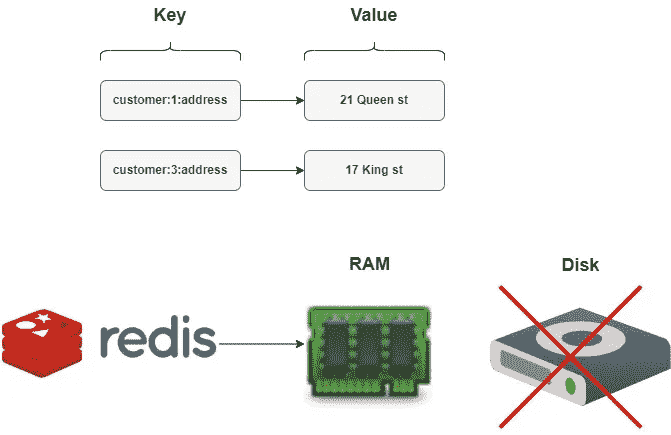
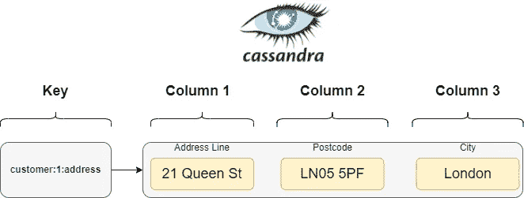
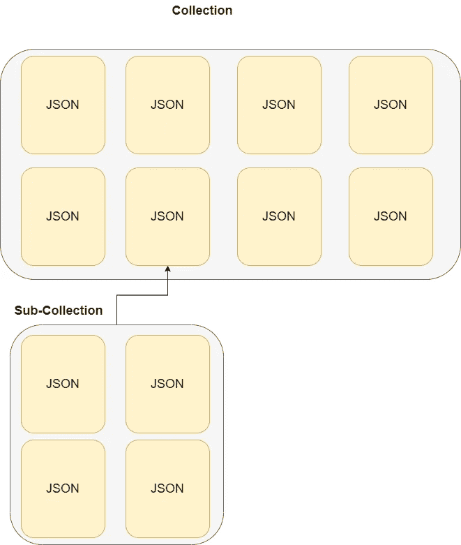
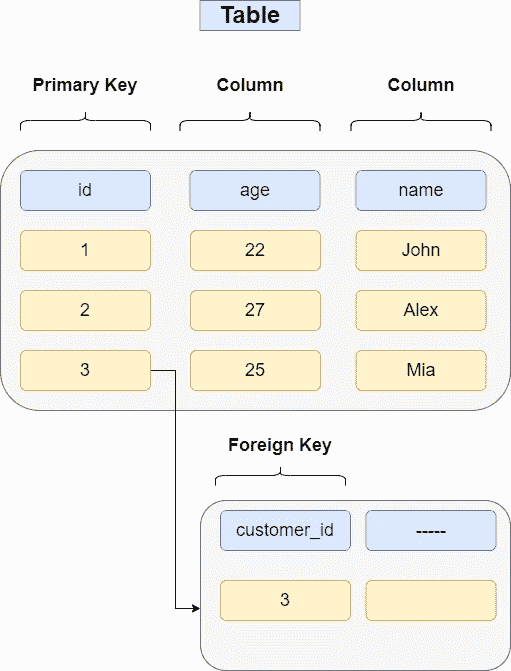

# 4 必须了解数据库范例

> 原文：<https://levelup.gitconnected.com/4-must-know-database-paradigms-377dc6d2ad1>

## 最常见的数据库范例是什么样的

托拜厄斯·菲舍尔在 [Unsplash](https://unsplash.com/photos/PkbZahEG2Ng) 上的照片

## 键值

键值数据库类似于字典，我们使用键来检索适当的值。在示例中,“客户:1:地址”和“客户:3:地址”是引导我们检索两个客户地址的关键字。

一个键值数据库的例子是 Redis，与关系数据库不同的是，数据存储在内存中，而不是磁盘上，这使得这种类型的数据库非常适合缓存。

例如，您可以缓存网站上所有客户的信息，并几乎立即访问这些数据，而不是在关系数据上进行大量 SQL 连接来检索所有需要的信息。

Bellow 是一篇关于 Twitter 如何使用 Redis 进行规模缓存的很好的文章。

 [## Twitter 如何使用 Redis 扩展- 105TB 内存，39 毫米 QPS，10，000 多个实例-高可扩展性-

### 2014 年 9 月 8 日星期一上午 9:05 姚悦自 2010 年以来一直在 Twitter 的缓存团队工作。她最近给了一个非常…

highscalability.com](http://highscalability.com/blog/2014/9/8/how-twitter-uses-redis-to-scale-105tb-ram-39mm-qps-10000-ins.html) 

## 宽栏

越过键值的限制，我们将研究宽列数据库(例如 Cassandra)。对于宽列，我们仍然有一个键，但是我们可以用类似表的方式存储更多的数据，这允许更大的可伸缩性。

也是 Cassandra 查询语言(CQL ),类似于 SQL，但有更多限制。但是由于数据存储在具有行和列的表中，所以您可以对其执行操作。

现在，关于 Cassandra 有趣的部分是，它是一个分布式数据库，这意味着它可以有多个节点。单个节点代表 Cassandra 的单个实例。你可以把它想象成一个微服务的多个实例，这很神奇，因为它可以轻松处理许多服务器上的大量数据。

Cassandra 非常适合在不影响速度的情况下写入大量数据，例如，它正在一些金融机构中使用。

## 文件

文档(NoSQL)数据库是一个以文档类型方式存储数据的数据库，通常是 JSON。

您可以拥有集合，这些集合通常存储具有相似内容的数据。

上面是一个名为 John 的用户的 JSON 文档，他对足球、拳击和排球感兴趣。

因此，如果我们有更多的用户，我们可以将他们存储在一个类似的 JSON 文档中(不一定是相同的字段)，例如，在一个名为*用户*的集合中。

例如，如果我们是一家运动器材商店，我们可以有一个子集合来存储订单，这允许我们编写某种关系查询，但是我们不能像在 SQL 中那样执行连接。

## 有关系的

毫无疑问，关系数据库是最受欢迎和使用最多的。

从上面的例子中我们可以看到，我们有一个*客户*表，它有三列— *id、年龄和姓名*。然后，我们可以创建第二个表，并拥有一个名为 *customer_id* 的字段，该字段可以引用我们的初始表。我们可以使用第二个表来存储我们想要的任何类型的数据，因为我们认为主键等于外键，所以我们可以编写 SQL 查询来检索数据。这就是关系型数据库的意义所在，因为它允许我们创建多个表，这些表之间有明确的关系，让我们有机会查询和使用我们需要的数据。

## 结论

这是数据库的 4 个最流行的时代，还有其他如搜索引擎(弹性)，图形数据库和更多不太流行的时代，但是这篇文章的目的是窥视最流行的时代和他们如何不同。

如果你喜欢这篇文章，并希望我深入研究其中的一个，请留下评论，我会很乐意这样做！

此外，如果你喜欢这篇文章，现在你正在考虑是否要注册 Medium，请随时使用我下面的推荐链接。

 [## 通过我的推荐链接加入 Medium-Ivan Stoev

### 你好，如果你对软件开发有热情，那你来对地方了！您的会员资格将直接…

medium.com](https://medium.com/@ivan.zstoev/membership)