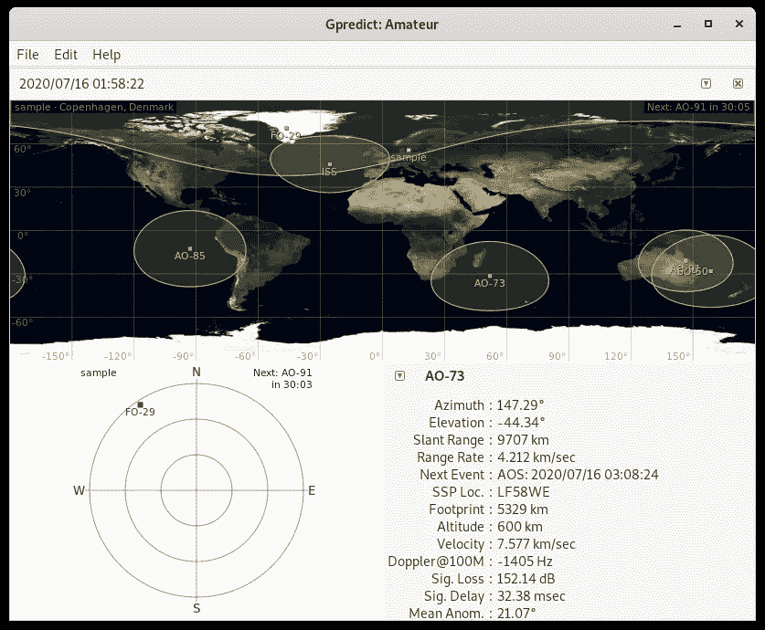
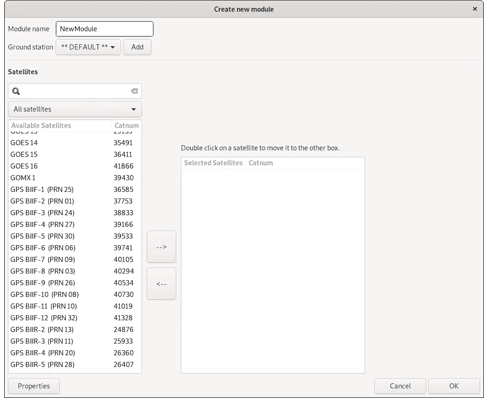
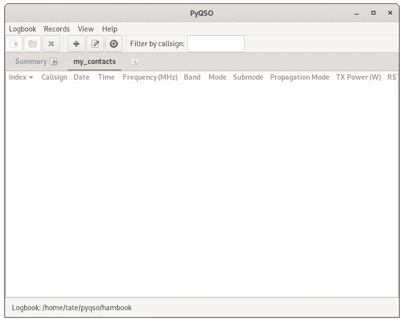
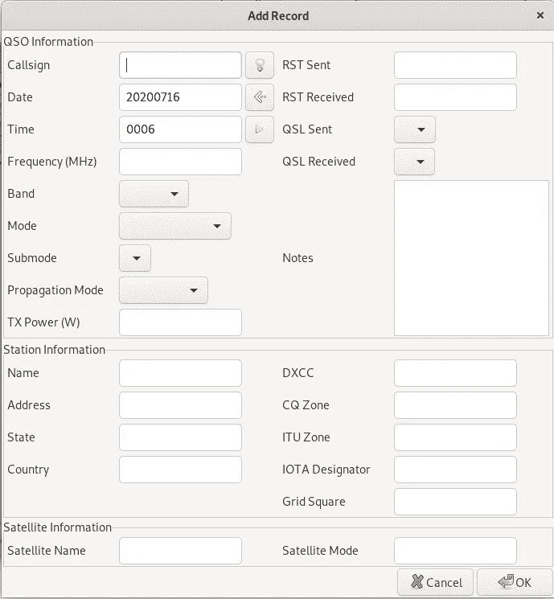

# 面向开发者的 4 个开源业余无线电项目

> 原文：<https://levelup.gitconnected.com/4-open-source-amateur-radio-projects-for-developers-a9d78ed4b268>

史蒂夫·哈拉马在 [Unsplash](https://unsplash.com/s/photos/radio?utm_source=unsplash&utm_medium=referral&utm_content=creditCopyText) 上拍摄的照片

业余无线电爱好引人注目，令人兴奋。结交来自世界各地的朋友。使用有趣的设备工作。学习 RF 的基本原理是一项令人难以置信的技能，也将转化为其他类型的工程领域。

当您想将业余无线电技能提升到一个新的水平，并将其与编程的力量相结合时，会发生什么？网上有很多学习编程或业余无线电的资源，但是展示这两者的项目呢？这些是存在的，但是你必须做一些调查。

我想带你看一些最酷的开源项目，它们结合了编程和业余无线电的力量。让我们来看看。

## [迷你 modem](http://www.whence.com/minimodem/)

不要让迷你 modem 愚弄你。这不全是关于你记得的旧的 56K 调制解调器。这是一个成熟的调制解调器，你可以配置成各种不同的模式。其中一种模式是 RTTY 或[无线电报类型](https://en.wikipedia.org/wiki/Radioteletype)。这种模式可用于其他业余无线电设备，将信息编码和解码成音调。RTTY 使用称为[频移键控](https://en.wikipedia.org/wiki/Frequency-shift_keying) (FSK)的调制方式，在传输数据时会产生非常独特的颤音。

RTTY 是一种将开发与业余无线电结合起来的有趣方式。使用 Minimodem 发送消息和其他数据有很大的可能性。您可以将 Minimodem 集成到现有的应用程序中，甚至构建一个专用的 UI 来使用它发送消息。您也可以简单地使用 Minimodem 来解码来自收音机音频输出的 RTTY。

这是 Minimodem 的一个很好的例子，视频是由创作者 Kamal Mostafa 制作的:

[http://www.whence.com/minimodem/](http://www.whence.com/minimodem/)

## [g 预测](https://github.com/csete/gpredict)

业余无线电爱好并不仅限于简单的老式地面通信。信号也传播到太空。当你能到达太空时，你也能到达卫星。与卫星通信是业余无线电的一个完整的子部分，既有趣又令人兴奋。

与卫星通话时，最重要的事情之一就是知道它们的位置。卫星围绕地球运行，所以你需要一些东西来跟踪它们的运动。Alexandru Csete 的 gpredict 就是一个很好的例子。这个软件可以让你跟踪和定位卫星，以便与它们进行通信。

使用 gpredict。

加载 gpredict 会立即向您显示大量信息。你将获得几颗 AMSAT 卫星和国际空间站的位置信息。改变地面站设置和调整地图也很容易。你也不会因为访问不同的卫星而感到压力，因为可用卫星的列表非常广泛。

在 gpredict 中添加新模块和选择卫星。

即使你不打算尝试卫星通信，Alexandru 的工作确实非常出色，将它集成到你现有的项目或设置中会是一次不可思议的学习经历。

 [## csete/g 预测

### GitHub 是超过 5000 万开发人员的家园，他们一起工作来托管和审查代码、管理项目和构建…

github.com](https://github.com/csete/gpredict) 

欲了解更多关于 gpredict 的信息，请访问以下网站:[http://gpredict.oz9aec.net/](http://gpredict.oz9aec.net/)

要了解更多关于使用业余无线电与卫星通信的信息，请访问:【https://www.amsat.org/[。](https://www.amsat.org/)

## [PyQSO](https://github.com/ctjacobs/pyqso)

ram radio 的部分乐趣是与来自世界各地的其他爱好者联系。最重要的事情之一是准确记录你的谈话对象。如果你参加了一场比赛，那么这一点尤其正确，在这场比赛中，尽可能多的联系可以让你赢得一份奖品！

PyQSO 新日志。

PyQSO 是一个用 Python 编写的非常棒的开源联系人日志应用程序，具有易于使用的基于 Qt 的 UI。使用 PyQSO，您可以快速方便地管理不同的联系人日志和联系人目录。扩展 PyQSO 非常容易，因为大部分都是 Python。

添加新的日志条目。

PyQSO 有一些很好的结合业余无线电社区元素的编程例子。一个很好的例子是从不同来源查找呼号的机制。根据您正在开发的应用程序的类型，这是一个非常常见的任务，看到不同的实现来完成这个任务是非常棒的。

查看 Christian T. Jacobs 的 PyQSO 存储库中的这个特定源文件:[https://github . com/CT Jacobs/py qso/blob/master/py qso/call sign _ lookup . py](https://github.com/ctjacobs/pyqso/blob/master/pyqso/callsign_lookup.py)

 [## ctjacobs/pyqso

### 版权所有(C) 2013-2018 克里斯蒂安·托马斯·雅各布斯。这个文件是 PyQSO 的一部分。PyQSO 是自由软件:你可以…

github.com](https://github.com/ctjacobs/pyqso) 

## SmallRX

随着 hams 的出现，软件定义无线电(SDR)越来越受欢迎。从 Ebay 或 Amazon 获取廉价 SDR 的相对较低的成本导致了开源 SDR 应用程序和库的爆炸式增长。

SmallRX 是一个 SDR 应用程序，面向快速和难以置信的轻量级。这完全用 C 语言编写，是一个全功能的 SDR 接收器。能够拥有这样一个小巧灵活的接收器，为在不同类型的硬件上运行打开了一个全新的世界。c 可以在任何东西上运行，所以能够在更小的嵌入式平台上使用 SDR 真的很酷。

作者 András Retzler 在 SmallRX 上发表了一篇精彩的演讲，请点击此处:

 [## ha7ilm/smallrx

### 这是一个业余无线电接收机，代码不超过 100 行。(如果我们只计算代码，而不计算评论…

github.com](https://github.com/ha7ilm/smallrx) 

*感谢阅读！业余无线电的世界有适合每个人的东西，特别是如果你是一个开发者。融合物理无线电通信和软件的世界是有趣和令人兴奋的。有关软件定义无线电的更多信息，请访问 ARRL 页面* [*此处*](http://www.arrl.org/software-defined-radio) *。*