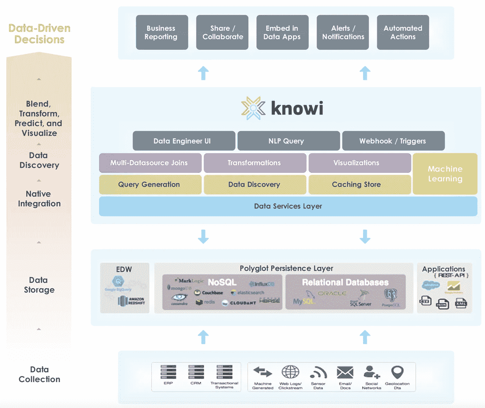
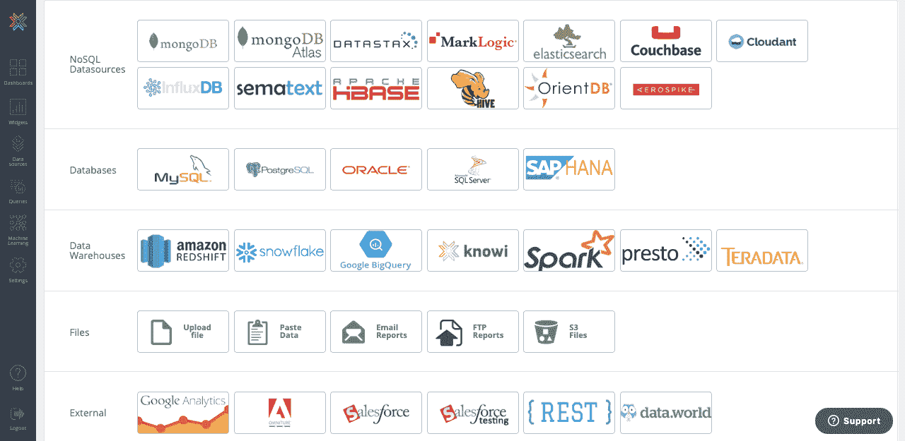

# 将 MongoDB 与商业智能结合使用的 4 个选项

> 原文：<https://levelup.gitconnected.com/4-options-for-using-mongodb-with-business-intelligence-ec278738b5d2>

如何对 NoSQL 数据进行 SQL 风格的分析

在 [Unsplash](https://unsplash.com?utm_source=medium&utm_medium=referral) 上由[主要 Tom 机构](https://unsplash.com/@majortomagency?utm_source=medium&utm_medium=referral)拍摄的照片

# MongoDB 可以和商业智能一起使用吗？

MongoDB 作为市场上顶级 NoSQL 提供商之一而声名鹊起，这引发了一场有趣的辩论:MongoDB vs SQL **。**

这场辩论中出现的主要问题是，MongoDB 是否可以像传统的 SQL 数据库一样用于商业智能。

虽然这个问题的答案是肯定的，但它附带了一个警告，即在 Mongo 数据的同时获得真正的商业智能功能可能需要付出成本——在金钱和时间方面。

在本文中，我将简要描述使用 SQL 等传统关系数据库进行商业智能的优势，并将它们与使用 MongoDB 等 NoSQL 数据库进行商业智能的优势进行比较。我还将介绍在仍然使用 MongoDB 作为数据库的同时，可以获得类似 SQL 的 BI 特性的选项。

# SQL 数据库的优势

本质上，传统的关系数据库是**结构化的**。他们的数据由规范化的表组成，这些表通过键或 ID 字段相互关联。关系数据库的结构化特性使得使用 SQL 来查询它们变得很容易。SQL 的最大优势之一是，它是一种结构化查询语言，在大多数数据库中具有几乎相同的语法:这意味着任何知道如何用 MySQL 编写查询的人都可以用 Oracle 和大多数其他数据库编写查询。

那么，关系数据库有什么优势呢？

*   **它们是结构化的** —这非常适合金融数据等应用，这些应用应该是干净、一致和规范化的。但它也可能是限制性的。稍后会详细介绍。
*   **高效的内存使用** —关系数据的高度规范化本质通常确保存储不会浪费在重复数据上。
*   **它们使数据检索变得容易** — SQL 是一种灵活且广泛的接口，被大多数供应商使用，这使得使用 SQL 来查询数据、转换数据和连接来自其他关系表的数据变得容易。

# MongoDB 的优势

与 SQL 数据库相比，NoSQL 数据库不遵循关系数据库结构。具体来说，基于文档的 NoSQL 数据库(如 MongoDB)是由一系列包含 JSON 数据的文档组成的。这种 JSON 数据通常包含深度嵌套的数据结构，这些深度嵌套的数据结构在不同的对象之间并不总是一致的。数百万开发人员使用 MongoDB，使其成为最受欢迎的 NoSQL 数据库之一。

这些开发者在使用 MongoDB 时，享受到了哪些优势？

*   **灵活的模式** —因为 MongoDB 将数据存储在 JSON 对象中，所以单个单元能够保存大量的嵌套字段。不同的对象实例也可能捕获不同的字段。
*   **速度** —对 JSON 数据进行索引通常比对典型的关系数据库进行索引更快地为用户提供数据。
*   **可扩展性** — MongoDB 将数据分成碎片，这意味着它可以高效地处理大数据。

# 商业智能:SQL 数据库与 MongoDB

谈到商业智能，这两种类型的数据库有何不同？一般来说，商业智能的领域属于 SQL。SQL 的灵活性允许分析师轻松地对关系数据进行提取、过滤、连接、聚合和执行其他功能。这使得可视化和报告关系数据变得容易。

相比之下，NoSQL 数据库中的商业智能发展得不太好，这是有道理的，因为 NoSQL 数据库仍处于萌芽状态。NoSQL 数据库能够用于商业智能，但是 NoSQL 数据库的非结构化性质意味着生成查询通常不像在 SQL 中那样简洁。举几个例子，跨 NoSQL 数据库的查询语言不像跨 SQL 数据库那样一致，而且 NoSQL 数据库通常不支持跨表连接。

# 如何将 MongoDB 用于商业智能？

很容易理解为什么 SQL 数据库经常是商业智能的最爱。但是 NoSQL 数据库的独特优势在某些情况下会变得非常重要。像 Mongo 这样的 NoSQL 数据库正在获得牵引力的一个领域是联网设备的物联网分析领域。这是一个包含大量数据的领域，数据的结构变化很大。在这种情况下，您仍然需要能够对您的 Mongo 数据执行商业智能功能。那你会怎么做？

## 解决方案一:ETL

您总是可以将 MongoDB 数据复制到 SQL 数据库中，然后使用关系数据执行您的商业智能流程。这样做将为您提供使用 SQL 进行商业智能的所有好处，如果您公司的 ETL 过程足够高效，甚至可能允许您执行实时分析。AWS Glue 等一些解决方案在这方面做得非常好。其他公司如 Avik Cloud 帮助公司建立数据管道，这为 ETL 过程增加了多层转换。

采用这种方法的问题是，它需要额外的硬件形式的额外资源，以及在 ETL 过程的配置和新环境的维护方面的额外工时。突然，商业智能过程需要来自几个不同团队的几个不同成员的支持。将数据从 MongoDB 复制到 SQL 数据库也放弃了拥有无模式数据结构的所有优势，因为您必须将数据强制转换到模式结构中才能将它放入 SQL 数据库。

## 解决方案二:数据虚拟化

由 Knowi 等公司开创的解决这一问题的最新选择之一是数据虚拟化。

数据虚拟化通过使用逻辑数据层(虚拟化层)模拟单个统一数据集，该逻辑数据层本机连接到正在使用的所有数据集。这使得分散在不同位置和数据库的 SQL 和 NoSQL 数据可以显示为一个统一的数据集，并可以实时访问。

数据虚拟化如何用于构建 Knowi 平台的图表。数据服务层是数据虚拟化层(来源: [Knowi](https://www.knowi.com/why-knowi)

Knowi 使用数据虚拟化直接连接到 MongoDB，并为用户提供一个接口，允许他们通过生成查询来操作数据。

用户可以使用原生 MongoDB 查询、点击式软件或两者的混合来构建查询。构建完查询后，用户可以选择更进一步，用 cloud 9ql(Knowi 的基于 SQL 的语言)处理数据。这个过程都是在 MongoDB 实例上实时完成的，因此不需要任何 ETL 过程来将数据存储在 SQL 数据库中。

Knowi 与 SQL 和 NoSQL 数据源的本地连接提供了很大的灵活性

简而言之，用户可以通过 Knowi 这样的解决方案使用数据虚拟化来过滤、连接和聚合 MongoDB 中的实时数据，就像在 SQL 数据库中一样，而无需使用 SQL 数据库。这里的一个额外优势是，他们还可以轻松地从其他来源获取数据，如 Elasticsearch、REST APIs、MySQL，以及 Couchbase 和 Datastax 等高级数据库解决方案。

## 解决方案三:翻译

为了解决这个问题，有些公司正在尝试构建一个过渡系统，允许用户输入 SQL 查询，然后将这些查询“翻译”成 MongoDB 查询。Dremio 就是其中之一，他们在消除 ETL 需求方面做得很好。

不幸的是，像跨独立数据库的连接这样的事情会给这个过程带来很大的问题。这个过程还包括延迟，这对于严格的大规模商业智能过程来说是非常不理想的。

## 解决方案四: [MongoDB 图表](https://www.mongodb.com/products/charts)(仅限有限用例)

为了消除 Mongo 数据的数据可视化和商业智能的一些技术障碍，MongoDB 的团队最近发布了 MongoDB 图表。MongoDB Charts 是一个本地可视化工具，有助于消除使用 MongoDB 进行数据可视化和商业智能的许多障碍，但它也有一些缺点。

*   用户必须有一个 MongoDB Atlas 帐户。
*   用户只能使用 MongoDB 数据。
*   您必须有一个 MongoDB Atlas 帐户。
*   每个图表只显示来自单一数据源的数据。
*   目前，商业智能和可视化的范围仅限于简单的图表和仪表板。然而，他们确实经常开发新功能。

如果您的用例不会受到这些限制的影响，MongoDB 图表可能是一个不错的解决方案。如果你已经订阅了 MongoDB Atlas，这可能是一个更好的解决方案。

如果这些限制与您的用例无关，MongoDB 图表可能是一个不错的解决方案——尤其是如果您已经是 MongoDB Atlas 的订阅者。

# 结论

商业智能的现代环境是动态的，这意味着我们必须不断地对各种不同的数据库类型进行分析，其中一些数据库类型比其他类型更有利于商业智能。MongoDB 并不是唯一一个在商业智能领域制造混乱的数据库。幸运的是，这个问题的解决方案正在由一些创新的公司提出，这些公司正在努力标准化和简化跨各种数据源的商业智能过程。无论您决定哪种解决方案最适合您的企业，有一点是明确的:您的企业不再需要在 MongoDB 和商业智能之间做出选择。你可以两者兼得。